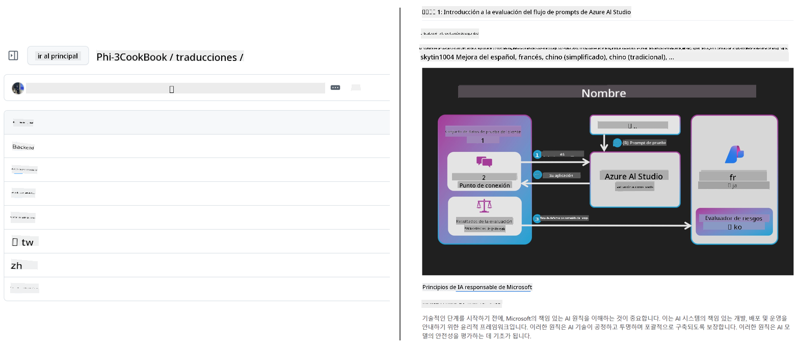
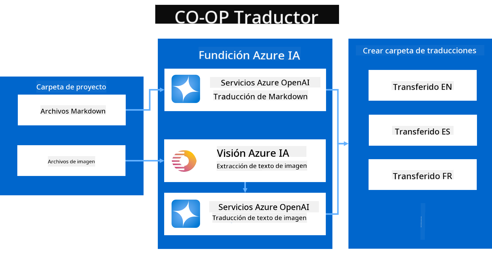
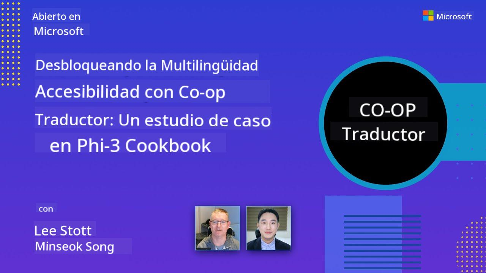

<!--
CO_OP_TRANSLATOR_METADATA:
{
  "original_hash": "044724537b57868117aadae8e7728c7c",
  "translation_date": "2025-06-12T09:49:02+00:00",
  "source_file": "README.md",
  "language_code": "es"
}
-->


# Co-op Translator: Automatiza la Traducción de Documentación Educativa Sin Esfuerzo

_Automatiza fácilmente la traducción de tu documentación a múltiples idiomas para llegar a una audiencia global._

[](https://pypi.org/project/co-op-translator/)
[](https://github.com/azure/co-op-translator/blob/main/LICENSE)
[](https://pepy.tech/project/co-op-translator)
[](https://pepy.tech/project/co-op-translator)
[](https://github.com/psf/black)

[](https://GitHub.com/azure/co-op-translator/graphs/contributors/)
[](https://GitHub.com/azure/co-op-translator/issues/)
[](https://GitHub.com/azure/co-op-translator/pulls/)
[](http://makeapullrequest.com)

### Soporte de Idiomas Impulsado por Co-op Translator
[Francés](../fr/README.md) | [Español](./README.md) | [Alemán](../de/README.md) | [Ruso](../ru/README.md) | [Árabe](../ar/README.md) | [Persa (Farsi)](../fa/README.md) | [Urdu](../ur/README.md) | [Chino (Simplificado)](../zh/README.md) | [Chino (Tradicional, Macao)](../mo/README.md) | [Chino (Tradicional, Hong Kong)](../hk/README.md) | [Chino (Tradicional, Taiwán)](../tw/README.md) | [Japonés](../ja/README.md) | [Coreano](../ko/README.md) | [Hindi](../hi/README.md) | [Bengalí](../bn/README.md) | [Maratí](../mr/README.md) | [Nepalí](../ne/README.md) | [Punjabi (Gurmukhi)](../pa/README.md) | [Portugués (Portugal)](../pt/README.md) | [Portugués (Brasil)](../br/README.md) | [Italiano](../it/README.md) | [Polaco](../pl/README.md) | [Turco](../tr/README.md) | [Griego](../el/README.md) | [Tailandés](../th/README.md) | [Sueco](../sv/README.md) | [Danés](../da/README.md) | [Noruego](../no/README.md) | [Finlandés](../fi/README.md) | [Neerlandés](../nl/README.md) | [Hebreo](../he/README.md) | [Vietnamita](../vi/README.md) | [Indonesio](../id/README.md) | [Malayo](../ms/README.md) | [Tagalo (Filipino)](../tl/README.md) | [Swahili](../sw/README.md) | [Húngaro](../hu/README.md) | [Checo](../cs/README.md) | [Eslovaco](../sk/README.md) | [Rumano](../ro/README.md) | [Búlgaro](../bg/README.md) | [Serbio (Cirílico)](../sr/README.md) | [Croata](../hr/README.md) | [Esloveno](../sl/README.md) | [Ucraniano](../uk/README.md) | [Birmano (Myanmar)](../my/README.md) Por favor, escriba la salida de izquierda a derecha.

[Francés](../fr/README.md) | [Español](./README.md) | [Alemán](../de/README.md) | [Ruso](../ru/README.md) | [Árabe](../ar/README.md) | [Persa (Farsi)](../fa/README.md) | [Urdu](../ur/README.md) | [Chino (Simplificado)](../zh/README.md) | [Chino (Tradicional, Macao)](../mo/README.md) | [Chino (Tradicional, Hong Kong)](../hk/README.md) | [Chino (Tradicional, Taiwán)](../tw/README.md) | [Japonés](../ja/README.md) | [Coreano](../ko/README.md) | [Hindi](../hi/README.md) | [Bengalí](../bn/README.md) | [Maratí](../mr/README.md) | [Nepalí](../ne/README.md) | [Punjabi (Gurmukhi)](../pa/README.md) | [Portugués (Portugal)](../pt/README.md) | [Portugués (Brasil)](../br/README.md) | [Italiano](../it/README.md) | [Polaco](../pl/README.md) | [Turco](../tr/README.md) | [Griego](../el/README.md) | [Tailandés](../th/README.md) | [Sueco](../sv/README.md) | [Danés](../da/README.md) | [Noruego](../no/README.md) | [Finlandés](../fi/README.md) | [Neerlandés](../nl/README.md) | [Hebreo](../he/README.md) | [Vietnamita](../vi/README.md) | [Indonesio](../id/README.md) | [Malayo](../ms/README.md) | [Tagalo (Filipino)](../tl/README.md) | [Swahili](../sw/README.md) | [Húngaro](../hu/README.md) | [Checo](../cs/README.md) | [Eslovaco](../sk/README.md) | [Rumano](../ro/README.md) | [Búlgaro](../bg/README.md) | [Serbio (Cirílico)](../sr/README.md) | [Croata](../hr/README.md) | [Esloveno](../sl/README.md) | [Ucraniano](../uk/README.md) | [Birmano (Myanmar)](../my/README.md)
> [!NOTE]
> Estas son las traducciones actuales del contenido de este repositorio. Para una lista completa de los idiomas soportados por Co-op Translator, consulta la sección [Language Support](../..).

[](https://GitHub.com/azure/co-op-translator/watchers/)
[](https://GitHub.com/azure/co-op-translator/network/)
[](https://GitHub.com/azure/co-op-translator/stargazers/)

[](https://discord.com/invite/ByRwuEEgH4)

[](https://codespaces.new/azure/co-op-translator)
[](https://vscode.dev/redirect?url=vscode://ms-vscode-remote.remote-containers/cloneInVolume?url=https://github.com/azure/co-op-translator)

## Resumen: Optimiza la Traducción de tu Contenido Educativo

Las barreras del idioma dificultan significativamente el acceso a recursos educativos valiosos y conocimientos técnicos para estudiantes y desarrolladores en todo el mundo. Esto limita la participación y ralentiza el ritmo de la innovación y el aprendizaje global.

**Co-op Translator** nació de la necesidad de mejorar el proceso manual e ineficiente de traducción para la propia serie educativa a gran escala de Microsoft (como las guías "For Beginners"). Se ha convertido en una herramienta fácil de usar y potente diseñada para derribar estas barreras para todos. Al ofrecer traducciones automáticas de alta calidad mediante CLI y GitHub Actions, Co-op Translator permite a educadores, estudiantes, investigadores y desarrolladores en todo el mundo compartir y acceder al conocimiento sin limitaciones de idioma.

Observa cómo Co-op Translator organiza el contenido educativo traducido:



Los archivos Markdown y el texto de las imágenes se traducen automáticamente y se organizan ordenadamente en carpetas específicas por idioma.

**¡Abre el acceso global a tu contenido educativo hoy con Co-op Translator!**

## Apoyando el Acceso Global a los Recursos de Aprendizaje de Microsoft

Co-op Translator ayuda a cerrar la brecha del idioma para iniciativas educativas clave de Microsoft, automatizando el proceso de traducción para repositorios que sirven a una comunidad global de desarrolladores. Ejemplos que actualmente usan Co-op Translator incluyen:

[](https://github.com/microsoft/Generative-AI-for-beginners)
[](https://github.com/microsoft/ML-For-Beginners)
[](https://github.com/microsoft/AI-For-Beginners)
[](https://github.com/microsoft/ai-agents-for-beginners)
[](https://github.com/microsoft/PhiCookBook)
[](https://github.com/microsoft/Generative-AI-for-beginners-dotnet)

## Características Clave

- **Traducciones Automatizadas**: Traduce texto a múltiples idiomas sin esfuerzo.
- **Integración con GitHub Actions**: Automatiza las traducciones como parte de tu pipeline CI/CD.
- **Preservación de Markdown**: Mantiene la sintaxis Markdown correcta durante la traducción.
- **Traducción de Texto en Imágenes**: Extrae y traduce texto dentro de imágenes.
- **Tecnología Avanzada LLM**: Utiliza modelos de lenguaje de última generación para traducciones de alta calidad.
- **Integración Fácil**: Se integra sin problemas con la configuración existente de tu proyecto.
- **Simplifica la Localización**: Optimiza el proceso de localizar tu proyecto para mercados internacionales.

## Cómo Funciona



Co-op Translator toma archivos Markdown e imágenes de la carpeta de tu proyecto y los procesa de la siguiente manera:

1. **Extracción de Texto**: Extrae texto de archivos Markdown y, si está configurado (por ejemplo, con Azure AI Vision), texto incrustado en imágenes.
1. **Traducción por IA**: Envía el texto extraído al LLM configurado (Azure OpenAI, OpenAI, etc.) para su traducción.
1. **Guardado de Resultados**: Guarda los archivos Markdown traducidos y las imágenes (con texto traducido) en carpetas específicas por idioma, preservando el formato original.

## Primeros Pasos

Comienza rápido con la CLI o configura la automatización completa con GitHub Actions. Elige el enfoque que mejor se adapte a tu flujo de trabajo:

1. **Línea de Comandos (CLI)** - Para traducciones puntuales o control manual
2. **GitHub Actions** - Para traducciones automáticas en cada push

> [!NOTE]
> Aunque este tutorial se centra en recursos de Azure, puedes usar cualquier modelo de lenguaje compatible.

### Soporte de Idiomas

Co-op Translator soporta una amplia gama de idiomas para ayudarte a llegar a una audiencia global. Esto es lo que necesitas saber:

#### Referencia Rápida

| Idioma | Código | Idioma | Código | Idioma | Código |
|--------|--------|--------|--------|--------|--------|
| Árabe | ar | Bengalí | bn | Búlgaro | bg |
| Birmano (Myanmar) | my | Chino (Simplificado) | zh | Chino (Tradicional, HK) | hk |
| Chino (Tradicional, Macao) | mo | Chino (Tradicional, TW) | tw | Croata | hr |
| Checo | cs | Danés | da | Neerlandés | nl |
| Finés | fi | Francés | fr | Alemán | de |
| Griego | el | Hebreo | he | Hindi | hi |
| Húngaro | hu | Indonesio | id | Italiano | it |
| Japonés | ja | Coreano | ko | Malayo | ms |
| Marathi | mr | Nepalí | ne | Noruego | no |
| Persa (Farsi) | fa | Polaco | pl | Portugués (Brasil) | br |
| Portugués (Portugal) | pt | Punjabi (Gurmukhi) | pa | Rumano | ro |
| Ruso | ru | Serbio (Cirílico) | sr | Eslovaco | sk |
| Esloveno | sl | Español | es | Swahili | sw |
| Sueco | sv | Tagalo (Filipino) | tl | Tailandés | th |
| Turco | tr | Ucraniano | uk | Urdu | ur |
| Vietnamita | vi | — | — | — | — |

#### Uso de Códigos de Idioma

Al usar Co-op Translator, necesitarás especificar los idiomas usando sus códigos. Por ejemplo:

```bash
# Translate to French, Spanish, and German
translate -l "fr es de"

# Translate to Chinese (Simplified) and Japanese
translate -l "zh ja"
```

> [!NOTE]
> Para información técnica detallada sobre el soporte de idiomas, incluyendo:
>
> - Especificaciones de fuentes para cada idioma
> - Problemas conocidos
> - Cómo agregar nuevos idiomas
>
> Consulta nuestra [Documentación de Idiomas Soportados](./getting_started/supported-languages.md).

### Modelos y Servicios Soportados

| Tipo                  | Nombre                           |
|-----------------------|--------------------------------|
| Modelo de Lenguaje     |   |
| AI Vision             |  |

> [!NOTE]
> Si un servicio de AI vision no está disponible, Co-op Translator cambiará al [modo solo Markdown](./getting_started/markdown-only-mode.md).

### Configuración Inicial

Antes de comenzar, necesitarás configurar los siguientes recursos:

1. Recurso de Modelo de Lenguaje (Obligatorio):
   - Azure OpenAI (Recomendado) - Ofrece traducciones de alta calidad con fiabilidad empresarial
   - OpenAI - Opción alternativa si no tienes acceso a Azure
   - Para información detallada sobre modelos soportados, consulta [Modelos y Servicios Soportados](../..)

1. Recurso de AI Vision (Opcional):
   - Azure AI Vision - Permite traducir texto dentro de imágenes
   - Si no está configurado, el traductor usará automáticamente el [modo solo Markdown](./getting_started/markdown-only-mode.md)
   - Recomendado para proyectos con imágenes que contienen texto que necesita traducción

1. Pasos de Configuración:
   - Sigue nuestra [guía de configuración de Azure AI](./getting_started/set-up-azure-ai.md) para instrucciones detalladas
   - Crea un archivo `.env` con tus claves API y puntos finales (consulta la sección [Quick Start](../..))
   - Asegúrate de tener los permisos y cuotas necesarias para los servicios elegidos

### Preparación del Proyecto Antes de la Traducción

Antes de iniciar el proceso de traducción, sigue estos pasos para preparar tu proyecto:

1. Prepara tu README:
   - Añade una tabla de traducciones en tu README.md para enlazar las versiones traducidas
   - Formato de ejemplo:

     ```markdown

     ### 🌐 Multi-Language Support
     
     [French](../fr/README.md) | [Spanish](./README.md) | [German](../de/README.md) | [Russian](../ru/README.md) | [Arabic](../ar/README.md) | [Persian (Farsi)](../fa/README.md) | [Urdu](../ur/README.md) | [Chinese (Simplified)](../zh/README.md) | [Chinese (Traditional, Macau)](../mo/README.md) | [Chinese (Traditional, Hong Kong)](../hk/README.md) | [Chinese (Traditional, Taiwan)](../tw/README.md) | [Japanese](../ja/README.md) | [Korean](../ko/README.md) | [Hindi](../hi/README.md) | [Bengali](../bn/README.md) | [Marathi](../mr/README.md) | [Nepali](../ne/README.md) | [Punjabi (Gurmukhi)](../pa/README.md) | [Portuguese (Portugal)](../pt/README.md) | [Portuguese (Brazil)](../br/README.md) | [Italian](../it/README.md) | [Polish](../pl/README.md) | [Turkish](../tr/README.md) | [Greek](../el/README.md) | [Thai](../th/README.md) | [Swedish](../sv/README.md) | [Danish](../da/README.md) | [Norwegian](../no/README.md) | [Finnish](../fi/README.md) | [Dutch](../nl/README.md) | [Hebrew](../he/README.md) | [Vietnamese](../vi/README.md) | [Indonesian](../id/README.md) | [Malay](../ms/README.md) | [Tagalog (Filipino)](../tl/README.md) | [Swahili](../sw/README.md) | [Hungarian](../hu/README.md) | [Czech](../cs/README.md) | [Slovak](../sk/README.md) | [Romanian](../ro/README.md) | [Bulgarian](../bg/README.md) | [Serbian (Cyrillic)](../sr/README.md) | [Croatian](../hr/README.md) | [Slovenian](../sl/README.md) | [Ukrainian](../uk/README.md) | [Burmese (Myanmar)](../my/README.md) 
    
     ```

1. Limpia Traducciones Existentes (si es necesario):
   - Elimina cualquier carpeta de traducción existente (por ejemplo, `translations/`)
   - Borra archivos de traducción antiguos para empezar desde cero
   - Esto asegura que no haya conflictos con el nuevo proceso de traducción

### Inicio Rápido: Línea de Comandos

Para comenzar rápido usando la línea de comandos:

1. Crea un entorno virtual:

    ```bash
    python -m venv .venv
    ```

1. Activa el entorno virtual:

    - En Windows:

    ```bash
    .venv\scripts\activate
    ```

    - En Linux/macOS:

    ```bash
    source .venv/bin/activate
    ```

1. Instala el paquete:

    ```bash
    pip install co-op-translator
    ```

1. Configura las Credenciales:

    - Crea un archivo `.env` file in your project's root directory.
    - Copy the contents from the [.env.template](../../.env.template) file into your new `.env` file.
    - Fill in the required API keys and endpoint information in your `.env` file.

1. Run Translation:
    - Navigate to your project's root directory in your terminal.
    - Execute the translate command, specifying target languages with the `-l` con la bandera:

    ```bash
    translate -l "ko ja fr"
    ```

    _(Reemplaza `"ko ja fr"` with your desired space-separated language codes)_

### Detailed Usage Guides

Choose the approach that best fits your workflow:

#### 1. Using the Command Line (CLI)

- Best for: One-time translations, manual control, or integration into custom scripts.
- Requires: Local installation of Python and the `co-op-translator` package.
- Guide: [Command Line Guide](./getting_started/command-line-guide/command-line-guide.md)

#### 2. Using GitHub Actions (Automation)

- Best for: Automatically translating content whenever changes are pushed to your repository. Keeps translations consistently up-to-date.
- Requires: Setting up a workflow file (`.github/workflows`) en tu repositorio. No se necesita instalación local.
- Guías:
  - [Guía de GitHub Actions (Repositorios Públicos y Secrets Estándar)](./getting_started/github-actions-guide/github-actions-guide-public.md) - Úsala para la mayoría de repositorios públicos o personales que usen secrets estándar del repositorio.
  - [Guía de GitHub Actions (Repositorios de Microsoft y Configuraciones a Nivel de Organización)](./getting_started/github-actions-guide/github-actions-guide-org.md) - Usa esta guía si trabajas dentro de la organización Microsoft en GitHub o necesitas aprovechar secrets o runners a nivel organizacional.

### Solución de Problemas y Consejos

- [Guía de Solución de Problemas](./getting_started/troubleshooting.md)

### Recursos Adicionales

- [Referencia de Comandos](./getting_started/command-reference.md): Guía detallada de todos los comandos y opciones disponibles.
- [Idiomas Soportados](./getting_started/supported-languages.md): Consulta la lista de idiomas soportados e instrucciones para agregar nuevos.
- [Modo Solo Markdown](./getting_started/markdown-only-mode.md): Cómo traducir solo texto, sin traducción de imágenes.

## Presentaciones en Video

Conoce más sobre Co-op Translator a través de nuestras presentaciones _(Haz clic en la imagen para ver en YouTube.)_:

- **Open at Microsoft**: Una introducción breve de 18 minutos y guía rápida sobre cómo usar Co-op Translator.
[](https://www.youtube.com/watch?v=jX_swfH_KNU)

## Apóyanos y Fomenta el Aprendizaje Global

¡Únete a nosotros para revolucionar la forma en que se comparte contenido educativo a nivel mundial! Dale una ⭐ a [Co-op Translator](https://github.com/azure/co-op-translator) en GitHub y apoya nuestra misión de eliminar las barreras del idioma en el aprendizaje y la tecnología. ¡Tu interés y contribuciones tienen un impacto significativo! Las contribuciones de código y sugerencias de funciones son siempre bienvenidas.

## Contribuir

Este proyecto acepta contribuciones y sugerencias. ¿Interesado en contribuir a Azure Co-op Translator? Por favor, consulta nuestro [CONTRIBUTING.md](./CONTRIBUTING.md) para conocer las pautas sobre cómo puedes ayudar a que Co-op Translator sea más accesible.

## Colaboradores

[](https://github.com/Azure/co-op-translator/graphs/contributors)

## Código de Conducta

Este proyecto ha adoptado el [Microsoft Open Source Code of Conduct](https://opensource.microsoft.com/codeofconduct/).
Para más información, consulta las [preguntas frecuentes sobre el Código de Conducta](https://opensource.microsoft.com/codeofconduct/faq/) o contacta a [opencode@microsoft.com](mailto:opencode@microsoft.com) con cualquier pregunta o comentario adicional.

## IA Responsable

Microsoft está comprometido a ayudar a nuestros clientes a usar nuestros productos de IA de manera responsable, compartiendo nuestras experiencias y construyendo alianzas basadas en la confianza mediante herramientas como Transparency Notes e Impact Assessments. Muchos de estos recursos están disponibles en [https://aka.ms/RAI](https://aka.ms/RAI).
El enfoque de Microsoft hacia la IA responsable se basa en nuestros principios de IA: equidad, confiabilidad y seguridad, privacidad y protección, inclusión, transparencia y responsabilidad.

Los modelos a gran escala de lenguaje natural, imagen y voz —como los usados en este ejemplo— pueden comportarse de manera injusta, poco confiable u ofensiva, causando daños. Consulta la [Azure OpenAI service Transparency note](https://learn.microsoft.com/legal/cognitive-services/openai/transparency-note?tabs=text) para informarte sobre riesgos y limitaciones.

La forma recomendada para mitigar estos riesgos es incluir un sistema de seguridad en tu arquitectura que pueda detectar y prevenir comportamientos dañinos. [Azure AI Content Safety](https://learn.microsoft.com/azure/ai-services/content-safety/overview) proporciona una capa independiente de protección, capaz de detectar contenido dañino generado por usuarios o IA en aplicaciones y servicios. Azure AI Content Safety incluye APIs de texto e imagen que permiten detectar material dañino. También contamos con un Content Safety Studio interactivo que te permite ver, explorar y probar ejemplos de código para detectar contenido dañino en diferentes modalidades. La siguiente [documentación de inicio rápido](https://learn.microsoft.com/azure/ai-services/content-safety/quickstart-text?tabs=visual-studio%2Clinux&pivots=programming-language-rest) te guía para hacer solicitudes al servicio.

Otro aspecto a considerar es el rendimiento general de la aplicación. En aplicaciones multimodales y con múltiples modelos, entendemos por rendimiento que el sistema funcione como tú y tus usuarios esperan, incluyendo no generar resultados dañinos. Es importante evaluar el rendimiento de tu aplicación completa usando [métricas de calidad de generación y de riesgo y seguridad](https://learn.microsoft.com/azure/ai-studio/concepts/evaluation-metrics-built-in).

Puedes evaluar tu aplicación de IA en tu entorno de desarrollo usando el [prompt flow SDK](https://microsoft.github.io/promptflow/index.html). Ya sea con un conjunto de datos de prueba o un objetivo, las generaciones de tu aplicación de IA generativa se miden cuantitativamente con evaluadores integrados o evaluadores personalizados que elijas. Para comenzar con el prompt flow sdk y evaluar tu sistema, puedes seguir la [guía de inicio rápido](https://learn.microsoft.com/azure/ai-studio/how-to/develop/flow-evaluate-sdk). Una vez que ejecutes una evaluación, puedes [visualizar los resultados en Azure AI Studio](https://learn.microsoft.com/azure/ai-studio/how-to/evaluate-flow-results).

## Marcas Registradas

Este proyecto puede contener marcas o logotipos de proyectos, productos o servicios. El uso autorizado de las marcas o logotipos de Microsoft está sujeto a y debe seguir las [Microsoft's Trademark & Brand Guidelines](https://www.microsoft.com/en-us/legal/intellectualproperty/trademarks/usage/general).
El uso de marcas o logotipos de Microsoft en versiones modificadas de este proyecto no debe causar confusión ni implicar patrocinio por parte de Microsoft.
Cualquier uso de marcas o logotipos de terceros está sujeto a las políticas de esos terceros.

**Descargo de responsabilidad**:  
Este documento ha sido traducido utilizando el servicio de traducción automática [Co-op Translator](https://github.com/Azure/co-op-translator). Aunque nos esforzamos por lograr precisión, tenga en cuenta que las traducciones automáticas pueden contener errores o inexactitudes. El documento original en su idioma nativo debe considerarse la fuente autorizada. Para información crítica, se recomienda la traducción profesional realizada por humanos. No nos hacemos responsables por malentendidos o interpretaciones erróneas que puedan derivarse del uso de esta traducción.