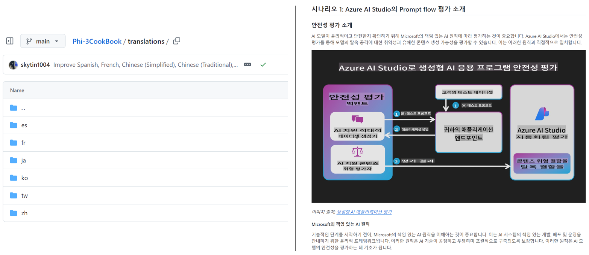

# Co-op Translator

_Facilita la automatización y el mantenimiento de traducciones para tu contenido educativo de GitHub en varios idiomas a medida que tu proyecto evoluciona._


[](https://pypi.org/project/co-op-translator/)
[](https://github.com/azure/co-op-translator/blob/main/LICENSE)
[](https://pepy.tech/project/co-op-translator)
[](https://pepy.tech/project/co-op-translator)
[](https://github.com/azure/co-op-translator/pkgs/container/co-op-translator)
[](https://github.com/psf/black)

[](https://GitHub.com/azure/co-op-translator/graphs/contributors/)
[](https://GitHub.com/azure/co-op-translator/issues/)
[](https://GitHub.com/azure/co-op-translator/pulls/)
[](http://makeapullrequest.com)

**Comienza aquí:** [Elige tu flujo de trabajo](https://azure.github.io/co-op-translator/workflows/) | [Configuración](https://azure.github.io/co-op-translator/configuration/) | [CLI](https://azure.github.io/co-op-translator/cli/) | [API de Python](https://azure.github.io/co-op-translator/api/) | [Servidor MCP](https://azure.github.io/co-op-translator/mcp/)

### 🌐 Soporte multilingüe

#### Compatibilidades de [Co-op Translator](https://github.com/Azure/co-op-translator)

<!-- CO-OP TRANSLATOR LANGUAGES TABLE START -->
[Árabe](../ar/README.md) | [Bengalí](../bn/README.md) | [Búlgaro](../bg/README.md) | [Birmano (Myanmar)](../my/README.md) | [Chino (simplificado)](../zh-CN/README.md) | [Chino (tradicional, Hong Kong)](../zh-HK/README.md) | [Chino (tradicional, Macao)](../zh-MO/README.md) | [Chino (tradicional, Taiwán)](../zh-TW/README.md) | [Croata](../hr/README.md) | [Checo](../cs/README.md) | [Danés](../da/README.md) | [Neerlandés](../nl/README.md) | [Estonio](../et/README.md) | [Finés](../fi/README.md) | [Francés](../fr/README.md) | [Alemán](../de/README.md) | [Griego](../el/README.md) | [Hebreo](../he/README.md) | [Hindi](../hi/README.md) | [Húngaro](../hu/README.md) | [Indonesio](../id/README.md) | [Italiano](../it/README.md) | [Japonés](../ja/README.md) | [Kannada](../kn/README.md) | [Jemer](../km/README.md) | [Coreano](../ko/README.md) | [Lituano](../lt/README.md) | [Malayo](../ms/README.md) | [Malayalam](../ml/README.md) | [Marathi](../mr/README.md) | [Nepalí](../ne/README.md) | [Pidgin nigeriano](../pcm/README.md) | [Noruego](../no/README.md) | [Persa (Farsi)](../fa/README.md) | [Polaco](../pl/README.md) | [Portugués (Brasil)](../pt-BR/README.md) | [Portugués (Portugal)](../pt-PT/README.md) | [Panyabí (Gurmukhi)](../pa/README.md) | [Rumano](../ro/README.md) | [Ruso](../ru/README.md) | [Serbio (cirílico)](../sr/README.md) | [Eslovaco](../sk/README.md) | [Esloveno](../sl/README.md) | [Español](./README.md) | [Swahili](../sw/README.md) | [Sueco](../sv/README.md) | [Tagalo (filipino)](../tl/README.md) | [Tamil](../ta/README.md) | [Telugu](../te/README.md) | [Tailandés](../th/README.md) | [Turco](../tr/README.md) | [Ucraniano](../uk/README.md) | [Urdu](../ur/README.md) | [Vietnamita](../vi/README.md)

> **¿Prefieres clonar localmente?**
>
> Este repositorio incluye más de 50 traducciones de idiomas, lo que aumenta significativamente el tamaño de la descarga. Para clonar sin las traducciones, usa sparse checkout:
>
> **Bash / macOS / Linux:**
> ```bash
> git clone --filter=blob:none --sparse https://github.com/Azure/co-op-translator.git
> cd co-op-translator
> git sparse-checkout set --no-cone '/*' '!translations' '!translated_images'
> ```
>
> **CMD (Windows):**
> ```cmd
> git clone --filter=blob:none --sparse https://github.com/Azure/co-op-translator.git
> cd co-op-translator
> git sparse-checkout set --no-cone "/*" "!translations" "!translated_images"
> ```
>
> Esto te proporciona todo lo necesario para completar el curso con una descarga mucho más rápida.
<!-- CO-OP TRANSLATOR LANGUAGES TABLE END -->

[](https://GitHub.com/azure/co-op-translator/watchers/)
[](https://GitHub.com/azure/co-op-translator/network/)
[](https://GitHub.com/azure/co-op-translator/stargazers/)

[](https://discord.gg/nTYy5BXMWG)

[](https://codespaces.new/azure/co-op-translator)

## Descripción general

**Co-op Translator** te ayuda a localizar tu contenido educativo de GitHub en múltiples idiomas sin esfuerzo.
Cuando actualizas tus archivos Markdown, imágenes o notebooks, las traducciones se mantienen sincronizadas automáticamente, asegurando que tu contenido siga siendo preciso y esté actualizado para los estudiantes de todo el mundo.

Úsalo desde la CLI para traducir repositorios, desde la API de Python para automatización, o a través del servidor MCP para flujos de trabajo con agentes y editores.

Ejemplo de cómo se organiza el contenido traducido:



## ¿Por qué Co-op Translator?

Traducir un archivo es fácil. Mantener traducido, enlazado y actualizado todo un repositorio de documentación es lo difícil.

| Problema | Cómo ayuda Co-op Translator |
| --- | --- |
| Long docs are not one prompt | Los archivos Markdown largos se dividen en fragmentos, por lo que un README extenso no depende de una única respuesta frágil del modelo. Si un fragmento falla, Co-op Translator puede reintentar y redividir solo la parte fallida. |
| Incomplete translations should not be marked current | Una traducción truncada nunca debería marcarse como actualizada. Co-op Translator verifica la integridad de la traducción antes de guardar y puede detectar traducciones existentes estructuralmente incompletas. |
| Links should match the translated repo structure | Las traducciones manuales suelen dejar enlaces relativos que apuntan de vuelta al árbol fuente. Co-op Translator reescribe enlaces de Markdown, notebooks, imágenes y README para coincidir con la estructura `translations/<lang>/...`. |
| Translation should work across an entire repo | Co-op Translator gestiona archivos README, docs, notebooks y texto en imágenes como parte de un flujo de trabajo de repositorio, en lugar de traducir archivos uno por uno. |
| Maintaining translations matters more than creating them once | Los hashes de origen y los metadatos de traducción permiten a Co-op Translator encontrar archivos desactualizados, omitir archivos sin cambios y mantener el contenido traducido sincronizado a medida que evoluciona el repositorio fuente. |

## Cómo se gestiona el estado de la traducción

Co-op Translator gestiona el contenido traducido como **artefactos de software versionados**,  
no como archivos estáticos.

La herramienta rastrea el estado de Markdown, imágenes y notebooks traducidos
usando **metadatos con alcance por idioma**.

Este diseño permite a Co-op Translator:

- Detectar de manera confiable traducciones desactualizadas
- Tratar Markdown, imágenes y notebooks de forma consistente
- Escalar de manera segura en repositorios grandes, dinámicos y multilingües

Al modelar las traducciones como artefactos gestionados,
los flujos de trabajo de traducción se alinean de forma natural con las prácticas modernas
de gestión de dependencias y artefactos de software.

→ [Cómo se gestiona el estado de la traducción](https://techcommunity.microsoft.com/blog/azuredevcommunityblog/rethinking-documentation-translation-treating-translations-as-versioned-software/4491755)

### Análisis detallados relacionados

- [Corregir Markdown roto en la traducción por IA: Fortaleciendo una canalización de producción](https://techcommunity.microsoft.com/blog/azuredevcommunityblog/fixing-broken-markdown-in-ai-translation-hardening-a-production-pipeline/4511378)

## Comenzar

Co-op Translator puede usarse desde la CLI, la API de Python o el servidor MCP. Comienza con la guía de flujos de trabajo si estás eligiendo entre traducción local, automatización, CI e integración con agentes/editores.

- [Elige tu flujo de trabajo](../../docs/workflows.md)
- [Configurar credenciales](../../docs/configuration.md)
- [Traducir desde la CLI](../../docs/cli.md)
- [Automatizar con la API de Python](../../docs/api.md)
- [Conectar con el servidor MCP](../../docs/mcp.md)
- [Ejecutar en GitHub Actions](../../docs/github-actions.md)

Ejemplo mínimo de CLI después de la configuración:

```bash
python -m venv .venv
# Windows
.venv\Scripts\activate
# macOS/Linux
source .venv/bin/activate

pip install co-op-translator
translate -l "ko" -md
co-op-review -l "ko"
```

Para las primeras ejecuciones en repositorios grandes, usa `--dry-run` antes de escribir archivos traducidos. Consulta la [Referencia de la CLI](../../docs/cli.md) para banderas de tipo de contenido, registros, revisión y migración de enlaces.

Ejecución rápida en contenedor con Bash/Zsh:

```bash
docker run --rm -it --env-file .env -v "${PWD}:/work" ghcr.io/azure/co-op-translator:latest -l "ko" -md
```

Ejecución rápida en contenedor con PowerShell:

```powershell
docker run --rm -it --env-file .env -v ${PWD}:/work ghcr.io/azure/co-op-translator:latest -l "ko" -md
```

## Características

- Traducción automatizada para Markdown, notebooks e imágenes
- Mantiene las traducciones sincronizadas con los cambios en el origen
- Funciona localmente (CLI) o en CI (GitHub Actions)
- Expone herramientas de traducción de Markdown, notebooks, imágenes, revisión y proyectos a través de MCP
- Utiliza Azure OpenAI o OpenAI para traducción respaldada por proveedores
- Permite que MCP aloje agentes que traduzcan fragmentos de Markdown y notebooks sin credenciales LLM de Co-op Translator
- Utiliza Azure AI Vision para la extracción y traducción de texto en imágenes
- Revisa la estructura y actualidad de las traducciones con verificaciones deterministas
- Preserva el formato y la estructura de Markdown

## Documentación

- [Sitio de documentación](https://azure.github.io/co-op-translator/)
- [Elige tu flujo de trabajo](../../docs/workflows.md)
- [Configuración](../../docs/configuration.md)
- [Configuración de Azure AI](../../docs/azure-ai-setup.md)
- [Referencia de la CLI](../../docs/cli.md)
- [API de Python](../../docs/api.md)
- [Servidor MCP](../../docs/mcp.md)
- [GitHub Actions](../../docs/github-actions.md)
- [Plantilla README de idiomas](../../docs/readme-languages-template.md)
- [Idiomas compatibles](../../docs/supported-languages.md)
- [Contribuir](../../CONTRIBUTING.md)
- [Solución de problemas](../../docs/troubleshooting.md)

### Guía específica de Microsoft
> [!NOTE]
> Para mantenedores de los repositorios “For Beginners” de Microsoft solamente.

- [Actualización de la lista “otros cursos” (solo para repositorios MS Beginners)](../../docs/microsoft-beginners.md)

## Apóyanos y fomenta el aprendizaje global

¡Únete a nosotros en la revolución de cómo se comparte el contenido educativo a nivel mundial! Dale una ⭐ a [Co-op Translator](https://github.com/azure/co-op-translator) en GitHub y apoya nuestra misión de derribar las barreras lingüísticas en el aprendizaje y la tecnología. ¡Tu interés y tus contribuciones tienen un impacto significativo! Las contribuciones de código y las sugerencias de funciones son siempre bienvenidas.

### Explora el contenido educativo de Microsoft en tu idioma
- [LangChain4j-for-Beginners](https://github.com/microsoft/LangChain4j-for-Beginners)
- [AZD for Beginners](https://github.com/microsoft/AZD-for-beginners)
- [Edge AI for Beginners](https://github.com/microsoft/edgeai-for-beginners)
- [Model Context Protocol (MCP) For Beginners](https://github.com/microsoft/mcp-for-beginners)
- [AI Agents for Beginners](https://github.com/microsoft/ai-agents-for-beginners)
- [Generative AI for Beginners using .NET](https://github.com/microsoft/Generative-AI-for-beginners-dotnet)
- [Generative AI for Beginners](https://github.com/microsoft/generative-ai-for-beginners)
- [Generative AI for Beginners using Java](https://github.com/microsoft/generative-ai-for-beginners-java)
- [ML for Beginners](https://aka.ms/ml-beginners)
- [Data Science for Beginners](https://aka.ms/datascience-beginners)
- [AI for Beginners](https://aka.ms/ai-beginners)
- [Cybersecurity for Beginners](https://github.com/microsoft/Security-101)
- [Web Dev for Beginners](https://aka.ms/webdev-beginners)
- [IoT for Beginners](https://aka.ms/iot-beginners)
- [PhiCookBook](https://github.com/microsoft/PhiCookBook)

## Presentaciones en video

👉 Haz clic en la imagen de abajo para ver en YouTube.

- **Open at Microsoft**: Una breve introducción de 18 minutos y una guía rápida sobre cómo usar Co-op Translator.

  [](https://www.youtube.com/watch?v=jX_swfH_KNU)

## Contribuir

Este proyecto acepta contribuciones y sugerencias. ¿Interesado en contribuir a Azure Co-op Translator? Consulte nuestro [CONTRIBUTING.md](../../CONTRIBUTING.md) para obtener pautas sobre cómo puede ayudar a que Co-op Translator sea más accesible.

## Colaboradores

[](https://github.com/Azure/co-op-translator/graphs/contributors)

## Código de conducta

Este proyecto ha adoptado el [Código de conducta de código abierto de Microsoft](https://opensource.microsoft.com/codeofconduct/).
Para más información consulte las [Preguntas frecuentes sobre el Código de conducta](https://opensource.microsoft.com/codeofconduct/faq/) o contacte a [opencode@microsoft.com](mailto:opencode@microsoft.com) con cualquier pregunta o comentario adicional.

## IA responsable

Microsoft se compromete a ayudar a nuestros clientes a utilizar nuestros productos de IA de manera responsable, compartir nuestros aprendizajes y construir alianzas basadas en la confianza mediante herramientas como Transparency Notes e Impact Assessments. Muchos de estos recursos se pueden encontrar en [https://aka.ms/RAI](https://aka.ms/RAI).
El enfoque de Microsoft para la IA responsable se fundamenta en nuestros principios de IA: equidad, fiabilidad y seguridad, privacidad y seguridad, inclusión, transparencia y responsabilidad.

Los modelos de gran escala para lenguaje, imagen y voz, como los utilizados en este ejemplo, pueden comportarse de maneras que sean injustas, poco fiables u ofensivas, provocando daños. Consulte la [nota de transparencia del servicio Azure OpenAI](https://learn.microsoft.com/legal/cognitive-services/openai/transparency-note?tabs=text) para informarse sobre los riesgos y las limitaciones.

El enfoque recomendado para mitigar estos riesgos es incluir un sistema de seguridad en su arquitectura que pueda detectar y prevenir comportamientos dañinos. [Azure AI Content Safety](https://learn.microsoft.com/azure/ai-services/content-safety/overview) proporciona una capa independiente de protección, capaz de detectar contenido dañino generado por usuarios y por IA en aplicaciones y servicios. Azure AI Content Safety incluye API de texto e imagen que permiten detectar material que sea perjudicial. También disponemos de un Content Safety Studio interactivo que le permite ver, explorar y probar ejemplos de código para detectar contenido dañino en diferentes modalidades. La siguiente [documentación de inicio rápido](https://learn.microsoft.com/azure/ai-services/content-safety/quickstart-text?tabs=visual-studio%2Clinux&pivots=programming-language-rest) le guía a través de cómo realizar solicitudes al servicio.

Otro aspecto a tener en cuenta es el rendimiento general de la aplicación. Con aplicaciones multimodales y con múltiples modelos, consideramos que el rendimiento implica que el sistema funcione como usted y sus usuarios esperan, incluyendo no generar salidas dañinas. Es importante evaluar el rendimiento de su aplicación global utilizando [métricas de calidad de generación, riesgo y seguridad](https://learn.microsoft.com/azure/ai-studio/concepts/evaluation-metrics-built-in).

Puede evaluar su aplicación de IA en su entorno de desarrollo utilizando el [prompt flow SDK](https://microsoft.github.io/promptflow/index.html). Dado un conjunto de datos de prueba o un objetivo, las generaciones de su aplicación generativa de IA se miden cuantitativamente con evaluadores integrados o evaluadores personalizados de su elección. Para comenzar con el prompt flow SDK para evaluar su sistema, puede seguir la [guía de inicio rápido](https://learn.microsoft.com/azure/ai-studio/how-to/develop/flow-evaluate-sdk). Una vez que ejecute una ejecución de evaluación, puede [visualizar los resultados en Azure AI Studio](https://learn.microsoft.com/azure/ai-studio/how-to/evaluate-flow-results).

## Marcas registradas

Este proyecto puede contener marcas comerciales o logotipos de proyectos, productos o servicios. El uso autorizado de marcas comerciales o logotipos de Microsoft está sujeto a y debe seguir las [Directrices de marcas y de la marca registrada de Microsoft](https://www.microsoft.com/en-us/legal/intellectualproperty/trademarks/usage/general).
El uso de marcas comerciales o logotipos de Microsoft en versiones modificadas de este proyecto no debe causar confusión ni implicar patrocinio por parte de Microsoft.
Cualquier uso de marcas comerciales o logotipos de terceros está sujeto a las políticas de esos terceros.

## Obtener ayuda

Si te quedas atascado o tienes alguna pregunta sobre cómo crear aplicaciones de IA, únete a:

[](https://discord.gg/nTYy5BXMWG)

Si tienes comentarios sobre el producto o errores mientras desarrollas, visita:

[](https://aka.ms/foundry/forum)