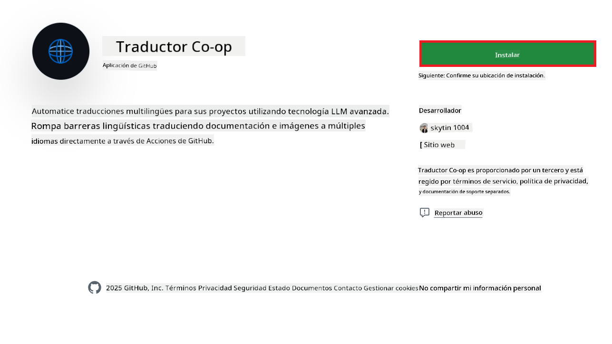
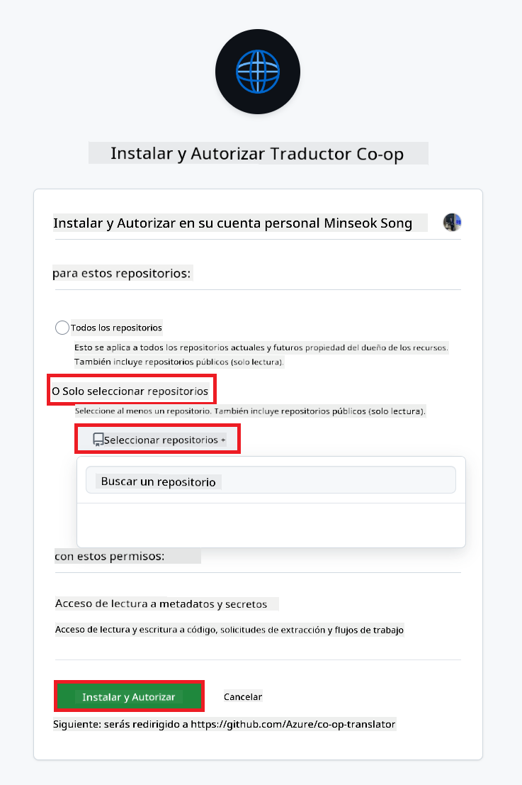
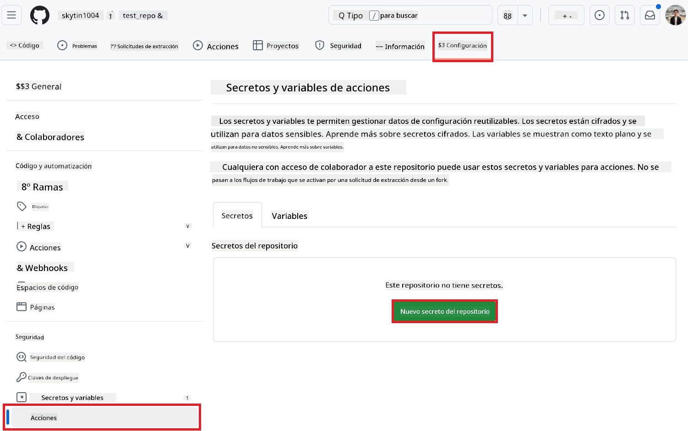
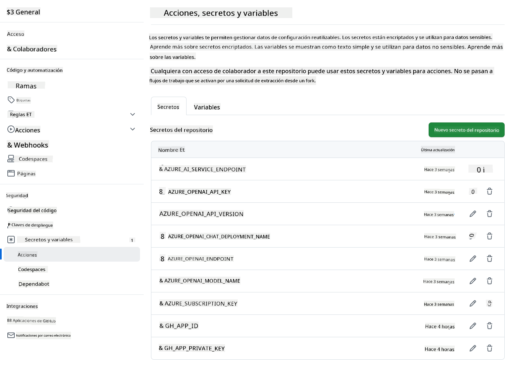

<!--
CO_OP_TRANSLATOR_METADATA:
{
  "original_hash": "c437820027c197f25fb2cbee95bae28c",
  "translation_date": "2025-06-12T18:59:41+00:00",
  "source_file": "getting_started/github-actions-guide/github-actions-guide-org.md",
  "language_code": "es"
}
-->
# Uso de la acción Co-op Translator en GitHub (Guía para organizaciones)

**Audiencia objetivo:** Esta guía está dirigida a **usuarios internos de Microsoft** o **equipos que tengan acceso a las credenciales necesarias para la aplicación Co-op Translator GitHub preconstruida** o que puedan crear su propia aplicación personalizada de GitHub.

Automatiza la traducción de la documentación de tu repositorio de forma sencilla usando la acción Co-op Translator de GitHub. Esta guía te explica cómo configurar la acción para que cree automáticamente pull requests con las traducciones actualizadas cada vez que cambien tus archivos Markdown fuente o imágenes.

> [!IMPORTANT]
> 
> **Elegir la guía correcta:**
>
> Esta guía detalla la configuración usando un **ID de GitHub App y una clave privada**. Normalmente necesitas este método de "Guía para organizaciones" si: **`GITHUB_TOKEN` Permisos restringidos:** La configuración de tu organización o repositorio limita los permisos predeterminados otorgados al `GITHUB_TOKEN` estándar. En particular, si al `GITHUB_TOKEN` no se le permiten los permisos `write` necesarios (como `contents: write` o `pull-requests: write`), el flujo de trabajo en la [Guía pública de configuración](./github-actions-guide-public.md) fallará por permisos insuficientes. Usar una GitHub App dedicada con permisos explícitos evita esta limitación.
>
> **Si lo anterior no aplica para ti:**
>
> Si el `GITHUB_TOKEN` estándar tiene permisos suficientes en tu repositorio (es decir, no estás bloqueado por restricciones organizacionales), utiliza la **[Guía pública de configuración usando GITHUB_TOKEN](./github-actions-guide-public.md)**. La guía pública no requiere obtener ni gestionar IDs de App o claves privadas y se basa únicamente en el `GITHUB_TOKEN` estándar y los permisos del repositorio.

## Requisitos previos

Antes de configurar la acción de GitHub, asegúrate de tener listas las credenciales necesarias para los servicios de IA.

**1. Obligatorio: Credenciales para el modelo de lenguaje IA**  
Necesitas credenciales para al menos uno de los modelos de lenguaje soportados:

- **Azure OpenAI**: Requiere Endpoint, clave API, nombres de modelo/despliegue, versión de API.  
- **OpenAI**: Requiere clave API, (Opcional: ID de organización, URL base, ID de modelo).  
- Consulta [Modelos y servicios soportados](../../../../README.md) para más detalles.  
- Guía de configuración: [Configurar Azure OpenAI](../set-up-resources/set-up-azure-openai.md).

**2. Opcional: Credenciales para Computer Vision (para traducción de imágenes)**

- Solo necesario si quieres traducir texto dentro de imágenes.  
- **Azure Computer Vision**: Requiere Endpoint y clave de suscripción.  
- Si no se proporcionan, la acción usará por defecto el [modo solo Markdown](../markdown-only-mode.md).  
- Guía de configuración: [Configurar Azure Computer Vision](../set-up-resources/set-up-azure-computer-vision.md).

## Configuración

Sigue estos pasos para configurar la acción Co-op Translator en tu repositorio:

### Paso 1: Instalar y configurar la autenticación de GitHub App

El flujo de trabajo usa autenticación mediante GitHub App para interactuar de forma segura con tu repositorio (por ejemplo, para crear pull requests) en tu nombre. Elige una opción:

#### **Opción A: Instalar la GitHub App preconstruida Co-op Translator (uso interno Microsoft)**

1. Ve a la página de la [GitHub App Co-op Translator](https://github.com/apps/co-op-translator).

1. Selecciona **Instalar** y elige la cuenta u organización donde está tu repositorio objetivo.

    

1. Escoge **Solo seleccionar repositorios** y selecciona tu repositorio objetivo (por ejemplo, `PhiCookBook`). Haz clic en **Instalar**. Puede que te pidan autenticarte.

    

1. **Obtener credenciales de la App (proceso interno requerido):** Para que el flujo de trabajo se autentique como la app, necesitas dos datos proporcionados por el equipo de Co-op Translator:  
  - **App ID:** Identificador único de la app Co-op Translator. El App ID es: `1164076`.  
  - **Clave privada:** Debes obtener **todo el contenido** del archivo de clave privada `.pem` del contacto del mantenedor. **Trata esta clave como una contraseña y mantenla segura.**

1. Continúa al Paso 2.

#### **Opción B: Usar tu propia GitHub App personalizada**

- Si prefieres, puedes crear y configurar tu propia GitHub App. Asegúrate de que tenga acceso de lectura y escritura a Contents y Pull requests. Necesitarás su App ID y una clave privada generada.

### Paso 2: Configurar secretos en el repositorio

Debes agregar las credenciales de la GitHub App y las credenciales de tus servicios de IA como secretos cifrados en la configuración del repositorio.

1. Ve a tu repositorio objetivo en GitHub (por ejemplo, `PhiCookBook`).

1. Navega a **Settings** > **Secrets and variables** > **Actions**.

1. En **Repository secrets**, haz clic en **New repository secret** para cada secreto listado a continuación.

   

**Secretos obligatorios (para autenticación GitHub App):**

| Nombre del secreto          | Descripción                                      | Fuente del valor                                |
| :------------------------- | :----------------------------------------------- | :---------------------------------------------- |
| `GH_APP_ID`          | El App ID de la GitHub App (del Paso 1).         | Configuración de GitHub App                      |
| `GH_APP_PRIVATE_KEY` | El **contenido completo** del archivo `.pem` descargado. | Archivo `.pem` (del Paso 1)           |

**Secretos de servicio IA (agrega TODOS los que apliquen según tus requisitos):**

| Nombre del secreto                         | Descripción                               | Fuente del valor                  |
| :---------------------------------------- | :---------------------------------------- | :------------------------------- |
| `AZURE_SUBSCRIPTION_KEY`            | Clave para Azure AI Service (Computer Vision)  | Azure AI Foundry                   |
| `AZURE_AI_SERVICE_ENDPOINT`         | Endpoint para Azure AI Service (Computer Vision) | Azure AI Foundry                   |
| `AZURE_OPENAI_API_KEY`              | Clave para servicio Azure OpenAI              | Azure AI Foundry                   |
| `AZURE_OPENAI_ENDPOINT`             | Endpoint para servicio Azure OpenAI            | Azure AI Foundry                   |
| `AZURE_OPENAI_MODEL_NAME`           | Nombre de tu modelo Azure OpenAI              | Azure AI Foundry                   |
| `AZURE_OPENAI_CHAT_DEPLOYMENT_NAME` | Nombre de tu despliegue Azure OpenAI           | Azure AI Foundry                   |
| `AZURE_OPENAI_API_VERSION`          | Versión de API para Azure OpenAI              | Azure AI Foundry                   |
| `OPENAI_API_KEY`                    | Clave API para OpenAI                        | Plataforma OpenAI                 |
| `OPENAI_ORG_ID`                     | ID de organización OpenAI                    | Plataforma OpenAI                 |
| `OPENAI_CHAT_MODEL_ID`              | ID específico de modelo OpenAI                | Plataforma OpenAI                 |
| `OPENAI_BASE_URL`                   | URL base personalizada para OpenAI API       | Plataforma OpenAI                 |



### Paso 3: Crear el archivo de flujo de trabajo

Finalmente, crea el archivo YAML que define el flujo de trabajo automatizado.

1. En el directorio raíz de tu repositorio, crea la carpeta `.github/workflows/` si no existe.

1. Dentro de `.github/workflows/`, crea un archivo llamado `co-op-translator.yml`.

1. Pega el siguiente contenido en co-op-translator.yml.

```
name: Co-op Translator

on:
  push:
    branches:
      - main

jobs:
  co-op-translator:
    runs-on: ubuntu-latest

    permissions:
      contents: write
      pull-requests: write

    steps:
      - name: Checkout repository
        uses: actions/checkout@v4
        with:
          fetch-depth: 0

      - name: Set up Python
        uses: actions/setup-python@v4
        with:
          python-version: '3.10'

      - name: Install Co-op Translator
        run: |
          python -m pip install --upgrade pip
          pip install co-op-translator

      - name: Run Co-op Translator
        env:
          PYTHONIOENCODING: utf-8
          # Azure AI Service Credentials
          AZURE_SUBSCRIPTION_KEY: ${{ secrets.AZURE_SUBSCRIPTION_KEY }}
          AZURE_AI_SERVICE_ENDPOINT: ${{ secrets.AZURE_AI_SERVICE_ENDPOINT }}

          # Azure OpenAI Credentials
          AZURE_OPENAI_API_KEY: ${{ secrets.AZURE_OPENAI_API_KEY }}
          AZURE_OPENAI_ENDPOINT: ${{ secrets.AZURE_OPENAI_ENDPOINT }}
          AZURE_OPENAI_MODEL_NAME: ${{ secrets.AZURE_OPENAI_MODEL_NAME }}
          AZURE_OPENAI_CHAT_DEPLOYMENT_NAME: ${{ secrets.AZURE_OPENAI_CHAT_DEPLOYMENT_NAME }}
          AZURE_OPENAI_API_VERSION: ${{ secrets.AZURE_OPENAI_API_VERSION }}

          # OpenAI Credentials
          OPENAI_API_KEY: ${{ secrets.OPENAI_API_KEY }}
          OPENAI_ORG_ID: ${{ secrets.OPENAI_ORG_ID }}
          OPENAI_CHAT_MODEL_ID: ${{ secrets.OPENAI_CHAT_MODEL_ID }}
          OPENAI_BASE_URL: ${{ secrets.OPENAI_BASE_URL }}
        run: |
          # =====================================================================
          # IMPORTANT: Set your target languages here (REQUIRED CONFIGURATION)
          # =====================================================================
          # Example: Translate to Spanish, French, German. Add -y to auto-confirm.
          translate -l "es fr de" -y  # <--- MODIFY THIS LINE with your desired languages

      - name: Authenticate GitHub App
        id: generate_token
        uses: tibdex/github-app-token@v1
        with:
          app_id: ${{ secrets.GH_APP_ID }}
          private_key: ${{ secrets.GH_APP_PRIVATE_KEY }}

      - name: Create Pull Request with translations
        uses: peter-evans/create-pull-request@v5
        with:
          token: ${{ steps.generate_token.outputs.token }}
          commit-message: "🌐 Update translations via Co-op Translator"
          title: "🌐 Update translations via Co-op Translator"
          body: |
            This PR updates translations for recent changes to the main branch.

            ### 📋 Changes included
            - Translated contents are available in the `translations/` directory
            - Translated images are available in the `translated_images/` directory

            ---
            🌐 Automatically generated by the [Co-op Translator](https://github.com/Azure/co-op-translator) GitHub Action.
          branch: update-translations
          base: main
          labels: translation, automated-pr
          delete-branch: true
          add-paths: |
            translations/
            translated_images/

```

4.  **Personaliza el flujo de trabajo:**  
  - **[!IMPORTANT] Idiomas destino:** En el comando `Run Co-op Translator` step, you **MUST review and modify the list of language codes** within the `translate -l "..." -y` command to match your project's requirements. The example list (`ar de es...`) needs to be replaced or adjusted.
  - **Trigger (`on:`):** The current trigger runs on every push to `main`. For large repositories, consider adding a `paths:` filter (see commented example in the YAML) to run the workflow only when relevant files (e.g., source documentation) change, saving runner minutes.
  - **PR Details:** Customize the `commit-message`, `title`, `body`, `branch` name, and `labels` in the `Create Pull Request` step if needed.

## Credential Management and Renewal

- **Security:** Always store sensitive credentials (API keys, private keys) as GitHub Actions secrets. Never expose them in your workflow file or repository code.
- **[!IMPORTANT] Key Renewal (Internal Microsoft Users):** Be aware that Azure OpenAI key used within Microsoft might have a mandatory renewal policy (e.g., every 5 months). Ensure you update the corresponding GitHub secrets (`AZURE_OPENAI_...` especifica los idiomas a traducir antes de que las claves expiren para evitar fallos en el flujo de trabajo.

## Ejecución del flujo de trabajo

Una vez que el archivo `co-op-translator.yml` esté fusionado en tu rama principal (o la rama especificada en el filtro `on:` trigger), the workflow will automatically run whenever changes are pushed to that branch (and match the `paths`, si está configurado).

Si se generan o actualizan traducciones, la acción creará automáticamente un Pull Request con los cambios, listo para que lo revises y lo fusiones.

**Aviso legal**:  
Este documento ha sido traducido utilizando el servicio de traducción automática [Co-op Translator](https://github.com/Azure/co-op-translator). Aunque nos esforzamos por la precisión, tenga en cuenta que las traducciones automáticas pueden contener errores o inexactitudes. El documento original en su idioma nativo debe considerarse la fuente autorizada. Para información crítica, se recomienda la traducción profesional realizada por humanos. No nos hacemos responsables de ningún malentendido o interpretación errónea que pueda surgir del uso de esta traducción.