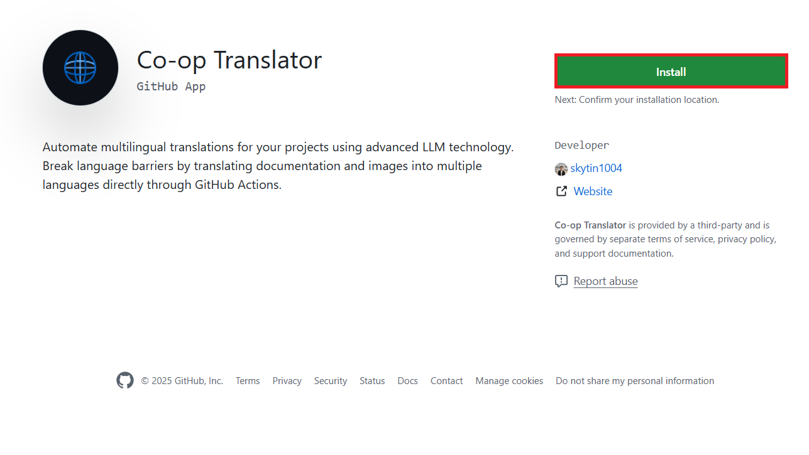

<!--
CO_OP_TRANSLATOR_METADATA:
{
  "original_hash": "c437820027c197f25fb2cbee95bae28c",
  "translation_date": "2025-05-06T18:03:25+00:00",
  "source_file": "getting_started/github-actions-guide/github-actions-guide-org.md",
  "language_code": "es"
}
-->
# Uso de la acción Co-op Translator de GitHub (Guía para organizaciones)

**Audiencia objetivo:** Esta guía está dirigida a **usuarios internos de Microsoft** o **equipos que tengan acceso a las credenciales necesarias para la aplicación Co-op Translator preconstruida en GitHub** o que puedan crear su propia aplicación personalizada de GitHub.

Automatiza la traducción de la documentación de tu repositorio sin esfuerzo usando la acción Co-op Translator de GitHub. Esta guía te lleva paso a paso para configurar la acción y crear automáticamente pull requests con las traducciones actualizadas cada vez que cambien tus archivos Markdown fuente o imágenes.

> [!IMPORTANT]
> 
> **Elección de la guía adecuada:**
>
> Esta guía detalla la configuración usando un **GitHub App ID y una clave privada**. Normalmente necesitas este método "Guía para organizaciones" si: **`GITHUB_TOKEN` permisos están restringidos:** La configuración de tu organización o repositorio limita los permisos predeterminados otorgados al `GITHUB_TOKEN` estándar. Específicamente, si el `GITHUB_TOKEN` no tiene los permisos `write` necesarios (como `contents: write` o `pull-requests: write`), el flujo de trabajo en la [Guía de configuración pública](./github-actions-guide-public.md) fallará por permisos insuficientes. Usar una aplicación GitHub dedicada con permisos explícitos evita esta limitación.
>
> **Si lo anterior no aplica para ti:**
>
> Si el `GITHUB_TOKEN` estándar tiene permisos suficientes en tu repositorio (es decir, no estás bloqueado por restricciones organizativas), utiliza la **[Guía pública de configuración usando GITHUB_TOKEN](./github-actions-guide-public.md)**. La guía pública no requiere obtener ni gestionar App IDs o claves privadas y se basa únicamente en el `GITHUB_TOKEN` estándar y los permisos del repositorio.

## Requisitos previos

Antes de configurar la acción de GitHub, asegúrate de tener las credenciales necesarias para los servicios de IA.

**1. Requisito: Credenciales para el modelo de lenguaje IA**  
Necesitas credenciales para al menos un modelo de lenguaje compatible:

- **Azure OpenAI**: Requiere Endpoint, clave API, nombres de modelo/despliegue, versión de API.  
- **OpenAI**: Requiere clave API, (Opcional: ID de organización, URL base, ID de modelo).  
- Consulta [Modelos y servicios compatibles](../../../../README.md) para más detalles.  
- Guía de configuración: [Configurar Azure OpenAI](../set-up-resources/set-up-azure-openai.md).

**2. Opcional: Credenciales de Computer Vision (para traducción de imágenes)**

- Solo requerido si necesitas traducir texto dentro de imágenes.  
- **Azure Computer Vision**: Requiere Endpoint y clave de suscripción.  
- Si no se proporciona, la acción usa el [modo solo Markdown](../markdown-only-mode.md).  
- Guía de configuración: [Configurar Azure Computer Vision](../set-up-resources/set-up-azure-computer-vision.md).

## Configuración

Sigue estos pasos para configurar la acción Co-op Translator en tu repositorio:

### Paso 1: Instalar y configurar la autenticación de GitHub App

El flujo de trabajo usa autenticación mediante GitHub App para interactuar de forma segura con tu repositorio (por ejemplo, crear pull requests) en tu nombre. Elige una opción:

#### **Opción A: Instalar la aplicación Co-op Translator preconstruida (uso interno de Microsoft)**

1. Ve a la página de la [aplicación Co-op Translator en GitHub](https://github.com/apps/co-op-translator).

1. Selecciona **Install** y elige la cuenta u organización donde está el repositorio destino.

    

1. Elige **Only select repositories** y selecciona tu repositorio objetivo (por ejemplo, `PhiCookBook`). Haz clic en **Install**. Puede que te pidan autenticarte.

    

1. **Obtén las credenciales de la aplicación (proceso interno requerido):** Para que el flujo de trabajo pueda autenticarse como la app, necesitas dos datos proporcionados por el equipo de Co-op Translator:  
  - **App ID:** Identificador único de la aplicación Co-op Translator. El App ID es: `1164076`.  
  - **Clave privada:** Debes obtener el **contenido completo** del archivo de clave privada `.pem` del contacto encargado. **Trata esta clave como una contraseña y mantenla segura.**

1. Continúa al Paso 2.

#### **Opción B: Usa tu propia aplicación personalizada de GitHub**

- Si prefieres, puedes crear y configurar tu propia aplicación GitHub. Asegúrate que tenga acceso de lectura y escritura a Contents y Pull requests. Necesitarás su App ID y una clave privada generada.

### Paso 2: Configurar los secretos del repositorio

Debes agregar las credenciales de la GitHub App y las credenciales del servicio de IA como secretos cifrados en la configuración de tu repositorio.

1. Navega a tu repositorio GitHub objetivo (por ejemplo, `PhiCookBook`).

1. Ve a **Settings** > **Secrets and variables** > **Actions**.

1. Bajo **Repository secrets**, haz clic en **New repository secret** para cada secreto listado abajo.

   

**Secretos requeridos (para autenticación GitHub App):**

| Nombre del secreto          | Descripción                                      | Origen del valor                              |
| :------------------------- | :----------------------------------------------- | :-------------------------------------------- |
| `GH_APP_ID`         | El App ID de la aplicación GitHub (del Paso 1). | Configuración de la aplicación GitHub        |
| `GH_APP_PRIVATE_KEY`         | El **contenido completo** del archivo `.pem` descargado. | Archivo `.pem` (del Paso 1)       |

**Secretos para servicio de IA (agrega TODOS los que apliquen según tus requisitos):**

| Nombre del secreto           | Descripción                               | Origen del valor                     |
| :--------------------------- | :---------------------------------------- | :---------------------------------- |
| `AZURE_SUBSCRIPTION_KEY`           | Clave para Azure AI Service (Computer Vision)  | Azure AI Foundry                    |
| `AZURE_AI_SERVICE_ENDPOINT`           | Endpoint para Azure AI Service (Computer Vision) | Azure AI Foundry                   |
| `AZURE_OPENAI_API_KEY`           | Clave para servicio Azure OpenAI              | Azure AI Foundry                   |
| `AZURE_OPENAI_ENDPOINT`           | Endpoint para servicio Azure OpenAI            | Azure AI Foundry                   |
| `AZURE_OPENAI_MODEL_NAME`           | Nombre de tu modelo Azure OpenAI                | Azure AI Foundry                   |
| `AZURE_OPENAI_CHAT_DEPLOYMENT_NAME`           | Nombre de tu despliegue Azure OpenAI             | Azure AI Foundry                   |
| `AZURE_OPENAI_API_VERSION`           | Versión de API para Azure OpenAI                  | Azure AI Foundry                   |
| `OPENAI_API_KEY`           | Clave API para OpenAI                             | Plataforma OpenAI                 |
| `OPENAI_ORG_ID`           | ID de organización OpenAI                         | Plataforma OpenAI                 |
| `OPENAI_CHAT_MODEL_ID`           | ID específico de modelo OpenAI                     | Plataforma OpenAI                 |
| `OPENAI_BASE_URL`           | URL base personalizada para API OpenAI             | Plataforma OpenAI                 |


### Paso 3: Crear el archivo de flujo de trabajo

Finalmente, crea el archivo YAML que define el flujo de trabajo automatizado.

1. En el directorio raíz de tu repositorio, crea el directorio `.github/workflows/` si no existe.

1. Dentro de `.github/workflows/`, crea un archivo llamado `co-op-translator.yml`.

1. Pega el siguiente contenido en co-op-translator.yml.

```
name: Co-op Translator

on:
  push:
    branches:
      - main

jobs:
  co-op-translator:
    runs-on: ubuntu-latest

    permissions:
      contents: write
      pull-requests: write

    steps:
      - name: Checkout repository
        uses: actions/checkout@v4
        with:
          fetch-depth: 0

      - name: Set up Python
        uses: actions/setup-python@v4
        with:
          python-version: '3.10'

      - name: Install Co-op Translator
        run: |
          python -m pip install --upgrade pip
          pip install co-op-translator

      - name: Run Co-op Translator
        env:
          PYTHONIOENCODING: utf-8
          # Azure AI Service Credentials
          AZURE_SUBSCRIPTION_KEY: ${{ secrets.AZURE_SUBSCRIPTION_KEY }}
          AZURE_AI_SERVICE_ENDPOINT: ${{ secrets.AZURE_AI_SERVICE_ENDPOINT }}

          # Azure OpenAI Credentials
          AZURE_OPENAI_API_KEY: ${{ secrets.AZURE_OPENAI_API_KEY }}
          AZURE_OPENAI_ENDPOINT: ${{ secrets.AZURE_OPENAI_ENDPOINT }}
          AZURE_OPENAI_MODEL_NAME: ${{ secrets.AZURE_OPENAI_MODEL_NAME }}
          AZURE_OPENAI_CHAT_DEPLOYMENT_NAME: ${{ secrets.AZURE_OPENAI_CHAT_DEPLOYMENT_NAME }}
          AZURE_OPENAI_API_VERSION: ${{ secrets.AZURE_OPENAI_API_VERSION }}

          # OpenAI Credentials
          OPENAI_API_KEY: ${{ secrets.OPENAI_API_KEY }}
          OPENAI_ORG_ID: ${{ secrets.OPENAI_ORG_ID }}
          OPENAI_CHAT_MODEL_ID: ${{ secrets.OPENAI_CHAT_MODEL_ID }}
          OPENAI_BASE_URL: ${{ secrets.OPENAI_BASE_URL }}
        run: |
          # =====================================================================
          # IMPORTANT: Set your target languages here (REQUIRED CONFIGURATION)
          # =====================================================================
          # Example: Translate to Spanish, French, German. Add -y to auto-confirm.
          translate -l "es fr de" -y  # <--- MODIFY THIS LINE with your desired languages

      - name: Authenticate GitHub App
        id: generate_token
        uses: tibdex/github-app-token@v1
        with:
          app_id: ${{ secrets.GH_APP_ID }}
          private_key: ${{ secrets.GH_APP_PRIVATE_KEY }}

      - name: Create Pull Request with translations
        uses: peter-evans/create-pull-request@v5
        with:
          token: ${{ steps.generate_token.outputs.token }}
          commit-message: "🌐 Update translations via Co-op Translator"
          title: "🌐 Update translations via Co-op Translator"
          body: |
            This PR updates translations for recent changes to the main branch.

            ### 📋 Changes included
            - Translated contents are available in the `translations/` directory
            - Translated images are available in the `translated_images/` directory

            ---
             🌐 Automatically generated by the [Co-op Translator](https://github.com/Azure/co-op-translator) GitHub Action.
          branch: update-translations
          base: main
          labels: translation, automated-pr
          delete-branch: true
          add-paths: |
            translations/
            translated_images/

```

4.  **Personaliza el flujo de trabajo:**  
  - **[!IMPORTANT] Idiomas destino:** En la línea `Run Co-op Translator` step, you **MUST review and modify the list of language codes** within the `translate -l "..." -y` command to match your project's requirements. The example list (`ar de es...`) needs to be replaced or adjusted.
  - **Trigger (`on:`):** The current trigger runs on every push to `main`. For large repositories, consider adding a `paths:` filter (see commented example in the YAML) to run the workflow only when relevant files (e.g., source documentation) change, saving runner minutes.
  - **PR Details:** Customize the `commit-message`, `title`, `body`, `branch` name, and `labels` in the `Create Pull Request` step if needed.

## Credential Management and Renewal

- **Security:** Always store sensitive credentials (API keys, private keys) as GitHub Actions secrets. Never expose them in your workflow file or repository code.
- **[!IMPORTANT] Key Renewal (Internal Microsoft Users):** Be aware that Azure OpenAI key used within Microsoft might have a mandatory renewal policy (e.g., every 5 months). Ensure you update the corresponding GitHub secrets (`AZURE_OPENAI_...` configura los idiomas a traducir.  
  - Asegúrate de renovar las credenciales de API (las claves bajo los secretos como AZURE_OPENAI_...) **antes de que expiren** para evitar fallos en el flujo de trabajo.

## Ejecución del flujo de trabajo

Una vez que el archivo `co-op-translator.yml` se haya fusionado en tu rama main (o la rama especificada en el filtro `on:` trigger), the workflow will automatically run whenever changes are pushed to that branch (and match the `paths`, si está configurado).

Si se generan o actualizan traducciones, la acción creará automáticamente un Pull Request con los cambios, listo para que lo revises y fusiones.

**Descargo de responsabilidad**:  
Este documento ha sido traducido utilizando el servicio de traducción automática [Co-op Translator](https://github.com/Azure/co-op-translator). Aunque nos esforzamos por lograr precisión, tenga en cuenta que las traducciones automáticas pueden contener errores o inexactitudes. El documento original en su idioma nativo debe considerarse la fuente autorizada. Para información crítica, se recomienda una traducción profesional realizada por humanos. No nos hacemos responsables por malentendidos o interpretaciones erróneas que puedan surgir del uso de esta traducción.