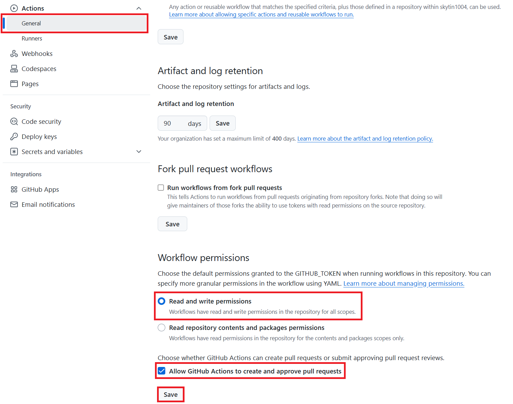

<!--
CO_OP_TRANSLATOR_METADATA:
{
  "original_hash": "527ca4d0a8d3f51087ec3317279e36ee",
  "translation_date": "2025-10-15T02:11:43+00:00",
  "source_file": "getting_started/github-actions-guide/github-actions-guide-public.md",
  "language_code": "es"
}
-->
# Uso de la Acción de GitHub Co-op Translator (Configuración Pública)

**Público objetivo:** Esta guía está dirigida a usuarios de la mayoría de los repositorios públicos o privados donde los permisos estándar de GitHub Actions son suficientes. Utiliza el `GITHUB_TOKEN` integrado.

Automatiza la traducción de la documentación de tu repositorio fácilmente usando la Acción de GitHub Co-op Translator. Esta guía te explica cómo configurar la acción para crear automáticamente pull requests con traducciones actualizadas cada vez que cambien tus archivos Markdown fuente o imágenes.

> [!IMPORTANT]
>
> **Elegir la guía adecuada:**
>
> Esta guía detalla la **configuración más sencilla usando el `GITHUB_TOKEN` estándar**. Es el método recomendado para la mayoría de los usuarios, ya que no requiere gestionar claves privadas sensibles de GitHub App.
>

## Requisitos previos

Antes de configurar la Acción de GitHub, asegúrate de tener listas las credenciales del servicio de IA necesarias.

**1. Obligatorio: Credenciales del modelo de lenguaje IA**
Necesitas credenciales para al menos uno de los modelos de lenguaje compatibles:

- **Azure OpenAI**: Requiere Endpoint, API Key, nombres de modelo/despliegue, versión de API.
- **OpenAI**: Requiere API Key, (Opcional: Org ID, Base URL, Model ID).
- Consulta [Modelos y servicios compatibles](../../../../README.md) para más detalles.

**2. Opcional: Credenciales de IA Vision (para traducción de imágenes)**

- Solo necesarias si necesitas traducir texto dentro de imágenes.
- **Azure AI Vision**: Requiere Endpoint y Subscription Key.
- Si no se proporcionan, la acción funcionará en [modo solo Markdown](../markdown-only-mode.md).

## Configuración

Sigue estos pasos para configurar la Acción de GitHub Co-op Translator en tu repositorio usando el `GITHUB_TOKEN` estándar.

### Paso 1: Entender la autenticación (usando `GITHUB_TOKEN`)

Este flujo de trabajo utiliza el `GITHUB_TOKEN` integrado que proporciona GitHub Actions. Este token otorga automáticamente permisos al flujo de trabajo para interactuar con tu repositorio según la configuración establecida en el **Paso 3**.

### Paso 2: Configurar secretos del repositorio

Solo necesitas agregar tus **credenciales del servicio de IA** como secretos cifrados en la configuración de tu repositorio.

1.  Ve a tu repositorio de GitHub.
2.  Dirígete a **Settings** > **Secrets and variables** > **Actions**.
3.  En **Repository secrets**, haz clic en **New repository secret** para cada secreto de servicio de IA requerido que se indica abajo.

     *(Referencia de imagen: muestra dónde agregar secretos)*

**Secretos requeridos del servicio de IA (Agrega TODOS los que correspondan según tus requisitos previos):**

| Nombre del secreto                         | Descripción                               | Fuente del valor                     |
| :----------------------------------------- | :---------------------------------------- | :----------------------------------- |
| `AZURE_AI_SERVICE_API_KEY`                 | Clave para Azure AI Service (Computer Vision)  | Tu Azure AI Foundry                  |
| `AZURE_AI_SERVICE_ENDPOINT`                | Endpoint para Azure AI Service (Computer Vision) | Tu Azure AI Foundry                  |
| `AZURE_OPENAI_API_KEY`                     | Clave para el servicio Azure OpenAI              | Tu Azure AI Foundry                  |
| `AZURE_OPENAI_ENDPOINT`                    | Endpoint para el servicio Azure OpenAI           | Tu Azure AI Foundry                  |
| `AZURE_OPENAI_MODEL_NAME`                  | Nombre de tu modelo Azure OpenAI                 | Tu Azure AI Foundry                  |
| `AZURE_OPENAI_CHAT_DEPLOYMENT_NAME`        | Nombre de despliegue de Azure OpenAI             | Tu Azure AI Foundry                  |
| `AZURE_OPENAI_API_VERSION`                 | Versión de API para Azure OpenAI                 | Tu Azure AI Foundry                  |
| `OPENAI_API_KEY`                           | API Key para OpenAI                             | Tu plataforma OpenAI                 |
| `OPENAI_ORG_ID`                            | ID de organización de OpenAI (Opcional)          | Tu plataforma OpenAI                 |
| `OPENAI_CHAT_MODEL_ID`                     | ID de modelo específico de OpenAI (Opcional)     | Tu plataforma OpenAI                 |
| `OPENAI_BASE_URL`                          | URL base personalizada de la API de OpenAI (Opcional) | Tu plataforma OpenAI            |

### Paso 3: Configurar permisos del flujo de trabajo

La Acción de GitHub necesita permisos otorgados mediante el `GITHUB_TOKEN` para hacer checkout del código y crear pull requests.

1.  En tu repositorio, ve a **Settings** > **Actions** > **General**.
2.  Desplázate hasta la sección **Workflow permissions**.
3.  Selecciona **Read and write permissions**. Esto otorga al `GITHUB_TOKEN` los permisos necesarios de `contents: write` y `pull-requests: write` para este flujo de trabajo.
4.  Asegúrate de que la casilla **Allow GitHub Actions to create and approve pull requests** esté **marcada**.
5.  Haz clic en **Save**.



### Paso 4: Crear el archivo de flujo de trabajo

Por último, crea el archivo YAML que define el flujo de trabajo automatizado usando `GITHUB_TOKEN`.

1.  En el directorio raíz de tu repositorio, crea el directorio `.github/workflows/` si no existe.
2.  Dentro de `.github/workflows/`, crea un archivo llamado `co-op-translator.yml`.
3.  Pega el siguiente contenido en `co-op-translator.yml`.

```yaml
name: Co-op Translator

on:
  push:
    branches:
      - main

jobs:
  co-op-translator:
    runs-on: ubuntu-latest

    permissions:
      contents: write
      pull-requests: write

    steps:
      - name: Checkout repository
        uses: actions/checkout@v4
        with:
          fetch-depth: 0

      - name: Set up Python
        uses: actions/setup-python@v4
        with:
          python-version: '3.10'

      - name: Install Co-op Translator
        run: |
          python -m pip install --upgrade pip
          pip install co-op-translator

      - name: Run Co-op Translator
        env:
          PYTHONIOENCODING: utf-8
          # === AI Service Credentials ===
          AZURE_AI_SERVICE_API_KEY: ${{ secrets.AZURE_AI_SERVICE_API_KEY }}
          AZURE_AI_SERVICE_ENDPOINT: ${{ secrets.AZURE_AI_SERVICE_ENDPOINT }}
          AZURE_OPENAI_API_KEY: ${{ secrets.AZURE_OPENAI_API_KEY }}
          AZURE_OPENAI_ENDPOINT: ${{ secrets.AZURE_OPENAI_ENDPOINT }}
          AZURE_OPENAI_MODEL_NAME: ${{ secrets.AZURE_OPENAI_MODEL_NAME }}
          AZURE_OPENAI_CHAT_DEPLOYMENT_NAME: ${{ secrets.AZURE_OPENAI_CHAT_DEPLOYMENT_NAME }}
          AZURE_OPENAI_API_VERSION: ${{ secrets.AZURE_OPENAI_API_VERSION }}
          OPENAI_API_KEY: ${{ secrets.OPENAI_API_KEY }}
          OPENAI_ORG_ID: ${{ secrets.OPENAI_ORG_ID }}
          OPENAI_CHAT_MODEL_ID: ${{ secrets.OPENAI_CHAT_MODEL_ID }}
          OPENAI_BASE_URL: ${{ secrets.OPENAI_BASE_URL }}
        run: |
          # =====================================================================
          # IMPORTANT: Set your target languages here (REQUIRED CONFIGURATION)
          # =====================================================================
          # Example: Translate to Spanish, French, German. Add -y to auto-confirm.
          translate -l "es fr de" -y  # <--- MODIFY THIS LINE with your desired languages

      - name: Create Pull Request with translations
        uses: peter-evans/create-pull-request@v5
        with:
          token: ${{ secrets.GITHUB_TOKEN }}
          commit-message: "🌐 Update translations via Co-op Translator"
          title: "🌐 Update translations via Co-op Translator"
          body: |
            This PR updates translations for recent changes to the main branch.

            ### 📋 Changes included
            - Translated contents are available in the `translations/` directory
            - Translated images are available in the `translated_images/` directory

            ---
            🌐 Automatically generated by the [Co-op Translator](https://github.com/Azure/co-op-translator) GitHub Action.
          branch: update-translations
          base: main
          labels: translation, automated-pr
          delete-branch: true
          add-paths: |
            translations/
            translated_images/
```
4.  **Personaliza el flujo de trabajo:**
  - **[!IMPORTANT] Idiomas objetivo:** En el paso `Run Co-op Translator`, **DEBES revisar y modificar la lista de códigos de idioma** dentro del comando `translate -l "..." -y` para que se ajuste a los requisitos de tu proyecto. La lista de ejemplo (`ar de es...`) debe ser reemplazada o ajustada.
  - **Disparador (`on:`):** El disparador actual se ejecuta en cada push a `main`. Para repositorios grandes, considera agregar un filtro `paths:` (ver ejemplo comentado en el YAML) para ejecutar el flujo de trabajo solo cuando cambien archivos relevantes (por ejemplo, documentación fuente), ahorrando minutos de ejecución.
  - **Detalles del PR:** Personaliza el `commit-message`, `title`, `body`, nombre de la `branch` y `labels` en el paso `Create Pull Request` si lo necesitas.

## Ejecución del flujo de trabajo

> [!WARNING]  
> **Límite de tiempo de ejecución en runners alojados por GitHub:**  
> Los runners alojados por GitHub como `ubuntu-latest` tienen un **límite máximo de ejecución de 6 horas**.  
> Para repositorios de documentación grandes, si el proceso de traducción supera las 6 horas, el flujo de trabajo se terminará automáticamente.  
> Para evitar esto, considera:  
> - Usar un **runner autoalojado** (sin límite de tiempo)  
> - Reducir el número de idiomas objetivo por ejecución

Una vez que el archivo `co-op-translator.yml` se haya fusionado en tu rama principal (o la rama especificada en el disparador `on:`), el flujo de trabajo se ejecutará automáticamente cada vez que se hagan cambios en esa rama (y coincidan con el filtro `paths`, si está configurado).

---

**Descargo de responsabilidad**:  
Este documento ha sido traducido utilizando el servicio de traducción automática [Co-op Translator](https://github.com/Azure/co-op-translator). Aunque nos esforzamos por lograr precisión, tenga en cuenta que las traducciones automáticas pueden contener errores o inexactitudes. El documento original en su idioma nativo debe considerarse la fuente autorizada. Para información crítica, se recomienda la traducción profesional humana. No nos hacemos responsables de cualquier malentendido o interpretación incorrecta que surja del uso de esta traducción.