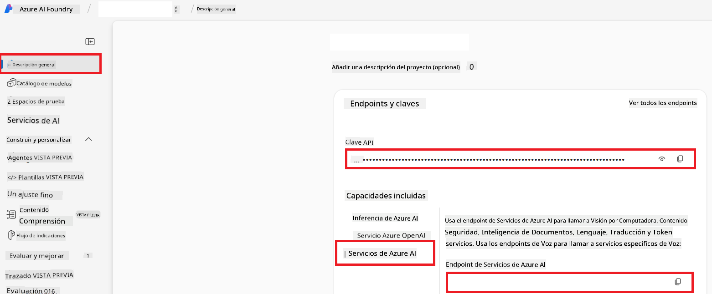

<!--
CO_OP_TRANSLATOR_METADATA:
{
  "original_hash": "b58d7c3cb4210697a073d20eb3064945",
  "translation_date": "2025-06-12T11:45:12+00:00",
  "source_file": "getting_started/set-up-azure-ai.md",
  "language_code": "es"
}
-->
# Configurar Azure AI para Co-op Translator (Azure OpenAI y Azure AI Vision)

Esta guía te muestra cómo configurar Azure OpenAI para traducción de idiomas y Azure Computer Vision para análisis de contenido en imágenes (que luego puede usarse para traducción basada en imágenes) dentro de Azure AI Foundry.

**Requisitos previos:**
- Una cuenta de Azure con una suscripción activa.
- Permisos suficientes para crear recursos y despliegues en tu suscripción de Azure.

## Crear un proyecto de Azure AI

Comenzarás creando un proyecto de Azure AI, que actúa como un lugar central para administrar tus recursos de IA.

1. Navega a [https://ai.azure.com](https://ai.azure.com) e inicia sesión con tu cuenta de Azure.

1. Selecciona **+Create** para crear un nuevo proyecto.

1. Realiza las siguientes tareas:
   - Ingresa un **Nombre del proyecto** (por ejemplo, `CoopTranslator-Project`).
   - Selecciona el **AI hub** (por ejemplo, `CoopTranslator-Hub`) (Crea uno nuevo si es necesario).

1. Haz clic en "**Review and Create**" para configurar tu proyecto. Serás dirigido a la página de resumen de tu proyecto.

## Configurar Azure OpenAI para traducción de idiomas

Dentro de tu proyecto, desplegarás un modelo de Azure OpenAI que servirá como backend para la traducción de texto.

### Navegar a tu proyecto

Si aún no estás ahí, abre tu proyecto recién creado (por ejemplo, `CoopTranslator-Project`) en Azure AI Foundry.

### Desplegar un modelo OpenAI

1. En el menú izquierdo de tu proyecto, bajo "My assets", selecciona "**Models + endpoints**".

1. Selecciona **+ Deploy model**.

1. Selecciona **Deploy Base Model**.

1. Se mostrará una lista de modelos disponibles. Filtra o busca un modelo GPT adecuado. Recomendamos `gpt-4o`.

1. Selecciona el modelo deseado y haz clic en **Confirm**.

1. Selecciona **Deploy**.

### Configuración de Azure OpenAI

Una vez desplegado, puedes seleccionar el despliegue desde la página "**Models + endpoints**" para encontrar su **URL del endpoint REST**, **Key**, **Nombre del despliegue**, **Nombre del modelo** y **Versión de API**. Estos datos serán necesarios para integrar el modelo de traducción en tu aplicación.

> [!NOTE]
> Puedes seleccionar versiones de API desde la página de [API version deprecation](https://learn.microsoft.com/azure/ai-services/openai/api-version-deprecation) según tus necesidades. Ten en cuenta que la **versión de API** es diferente de la **versión del modelo** que aparece en la página **Models + endpoints** en Azure AI Foundry.

## Configurar Azure Computer Vision para traducción de imágenes

Para habilitar la traducción de texto dentro de imágenes, necesitas obtener la Clave API y el Endpoint del Servicio Azure AI.

1. Navega a tu proyecto de Azure AI (por ejemplo, `CoopTranslator-Project`). Asegúrate de estar en la página de resumen del proyecto.

### Configuración del Servicio Azure AI

Encuentra la Clave API y el Endpoint desde el Servicio Azure AI.

1. Navega a tu proyecto de Azure AI (por ejemplo, `CoopTranslator-Project`). Asegúrate de estar en la página de resumen del proyecto.

1. Encuentra la **Clave API** y el **Endpoint** en la pestaña del Servicio Azure AI.

    

Esta conexión pone a disposición de tu proyecto AI Foundry las capacidades del recurso Azure AI Services vinculado (incluido el análisis de imágenes). Luego puedes usar esta conexión en tus notebooks o aplicaciones para extraer texto de imágenes, que posteriormente puede enviarse al modelo Azure OpenAI para traducción.

## Consolidación de tus credenciales

Para este momento, deberías haber recopilado lo siguiente:

**Para Azure OpenAI (Traducción de texto):**
- Endpoint de Azure OpenAI
- Clave API de Azure OpenAI
- Nombre del modelo Azure OpenAI (por ejemplo, `gpt-4o`)
- Nombre del despliegue Azure OpenAI (por ejemplo, `cooptranslator-gpt4o`)
- Versión de API Azure OpenAI

**Para Azure AI Services (Extracción de texto de imágenes vía Vision):**
- Endpoint del Servicio Azure AI
- Clave API del Servicio Azure AI

### Ejemplo: Configuración de variables de entorno (Vista previa)

Más adelante, al construir tu aplicación, probablemente la configurarás usando estas credenciales recopiladas. Por ejemplo, podrías establecerlas como variables de entorno de esta forma:

```bash
# Azure AI Service Credentials (Required for image translation)
AZURE_AI_SERVICE_API_KEY="your_azure_ai_service_api_key" # e.g., 21xasd...
AZURE_AI_SERVICE_ENDPOINT="https://your_azure_ai_service_endpoint.cognitiveservices.azure.com/"

# Azure OpenAI Credentials (Required for text translation)
AZURE_OPENAI_API_KEY="your_azure_openai_api_key" # e.g., 21xasd...
AZURE_OPENAI_ENDPOINT="https://your_azure_openai_endpoint.openai.azure.com/"
AZURE_OPENAI_MODEL_NAME="your_model_name" # e.g., gpt-4o
AZURE_OPENAI_CHAT_DEPLOYMENT_NAME="your_deployment_name" # e.g., cooptranslator-gpt4o
AZURE_OPENAI_API_VERSION="your_api_version" # e.g., 2024-12-01-preview
```

---

### Lectura adicional

- [Cómo crear un proyecto en Azure AI Foundry](https://learn.microsoft.com/azure/ai-foundry/how-to/create-projects?tabs=ai-studio)
- [Cómo crear recursos Azure AI](https://learn.microsoft.com/azure/ai-foundry/how-to/create-azure-ai-resource?tabs=portal)
- [Cómo desplegar modelos OpenAI en Azure AI Foundry](https://learn.microsoft.com/en-us/azure/ai-foundry/how-to/deploy-models-openai)

**Descargo de responsabilidad**:  
Este documento ha sido traducido utilizando el servicio de traducción automática [Co-op Translator](https://github.com/Azure/co-op-translator). Aunque nos esforzamos por la precisión, tenga en cuenta que las traducciones automáticas pueden contener errores o inexactitudes. El documento original en su idioma nativo debe considerarse la fuente autorizada. Para información crítica, se recomienda la traducción profesional realizada por humanos. No nos hacemos responsables de ningún malentendido o interpretación errónea derivada del uso de esta traducción.