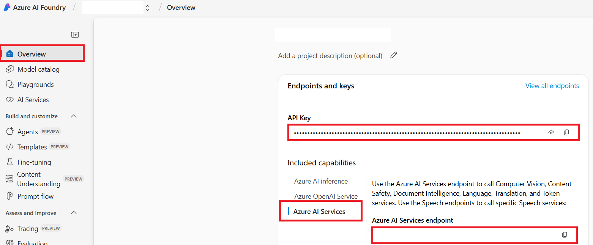

<!--
CO_OP_TRANSLATOR_METADATA:
{
  "original_hash": "b58d7c3cb4210697a073d20eb3064945",
  "translation_date": "2025-10-15T04:47:59+00:00",
  "source_file": "getting_started/set-up-azure-ai.md",
  "language_code": "et"
}
-->
# Azure AI seadistamine Co-op Translatori jaoks (Azure OpenAI & Azure AI Vision)

See juhend aitab sul seadistada Azure OpenAI keele tõlkimiseks ja Azure Computer Visioni pildisisu analüüsiks (mida saab kasutada pildipõhiseks tõlkeks) Azure AI Foundry keskkonnas.

**Eeltingimused:**
- Azure'i konto aktiivse tellimusega.
- Piisavad õigused ressursside ja juurutuste loomiseks oma Azure'i tellimuses.

## Azure AI projekti loomine

Alustuseks loo Azure AI projekt, mis toimib keskse kohana sinu AI ressursside haldamiseks.

1. Mine lehele [https://ai.azure.com](https://ai.azure.com) ja logi sisse oma Azure'i kontoga.

1. Vali **+Create**, et luua uus projekt.

1. Tee järgmised sammud:
   - Sisesta **Projekti nimi** (nt `CoopTranslator-Project`).
   - Vali **AI hub**  (nt `CoopTranslator-Hub`) (Loo uus, kui vaja).

1. Klõpsa "**Review and Create**", et projekt seadistada. Sind suunatakse projekti ülevaate lehele.

## Azure OpenAI seadistamine keele tõlkimiseks

Projekti sees juurutad Azure OpenAI mudeli, mis toimib tekstide tõlkimise taustateenusena.

### Liigu oma projekti juurde

Kui sa pole veel seal, ava äsja loodud projekt (nt `CoopTranslator-Project`) Azure AI Foundry keskkonnas.

### OpenAI mudeli juurutamine

1. Projekti vasakpoolsest menüüst, "My assets" alt, vali "**Models + endpoints**".

1. Vali **+ Deploy model**.

1. Vali **Deploy Base Model**.

1. Sulle kuvatakse saadaolevate mudelite nimekiri. Filtreeri või otsi sobivat GPT mudelit. Soovitame `gpt-4o`.

1. Vali soovitud mudel ja klõpsa **Confirm**.

1. Vali **Deploy**.

### Azure OpenAI seadistuse info

Kui mudel on juurutatud, saad selle juurutuse valida "**Models + endpoints**" lehelt, et leida **REST endpoint URL**, **Key**, **Deployment name**, **Model name** ja **API version**. Neid andmeid on vaja, et integreerida tõlkemudel oma rakendusse.

> [!NOTE]
> API versiooni saad valida [API version deprecation](https://learn.microsoft.com/azure/ai-services/openai/api-version-deprecation) lehelt vastavalt oma vajadustele. Pane tähele, et **API versioon** erineb **Model version**-ist, mida näidatakse **Models + endpoints** lehel Azure AI Foundry's.

## Azure Computer Vision seadistamine pilditõlkeks

Et võimaldada piltidel oleva teksti tõlkimist, pead leidma Azure AI Service API võtme ja lõpp-punkti.

1. Mine oma Azure AI projekti juurde (nt `CoopTranslator-Project`). Veendu, et oled projekti ülevaate lehel.

### Azure AI Service seadistuse info

Leia API võti ja lõpp-punkt Azure AI Service alt.

1. Mine oma Azure AI projekti juurde (nt `CoopTranslator-Project`). Veendu, et oled projekti ülevaate lehel.

1. Leia **API Key** ja **Endpoint** Azure AI Service vahekaardilt.

    

See ühendus võimaldab seotud Azure AI Service ressursi (sh pildianalüüs) võimalusi sinu AI Foundry projektis kasutada. Seda ühendust saad kasutada oma märkmikes või rakendustes, et piltidelt teksti välja võtta ja seejärel Azure OpenAI mudelile tõlkimiseks saata.

## Kogutud andmete koondamine

Nüüd peaksid olema kogunud järgmised andmed:

**Azure OpenAI jaoks (tekstitõlge):**
- Azure OpenAI Endpoint
- Azure OpenAI API Key
- Azure OpenAI Model Name (nt `gpt-4o`)
- Azure OpenAI Deployment Name (nt `cooptranslator-gpt4o`)
- Azure OpenAI API Version

**Azure AI Service jaoks (pilditeksti tuvastus Visioni kaudu):**
- Azure AI Service Endpoint
- Azure AI Service API Key

### Näide: Keskkonnamuutujate seadistamine (Preview)

Hiljem, kui hakkad rakendust ehitama, seadistad selle tõenäoliselt nende kogutud andmetega. Näiteks võid need määrata keskkonnamuutujatena järgmiselt:

```bash
# Azure AI Service Credentials (Required for image translation)
AZURE_AI_SERVICE_API_KEY="your_azure_ai_service_api_key" # e.g., 21xasd...
AZURE_AI_SERVICE_ENDPOINT="https://your_azure_ai_service_endpoint.cognitiveservices.azure.com/"

# Azure OpenAI Credentials (Required for text translation)
AZURE_OPENAI_API_KEY="your_azure_openai_api_key" # e.g., 21xasd...
AZURE_OPENAI_ENDPOINT="https://your_azure_openai_endpoint.openai.azure.com/"
AZURE_OPENAI_MODEL_NAME="your_model_name" # e.g., gpt-4o
AZURE_OPENAI_CHAT_DEPLOYMENT_NAME="your_deployment_name" # e.g., cooptranslator-gpt4o
AZURE_OPENAI_API_VERSION="your_api_version" # e.g., 2024-12-01-preview
```

---

### Lisalugemist

- [Kuidas luua projekti Azure AI Foundry's](https://learn.microsoft.com/azure/ai-foundry/how-to/create-projects?tabs=ai-studio)
- [Kuidas luua Azure AI ressursse](https://learn.microsoft.com/azure/ai-foundry/how-to/create-azure-ai-resource?tabs=portal)
- [Kuidas juurutada OpenAI mudeleid Azure AI Foundry's](https://learn.microsoft.com/en-us/azure/ai-foundry/how-to/deploy-models-openai)

---

**Vastutusest loobumine**:  
See dokument on tõlgitud tehisintellekti tõlketeenuse [Co-op Translator](https://github.com/Azure/co-op-translator) abil. Kuigi püüame tagada täpsust, tuleb arvestada, et automaatsed tõlked võivad sisaldada vigu või ebatäpsusi. Originaaldokumenti selle algses keeles tuleks pidada autoriteetseks allikaks. Kriitilise teabe puhul soovitame kasutada professionaalset inimtõlget. Me ei vastuta selle tõlke kasutamisest tulenevate arusaamatuste või valesti tõlgendamise eest.