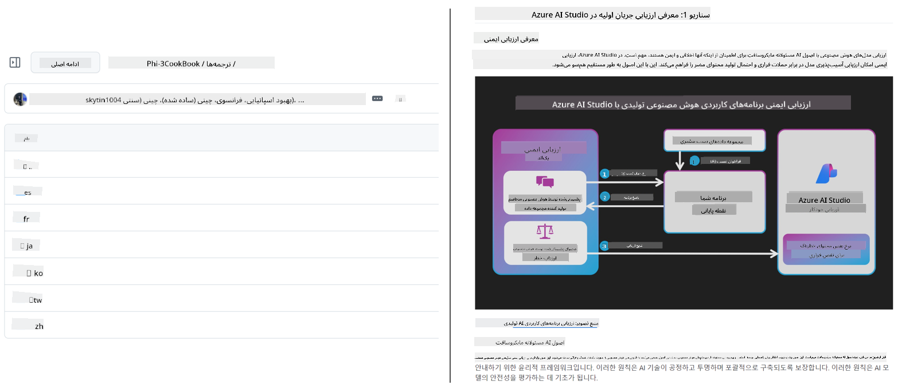
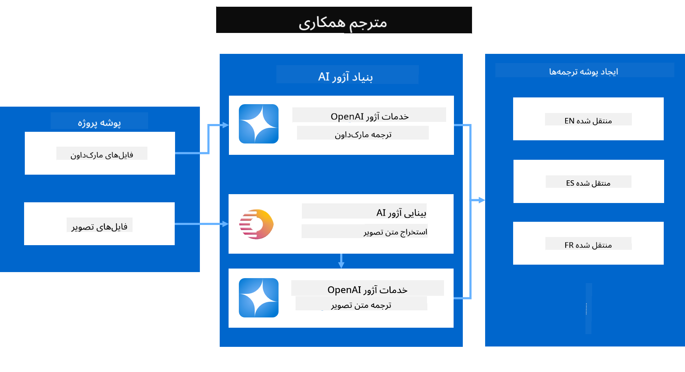
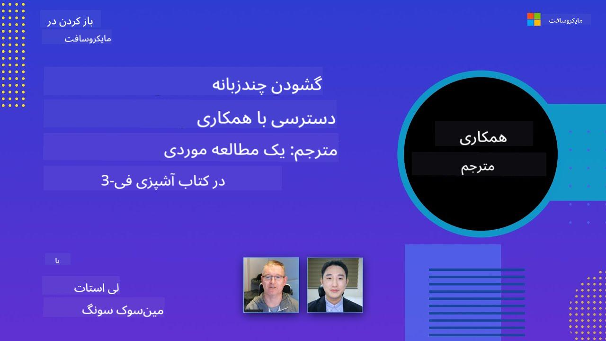

<!--
CO_OP_TRANSLATOR_METADATA:
{
  "original_hash": "044724537b57868117aadae8e7728c7c",
  "translation_date": "2025-06-12T09:55:18+00:00",
  "source_file": "README.md",
  "language_code": "fa"
}
-->


# Co-op Translator: ترجمه خودکار مستندات آموزشی به‌سادگی

_ترجمه مستندات خود را به چند زبان به‌راحتی خودکار کنید تا به مخاطبان جهانی دسترسی پیدا کنید._

[](https://pypi.org/project/co-op-translator/)
[](https://github.com/azure/co-op-translator/blob/main/LICENSE)
[](https://pepy.tech/project/co-op-translator)
[](https://pepy.tech/project/co-op-translator)
[](https://github.com/psf/black)

[](https://GitHub.com/azure/co-op-translator/graphs/contributors/)
[](https://GitHub.com/azure/co-op-translator/issues/)
[](https://GitHub.com/azure/co-op-translator/pulls/)
[](http://makeapullrequest.com)

### پشتیبانی زبان با قدرت Co-op Translator
[فرانسوی](../fr/README.md) | [اسپانیایی](../es/README.md) | [آلمانی](../de/README.md) | [روسی](../ru/README.md) | [عربی](../ar/README.md) | [فارسی](./README.md) | [اردو](../ur/README.md) | [چینی (ساده شده)](../zh/README.md) | [چینی (سنتی، ماکائو)](../mo/README.md) | [چینی (سنتی، هنگ کنگ)](../hk/README.md) | [چینی (سنتی، تایوان)](../tw/README.md) | [ژاپنی](../ja/README.md) | [کره‌ای](../ko/README.md) | [هندی](../hi/README.md) | [بنگالی](../bn/README.md) | [مراتی](../mr/README.md) | [نپالی](../ne/README.md) | [پنجابی (گورمخی)](../pa/README.md) | [پرتغالی (پرتغال)](../pt/README.md) | [پرتغالی (برزیل)](../br/README.md) | [ایتالیایی](../it/README.md) | [لهستانی](../pl/README.md) | [ترکی](../tr/README.md) | [یونانی](../el/README.md) | [تایلندی](../th/README.md) | [سوئدی](../sv/README.md) | [دانمارکی](../da/README.md) | [نروژی](../no/README.md) | [فنلاندی](../fi/README.md) | [هلندی](../nl/README.md) | [عبری](../he/README.md) | [ویتنامی](../vi/README.md) | [اندونزیایی](../id/README.md) | [مالایی](../ms/README.md) | [تاگالوگ (فیلیپینی)](../tl/README.md) | [سواحیلی](../sw/README.md) | [مجارستانی](../hu/README.md) | [چکی](../cs/README.md) | [اسلواکی](../sk/README.md) | [رومانیایی](../ro/README.md) | [بلغاری](../bg/README.md) | [صربی (سیریلیک)](../sr/README.md) | [کرواتی](../hr/README.md) | [اسلوونیایی](../sl/README.md) | [اوکراینی](../uk/README.md) | [برمه‌ای (میانمار)](../my/README.md)لطفاً خروجی را از راست به چپ بنویسید، با رعایت اینکه این زبان راست به چپ است.
> [!NOTE]
> این‌ها ترجمه‌های فعلی محتوای این مخزن هستند. برای مشاهده فهرست کامل زبان‌های پشتیبانی‌شده توسط Co-op Translator، لطفاً به بخش [Language Support](../..) مراجعه کنید.

[](https://GitHub.com/azure/co-op-translator/watchers/)
[](https://GitHub.com/azure/co-op-translator/network/)
[](https://GitHub.com/azure/co-op-translator/stargazers/)

[](https://discord.com/invite/ByRwuEEgH4)

[](https://codespaces.new/azure/co-op-translator)
[](https://vscode.dev/redirect?url=vscode://ms-vscode-remote.remote-containers/cloneInVolume?url=https://github.com/azure/co-op-translator)

## مرور کلی: روند ترجمه محتوای آموزشی خود را ساده کنید

موانع زبانی به‌طور چشمگیری دسترسی به منابع آموزشی ارزشمند و دانش فنی را برای یادگیرندگان و توسعه‌دهندگان در سراسر جهان محدود می‌کند. این موضوع باعث کاهش مشارکت و کند شدن روند نوآوری و یادگیری در سطح جهانی می‌شود.

**Co-op Translator** از نیاز به رفع روند ناکارآمد ترجمه دستی برای مجموعه‌های آموزشی گسترده مایکروسافت (مانند راهنماهای "برای مبتدیان") شکل گرفته است. این ابزار به یک راهکار قدرتمند و ساده برای استفاده تبدیل شده که هدفش شکستن این موانع برای همه است. با ارائه ترجمه‌های خودکار با کیفیت بالا از طریق CLI و GitHub Actions، Co-op Translator به مربیان، دانشجویان، پژوهشگران و توسعه‌دهندگان در سراسر جهان این امکان را می‌دهد که بدون محدودیت زبانی دانش را به اشتراک بگذارند و به آن دسترسی پیدا کنند.

نحوه سازماندهی محتوای آموزشی ترجمه‌شده توسط Co-op Translator را ببینید:



فایل‌های Markdown و متن‌های داخل تصاویر به‌صورت خودکار ترجمه شده و به‌طور مرتب در پوشه‌های مختص هر زبان مرتب می‌شوند.

**امروز با Co-op Translator دسترسی جهانی به محتوای آموزشی خود را آزاد کنید!**

## حمایت از دسترسی جهانی به منابع آموزشی مایکروسافت

Co-op Translator به پر کردن شکاف زبانی در پروژه‌های آموزشی کلیدی مایکروسافت کمک می‌کند و فرآیند ترجمه را برای مخازنی که به جامعه توسعه‌دهندگان جهانی خدمت می‌کنند، خودکار می‌کند. نمونه‌هایی که در حال حاضر از Co-op Translator استفاده می‌کنند عبارتند از:

[](https://github.com/microsoft/Generative-AI-for-beginners)
[](https://github.com/microsoft/ML-For-Beginners)
[](https://github.com/microsoft/AI-For-Beginners)
[](https://github.com/microsoft/ai-agents-for-beginners)
[](https://github.com/microsoft/PhiCookBook)
[](https://github.com/microsoft/Generative-AI-for-beginners-dotnet)

## ویژگی‌های کلیدی

- **ترجمه‌های خودکار**: به‌راحتی متن را به چندین زبان ترجمه کنید.
- **ادغام با GitHub Actions**: ترجمه‌ها را به‌صورت خودکار در روند CI/CD خود اجرا کنید.
- **حفظ قالب‌بندی Markdown**: در هنگام ترجمه، ساختار صحیح Markdown را حفظ کنید.
- **ترجمه متن تصاویر**: متن داخل تصاویر را استخراج و ترجمه کنید.
- **فناوری پیشرفته LLM**: از مدل‌های زبان پیشرفته برای ترجمه‌های با کیفیت بالا استفاده کنید.
- **ادغام آسان**: به‌راحتی با تنظیمات پروژه فعلی خود هماهنگ شوید.
- **ساده‌سازی بومی‌سازی**: فرآیند بومی‌سازی پروژه برای بازارهای بین‌المللی را روان‌تر کنید.

## نحوه کارکرد



Co-op Translator فایل‌های Markdown و تصاویر موجود در پوشه پروژه شما را دریافت و به این صورت پردازش می‌کند:

1. **استخراج متن**: متن را از فایل‌های Markdown و در صورت تنظیم (مثلاً با Azure AI Vision) متن‌های داخل تصاویر استخراج می‌کند.
1. **ترجمه با هوش مصنوعی**: متن استخراج‌شده را به مدل زبان تنظیم‌شده (Azure OpenAI، OpenAI و غیره) برای ترجمه ارسال می‌کند.
1. **ذخیره نتایج**: فایل‌های Markdown و تصاویر ترجمه‌شده را در پوشه‌های مختص هر زبان ذخیره می‌کند و قالب‌بندی اصلی را حفظ می‌کند.

## شروع به کار

سریع شروع کنید با CLI یا تنظیم خودکار کامل با GitHub Actions. روشی را انتخاب کنید که با روند کاری شما سازگار است:

1. **خط فرمان (CLI)** - برای ترجمه‌های یک‌باره یا کنترل دستی
2. **GitHub Actions** - برای ترجمه‌های خودکار در هر بار push

> [!NOTE]
> در حالی که این آموزش بر منابع Azure تمرکز دارد، می‌توانید از هر مدل زبانی پشتیبانی‌شده استفاده کنید.

### پشتیبانی زبان‌ها

Co-op Translator از طیف وسیعی از زبان‌ها پشتیبانی می‌کند تا به شما کمک کند به مخاطبان جهانی دسترسی داشته باشید. نکات مهم:

#### مرجع سریع

| زبان | کد | زبان | کد | زبان | کد |
|----------|------|----------|------|----------|------|
| عربی | ar | بنگالی | bn | بلغاری | bg |
| برمه‌ای (میانمار) | my | چینی (ساده‌شده) | zh | چینی (سنتی، هنگ‌کنگ) | hk |
| چینی (سنتی، ماکائو) | mo | چینی (سنتی، تایوان) | tw | کرواتی | hr |
| چکی | cs | دانمارکی | da | هلندی | nl |
| فنلاندی | fi | فرانسوی | fr | آلمانی | de |
| یونانی | el | عبری | he | هندی | hi |
| مجاری | hu | اندونزیایی | id | ایتالیایی | it |
| ژاپنی | ja | کره‌ای | ko | مالایی | ms |
| مراتی | mr | نپالی | ne | نروژی | no |
| فارسی | fa | لهستانی | pl | پرتغالی (برزیل) | br |
| پرتغالی (پرتغال) | pt | پنجابی (گورمخی) | pa | رومانیایی | ro |
| روسی | ru | صربی (سیریلیک) | sr | اسلواکی | sk |
| اسلوونیایی | sl | اسپانیایی | es | سواحیلی | sw |
| سوئدی | sv | تاگالوگ (فیلیپینی) | tl | تایلندی | th |
| ترکی | tr | اوکراینی | uk | اردو | ur |
| ویتنامی | vi | — | — | — | — |

#### استفاده از کدهای زبان

هنگام استفاده از Co-op Translator، باید زبان‌ها را با کدهایشان مشخص کنید. برای مثال:

```bash
# Translate to French, Spanish, and German
translate -l "fr es de"

# Translate to Chinese (Simplified) and Japanese
translate -l "zh ja"
```

> [!NOTE]
> برای اطلاعات فنی دقیق درباره پشتیبانی زبان‌ها، شامل:
>
> - مشخصات قلم برای هر زبان
> - مشکلات شناخته‌شده
> - نحوه افزودن زبان‌های جدید
>
> به [مستندات زبان‌های پشتیبانی‌شده](./getting_started/supported-languages.md) مراجعه کنید.

### مدل‌ها و سرویس‌های پشتیبانی‌شده

| نوع                  | نام                           |
|-----------------------|--------------------------------|
| مدل زبان        |   |
| بینایی هوش مصنوعی       |  |

> [!NOTE]
> اگر سرویس بینایی هوش مصنوعی در دسترس نباشد، co-op translator به [حالت فقط Markdown](./getting_started/markdown-only-mode.md) تغییر خواهد کرد.

### تنظیمات اولیه

قبل از شروع، باید منابع زیر را تنظیم کنید:

1. منبع مدل زبان (الزامی):
   - Azure OpenAI (توصیه‌شده) - ترجمه‌های با کیفیت بالا با قابلیت اطمینان سازمانی
   - OpenAI - گزینه جایگزین در صورت عدم دسترسی به Azure
   - برای اطلاعات دقیق درباره مدل‌های پشتیبانی‌شده، به [مدل‌ها و سرویس‌های پشتیبانی‌شده](../..) مراجعه کنید

1. منبع بینایی هوش مصنوعی (اختیاری):
   - Azure AI Vision - امکان ترجمه متن داخل تصاویر
   - اگر تنظیم نشود، ترجمه‌گر به‌طور خودکار از [حالت فقط Markdown](./getting_started/markdown-only-mode.md) استفاده می‌کند
   - برای پروژه‌هایی با تصاویر حاوی متن که نیاز به ترجمه دارند توصیه می‌شود

1. مراحل پیکربندی:
   - دستورالعمل‌های دقیق را در [راهنمای راه‌اندازی Azure AI](./getting_started/set-up-azure-ai.md) دنبال کنید
   - یک فایل `.env` با کلیدهای API و نقاط پایان خود ایجاد کنید (بخش [شروع سریع](../..) را ببینید)
   - مطمئن شوید مجوزها و سهمیه‌های لازم برای سرویس‌های انتخابی خود را دارید

### آماده‌سازی پروژه پیش از ترجمه

قبل از شروع فرآیند ترجمه، مراحل زیر را برای آماده‌سازی پروژه خود دنبال کنید:

1. آماده‌سازی README:
   - یک جدول ترجمه‌ها به README.md خود اضافه کنید تا به نسخه‌های ترجمه‌شده لینک داده شود
   - قالب نمونه:

     ```markdown

     ### 🌐 Multi-Language Support
     
     [French](../fr/README.md) | [Spanish](../es/README.md) | [German](../de/README.md) | [Russian](../ru/README.md) | [Arabic](../ar/README.md) | [Persian (Farsi)](./README.md) | [Urdu](../ur/README.md) | [Chinese (Simplified)](../zh/README.md) | [Chinese (Traditional, Macau)](../mo/README.md) | [Chinese (Traditional, Hong Kong)](../hk/README.md) | [Chinese (Traditional, Taiwan)](../tw/README.md) | [Japanese](../ja/README.md) | [Korean](../ko/README.md) | [Hindi](../hi/README.md) | [Bengali](../bn/README.md) | [Marathi](../mr/README.md) | [Nepali](../ne/README.md) | [Punjabi (Gurmukhi)](../pa/README.md) | [Portuguese (Portugal)](../pt/README.md) | [Portuguese (Brazil)](../br/README.md) | [Italian](../it/README.md) | [Polish](../pl/README.md) | [Turkish](../tr/README.md) | [Greek](../el/README.md) | [Thai](../th/README.md) | [Swedish](../sv/README.md) | [Danish](../da/README.md) | [Norwegian](../no/README.md) | [Finnish](../fi/README.md) | [Dutch](../nl/README.md) | [Hebrew](../he/README.md) | [Vietnamese](../vi/README.md) | [Indonesian](../id/README.md) | [Malay](../ms/README.md) | [Tagalog (Filipino)](../tl/README.md) | [Swahili](../sw/README.md) | [Hungarian](../hu/README.md) | [Czech](../cs/README.md) | [Slovak](../sk/README.md) | [Romanian](../ro/README.md) | [Bulgarian](../bg/README.md) | [Serbian (Cyrillic)](../sr/README.md) | [Croatian](../hr/README.md) | [Slovenian](../sl/README.md) | [Ukrainian](../uk/README.md) | [Burmese (Myanmar)](../my/README.md) 
    
     ```

1. پاک‌سازی ترجمه‌های موجود (در صورت نیاز):
   - پوشه‌های ترجمه قبلی (مثلاً `translations/`) را حذف کنید
   - فایل‌های ترجمه قدیمی را پاک کنید تا از بروز تعارض جلوگیری شود
   - این کار تضمین می‌کند که فرآیند ترجمه جدید بدون مشکل اجرا شود

### شروع سریع: خط فرمان

برای شروع سریع با استفاده از خط فرمان:

1. یک محیط مجازی بسازید:

    ```bash
    python -m venv .venv
    ```

1. محیط مجازی را فعال کنید:

    - در ویندوز:

    ```bash
    .venv\scripts\activate
    ```

    - در لینوکس/مک:

    ```bash
    source .venv/bin/activate
    ```

1. بسته را نصب کنید:

    ```bash
    pip install co-op-translator
    ```

1. پیکربندی اعتبارنامه‌ها:

    - با ایجاد پرچم `.env` file in your project's root directory.
    - Copy the contents from the [.env.template](../../.env.template) file into your new `.env` file.
    - Fill in the required API keys and endpoint information in your `.env` file.

1. Run Translation:
    - Navigate to your project's root directory in your terminal.
    - Execute the translate command, specifying target languages with the `-l`:

    ```bash
    translate -l "ko ja fr"
    ```

    _(جایگزین `"ko ja fr"` with your desired space-separated language codes)_

### Detailed Usage Guides

Choose the approach that best fits your workflow:

#### 1. Using the Command Line (CLI)

- Best for: One-time translations, manual control, or integration into custom scripts.
- Requires: Local installation of Python and the `co-op-translator` package.
- Guide: [Command Line Guide](./getting_started/command-line-guide/command-line-guide.md)

#### 2. Using GitHub Actions (Automation)

- Best for: Automatically translating content whenever changes are pushed to your repository. Keeps translations consistently up-to-date.
- Requires: Setting up a workflow file (`.github/workflows`) در مخزن خود. نیازی به نصب محلی نیست.
- راهنماها:
  - [راهنمای GitHub Actions (مخازن عمومی و اسرار استاندارد)](./getting_started/github-actions-guide/github-actions-guide-public.md) - برای بیشتر مخازن عمومی یا شخصی که از اسرار استاندارد مخزن استفاده می‌کنند.
  - [راهنمای GitHub Actions (مخازن سازمانی مایکروسافت و تنظیمات سطح سازمان)](./getting_started/github-actions-guide/github-actions-guide-org.md) - اگر در سازمان GitHub مایکروسافت فعالیت می‌کنید یا نیاز به استفاده از اسرار یا رانرهای سطح سازمان دارید، این راهنما را ببینید.

### عیب‌یابی و نکات

- [راهنمای عیب‌یابی](./getting_started/troubleshooting.md)

### منابع اضافی

- [مرجع دستورات](./getting_started/command-reference.md): راهنمای کامل دستورات و گزینه‌های موجود.
- [زبان‌های پشتیبانی‌شده](./getting_started/supported-languages.md): فهرست زبان‌های پشتیبانی‌شده و نحوه افزودن زبان جدید.
- [حالت فقط Markdown](./getting_started/markdown-only-mode.md): نحوه ترجمه فقط متن بدون ترجمه تصاویر.

## ویدیوهای معرفی

برای آشنایی بیشتر با Co-op Translator، ارائه‌های ما را ببینید _(برای مشاهده در یوتیوب روی تصویر زیر کلیک کنید)_:

- **Open at Microsoft**: معرفی کوتاه ۱۸ دقیقه‌ای و راهنمای سریع استفاده از Co-op Translator.
[](https://www.youtube.com/watch?v=jX_swfH_KNU)

## از ما حمایت کنید و یادگیری جهانی را تقویت کنید

به ما بپیوندید تا نحوه اشتراک‌گذاری محتوای آموزشی در سطح جهان را متحول کنیم! به [Co-op Translator](https://github.com/azure/co-op-translator) در گیت‌هاب ⭐ بدهید و از مأموریت ما برای از بین بردن موانع زبانی در یادگیری و فناوری حمایت کنید. علاقه و مشارکت‌های شما تأثیر قابل توجهی دارد! مشارکت در کد و پیشنهاد ویژگی‌ها همیشه خوش‌آمد است.

## مشارکت

این پروژه از مشارکت‌ها و پیشنهادات استقبال می‌کند. علاقه‌مند به مشارکت در Azure Co-op Translator هستید؟ لطفاً برای راهنمایی درباره نحوه کمک به دسترسی‌پذیرتر کردن Co-op Translator، به [CONTRIBUTING.md](./CONTRIBUTING.md) مراجعه کنید.

## مشارکت‌کنندگان

[](https://github.com/Azure/co-op-translator/graphs/contributors)

## قوانین رفتاری

این پروژه [Microsoft Open Source Code of Conduct](https://opensource.microsoft.com/codeofconduct/) را پذیرفته است.
برای اطلاعات بیشتر به [Code of Conduct FAQ](https://opensource.microsoft.com/codeofconduct/faq/) مراجعه کنید یا
در صورت داشتن سوال یا نظر اضافی با [opencode@microsoft.com](mailto:opencode@microsoft.com) تماس بگیرید.

## هوش مصنوعی مسئولانه

مایکروسافت متعهد است به مشتریان خود کمک کند تا محصولات هوش مصنوعی ما را به‌صورت مسئولانه استفاده کنند، تجربیات خود را به اشتراک بگذارد و از طریق ابزارهایی مانند Transparency Notes و Impact Assessments، شراکت‌های مبتنی بر اعتماد بسازد. بسیاری از این منابع را می‌توانید در [https://aka.ms/RAI](https://aka.ms/RAI) بیابید.
رویکرد مایکروسافت به هوش مصنوعی مسئولانه بر اصولی چون عدالت، قابلیت اطمینان و ایمنی، حریم خصوصی و امنیت، فراگیری، شفافیت و پاسخگویی استوار است.

مدل‌های بزرگ زبان طبیعی، تصویر و گفتار - مانند مدل‌هایی که در این نمونه استفاده شده‌اند - ممکن است رفتارهایی ناعادلانه، غیرقابل اطمینان یا توهین‌آمیز داشته باشند که به نوبه خود می‌تواند آسیب‌زا باشد. لطفاً برای آگاهی از خطرات و محدودیت‌ها، به [Azure OpenAI service Transparency note](https://learn.microsoft.com/legal/cognitive-services/openai/transparency-note?tabs=text) مراجعه کنید.

رویکرد پیشنهادی برای کاهش این خطرات، گنجاندن یک سیستم ایمنی در معماری شما است که بتواند رفتارهای مضر را شناسایی و جلوگیری کند. [Azure AI Content Safety](https://learn.microsoft.com/azure/ai-services/content-safety/overview) لایه‌ای مستقل از حفاظت ارائه می‌دهد که قادر است محتوای مضر تولید شده توسط کاربران و هوش مصنوعی را در برنامه‌ها و خدمات تشخیص دهد. Azure AI Content Safety شامل APIهای متنی و تصویری است که امکان شناسایی محتوای مضر را فراهم می‌کنند. همچنین یک Content Safety Studio تعاملی داریم که به شما اجازه می‌دهد نمونه کدهای تشخیص محتوای مضر در حالت‌های مختلف را مشاهده، بررسی و آزمایش کنید. مستندات [quickstart](https://learn.microsoft.com/azure/ai-services/content-safety/quickstart-text?tabs=visual-studio%2Clinux&pivots=programming-language-rest) زیر شما را در ارسال درخواست به سرویس راهنمایی می‌کند.

یکی دیگر از جنبه‌های مهم، عملکرد کلی برنامه است. در برنامه‌های چندرسانه‌ای و چندمدلی، عملکرد به معنای اجرای سیستم مطابق انتظار شما و کاربران است، از جمله عدم تولید خروجی‌های مضر. ارزیابی عملکرد کلی برنامه با استفاده از [معیارهای کیفیت تولید و ریسک و ایمنی](https://learn.microsoft.com/azure/ai-studio/concepts/evaluation-metrics-built-in) اهمیت دارد.

شما می‌توانید برنامه هوش مصنوعی خود را در محیط توسعه با استفاده از [prompt flow SDK](https://microsoft.github.io/promptflow/index.html) ارزیابی کنید. با داشتن یک مجموعه داده آزمایشی یا هدف، تولیدات برنامه هوش مصنوعی شما به صورت کمی با ارزیاب‌های داخلی یا سفارشی اندازه‌گیری می‌شود. برای شروع با prompt flow sdk و ارزیابی سیستم خود، می‌توانید راهنمای [quickstart](https://learn.microsoft.com/azure/ai-studio/how-to/develop/flow-evaluate-sdk) را دنبال کنید. پس از اجرای ارزیابی، می‌توانید [نتایج را در Azure AI Studio مشاهده کنید](https://learn.microsoft.com/azure/ai-studio/how-to/evaluate-flow-results).

## علائم تجاری

این پروژه ممکن است شامل علائم تجاری یا لوگوهایی برای پروژه‌ها، محصولات یا خدمات باشد. استفاده مجاز از علائم تجاری یا لوگوهای مایکروسافت مشروط به رعایت
[Microsoft's Trademark & Brand Guidelines](https://www.microsoft.com/en-us/legal/intellectualproperty/trademarks/usage/general) است.
استفاده از علائم تجاری یا لوگوهای مایکروسافت در نسخه‌های تغییر یافته این پروژه نباید باعث سردرگمی شود یا حمایت مایکروسافت را القا کند.
هرگونه استفاده از علائم تجاری یا لوگوهای شخص ثالث مشمول سیاست‌های آن شخص ثالث است.

**سلب مسئولیت**:  
این سند با استفاده از سرویس ترجمه هوش مصنوعی [Co-op Translator](https://github.com/Azure/co-op-translator) ترجمه شده است. در حالی که ما در تلاش برای دقت هستیم، لطفاً توجه داشته باشید که ترجمه‌های خودکار ممکن است حاوی اشتباهات یا نادرستی‌هایی باشند. سند اصلی به زبان بومی خود باید به عنوان منبع معتبر در نظر گرفته شود. برای اطلاعات حیاتی، ترجمه حرفه‌ای انسانی توصیه می‌شود. ما مسئول هیچ گونه سوءتفاهم یا برداشت نادرستی که از استفاده از این ترجمه ناشی شود، نیستیم.