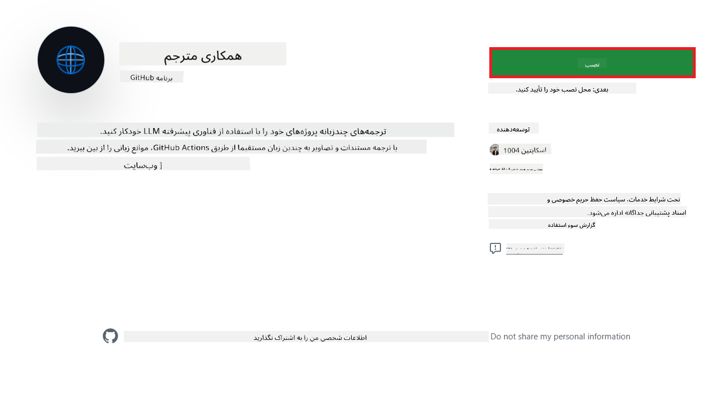
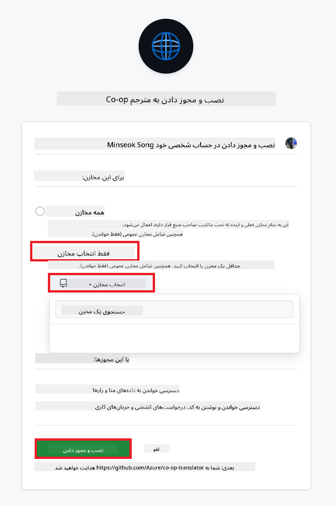
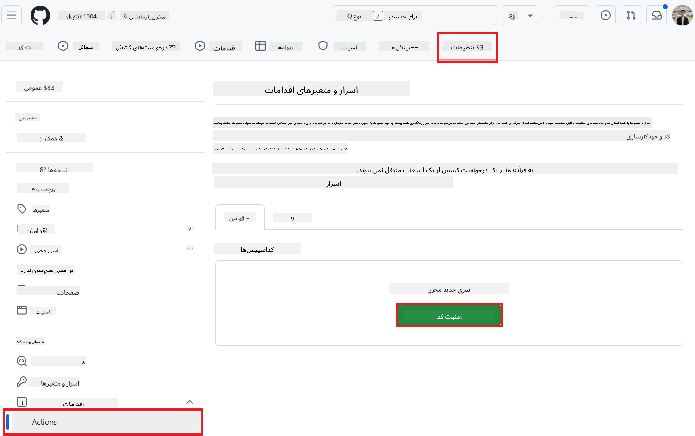
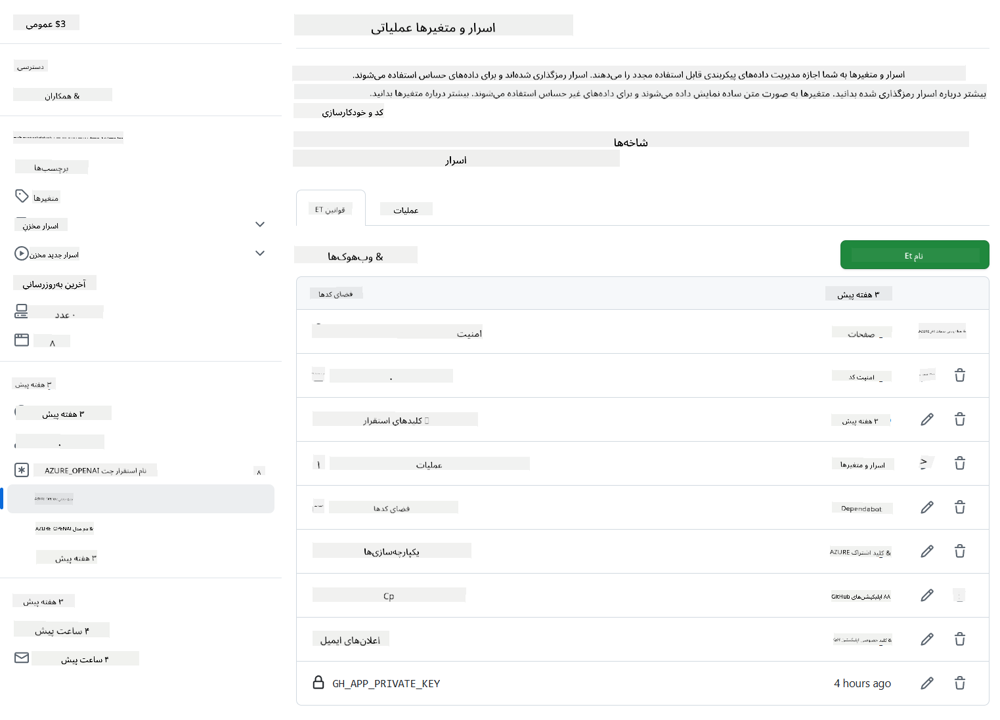

<!--
CO_OP_TRANSLATOR_METADATA:
{
  "original_hash": "c437820027c197f25fb2cbee95bae28c",
  "translation_date": "2025-06-12T19:01:27+00:00",
  "source_file": "getting_started/github-actions-guide/github-actions-guide-org.md",
  "language_code": "fa"
}
-->
# استفاده از اکشن Co-op Translator در گیت‌هاب (راهنمای سازمانی)

**مخاطب هدف:** این راهنما برای **کاربران داخلی مایکروسافت** یا **تیم‌هایی که به اطلاعات لازم برای اپلیکیشن Co-op Translator گیت‌هاب از پیش ساخته شده دسترسی دارند** یا می‌توانند اپلیکیشن گیت‌هاب سفارشی خود را ایجاد کنند، تهیه شده است.

با استفاده از اکشن Co-op Translator گیت‌هاب، مستندات مخزن خود را به‌صورت خودکار ترجمه کنید. این راهنما شما را در راه‌اندازی اکشن برای ایجاد خودکار درخواست‌های pull با ترجمه‌های به‌روزشده هر بار که فایل‌های Markdown یا تصاویر منبع تغییر کنند، همراهی می‌کند.

> [!IMPORTANT]
>
> **انتخاب راهنمای مناسب:**
>
> این راهنما نحوه راه‌اندازی با استفاده از **شناسه اپلیکیشن گیت‌هاب و کلید خصوصی** را توضیح می‌دهد. معمولاً این روش «راهنمای سازمانی» را زمانی نیاز دارید که: **`GITHUB_TOKEN` دسترسی‌ها محدود شده‌اند:** تنظیمات سازمان یا مخزن شما دسترسی‌های پیش‌فرض داده شده به `GITHUB_TOKEN` استاندارد را محدود می‌کند. به‌طور خاص، اگر `GITHUB_TOKEN` دسترسی‌های لازم `write` (مانند `contents: write` یا `pull-requests: write`) را نداشته باشد، روند کاری در [راهنمای راه‌اندازی عمومی](./github-actions-guide-public.md) به دلیل کمبود دسترسی‌ها شکست خواهد خورد. استفاده از اپلیکیشن گیت‌هاب اختصاصی با دسترسی‌های مشخص، این محدودیت را دور می‌زند.
>
> **اگر مورد بالا شامل حال شما نمی‌شود:**
>
> اگر `GITHUB_TOKEN` استاندارد دسترسی‌های کافی در مخزن شما دارد (یعنی محدودیت سازمانی مانع شما نمی‌شود)، لطفاً از **[راهنمای راه‌اندازی عمومی با استفاده از GITHUB_TOKEN](./github-actions-guide-public.md)** استفاده کنید. راهنمای عمومی نیازی به دریافت یا مدیریت شناسه اپلیکیشن یا کلید خصوصی ندارد و فقط به دسترسی‌های استاندارد `GITHUB_TOKEN` و مخزن وابسته است.

## پیش‌نیازها

قبل از پیکربندی اکشن گیت‌هاب، اطمینان حاصل کنید که اطلاعات دسترسی سرویس هوش مصنوعی مورد نیاز را دارید.

**1. ضروری: اطلاعات دسترسی مدل زبان هوش مصنوعی**  
شما به اطلاعات دسترسی حداقل یکی از مدل‌های زبانی پشتیبانی شده نیاز دارید:

- **Azure OpenAI**: نیاز به Endpoint، کلید API، نام مدل/استقرار، نسخه API دارد.  
- **OpenAI**: نیاز به کلید API، (اختیاری: شناسه سازمان، آدرس پایه، شناسه مدل) دارد.  
- جزئیات را در [مدل‌ها و سرویس‌های پشتیبانی شده](../../../../README.md) ببینید.  
- راهنمای راه‌اندازی: [راه‌اندازی Azure OpenAI](../set-up-resources/set-up-azure-openai.md).

**2. اختیاری: اطلاعات دسترسی بینایی ماشین (برای ترجمه تصاویر)**

- فقط در صورتی که نیاز به ترجمه متن داخل تصاویر دارید، لازم است.  
- **Azure Computer Vision**: نیاز به Endpoint و کلید اشتراک دارد.  
- در صورت عدم ارائه، اکشن در [حالت فقط Markdown](../markdown-only-mode.md) اجرا می‌شود.  
- راهنمای راه‌اندازی: [راه‌اندازی Azure Computer Vision](../set-up-resources/set-up-azure-computer-vision.md).

## راه‌اندازی و پیکربندی

برای پیکربندی اکشن Co-op Translator گیت‌هاب در مخزن خود، مراحل زیر را دنبال کنید:

### مرحله ۱: نصب و پیکربندی احراز هویت اپلیکیشن گیت‌هاب

روند کاری از احراز هویت اپلیکیشن گیت‌هاب برای تعامل امن با مخزن شما (مثلاً ایجاد درخواست‌های pull) به نمایندگی از شما استفاده می‌کند. یک گزینه را انتخاب کنید:

#### **گزینه A: نصب اپلیکیشن Co-op Translator از پیش ساخته شده (برای استفاده داخلی مایکروسافت)**

1. به صفحه [اپلیکیشن Co-op Translator گیت‌هاب](https://github.com/apps/co-op-translator) بروید.

1. گزینه **Install** را انتخاب کنید و حساب یا سازمانی که مخزن هدف شما در آن قرار دارد را انتخاب کنید.

    

1. گزینه **Only select repositories** را انتخاب کرده و مخزن هدف خود را (مثلاً `PhiCookBook`) برگزینید. سپس روی **Install** کلیک کنید. ممکن است نیاز به احراز هویت داشته باشید.

    

1. **دریافت اطلاعات اپلیکیشن (فرآیند داخلی لازم است):** برای اجازه دادن به روند کاری جهت احراز هویت به عنوان اپلیکیشن، به دو مورد نیاز دارید که توسط تیم Co-op Translator ارائه می‌شود:  
  - **شناسه اپلیکیشن:** شناسه یکتای اپلیکیشن Co-op Translator است. شناسه اپلیکیشن: `1164076`.  
  - **کلید خصوصی:** باید **تمام محتوای** فایل کلید خصوصی `.pem` را از تماس نگهدارنده دریافت کنید. **این کلید را مانند رمز عبور حفظ کرده و ایمن نگه دارید.**

1. به مرحله ۲ بروید.

#### **گزینه B: استفاده از اپلیکیشن گیت‌هاب سفارشی خودتان**

- اگر تمایل دارید، می‌توانید اپلیکیشن گیت‌هاب خود را ایجاد و پیکربندی کنید. اطمینان حاصل کنید که دسترسی خواندن و نوشتن به محتوا و درخواست‌های pull دارد. شما به شناسه اپلیکیشن و کلید خصوصی تولید شده نیاز خواهید داشت.

### مرحله ۲: پیکربندی اسرار مخزن

شما باید اطلاعات احراز هویت اپلیکیشن گیت‌هاب و اطلاعات سرویس هوش مصنوعی خود را به صورت اسرار رمزنگاری شده در تنظیمات مخزن اضافه کنید.

1. به مخزن هدف گیت‌هاب خود بروید (مثلاً `PhiCookBook`).

1. به **Settings** > **Secrets and variables** > **Actions** بروید.

1. در بخش **Repository secrets**، برای هر یک از اسرار زیر روی **New repository secret** کلیک کنید.

   

**اسرار ضروری (برای احراز هویت اپلیکیشن گیت‌هاب):**

| نام راز               | توضیح                                          | منبع مقدار                                      |
| :------------------- | :---------------------------------------------- | :---------------------------------------------- |
| `GH_APP_ID`          | شناسه اپلیکیشن گیت‌هاب (از مرحله ۱).              | تنظیمات اپلیکیشن گیت‌هاب                        |
| `GH_APP_PRIVATE_KEY` | **تمام محتوای** فایل `.pem` دانلود شده. | فایل `.pem` (از مرحله ۱)           |

**اسرار سرویس هوش مصنوعی (تمام موارد مربوط بر اساس پیش‌نیازها را اضافه کنید):**

| نام راز                             | توضیح                                     | منبع مقدار                        |
| :---------------------------------- | :---------------------------------------- | :-------------------------------- |
| `AZURE_SUBSCRIPTION_KEY`            | کلید سرویس Azure AI (بینایی ماشین)          | Azure AI Foundry                  |
| `AZURE_AI_SERVICE_ENDPOINT`         | Endpoint سرویس Azure AI (بینایی ماشین)        | Azure AI Foundry                  |
| `AZURE_OPENAI_API_KEY`              | کلید سرویس Azure OpenAI                      | Azure AI Foundry                  |
| `AZURE_OPENAI_ENDPOINT`             | Endpoint سرویس Azure OpenAI                   | Azure AI Foundry                  |
| `AZURE_OPENAI_MODEL_NAME`           | نام مدل Azure OpenAI شما                       | Azure AI Foundry                  |
| `AZURE_OPENAI_CHAT_DEPLOYMENT_NAME` | نام استقرار Azure OpenAI شما                     | Azure AI Foundry                  |
| `AZURE_OPENAI_API_VERSION`          | نسخه API برای Azure OpenAI                     | Azure AI Foundry                  |
| `OPENAI_API_KEY`                    | کلید API برای OpenAI                          | OpenAI Platform                  |
| `OPENAI_ORG_ID`                     | شناسه سازمان OpenAI                          | OpenAI Platform                  |
| `OPENAI_CHAT_MODEL_ID`              | شناسه مدل خاص OpenAI                          | OpenAI Platform                  |
| `OPENAI_BASE_URL`                   | آدرس پایه سفارشی API OpenAI                    | OpenAI Platform                  |



### مرحله ۳: ایجاد فایل روند کاری

در نهایت، فایل YAML که روند کاری خودکار را تعریف می‌کند، ایجاد کنید.

1. در شاخه اصلی مخزن خود، اگر پوشه `.github/workflows/` وجود ندارد، آن را بسازید.

1. داخل `.github/workflows/`، فایلی به نام `co-op-translator.yml` ایجاد کنید.

1. محتوای زیر را در co-op-translator.yml جای‌گذاری کنید.

```
name: Co-op Translator

on:
  push:
    branches:
      - main

jobs:
  co-op-translator:
    runs-on: ubuntu-latest

    permissions:
      contents: write
      pull-requests: write

    steps:
      - name: Checkout repository
        uses: actions/checkout@v4
        with:
          fetch-depth: 0

      - name: Set up Python
        uses: actions/setup-python@v4
        with:
          python-version: '3.10'

      - name: Install Co-op Translator
        run: |
          python -m pip install --upgrade pip
          pip install co-op-translator

      - name: Run Co-op Translator
        env:
          PYTHONIOENCODING: utf-8
          # Azure AI Service Credentials
          AZURE_SUBSCRIPTION_KEY: ${{ secrets.AZURE_SUBSCRIPTION_KEY }}
          AZURE_AI_SERVICE_ENDPOINT: ${{ secrets.AZURE_AI_SERVICE_ENDPOINT }}

          # Azure OpenAI Credentials
          AZURE_OPENAI_API_KEY: ${{ secrets.AZURE_OPENAI_API_KEY }}
          AZURE_OPENAI_ENDPOINT: ${{ secrets.AZURE_OPENAI_ENDPOINT }}
          AZURE_OPENAI_MODEL_NAME: ${{ secrets.AZURE_OPENAI_MODEL_NAME }}
          AZURE_OPENAI_CHAT_DEPLOYMENT_NAME: ${{ secrets.AZURE_OPENAI_CHAT_DEPLOYMENT_NAME }}
          AZURE_OPENAI_API_VERSION: ${{ secrets.AZURE_OPENAI_API_VERSION }}

          # OpenAI Credentials
          OPENAI_API_KEY: ${{ secrets.OPENAI_API_KEY }}
          OPENAI_ORG_ID: ${{ secrets.OPENAI_ORG_ID }}
          OPENAI_CHAT_MODEL_ID: ${{ secrets.OPENAI_CHAT_MODEL_ID }}
          OPENAI_BASE_URL: ${{ secrets.OPENAI_BASE_URL }}
        run: |
          # =====================================================================
          # IMPORTANT: Set your target languages here (REQUIRED CONFIGURATION)
          # =====================================================================
          # Example: Translate to Spanish, French, German. Add -y to auto-confirm.
          translate -l "es fr de" -y  # <--- MODIFY THIS LINE with your desired languages

      - name: Authenticate GitHub App
        id: generate_token
        uses: tibdex/github-app-token@v1
        with:
          app_id: ${{ secrets.GH_APP_ID }}
          private_key: ${{ secrets.GH_APP_PRIVATE_KEY }}

      - name: Create Pull Request with translations
        uses: peter-evans/create-pull-request@v5
        with:
          token: ${{ steps.generate_token.outputs.token }}
          commit-message: "🌐 Update translations via Co-op Translator"
          title: "🌐 Update translations via Co-op Translator"
          body: |
            This PR updates translations for recent changes to the main branch.

            ### 📋 Changes included
            - Translated contents are available in the `translations/` directory
            - Translated images are available in the `translated_images/` directory

            ---
            🌐 Automatically generated by the [Co-op Translator](https://github.com/Azure/co-op-translator) GitHub Action.
          branch: update-translations
          base: main
          labels: translation, automated-pr
          delete-branch: true
          add-paths: |
            translations/
            translated_images/

```

4.  **سفارشی‌سازی روند کاری:**  
  - **[!IMPORTANT] زبان‌های هدف:** در دستور `Run Co-op Translator` step, you **MUST review and modify the list of language codes** within the `translate -l "..." -y` command to match your project's requirements. The example list (`ar de es...`) needs to be replaced or adjusted.
  - **Trigger (`on:`):** The current trigger runs on every push to `main`. For large repositories, consider adding a `paths:` filter (see commented example in the YAML) to run the workflow only when relevant files (e.g., source documentation) change, saving runner minutes.
  - **PR Details:** Customize the `commit-message`, `title`, `body`, `branch` name, and `labels` in the `Create Pull Request` step if needed.

## Credential Management and Renewal

- **Security:** Always store sensitive credentials (API keys, private keys) as GitHub Actions secrets. Never expose them in your workflow file or repository code.
- **[!IMPORTANT] Key Renewal (Internal Microsoft Users):** Be aware that Azure OpenAI key used within Microsoft might have a mandatory renewal policy (e.g., every 5 months). Ensure you update the corresponding GitHub secrets (`AZURE_OPENAI_...` کلیدها) **قبل از انقضا** آن‌ها را به‌روز کنید تا از شکست روند کاری جلوگیری شود.

## اجرای روند کاری

پس از ادغام فایل `co-op-translator.yml` در شاخه main شما (یا شاخه مشخص شده در فیلتر `on:` trigger), the workflow will automatically run whenever changes are pushed to that branch (and match the `paths`، در صورت تنظیم)،

اگر ترجمه‌ها تولید یا به‌روزرسانی شده باشند، اکشن به‌صورت خودکار یک درخواست Pull Request شامل تغییرات ایجاد می‌کند که آماده بررسی و ادغام شماست.

**سلب مسئولیت**:  
این سند با استفاده از سرویس ترجمه ماشینی [Co-op Translator](https://github.com/Azure/co-op-translator) ترجمه شده است. در حالی که ما در تلاش برای دقت هستیم، لطفاً توجه داشته باشید که ترجمه‌های خودکار ممکن است حاوی خطاها یا نواقصی باشند. سند اصلی به زبان مبدأ باید به عنوان منبع معتبر در نظر گرفته شود. برای اطلاعات حیاتی، ترجمه حرفه‌ای انسانی توصیه می‌شود. ما مسئول هیچ گونه سوءتفاهم یا برداشت نادرستی که از استفاده از این ترجمه ناشی شود، نیستیم.