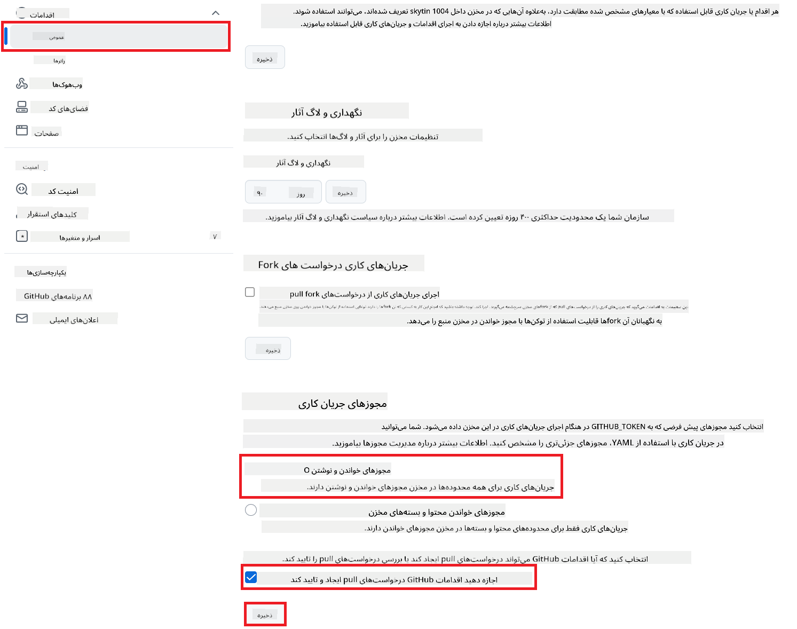

<!--
CO_OP_TRANSLATOR_METADATA:
{
  "original_hash": "a52587a512e667f70d92db853d3c61d5",
  "translation_date": "2025-06-12T19:22:23+00:00",
  "source_file": "getting_started/github-actions-guide/github-actions-guide-public.md",
  "language_code": "fa"
}
-->
# استفاده از اکشن Co-op Translator در گیت‌هاب (تنظیمات عمومی)

**مخاطب هدف:** این راهنما برای کاربران در بیشتر مخازن عمومی یا خصوصی که مجوزهای استاندارد GitHub Actions برایشان کافی است، نوشته شده است. این روش از `GITHUB_TOKEN` داخلی استفاده می‌کند.

با استفاده از اکشن Co-op Translator گیت‌هاب، مستندات مخزن خود را به‌صورت خودکار ترجمه کنید. این راهنما شما را در راه‌اندازی اکشن برای ایجاد خودکار درخواست‌های pull با ترجمه‌های به‌روز شده هر زمان که فایل‌های Markdown یا تصاویر منبع تغییر کنند، همراهی می‌کند.

> [!IMPORTANT]
>
> **انتخاب راهنمای مناسب:**
>
> این راهنما تنظیم ساده‌تر با استفاده از `GITHUB_TOKEN` استاندارد را توضیح می‌دهد. این روش برای اکثر کاربران توصیه می‌شود زیرا نیازی به مدیریت کلیدهای خصوصی حساس GitHub App ندارد.
>

## پیش‌نیازها

قبل از پیکربندی اکشن گیت‌هاب، مطمئن شوید اطلاعات لازم برای سرویس‌های هوش مصنوعی را آماده دارید.

**1. ضروری: اطلاعات مدل زبان هوش مصنوعی**  
شما به اطلاعات احراز هویت حداقل یکی از مدل‌های زبانی پشتیبانی شده نیاز دارید:

- **Azure OpenAI**: نیاز به Endpoint، کلید API، نام مدل/استقرار، نسخه API دارد.  
- **OpenAI**: نیاز به کلید API، (اختیاری: شناسه سازمان، آدرس پایه، شناسه مدل).  
- برای جزئیات بیشتر به [مدل‌ها و سرویس‌های پشتیبانی شده](../../../../README.md) مراجعه کنید.

**2. اختیاری: اطلاعات سرویس بینایی هوش مصنوعی (برای ترجمه تصویر)**

- فقط در صورتی نیاز است که بخواهید متن داخل تصاویر را ترجمه کنید.  
- **Azure AI Vision**: نیاز به Endpoint و کلید اشتراک دارد.  
- در صورت عدم ارائه، اکشن به حالت [فقط Markdown](../markdown-only-mode.md) برمی‌گردد.

## راه‌اندازی و پیکربندی

برای پیکربندی اکشن Co-op Translator در مخزن خود با استفاده از `GITHUB_TOKEN` استاندارد، مراحل زیر را دنبال کنید.

### مرحله 1: آشنایی با احراز هویت (استفاده از `GITHUB_TOKEN`)

این گردش کار از `GITHUB_TOKEN` داخلی که توسط GitHub Actions ارائه شده استفاده می‌کند. این توکن به‌طور خودکار به گردش کار اجازه می‌دهد تا بر اساس تنظیمات مرحله 3 با مخزن شما تعامل داشته باشد.

### مرحله 2: پیکربندی مخفی‌گاه‌های مخزن

شما فقط باید **اطلاعات سرویس هوش مصنوعی** را به‌صورت مخفی‌گاه رمزگذاری شده در تنظیمات مخزن خود اضافه کنید.

1. به مخزن هدف در گیت‌هاب بروید.  
2. به مسیر **Settings** > **Secrets and variables** > **Actions** بروید.  
3. در بخش **Repository secrets**، برای هر یک از اسرار مورد نیاز سرویس هوش مصنوعی زیر، روی **New repository secret** کلیک کنید.

     *(تصویر راهنما: محل اضافه کردن مخفی‌گاه‌ها را نشان می‌دهد)*

**اسرار ضروری سرویس هوش مصنوعی (تمام موارد مرتبط با پیش‌نیازهای شما را اضافه کنید):**

| نام مخفی‌گاه                        | توضیح                                     | منبع مقدار                        |
| :--------------------------------- | :---------------------------------------- | :-------------------------------- |
| `AZURE_SUBSCRIPTION_KEY`            | کلید سرویس Azure AI (بینایی ماشین)          | Azure AI Foundry شما               |
| `AZURE_AI_SERVICE_ENDPOINT`         | Endpoint سرویس Azure AI (بینایی ماشین)       | Azure AI Foundry شما               |
| `AZURE_OPENAI_API_KEY`              | کلید سرویس Azure OpenAI                      | Azure AI Foundry شما               |
| `AZURE_OPENAI_ENDPOINT`             | Endpoint سرویس Azure OpenAI                   | Azure AI Foundry شما               |
| `AZURE_OPENAI_MODEL_NAME`           | نام مدل Azure OpenAI شما                       | Azure AI Foundry شما               |
| `AZURE_OPENAI_CHAT_DEPLOYMENT_NAME` | نام استقرار Azure OpenAI شما                     | Azure AI Foundry شما               |
| `AZURE_OPENAI_API_VERSION`          | نسخه API برای Azure OpenAI                     | Azure AI Foundry شما               |
| `OPENAI_API_KEY`                    | کلید API برای OpenAI                          | پلتفرم OpenAI شما                 |
| `OPENAI_ORG_ID`                     | شناسه سازمان OpenAI (اختیاری)                 | پلتفرم OpenAI شما                 |
| `OPENAI_CHAT_MODEL_ID`              | شناسه مدل خاص OpenAI (اختیاری)                 | پلتفرم OpenAI شما                 |
| `OPENAI_BASE_URL`                   | آدرس پایه سفارشی API OpenAI (اختیاری)         | پلتفرم OpenAI شما                 |

### مرحله 3: پیکربندی مجوزهای گردش کار

اکشن گیت‌هاب برای بررسی کد و ایجاد درخواست pull نیاز به مجوزهای ارائه شده توسط `GITHUB_TOKEN` دارد.

1. در مخزن خود به مسیر **Settings** > **Actions** > **General** بروید.  
2. به بخش **Workflow permissions** اسکرول کنید.  
3. گزینه **Read and write permissions** را انتخاب کنید. این کار به `GITHUB_TOKEN` مجوزهای لازم `contents: write` و `pull-requests: write` برای این گردش کار را می‌دهد.  
4. اطمینان حاصل کنید که گزینه **Allow GitHub Actions to create and approve pull requests** فعال باشد.  
5. روی **Save** کلیک کنید.



### مرحله 4: ایجاد فایل گردش کار

در نهایت، فایل YAML را که گردش کار خودکار را با استفاده از `GITHUB_TOKEN` تعریف می‌کند، ایجاد کنید.

1. در شاخه اصلی مخزن خود، اگر وجود ندارد، پوشه `.github/workflows/` را ایجاد کنید.  
2. داخل پوشه `.github/workflows/`، فایلی به نام `co-op-translator.yml` بسازید.  
3. محتوای زیر را در `co-op-translator.yml` جای‌گذاری کنید.

```yaml
name: Co-op Translator

on:
  push:
    branches:
      - main

jobs:
  co-op-translator:
    runs-on: ubuntu-latest

    permissions:
      contents: write
      pull-requests: write

    steps:
      - name: Checkout repository
        uses: actions/checkout@v4
        with:
          fetch-depth: 0

      - name: Set up Python
        uses: actions/setup-python@v4
        with:
          python-version: '3.10'

      - name: Install Co-op Translator
        run: |
          python -m pip install --upgrade pip
          pip install co-op-translator

      - name: Run Co-op Translator
        env:
          PYTHONIOENCODING: utf-8
          # === AI Service Credentials ===
          AZURE_SUBSCRIPTION_KEY: ${{ secrets.AZURE_SUBSCRIPTION_KEY }}
          AZURE_AI_SERVICE_ENDPOINT: ${{ secrets.AZURE_AI_SERVICE_ENDPOINT }}
          AZURE_OPENAI_API_KEY: ${{ secrets.AZURE_OPENAI_API_KEY }}
          AZURE_OPENAI_ENDPOINT: ${{ secrets.AZURE_OPENAI_ENDPOINT }}
          AZURE_OPENAI_MODEL_NAME: ${{ secrets.AZURE_OPENAI_MODEL_NAME }}
          AZURE_OPENAI_CHAT_DEPLOYMENT_NAME: ${{ secrets.AZURE_OPENAI_CHAT_DEPLOYMENT_NAME }}
          AZURE_OPENAI_API_VERSION: ${{ secrets.AZURE_OPENAI_API_VERSION }}
          OPENAI_API_KEY: ${{ secrets.OPENAI_API_KEY }}
          OPENAI_ORG_ID: ${{ secrets.OPENAI_ORG_ID }}
          OPENAI_CHAT_MODEL_ID: ${{ secrets.OPENAI_CHAT_MODEL_ID }}
          OPENAI_BASE_URL: ${{ secrets.OPENAI_BASE_URL }}
        run: |
          # =====================================================================
          # IMPORTANT: Set your target languages here (REQUIRED CONFIGURATION)
          # =====================================================================
          # Example: Translate to Spanish, French, German. Add -y to auto-confirm.
          translate -l "es fr de" -y  # <--- MODIFY THIS LINE with your desired languages

      - name: Create Pull Request with translations
        uses: peter-evans/create-pull-request@v5
        with:
          token: ${{ secrets.GITHUB_TOKEN }}
          commit-message: "🌐 Update translations via Co-op Translator"
          title: "🌐 Update translations via Co-op Translator"
          body: |
            This PR updates translations for recent changes to the main branch.

            ### 📋 Changes included
            - Translated contents are available in the `translations/` directory
            - Translated images are available in the `translated_images/` directory

            ---
            🌐 Automatically generated by the [Co-op Translator](https://github.com/Azure/co-op-translator) GitHub Action.
          branch: update-translations
          base: main
          labels: translation, automated-pr
          delete-branch: true
          add-paths: |
            translations/
            translated_images/
```  
4. **سفارشی‌سازی گردش کار:**  
  - **[!IMPORTANT] زبان‌های هدف:** در مرحله `Run Co-op Translator` step, you **MUST review and modify the list of language codes** within the `translate -l "..." -y` command to match your project's requirements. The example list (`ar de es...`) needs to be replaced or adjusted.
  - **Trigger (`on:`):** The current trigger runs on every push to `main`. For large repositories, consider adding a `paths:` filter (see commented example in the YAML) to run the workflow only when relevant files (e.g., source documentation) change, saving runner minutes.
  - **PR Details:** Customize the `commit-message`, `title`, `body`, `branch` name, and `labels` in the `Create Pull Request` در صورت نیاز تغییر دهید.

**سلب مسئولیت**:  
این سند با استفاده از سرویس ترجمه ماشینی [Co-op Translator](https://github.com/Azure/co-op-translator) ترجمه شده است. در حالی که ما برای دقت تلاش می‌کنیم، لطفاً توجه داشته باشید که ترجمه‌های خودکار ممکن است شامل خطاها یا نادرستی‌هایی باشند. سند اصلی به زبان بومی خود به عنوان منبع معتبر در نظر گرفته شود. برای اطلاعات حیاتی، استفاده از ترجمه حرفه‌ای انسانی توصیه می‌شود. ما مسئول هیچ گونه سوءتفاهم یا برداشت نادرستی که از استفاده از این ترجمه ناشی شود، نیستیم.