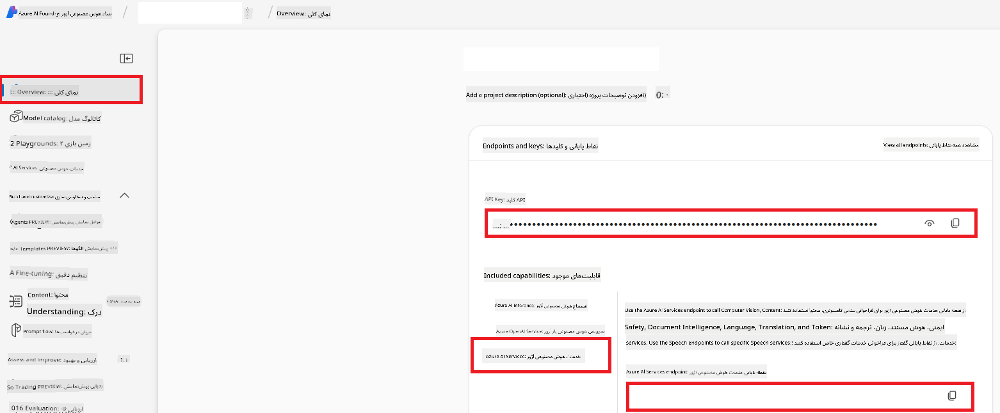

<!--
CO_OP_TRANSLATOR_METADATA:
{
  "original_hash": "b58d7c3cb4210697a073d20eb3064945",
  "translation_date": "2025-06-12T11:46:25+00:00",
  "source_file": "getting_started/set-up-azure-ai.md",
  "language_code": "fa"
}
-->
# راه‌اندازی Azure AI برای مترجم همکار (Azure OpenAI و Azure AI Vision)

این راهنما شما را در راه‌اندازی Azure OpenAI برای ترجمه زبان و Azure Computer Vision برای تحلیل محتوای تصویر (که می‌تواند برای ترجمه مبتنی بر تصویر استفاده شود) در Azure AI Foundry همراهی می‌کند.

**پیش‌نیازها:**
- یک حساب Azure با اشتراک فعال.
- دسترسی‌های کافی برای ایجاد منابع و استقرارها در اشتراک Azure خود.

## ایجاد یک پروژه Azure AI

ابتدا یک پروژه Azure AI ایجاد خواهید کرد که به عنوان مرکز مدیریت منابع هوش مصنوعی شما عمل می‌کند.

1. به [https://ai.azure.com](https://ai.azure.com) بروید و با حساب Azure خود وارد شوید.

1. گزینه **+Create** را برای ایجاد پروژه جدید انتخاب کنید.

1. کارهای زیر را انجام دهید:
   - یک **نام پروژه** وارد کنید (مثلاً `CoopTranslator-Project`).
   - **AI hub** را انتخاب کنید (مثلاً `CoopTranslator-Hub`) (در صورت نیاز یک مورد جدید بسازید).

1. روی "**Review and Create**" کلیک کنید تا پروژه شما ایجاد شود. به صفحه نمای کلی پروژه هدایت خواهید شد.

## راه‌اندازی Azure OpenAI برای ترجمه زبان

در پروژه خود، یک مدل Azure OpenAI مستقر خواهید کرد که به عنوان پشتیبان ترجمه متنی عمل می‌کند.

### رفتن به پروژه خود

اگر قبلاً وارد نشده‌اید، پروژه تازه ساخته شده خود (مثلاً `CoopTranslator-Project`) را در Azure AI Foundry باز کنید.

### استقرار مدل OpenAI

1. از منوی سمت چپ پروژه، زیر "My assets"، گزینه "**Models + endpoints**" را انتخاب کنید.

1. روی **+ Deploy model** کلیک کنید.

1. گزینه **Deploy Base Model** را انتخاب کنید.

1. فهرستی از مدل‌های موجود به شما نمایش داده می‌شود. مدل GPT مناسب را جستجو یا فیلتر کنید. ما مدل `gpt-4o` را پیشنهاد می‌کنیم.

1. مدل مورد نظر خود را انتخاب کرده و روی **Confirm** کلیک کنید.

1. روی **Deploy** کلیک کنید.

### پیکربندی Azure OpenAI

پس از استقرار، می‌توانید از صفحه "**Models + endpoints**" استقرار خود را انتخاب کنید تا **REST endpoint URL**، **کلید (Key)**، **نام استقرار**، **نام مدل** و **نسخه API** را مشاهده کنید. این اطلاعات برای ادغام مدل ترجمه در برنامه شما لازم است.

> [!NOTE]
> می‌توانید نسخه‌های API را بر اساس نیاز خود از صفحه [API version deprecation](https://learn.microsoft.com/azure/ai-services/openai/api-version-deprecation) انتخاب کنید. توجه داشته باشید که **نسخه API** با **نسخه مدل** که در صفحه **Models + endpoints** در Azure AI Foundry نمایش داده می‌شود متفاوت است.

## راه‌اندازی Azure Computer Vision برای ترجمه تصویر

برای فعال‌سازی ترجمه متن در تصاویر، باید کلید API و نقطه پایانی (Endpoint) سرویس Azure AI را بیابید.

1. به پروژه Azure AI خود (مثلاً `CoopTranslator-Project`) بروید و مطمئن شوید در صفحه نمای کلی پروژه هستید.

### پیکربندی سرویس Azure AI

کلید API و نقطه پایانی را از سرویس Azure AI پیدا کنید.

1. به پروژه Azure AI خود (مثلاً `CoopTranslator-Project`) بروید و مطمئن شوید در صفحه نمای کلی پروژه هستید.

1. کلید **API Key** و **Endpoint** را از تب سرویس Azure AI پیدا کنید.

    

این اتصال، قابلیت‌های منبع سرویس Azure AI مرتبط (از جمله تحلیل تصویر) را در پروژه AI Foundry شما فعال می‌کند. سپس می‌توانید از این اتصال در دفترچه‌های یادداشت یا برنامه‌های خود برای استخراج متن از تصاویر استفاده کنید که پس از آن می‌توان متن استخراج شده را برای ترجمه به مدل Azure OpenAI ارسال کرد.

## جمع‌بندی اطلاعات ورود شما

تا اینجا باید موارد زیر را جمع‌آوری کرده باشید:

**برای Azure OpenAI (ترجمه متن):**
- نقطه پایانی Azure OpenAI
- کلید API Azure OpenAI
- نام مدل Azure OpenAI (مثلاً `gpt-4o`)
- نام استقرار Azure OpenAI (مثلاً `cooptranslator-gpt4o`)
- نسخه API Azure OpenAI

**برای سرویس‌های Azure AI (استخراج متن از تصویر با Vision):**
- نقطه پایانی سرویس Azure AI
- کلید API سرویس Azure AI

### نمونه: پیکربندی متغیر محیطی (پیش‌نمایش)

بعداً هنگام ساخت برنامه خود، احتمالاً آن را با استفاده از این اطلاعات ورود پیکربندی خواهید کرد. به عنوان مثال، ممکن است آن‌ها را به صورت متغیرهای محیطی به شکل زیر تنظیم کنید:

```bash
# Azure AI Service Credentials (Required for image translation)
AZURE_AI_SERVICE_API_KEY="your_azure_ai_service_api_key" # e.g., 21xasd...
AZURE_AI_SERVICE_ENDPOINT="https://your_azure_ai_service_endpoint.cognitiveservices.azure.com/"

# Azure OpenAI Credentials (Required for text translation)
AZURE_OPENAI_API_KEY="your_azure_openai_api_key" # e.g., 21xasd...
AZURE_OPENAI_ENDPOINT="https://your_azure_openai_endpoint.openai.azure.com/"
AZURE_OPENAI_MODEL_NAME="your_model_name" # e.g., gpt-4o
AZURE_OPENAI_CHAT_DEPLOYMENT_NAME="your_deployment_name" # e.g., cooptranslator-gpt4o
AZURE_OPENAI_API_VERSION="your_api_version" # e.g., 2024-12-01-preview
```

---

### مطالعه بیشتر

- [چگونه در Azure AI Foundry پروژه بسازیم](https://learn.microsoft.com/azure/ai-foundry/how-to/create-projects?tabs=ai-studio)
- [چگونه منابع Azure AI ایجاد کنیم](https://learn.microsoft.com/azure/ai-foundry/how-to/create-azure-ai-resource?tabs=portal)
- [چگونه مدل‌های OpenAI را در Azure AI Foundry مستقر کنیم](https://learn.microsoft.com/en-us/azure/ai-foundry/how-to/deploy-models-openai)

**سلب مسئولیت**:  
این سند با استفاده از سرویس ترجمه ماشینی [Co-op Translator](https://github.com/Azure/co-op-translator) ترجمه شده است. در حالی که ما در تلاش برای دقت هستیم، لطفاً توجه داشته باشید که ترجمه‌های خودکار ممکن است حاوی خطاها یا نادرستی‌هایی باشند. سند اصلی به زبان مبدأ باید به عنوان منبع معتبر در نظر گرفته شود. برای اطلاعات حیاتی، ترجمه حرفه‌ای انسانی توصیه می‌شود. ما مسئول هیچ گونه سوءتفاهم یا تفسیر نادرستی که ناشی از استفاده از این ترجمه باشد، نیستیم.