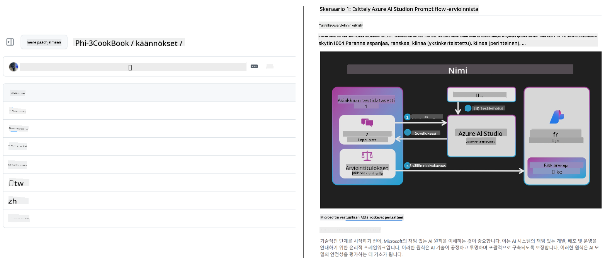
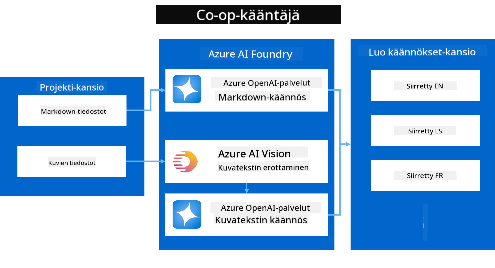
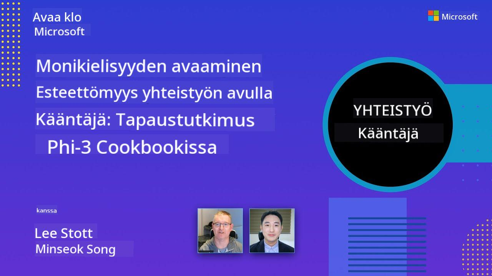

<!--
CO_OP_TRANSLATOR_METADATA:
{
  "original_hash": "044724537b57868117aadae8e7728c7c",
  "translation_date": "2025-06-12T10:35:39+00:00",
  "source_file": "README.md",
  "language_code": "fi"
}
-->


# Co-op Translator: Automatisoi koulutusdokumentaation käännökset vaivattomasti

_Automatisoi helposti dokumentaatiosi kääntäminen useille kielille ja tavoita maailmanlaajuinen yleisö._

[](https://pypi.org/project/co-op-translator/)
[](https://github.com/azure/co-op-translator/blob/main/LICENSE)
[](https://pepy.tech/project/co-op-translator)
[](https://pepy.tech/project/co-op-translator)
[](https://github.com/psf/black)

[](https://GitHub.com/azure/co-op-translator/graphs/contributors/)
[](https://GitHub.com/azure/co-op-translator/issues/)
[](https://GitHub.com/azure/co-op-translator/pulls/)
[](http://makeapullrequest.com)

### Kielituki Co-op Translatorin voimin

> [!NOTE]
> Nämä ovat tämän arkiston sisällön nykyiset käännökset. Täydellinen lista Co-op Translatorin tukemista kielistä löytyy kohdasta [Language Support](../..).

[](https://GitHub.com/azure/co-op-translator/watchers/)
[](https://GitHub.com/azure/co-op-translator/network/)
[](https://GitHub.com/azure/co-op-translator/stargazers/)

[](https://discord.com/invite/ByRwuEEgH4)

[](https://codespaces.new/azure/co-op-translator)
[](https://vscode.dev/redirect?url=vscode://ms-vscode-remote.remote-containers/cloneInVolume?url=https://github.com/azure/co-op-translator)

## Yleiskatsaus: Tehosta opetussisältöjesi kääntämistä

Kielimuurit vaikeuttavat merkittävästi arvokkaiden opetussisältöjen ja teknisen tiedon saatavuutta oppijoille ja kehittäjille ympäri maailmaa. Tämä rajoittaa osallistumista ja hidastaa globaalin innovaation ja oppimisen vauhtia.

**Co-op Translator** syntyi tarpeesta tehostaa Microsoftin omien laajamittaisten opetussarjojen (kuten "For Beginners" -oppaat) manuaalista käännösprosessia. Se on kehittynyt helppokäyttöiseksi ja tehokkaaksi työkaluksi, joka murtaa kielimuurit kaikille. Tarjoamalla laadukkaita automaattisia käännöksiä komentorivin ja GitHub Actionsin kautta, Co-op Translator antaa opettajille, opiskelijoille, tutkijoille ja kehittäjille maailmanlaajuisesti mahdollisuuden jakaa ja käyttää tietoa ilman kielirajoituksia.

Katso, miten Co-op Translator järjestää käännetyn opetussisällön:



Markdown-tiedostot ja kuvien tekstit käännetään automaattisesti ja järjestetään siististi kielikohtaisiin kansioihin.

**Avaa opetussisältösi globaaliin käyttöön Co-op Translatorin avulla jo tänään!**

## Tuemme Microsoftin oppimateriaalien maailmanlaajuista saavutettavuutta

Co-op Translator auttaa ylittämään kielimuurit tärkeissä Microsoftin opetushankkeissa automatisoimalla käännösprosessin kehittäjäyhteisölle, joka toimii globaalisti. Esimerkkejä projekteista, jotka käyttävät Co-op Translatoria tällä hetkellä:

[](https://github.com/microsoft/Generative-AI-for-beginners)
[](https://github.com/microsoft/ML-For-Beginners)
[](https://github.com/microsoft/AI-For-Beginners)
[](https://github.com/microsoft/ai-agents-for-beginners)
[](https://github.com/microsoft/PhiCookBook)
[](https://github.com/microsoft/Generative-AI-for-beginners-dotnet)

## Keskeiset ominaisuudet

- **Automaattiset käännökset**: Käännä tekstiä vaivattomasti useille kielille.
- **GitHub Actions -integraatio**: Automatisoi käännökset osana CI/CD-putkeasi.
- **Markdownin säilytys**: Säilytä oikea Markdown-syntaksi käännöksen aikana.
- **Kuvien tekstin käännös**: Tunnista ja käännä kuviin upotettu teksti.
- **Edistynyt LLM-teknologia**: Hyödynnä huippuluokan kielimalleja laadukkaisiin käännöksiin.
- **Helppo integrointi**: Yhdistä saumattomasti olemassa olevaan projektikokonaisuuteen.
- **Lokalisaation yksinkertaistus**: Tehosta projektisi kansainvälistämistä.

## Miten se toimii



Co-op Translator ottaa projektikansiostasi Markdown-tiedostot ja kuvat ja käsittelee ne seuraavasti:

1. **Tekstin poiminta**: Poimii tekstiä Markdown-tiedostoista ja tarvittaessa (esim. Azure AI Visionilla) kuvien sisältä.
1. **AI-käännös**: Lähettää poimitun tekstin määritettyyn LLM:ään (Azure OpenAI, OpenAI jne.) käännettäväksi.
1. **Tuloksen tallennus**: Tallentaa käännetyt Markdown-tiedostot ja kuvat (käännetty teksti mukana) kielikohtaisiin kansioihin säilyttäen alkuperäisen muotoilun.

## Aloittaminen

Aloita nopeasti komentoriviltä tai ota käyttöön täysi automaatio GitHub Actionsin avulla. Valitse työskentelytapa, joka sopii parhaiten sinulle:

1. **Komentorivi (CLI)** – kertakäyttöisiin käännöksiin tai manuaaliseen hallintaan
2. **GitHub Actions** – automaattisiin käännöksiin jokaisella pushilla

> [!NOTE]
> Vaikka tämä opas keskittyy Azure-resursseihin, voit käyttää mitä tahansa tuettua kielimallia.

### Kielituki

Co-op Translator tukee laajaa valikoimaa kieliä, jotta tavoitat globaalin yleisön. Tässä tärkeimmät tiedot:

#### Pikakatsaus

| Kieli | Koodi | Kieli | Koodi | Kieli | Koodi |
|-------|-------|-------|-------|-------|-------|
| Arabic | ar | Bengali | bn | Bulgarian | bg |
| Burmese (Myanmar) | my | Chinese (Simplified) | zh | Chinese (Traditional, HK) | hk |
| Chinese (Traditional, Macau) | mo | Chinese (Traditional, TW) | tw | Croatian | hr |
| Czech | cs | Danish | da | Dutch | nl |
| Finnish | fi | French | fr | German | de |
| Greek | el | Hebrew | he | Hindi | hi |
| Hungarian | hu | Indonesian | id | Italian | it |
| Japanese | ja | Korean | ko | Malay | ms |
| Marathi | mr | Nepali | ne | Norwegian | no |
| Persian (Farsi) | fa | Polish | pl | Portuguese (Brazil) | br |
| Portuguese (Portugal) | pt | Punjabi (Gurmukhi) | pa | Romanian | ro |
| Russian | ru | Serbian (Cyrillic) | sr | Slovak | sk |
| Slovenian | sl | Spanish | es | Swahili | sw |
| Swedish | sv | Tagalog (Filipino) | tl | Thai | th |
| Turkish | tr | Ukrainian | uk | Urdu | ur |
| Vietnamese | vi | — | — | — | — |

#### Kielikoodien käyttö

Co-op Translatorissa kielet määritetään niiden koodeilla. Esimerkiksi:

```bash
# Translate to French, Spanish, and German
translate -l "fr es de"

# Translate to Chinese (Simplified) and Japanese
translate -l "zh ja"
```

> [!NOTE]
> Tarkempia teknisiä tietoja kielituesta, mukaan lukien:
>
> - Kirjasinvaatimukset kullekin kielelle
> - Tunnetut ongelmat
> - Uusien kielten lisääminen
>
> löydät dokumentaatiostamme [Supported Languages Documentation](./getting_started/supported-languages.md).

### Tuetut mallit ja palvelut

| Tyyppi                | Nimi                           |
|-----------------------|--------------------------------|
| Language Model        |   |
| AI Vision             |  |

> [!NOTE]
> Jos AI Vision -palvelua ei ole käytettävissä, co-op translator vaihtaa automaattisesti [Markdown-only modeen](./getting_started/markdown-only-mode.md).

### Alustava käyttöönotto

Ennen aloittamista sinun tulee määrittää seuraavat resurssit:

1. Language Model -resurssi (pakollinen):
   - Azure OpenAI (suositeltu) – tarjoaa laadukkaita käännöksiä yritystason luotettavuudella
   - OpenAI – vaihtoehto, jos Azureen ei ole pääsyä
   - Tarkemmat tiedot tuetuista malleista löytyvät kohdasta [Supported Models and Services](../..)

1. AI Vision -resurssi (valinnainen):
   - Azure AI Vision – mahdollistaa kuvien sisällön tekstin kääntämisen
   - Jos tätä ei ole määritetty, kääntäjä käyttää automaattisesti [Markdown-only modea](./getting_started/markdown-only-mode.md)
   - Suositellaan projekteihin, joissa on kuvia, joissa on käännettävää tekstiä

1. Konfigurointivaiheet:
   - Seuraa [Azure AI setup guidea](./getting_started/set-up-azure-ai.md) tarkkojen ohjeiden saamiseksi
   - Luo `.env`-tiedosto API-avaimilla ja päätepisteillä (katso [Quick Start](../..) -osio)
   - Varmista, että sinulla on tarvittavat oikeudet ja käyttökiintiöt valitsemillesi palveluille

### Projektin valmistelu ennen käännöstä

Ennen käännösprosessin aloittamista valmistele projektisi seuraavasti:

1. Valmistele README:
   - Lisää README.md-tiedostoon käännöstaulukko, josta pääsee käännettyihin versioihin
   - Esimerkkimuoto:

     ```markdown

     ### 🌐 Multi-Language Support
     
     [French](../fr/README.md) | [Spanish](../es/README.md) | [German](../de/README.md) | [Russian](../ru/README.md) | [Arabic](../ar/README.md) | [Persian (Farsi)](../fa/README.md) | [Urdu](../ur/README.md) | [Chinese (Simplified)](../zh/README.md) | [Chinese (Traditional, Macau)](../mo/README.md) | [Chinese (Traditional, Hong Kong)](../hk/README.md) | [Chinese (Traditional, Taiwan)](../tw/README.md) | [Japanese](../ja/README.md) | [Korean](../ko/README.md) | [Hindi](../hi/README.md) | [Bengali](../bn/README.md) | [Marathi](../mr/README.md) | [Nepali](../ne/README.md) | [Punjabi (Gurmukhi)](../pa/README.md) | [Portuguese (Portugal)](../pt/README.md) | [Portuguese (Brazil)](../br/README.md) | [Italian](../it/README.md) | [Polish](../pl/README.md) | [Turkish](../tr/README.md) | [Greek](../el/README.md) | [Thai](../th/README.md) | [Swedish](../sv/README.md) | [Danish](../da/README.md) | [Norwegian](../no/README.md) | [Finnish](./README.md) | [Dutch](../nl/README.md) | [Hebrew](../he/README.md) | [Vietnamese](../vi/README.md) | [Indonesian](../id/README.md) | [Malay](../ms/README.md) | [Tagalog (Filipino)](../tl/README.md) | [Swahili](../sw/README.md) | [Hungarian](../hu/README.md) | [Czech](../cs/README.md) | [Slovak](../sk/README.md) | [Romanian](../ro/README.md) | [Bulgarian](../bg/README.md) | [Serbian (Cyrillic)](../sr/README.md) | [Croatian](../hr/README.md) | [Slovenian](../sl/README.md) | [Ukrainian](../uk/README.md) | [Burmese (Myanmar)](../my/README.md) 
    
     ```

1. Siivoa olemassa olevat käännökset (tarvittaessa):
   - Poista vanhat käännöskansiot (esim. `translations/`)
   - Poista vanhat käännöstiedostot aloittaaksesi puhtaalta pöydältä
   - Tämä estää ristiriidat uuden käännösprosessin kanssa

### Pikakäynnistys: Komentorivi

Nopea aloitus komentoriviltä:

1. Luo virtuaaliympäristö:

    ```bash
    python -m venv .venv
    ```

1. Aktivoi virtuaaliympäristö:

    - Windowsilla:

    ```bash
    .venv\scripts\activate
    ```

    - Linux/macOS:

    ```bash
    source .venv/bin/activate
    ```

1. Asenna paketti:

    ```bash
    pip install co-op-translator
    ```

1. Määritä tunnistetiedot:

    - Luo `.env` file in your project's root directory.
    - Copy the contents from the [.env.template](../../.env.template) file into your new `.env` file.
    - Fill in the required API keys and endpoint information in your `.env` file.

1. Run Translation:
    - Navigate to your project's root directory in your terminal.
    - Execute the translate command, specifying target languages with the `-l` -lippu:

    ```bash
    translate -l "ko ja fr"
    ```

_(Korvaa `"ko ja fr"` with your desired space-separated language codes)_

### Detailed Usage Guides

Choose the approach that best fits your workflow:

#### 1. Using the Command Line (CLI)

- Best for: One-time translations, manual control, or integration into custom scripts.
- Requires: Local installation of Python and the `co-op-translator` package.
- Guide: [Command Line Guide](./getting_started/command-line-guide/command-line-guide.md)

#### 2. Using GitHub Actions (Automation)

- Best for: Automatically translating content whenever changes are pushed to your repository. Keeps translations consistently up-to-date.
- Requires: Setting up a workflow file (`.github/workflows`) arkistossasi. Ei tarvetta paikalliselle asennukselle.
- Oppaat:
  - [GitHub Actions Guide (Public Repositories & Standard Secrets)](./getting_started/github-actions-guide/github-actions-guide-public.md) – Käytä tätä julkisissa tai henkilökohtaisissa arkistoissa, jotka käyttävät vakiovarasto-salaisuuksia.
  - [GitHub Actions Guide (Microsoft Organization Repos & Org-Level Setups)](./getting_started/github-actions-guide/github-actions-guide-org.md) – Käytä tätä, jos työskentelet Microsoftin GitHub-organisaatiossa tai tarvitset organisaatiotason salaisuuksia tai suorittimia.

### Vianmääritys ja vinkit

- [Vianmääritysohje](./getting_started/troubleshooting.md)

### Lisäresurssit

- [Komentoviite](./getting_started/command-reference.md): Yksityiskohtainen opas kaikista komennoista ja vaihtoehdoista.
- [Tuetut kielet](./getting_started/supported-languages.md): Tarkista tuettujen kielten lista ja ohjeet uusien lisäämiseen.
- [Markdown-only mode](./getting_started/markdown-only-mode.md): Kuinka kääntää pelkkä teksti ilman kuvien käännöstä.

## Videopresentaatiot

Tutustu Co-op Translatoriin esitystemme kautta _(klikkaa alla olevaa kuvaa katsoaksesi YouTubessa)_:

- **Open at Microsoft**: Lyhyt 18 minuutin johdanto ja nopea opas Co-op Translatorin käyttöön.
[](https://www.youtube.com/watch?v=jX_swfH_KNU)

## Tue meitä ja edistä globaalia oppimista

Liity mukaan mullistamaan tapa, jolla opetussisältöä jaetaan maailmanlaajuisesti! Anna [Co-op Translatorille](https://github.com/azure/co-op-translator) ⭐ GitHubissa ja tue missiotamme poistaa kielimuurit oppimisessa ja teknologiassa. Kiinnostuksesi ja panoksesi ovat erittäin arvokkaita! Koodin parannukset ja ominaisuusehdotukset ovat aina tervetulleita.

## Osallistuminen

Tämä projekti toivottaa tervetulleiksi panokset ja ehdotukset. Haluatko osallistua Azure Co-op Translatorin kehittämiseen? Katso ohjeet [CONTRIBUTING.md](./CONTRIBUTING.md)-tiedostosta, miten voit auttaa tekemään Co-op Translatorista entistä saavutettavamman.

## Tekijät

[](https://github.com/Azure/co-op-translator/graphs/contributors)

## Käyttäytymissäännöt

Tämä projekti on ottanut käyttöön [Microsoft Open Source Code of Conductin](https://opensource.microsoft.com/codeofconduct/).
Lisätietoja löydät [Code of Conduct FAQ](https://opensource.microsoft.com/codeofconduct/faq/) -sivulta tai ota yhteyttä osoitteeseen [opencode@microsoft.com](mailto:opencode@microsoft.com), jos sinulla on lisäkysymyksiä tai kommentteja.

## Vastuullinen tekoäly

Microsoft sitoutuu auttamaan asiakkaitamme käyttämään tekoälytuotteitamme vastuullisesti, jakamaan oppejamme ja rakentamaan luottamukseen perustuvia kumppanuuksia esimerkiksi Transparency Notes- ja Impact Assessments -työkalujen avulla. Monet näistä resursseista löytyvät osoitteesta [https://aka.ms/RAI](https://aka.ms/RAI).
Microsoftin vastuullisen tekoälyn lähestymistapa perustuu tekoälyn periaatteisiimme, jotka ovat oikeudenmukaisuus, luotettavuus ja turvallisuus, yksityisyys ja tietoturva, osallisuus, läpinäkyvyys sekä vastuullisuus.

Laajamittaiset luonnollisen kielen, kuvan ja puheen mallit – kuten tässä esimerkissä käytetyt – voivat käyttäytyä tavoilla, jotka ovat epäoikeudenmukaisia, epäluotettavia tai loukkaavia, ja aiheuttaa haittaa. Tutustu [Azure OpenAI -palvelun Transparency noteen](https://learn.microsoft.com/legal/cognitive-services/openai/transparency-note?tabs=text) saadaksesi tietoa riskeistä ja rajoituksista.

Suositeltu tapa vähentää näitä riskejä on sisällyttää arkkitehtuuriisi turvajärjestelmä, joka pystyy havaitsemaan ja estämään haitallisen toiminnan. [Azure AI Content Safety](https://learn.microsoft.com/azure/ai-services/content-safety/overview) tarjoaa itsenäisen suojakerroksen, joka pystyy tunnistamaan haitallisen käyttäjien ja tekoälyn tuottaman sisällön sovelluksissa ja palveluissa. Azure AI Content Safety sisältää tekstin ja kuvien API:t, joiden avulla voit tunnistaa haitallista materiaalia. Meillä on myös interaktiivinen Content Safety Studio, jossa voit tarkastella, tutkia ja kokeilla esimerkkikoodeja haitallisen sisällön havaitsemiseksi eri muodoissa. Seuraava [aloitusopas](https://learn.microsoft.com/azure/ai-services/content-safety/quickstart-text?tabs=visual-studio%2Clinux&pivots=programming-language-rest) opastaa sinua palvelun käyttöönotossa.

Toinen huomioon otettava seikka on sovelluksen kokonaisvaltainen suorituskyky. Monimodaalisissa ja monimallipohjaisissa sovelluksissa suorituskyvyllä tarkoitetaan sitä, että järjestelmä toimii odotetusti sinulta ja käyttäjiltäsi, mukaan lukien haitallisten tulosten välttäminen. On tärkeää arvioida sovelluksesi suorituskykyä käyttämällä [generoinnin laatua sekä riski- ja turvallisuusmittareita](https://learn.microsoft.com/azure/ai-studio/concepts/evaluation-metrics-built-in).

Voit arvioida tekoälysovellustasi kehitysympäristössäsi käyttämällä [prompt flow SDK:ta](https://microsoft.github.io/promptflow/index.html). Olipa käytössäsi testiaineisto tai tavoite, generatiivisen tekoälysovelluksesi tuotokset mitataan määrällisesti sisäänrakennetuilla arvioijilla tai valinnaisilla mukautetuilla arvioijilla. Aloittaaksesi prompt flow SDK:n käytön järjestelmäsi arviointiin, voit seurata [aloitusopasta](https://learn.microsoft.com/azure/ai-studio/how-to/develop/flow-evaluate-sdk). Kun suoritat arviointikierroksen, voit [visualisoida tulokset Azure AI Studiossa](https://learn.microsoft.com/azure/ai-studio/how-to/evaluate-flow-results).

## Tavara- ja palvelumerkit

Tässä projektissa voi olla tavara- tai palvelumerkkejä projekteille, tuotteille tai palveluille. Microsoftin tavara- ja palvelumerkkien valtuutettu käyttö edellyttää [Microsoftin tavara- ja brändiohjeiden](https://www.microsoft.com/en-us/legal/intellectualproperty/trademarks/usage/general) noudattamista.
Microsoftin tavara- ja palvelumerkkien käyttö muokatuissa versioissa tästä projektista ei saa aiheuttaa sekaannusta eikä antaa ymmärtää Microsoftin sponsorointia.
Kolmansien osapuolten tavara- ja palvelumerkkien käyttö on näiden osapuolten sääntöjen alaista.

**Vastuuvapauslauseke**:  
Tämä asiakirja on käännetty käyttämällä tekoälypohjaista käännöspalvelua [Co-op Translator](https://github.com/Azure/co-op-translator). Pyrimme tarkkuuteen, mutta huomioithan, että automaattiset käännökset saattavat sisältää virheitä tai epätarkkuuksia. Alkuperäistä asiakirjaa sen alkuperäiskielellä tulee pitää auktoritatiivisena lähteenä. Tärkeissä tiedoissa suositellaan ammattimaista ihmiskäännöstä. Emme ole vastuussa tämän käännöksen käytöstä aiheutuvista väärinymmärryksistä tai tulkinnoista.