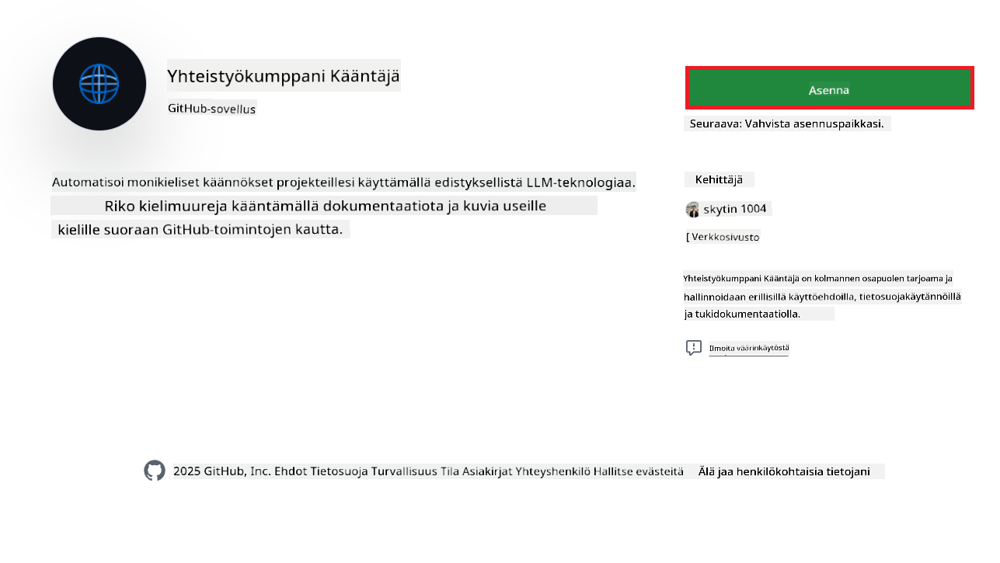
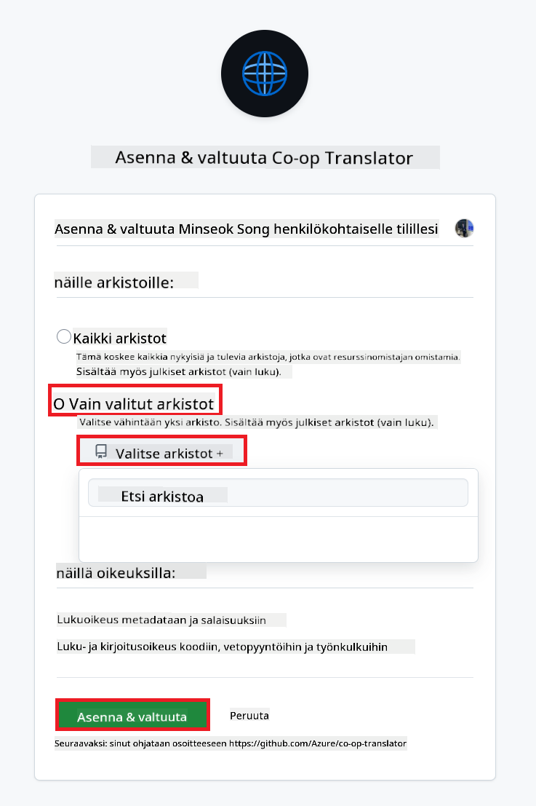
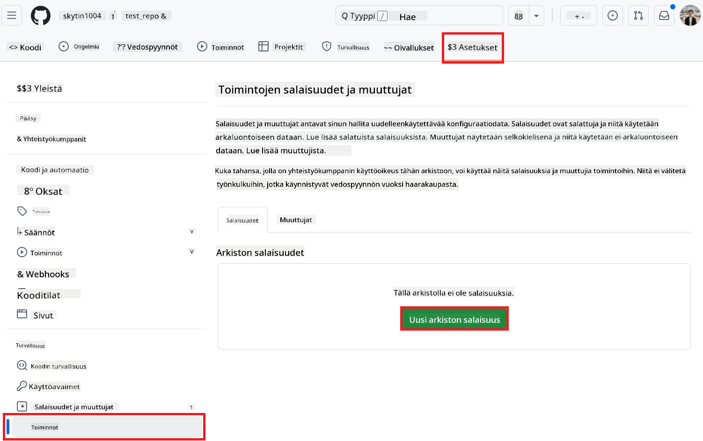
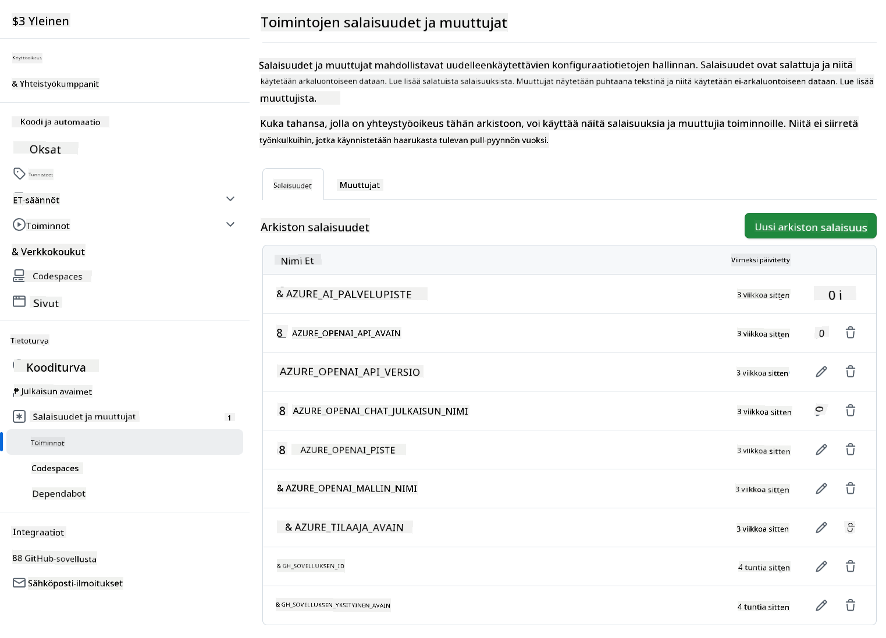

<!--
CO_OP_TRANSLATOR_METADATA:
{
  "original_hash": "c437820027c197f25fb2cbee95bae28c",
  "translation_date": "2025-06-12T19:12:18+00:00",
  "source_file": "getting_started/github-actions-guide/github-actions-guide-org.md",
  "language_code": "fi"
}
-->
# Co-op Translator GitHub Actionin käyttö (Organisaation opas)

**Kohdeyleisö:** Tämä opas on tarkoitettu **Microsoftin sisäisille käyttäjille** tai **tiimeille, joilla on pääsy tarvittaviin tunnistetietoihin valmiiksi rakennetulle Co-op Translator GitHub -sovellukselle** tai jotka voivat luoda oman mukautetun GitHub-sovelluksen.

Automatisoi repositoriosi dokumentaation käännökset vaivattomasti Co-op Translator GitHub Actionin avulla. Tämä opas ohjaa sinut toiminnon määrittämisessä niin, että se luo automaattisesti pull requesteja päivitettyjen käännösten kanssa aina, kun lähde-Markdown-tiedostosi tai kuvat muuttuvat.

> [!IMPORTANT]
> 
> **Oikean oppaan valinta:**
>
> Tämä opas kuvaa asetukset käyttäen **GitHub App ID:tä ja yksityistä avainta**. Tarvitset tämän "Organisaation oppaan" menetelmän yleensä, jos: **`GITHUB_TOKEN` oikeudet ovat rajoitettuja:** Organisaatiosi tai repositoriosi asetukset rajoittavat oletuksena myönnettyjä oikeuksia standardille `GITHUB_TOKEN`:lle. Erityisesti, jos `GITHUB_TOKEN` ei saa tarvittavia `write`-oikeuksia (kuten `contents: write` tai `pull-requests: write`), työnkulku [Public Setup Guide](./github-actions-guide-public.md) -oppaassa epäonnistuu puutteellisten oikeuksien vuoksi. Omalla GitHub-sovelluksella, jolla on nimenomaisesti myönnetyt oikeudet, tämä rajoitus ohitetaan.
>
> **Jos yllä oleva ei koske sinua:**
>
> Jos standardilla `GITHUB_TOKEN`:lla on riittävät oikeudet repositoriossasi (eli organisaatiorajoitukset eivät estä sinua), käytä **[Public Setup Guide using GITHUB_TOKEN](./github-actions-guide-public.md)** -opasta. Julkinen opas ei vaadi App ID:n tai yksityisen avaimen hankkimista tai hallintaa, vaan luottaa pelkästään standardiin `GITHUB_TOKEN`:oon ja repositorion oikeuksiin.

## Esivaatimukset

Ennen GitHub Actionin määrittämistä varmista, että sinulla on tarvittavat AI-palvelun tunnistetiedot valmiina.

**1. Pakollinen: AI-kielimallin tunnistetiedot**  
Tarvitset tunnistetiedot vähintään yhdelle tuetulle kielimallille:

- **Azure OpenAI**: Tarvitaan Endpoint, API-avain, Malli/Deployment-nimet, API-versio.  
- **OpenAI**: Tarvitaan API-avain, (valinnainen: Org ID, Base URL, Model ID).  
- Katso lisätietoja [Supported Models and Services](../../../../README.md) -osiosta.  
- Asetusopas: [Set up Azure OpenAI](../set-up-resources/set-up-azure-openai.md).

**2. Valinnainen: Computer Vision -tunnistetiedot (kuvakäännöksiä varten)**

- Tarvitaan vain, jos haluat kääntää kuviin sisältyvää tekstiä.  
- **Azure Computer Vision**: Tarvitaan Endpoint ja Subscription Key.  
- Jos näitä ei anneta, toiminto käyttää oletuksena [vain Markdown-tilaa](../markdown-only-mode.md).  
- Asetusopas: [Set up Azure Computer Vision](../set-up-resources/set-up-azure-computer-vision.md).

## Määrittäminen ja konfigurointi

Seuraa näitä ohjeita ottaaksesi Co-op Translator GitHub Actionin käyttöön repositoriossasi:

### Vaihe 1: Asenna ja määritä GitHub App -todennus

Työnkulku käyttää GitHub App -todennusta, jotta se voi turvallisesti toimia repositoriossasi puolestasi (esim. luoda pull requesteja). Valitse yksi vaihtoehto:

#### **Vaihtoehto A: Asenna valmiiksi rakennettu Co-op Translator GitHub App (Microsoftin sisäinen käyttö)**

1. Siirry [Co-op Translator GitHub App](https://github.com/apps/co-op-translator) -sivulle.

1. Valitse **Install** ja valitse tili tai organisaatio, jossa kohderepositoriosi sijaitsee.

    

1. Valitse **Only select repositories** ja valitse kohderepositoriosi (esim. `PhiCookBook`). Klikkaa **Install**. Saatat joutua kirjautumaan sisään.

    

1. **Hanki sovellustunnukset (sisäinen prosessi):** Jotta työnkulku voi todennustua sovelluksena, tarvitset kaksi tietoa, jotka Co-op Translator -tiimi toimittaa:  
  - **App ID:** Co-op Translator -sovelluksen yksilöllinen tunniste. App ID on: `1164076`.  
  - **Yksityinen avain:** Sinun on saatava **kokonainen sisältö** `.pem` -yksityisavaintiedostosta ylläpitäjältä. **Kohtele tätä avainta kuin salasanaa ja säilytä se turvallisesti.**

1. Jatka vaiheeseen 2.

#### **Vaihtoehto B: Käytä omaa mukautettua GitHub Appia**

- Halutessasi voit luoda ja määrittää oman GitHub Appin. Varmista, että sillä on Luku- ja kirjoitusoikeudet Contents- ja Pull requests -osioihin. Tarvitset sen App ID:n ja luodun yksityisen avaimen.

### Vaihe 2: Määritä repositorion salaisuudet

Lisää GitHub App -tunnistetiedot ja AI-palvelun tunnukset salattuina salaisuuksina repositoriosi asetuksiin.

1. Siirry kohderepositoriosi GitHub-sivulle (esim. `PhiCookBook`).

1. Mene kohtaan **Settings** > **Secrets and variables** > **Actions**.

1. Klikkaa **New repository secret** lisätäksesi alla listatut salaisuudet yksitellen.

   

**Pakolliset salaisuudet (GitHub App -todennukseen):**

| Salaisuuden nimi          | Kuvaus                                      | Arvon lähde                                     |
| :------------------------ | :------------------------------------------ | :---------------------------------------------- |
| `GH_APP_ID`        | GitHub Appin App ID (vaiheesta 1).          | GitHub Appin asetukset                          |
| `GH_APP_PRIVATE_KEY`        | Ladatun `.pem` tiedoston **kokonainen sisältö**. | `.pem` tiedosto (vaiheesta 1)       |

**AI-palvelun salaisuudet (lisää KAIKKI tarpeelliset esivaatimusten mukaan):**

| Salaisuuden nimi           | Kuvaus                                   | Arvon lähde                     |
| :------------------------- | :--------------------------------------- | :------------------------------ |
| `AZURE_SUBSCRIPTION_KEY`         | Avain Azure AI -palveluun (Computer Vision) | Azure AI Foundry                |
| `AZURE_AI_SERVICE_ENDPOINT`         | Endpoint Azure AI -palveluun (Computer Vision) | Azure AI Foundry                |
| `AZURE_OPENAI_API_KEY`         | Avain Azure OpenAI -palveluun             | Azure AI Foundry                |
| `AZURE_OPENAI_ENDPOINT`         | Endpoint Azure OpenAI -palveluun           | Azure AI Foundry                |
| `AZURE_OPENAI_MODEL_NAME`         | Azure OpenAI -mallin nimi                  | Azure AI Foundry                |
| `AZURE_OPENAI_CHAT_DEPLOYMENT_NAME`         | Azure OpenAI -deploymentin nimi            | Azure AI Foundry                |
| `AZURE_OPENAI_API_VERSION`         | API-versio Azure OpenAI -palvelulle        | Azure AI Foundry                |
| `OPENAI_API_KEY`         | API-avain OpenAI:lle                        | OpenAI Platform                |
| `OPENAI_ORG_ID`         | OpenAI-organisaation ID                      | OpenAI Platform                |
| `OPENAI_CHAT_MODEL_ID`         | Tietty OpenAI-mallin ID                      | OpenAI Platform                |
| `OPENAI_BASE_URL`         | Mukautettu OpenAI API Base URL                | OpenAI Platform                |



### Vaihe 3: Luo työnkulutiedosto

Lopuksi luo YAML-tiedosto, joka määrittelee automaattisen työnkulun.

1. Luo repositoriosi juurihakemistoon `.github/workflows/`-kansio, jos sitä ei vielä ole.

1. Luo `.github/workflows/`-kansioon tiedosto nimeltä `co-op-translator.yml`.

1. Liitä seuraava sisältö tiedostoon co-op-translator.yml.

```
name: Co-op Translator

on:
  push:
    branches:
      - main

jobs:
  co-op-translator:
    runs-on: ubuntu-latest

    permissions:
      contents: write
      pull-requests: write

    steps:
      - name: Checkout repository
        uses: actions/checkout@v4
        with:
          fetch-depth: 0

      - name: Set up Python
        uses: actions/setup-python@v4
        with:
          python-version: '3.10'

      - name: Install Co-op Translator
        run: |
          python -m pip install --upgrade pip
          pip install co-op-translator

      - name: Run Co-op Translator
        env:
          PYTHONIOENCODING: utf-8
          # Azure AI Service Credentials
          AZURE_SUBSCRIPTION_KEY: ${{ secrets.AZURE_SUBSCRIPTION_KEY }}
          AZURE_AI_SERVICE_ENDPOINT: ${{ secrets.AZURE_AI_SERVICE_ENDPOINT }}

          # Azure OpenAI Credentials
          AZURE_OPENAI_API_KEY: ${{ secrets.AZURE_OPENAI_API_KEY }}
          AZURE_OPENAI_ENDPOINT: ${{ secrets.AZURE_OPENAI_ENDPOINT }}
          AZURE_OPENAI_MODEL_NAME: ${{ secrets.AZURE_OPENAI_MODEL_NAME }}
          AZURE_OPENAI_CHAT_DEPLOYMENT_NAME: ${{ secrets.AZURE_OPENAI_CHAT_DEPLOYMENT_NAME }}
          AZURE_OPENAI_API_VERSION: ${{ secrets.AZURE_OPENAI_API_VERSION }}

          # OpenAI Credentials
          OPENAI_API_KEY: ${{ secrets.OPENAI_API_KEY }}
          OPENAI_ORG_ID: ${{ secrets.OPENAI_ORG_ID }}
          OPENAI_CHAT_MODEL_ID: ${{ secrets.OPENAI_CHAT_MODEL_ID }}
          OPENAI_BASE_URL: ${{ secrets.OPENAI_BASE_URL }}
        run: |
          # =====================================================================
          # IMPORTANT: Set your target languages here (REQUIRED CONFIGURATION)
          # =====================================================================
          # Example: Translate to Spanish, French, German. Add -y to auto-confirm.
          translate -l "es fr de" -y  # <--- MODIFY THIS LINE with your desired languages

      - name: Authenticate GitHub App
        id: generate_token
        uses: tibdex/github-app-token@v1
        with:
          app_id: ${{ secrets.GH_APP_ID }}
          private_key: ${{ secrets.GH_APP_PRIVATE_KEY }}

      - name: Create Pull Request with translations
        uses: peter-evans/create-pull-request@v5
        with:
          token: ${{ steps.generate_token.outputs.token }}
          commit-message: "🌐 Update translations via Co-op Translator"
          title: "🌐 Update translations via Co-op Translator"
          body: |
            This PR updates translations for recent changes to the main branch.

            ### 📋 Changes included
            - Translated contents are available in the `translations/` directory
            - Translated images are available in the `translated_images/` directory

            ---
            🌐 Automatically generated by the [Co-op Translator](https://github.com/Azure/co-op-translator) GitHub Action.
          branch: update-translations
          base: main
          labels: translation, automated-pr
          delete-branch: true
          add-paths: |
            translations/
            translated_images/

```

4.  **Mukauta työnkulkua:**  
  - **[!IMPORTANT] Kohdekielet:** Muokkaa `Run Co-op Translator` step, you **MUST review and modify the list of language codes** within the `translate -l "..." -y` command to match your project's requirements. The example list (`ar de es...`) needs to be replaced or adjusted.
  - **Trigger (`on:`):** The current trigger runs on every push to `main`. For large repositories, consider adding a `paths:` filter (see commented example in the YAML) to run the workflow only when relevant files (e.g., source documentation) change, saving runner minutes.
  - **PR Details:** Customize the `commit-message`, `title`, `body`, `branch` name, and `labels` in the `Create Pull Request` step if needed.

## Credential Management and Renewal

- **Security:** Always store sensitive credentials (API keys, private keys) as GitHub Actions secrets. Never expose them in your workflow file or repository code.
- **[!IMPORTANT] Key Renewal (Internal Microsoft Users):** Be aware that Azure OpenAI key used within Microsoft might have a mandatory renewal policy (e.g., every 5 months). Ensure you update the corresponding GitHub secrets (`AZURE_OPENAI_...` -avaimia **ennen kuin ne vanhenevat** estääksesi työnkulun epäonnistumiset.

## Työnkulun suorittaminen

Kun `co-op-translator.yml` tiedosto on yhdistetty päähaaraasi (tai `on:` trigger), the workflow will automatically run whenever changes are pushed to that branch (and match the `paths` -suodattimessa määriteltyyn haaraan, jos sellainen on asetettu).

Jos käännöksiä luodaan tai päivitetään, toiminto luo automaattisesti Pull Requestin, joka sisältää muutokset, valmiina tarkastettavaksi ja yhdistettäväksi.

**Vastuuvapauslauseke**:  
Tämä asiakirja on käännetty käyttämällä tekoälypohjaista käännöspalvelua [Co-op Translator](https://github.com/Azure/co-op-translator). Vaikka pyrimme tarkkuuteen, otathan huomioon, että automaattikäännöksissä saattaa esiintyä virheitä tai epätarkkuuksia. Alkuperäistä asiakirjaa sen alkuperäisellä kielellä tulee pitää auktoritatiivisena lähteenä. Tärkeiden tietojen osalta suositellaan ammattimaista ihmiskäännöstä. Emme ole vastuussa tämän käännöksen käytöstä johtuvista väärinymmärryksistä tai virhetulkinnoista.