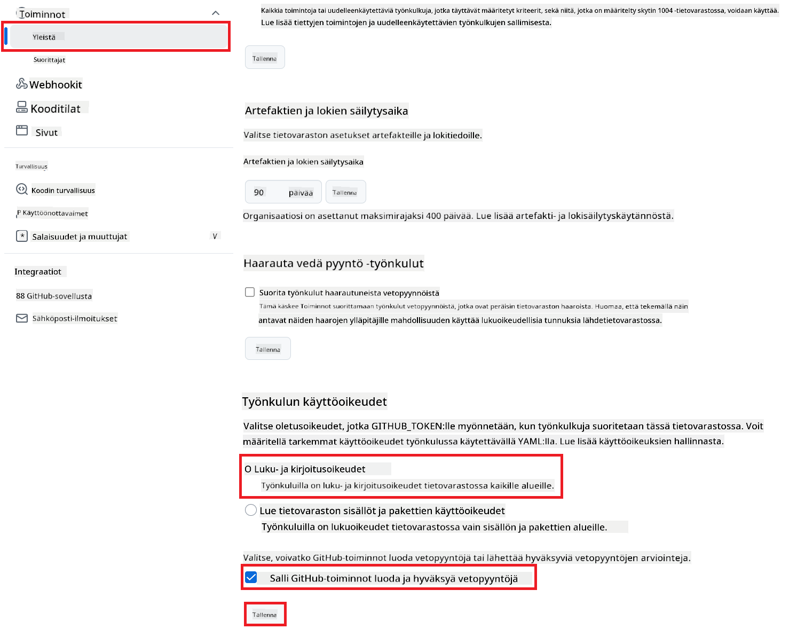

<!--
CO_OP_TRANSLATOR_METADATA:
{
  "original_hash": "a52587a512e667f70d92db853d3c61d5",
  "translation_date": "2025-06-12T19:30:42+00:00",
  "source_file": "getting_started/github-actions-guide/github-actions-guide-public.md",
  "language_code": "fi"
}
-->
# Co-op Translator GitHub Actionin käyttäminen (Julkinen asennus)

**Kohdeyleisö:** Tämä opas on tarkoitettu käyttäjille useimmissa julkisissa tai yksityisissä repositorioissa, joissa tavalliset GitHub Actions -oikeudet riittävät. Se hyödyntää sisäänrakennettua `GITHUB_TOKEN`.

Automatisoi repositoriosi dokumentaation kääntäminen vaivattomasti Co-op Translator GitHub Actionin avulla. Tämä opas ohjaa sinut toiminnon asetusten läpi, jotta se luo automaattisesti pull requesteja päivitetyillä käännöksillä aina, kun lähde-Markdown-tiedostosi tai kuvat muuttuvat.

> [!IMPORTANT]
>
> **Oikean oppaan valinta:**
>
> Tämä opas kuvaa **yksinkertaisemman asennuksen käyttäen tavallista `GITHUB_TOKEN`**. Tämä on suositeltu tapa useimmille käyttäjille, koska se ei vaadi arkaluontoisten GitHub App Private Keyjen hallintaa.
>

## Esivaatimukset

Ennen GitHub Actionin konfigurointia varmista, että sinulla on tarvittavat tekoälypalvelun tunnistetiedot valmiina.

**1. Pakolliset: Tekoälykielimallin tunnistetiedot**  
Tarvitset tunnistetiedot vähintään yhdelle tuetulle kielimallille:

- **Azure OpenAI**: Tarvitaan Endpoint, API-avain, mallin/deploynimen tiedot ja API-versio.  
- **OpenAI**: Tarvitaan API-avain, (valinnainen: organisaatio-ID, perus-URL, mallin ID).  
- Katso lisätietoja [Tuetut mallit ja palvelut](../../../../README.md).

**2. Valinnainen: AI Vision -tunnistetiedot (kuvakäännöksiä varten)**

- Tarvitaan vain, jos haluat kääntää kuviin upotettua tekstiä.  
- **Azure AI Vision**: Tarvitaan Endpoint ja tilausavain.  
- Jos näitä ei anneta, toiminto käyttää oletuksena [vain Markdown -tilaa](../markdown-only-mode.md).

## Asennus ja konfigurointi

Seuraa näitä ohjeita ottaaksesi Co-op Translator GitHub Actionin käyttöön repositoriossasi käyttäen tavallista `GITHUB_TOKEN`.

### Vaihe 1: Ymmärrä todennus (käyttäen `GITHUB_TOKEN`)

Tämä työnkulku käyttää GitHub Actionsin sisäänrakennettua `GITHUB_TOKEN`-tokenia. Tämä token antaa automaattisesti työnkululle oikeudet olla vuorovaikutuksessa repositoriosi kanssa sen mukaan, miten ne on määritetty **Vaiheessa 3**.

### Vaihe 2: Määritä repositorion salaisuudet

Sinun tarvitsee lisätä vain **tekoälypalvelun tunnistetiedot** salattuina salaisuuksina repositoriosi asetuksissa.

1.  Siirry haluamaasi GitHub-repositorioon.  
2.  Valitse **Settings** > **Secrets and variables** > **Actions**.  
3.  Valitse **New repository secret** ja lisää jokainen tarvittava tekoälypalvelun salaisuus alla olevan listan mukaan.

     *(Kuvaviite: Näyttää, mistä salaisuudet lisätään)*

**Pakolliset tekoälypalvelun salaisuudet (lisää KAIKKI, jotka koskevat esivaatimuksiasi):**

| Salaisuuden nimi                  | Kuvaus                                   | Arvon lähde                     |
| :-------------------------------- | :---------------------------------------- | :------------------------------- |
| `AZURE_SUBSCRIPTION_KEY`            | Avain Azure AI -palveluun (Computer Vision)  | Azure AI Foundry -ympäristösi      |
| `AZURE_AI_SERVICE_ENDPOINT`         | Päätepiste Azure AI -palveluun (Computer Vision) | Azure AI Foundry -ympäristösi      |
| `AZURE_OPENAI_API_KEY`              | Avain Azure OpenAI -palveluun              | Azure AI Foundry -ympäristösi      |
| `AZURE_OPENAI_ENDPOINT`             | Päätepiste Azure OpenAI -palveluun         | Azure AI Foundry -ympäristösi      |
| `AZURE_OPENAI_MODEL_NAME`           | Azure OpenAI -mallin nimi                   | Azure AI Foundry -ympäristösi      |
| `AZURE_OPENAI_CHAT_DEPLOYMENT_NAME` | Azure OpenAI -deploynimen nimi                | Azure AI Foundry -ympäristösi      |
| `AZURE_OPENAI_API_VERSION`          | Azure OpenAI API-versio                      | Azure AI Foundry -ympäristösi      |
| `OPENAI_API_KEY`                    | OpenAI API-avain                            | OpenAI-alustasi                   |
| `OPENAI_ORG_ID`                     | OpenAI organisaatio-ID (valinnainen)         | OpenAI-alustasi                   |
| `OPENAI_CHAT_MODEL_ID`              | Tietty OpenAI mallin ID (valinnainen)         | OpenAI-alustasi                   |
| `OPENAI_BASE_URL`                   | Mukautettu OpenAI API-perus-URL (valinnainen) | OpenAI-alustasi                   |

### Vaihe 3: Määritä työnkulun oikeudet

GitHub Action tarvitsee oikeudet, jotka annetaan `GITHUB_TOKEN`-tokenin kautta, jotta se voi hakea koodin ja luoda pull requesteja.

1.  Mene repositoriossasi kohtaan **Settings** > **Actions** > **General**.  
2.  Selaa alas kohtaan **Workflow permissions**.  
3.  Valitse **Read and write permissions**. Tämä antaa `GITHUB_TOKEN`-tokenille tarvittavat `contents: write`- ja `pull-requests: write`-oikeudet tätä työnkulkua varten.  
4.  Varmista, että valintaruutu **Allow GitHub Actions to create and approve pull requests** on valittuna.  
5.  Valitse **Save**.



### Vaihe 4: Luo työnkulku-tiedosto

Lopuksi luo YAML-tiedosto, joka määrittelee automaattisen työnkulun käyttäen `GITHUB_TOKEN`.

1.  Luo repositoriosi juurikansioon `.github/workflows/`-hakemisto, jos sitä ei vielä ole.  
2.  Luo `.github/workflows/`-kansioon tiedosto nimeltä `co-op-translator.yml`.  
3.  Liitä seuraava sisältö tiedostoon `co-op-translator.yml`.

```yaml
name: Co-op Translator

on:
  push:
    branches:
      - main

jobs:
  co-op-translator:
    runs-on: ubuntu-latest

    permissions:
      contents: write
      pull-requests: write

    steps:
      - name: Checkout repository
        uses: actions/checkout@v4
        with:
          fetch-depth: 0

      - name: Set up Python
        uses: actions/setup-python@v4
        with:
          python-version: '3.10'

      - name: Install Co-op Translator
        run: |
          python -m pip install --upgrade pip
          pip install co-op-translator

      - name: Run Co-op Translator
        env:
          PYTHONIOENCODING: utf-8
          # === AI Service Credentials ===
          AZURE_SUBSCRIPTION_KEY: ${{ secrets.AZURE_SUBSCRIPTION_KEY }}
          AZURE_AI_SERVICE_ENDPOINT: ${{ secrets.AZURE_AI_SERVICE_ENDPOINT }}
          AZURE_OPENAI_API_KEY: ${{ secrets.AZURE_OPENAI_API_KEY }}
          AZURE_OPENAI_ENDPOINT: ${{ secrets.AZURE_OPENAI_ENDPOINT }}
          AZURE_OPENAI_MODEL_NAME: ${{ secrets.AZURE_OPENAI_MODEL_NAME }}
          AZURE_OPENAI_CHAT_DEPLOYMENT_NAME: ${{ secrets.AZURE_OPENAI_CHAT_DEPLOYMENT_NAME }}
          AZURE_OPENAI_API_VERSION: ${{ secrets.AZURE_OPENAI_API_VERSION }}
          OPENAI_API_KEY: ${{ secrets.OPENAI_API_KEY }}
          OPENAI_ORG_ID: ${{ secrets.OPENAI_ORG_ID }}
          OPENAI_CHAT_MODEL_ID: ${{ secrets.OPENAI_CHAT_MODEL_ID }}
          OPENAI_BASE_URL: ${{ secrets.OPENAI_BASE_URL }}
        run: |
          # =====================================================================
          # IMPORTANT: Set your target languages here (REQUIRED CONFIGURATION)
          # =====================================================================
          # Example: Translate to Spanish, French, German. Add -y to auto-confirm.
          translate -l "es fr de" -y  # <--- MODIFY THIS LINE with your desired languages

      - name: Create Pull Request with translations
        uses: peter-evans/create-pull-request@v5
        with:
          token: ${{ secrets.GITHUB_TOKEN }}
          commit-message: "🌐 Update translations via Co-op Translator"
          title: "🌐 Update translations via Co-op Translator"
          body: |
            This PR updates translations for recent changes to the main branch.

            ### 📋 Changes included
            - Translated contents are available in the `translations/` directory
            - Translated images are available in the `translated_images/` directory

            ---
            🌐 Automatically generated by the [Co-op Translator](https://github.com/Azure/co-op-translator) GitHub Action.
          branch: update-translations
          base: main
          labels: translation, automated-pr
          delete-branch: true
          add-paths: |
            translations/
            translated_images/
```  
4.  **Mukauta työnkulkua:**  
  - **[!IMPORTANT] Kohdekielet:** Muokkaa `Run Co-op Translator` step, you **MUST review and modify the list of language codes** within the `translate -l "..." -y` command to match your project's requirements. The example list (`ar de es...`) needs to be replaced or adjusted.
  - **Trigger (`on:`):** The current trigger runs on every push to `main`. For large repositories, consider adding a `paths:` filter (see commented example in the YAML) to run the workflow only when relevant files (e.g., source documentation) change, saving runner minutes.
  - **PR Details:** Customize the `commit-message`, `title`, `body`, `branch` name, and `labels` in the `Create Pull Request` -kohtaa tarpeen mukaan.

**Vastuuvapauslauseke**:  
Tämä asiakirja on käännetty käyttämällä tekoälypohjaista käännöspalvelua [Co-op Translator](https://github.com/Azure/co-op-translator). Pyrimme tarkkuuteen, mutta otathan huomioon, että automaattikäännöksissä saattaa esiintyä virheitä tai epätarkkuuksia. Alkuperäistä asiakirjaa sen omalla kielellä tulee pitää virallisena lähteenä. Tärkeiden tietojen osalta suositellaan ammattimaista ihmiskäännöstä. Emme ole vastuussa tämän käännöksen käytöstä aiheutuvista väärinymmärryksistä tai virhetulkinnoista.