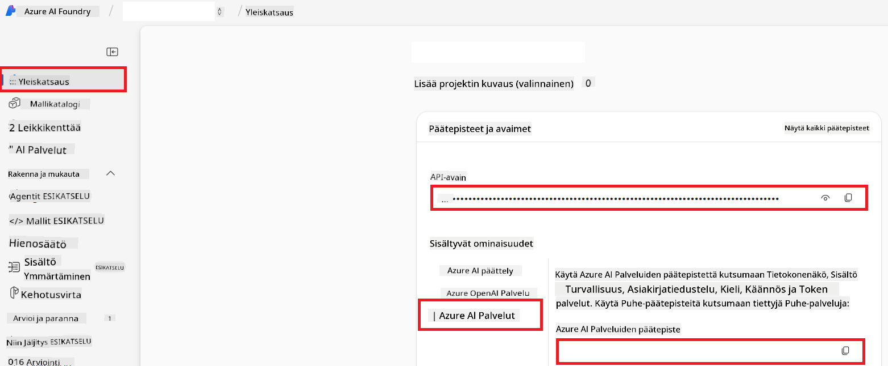

<!--
CO_OP_TRANSLATOR_METADATA:
{
  "original_hash": "b58d7c3cb4210697a073d20eb3064945",
  "translation_date": "2025-06-12T11:54:39+00:00",
  "source_file": "getting_started/set-up-azure-ai.md",
  "language_code": "fi"
}
-->
# Azure AI:n käyttöönotto Co-op Translatorille (Azure OpenAI & Azure AI Vision)

Tässä ohjeessa käydään läpi, miten otat käyttöön Azure OpenAI -kielenkääntämiseen ja Azure Computer Vision -kuvasisällön analysointiin (jota voidaan käyttää kuvapohjaiseen käännökseen) Azure AI Foundryn sisällä.

**Esivaatimukset:**
- Azure-tili, jossa on aktiivinen tilaus.
- Riittävät oikeudet resurssien ja käyttöönottojen luomiseen Azure-tilauksessasi.

## Luo Azure AI -projekti

Aloitat luomalla Azure AI -projektin, joka toimii keskeisenä paikkana AI-resurssiesi hallintaan.

1. Siirry osoitteeseen [https://ai.azure.com](https://ai.azure.com) ja kirjaudu sisään Azure-tililläsi.

1. Valitse **+Create** luodaksesi uuden projektin.

1. Suorita seuraavat toimenpiteet:
   - Anna **Project name** (esim. `CoopTranslator-Project`).
   - Valitse **AI hub** (esim. `CoopTranslator-Hub`) (luo uusi tarvittaessa).

1. Klikkaa "**Review and Create**" luodaksesi projektisi. Sinut ohjataan projektin yleiskatsaus-sivulle.

## Ota Azure OpenAI käyttöön kielenkääntämiseen

Projektissasi otat käyttöön Azure OpenAI -mallin, joka toimii tekstin käännöksen taustapalveluna.

### Siirry projektiisi

Jos et ole jo siellä, avaa juuri luomasi projekti (esim. `CoopTranslator-Project`) Azure AI Foundrystä.

### Ota OpenAI-malli käyttöön

1. Projektisi vasemman reunan valikosta, kohdasta "My assets", valitse "**Models + endpoints**".

1. Valitse **+ Deploy model**.

1. Valitse **Deploy Base Model**.

1. Näet listan saatavilla olevista malleista. Suodata tai etsi sopiva GPT-malli. Suosittelemme `gpt-4o`.

1. Valitse haluamasi malli ja klikkaa **Confirm**.

1. Valitse **Deploy**.

### Azure OpenAI -asetukset

Kun käyttöönotto on valmis, voit valita käyttöönoton "**Models + endpoints**" -sivulta ja löytää sieltä **REST endpoint URL:n**, **Avain**, **Deployment name** -nimen, **Model name** -nimen sekä **API version** -version. Näitä tarvitaan, kun liität käännösmallin sovellukseesi.

> [!NOTE]
> Voit valita API-versioita [API version deprecation](https://learn.microsoft.com/azure/ai-services/openai/api-version-deprecation) -sivulta tarpeidesi mukaan. Huomaa, että **API version** eroaa **Model version** -versiosta, joka näkyy **Models + endpoints** -sivulla Azure AI Foundryssä.

## Ota Azure Computer Vision käyttöön kuvakäännöstä varten

Jotta voit kääntää kuvan tekstisisältöä, sinun täytyy löytää Azure AI Service API Key ja Endpoint.

1. Siirry Azure AI -projektiisi (esim. `CoopTranslator-Project`). Varmista, että olet projektin yleiskatsaus-sivulla.

### Azure AI Service -asetukset

Löydä API Key ja Endpoint Azure AI Service -välilehdeltä.

1. Siirry Azure AI -projektiisi (esim. `CoopTranslator-Project`). Varmista, että olet projektin yleiskatsaus-sivulla.

1. Etsi **API Key** ja **Endpoint** Azure AI Service -välilehdeltä.

    

Tämä yhteys tekee linkitetyn Azure AI Services -resurssin ominaisuudet (mukaan lukien kuvan analysoinnin) saataville AI Foundry -projektiisi. Voit käyttää tätä yhteyttä muistiinpanoissasi tai sovelluksissasi tekstin poimimiseen kuvista, jonka jälkeen teksti voidaan lähettää Azure OpenAI -mallille käännettäväksi.

## Tietojen kokoaminen yhteen

Nyt sinulla pitäisi olla kerättynä seuraavat tiedot:

**Azure OpenAI:lle (tekstin kääntäminen):**
- Azure OpenAI Endpoint
- Azure OpenAI API Key
- Azure OpenAI Model Name (esim. `gpt-4o`)
- Azure OpenAI Deployment Name (esim. `cooptranslator-gpt4o`)
- Azure OpenAI API Version

**Azure AI Servicesille (kuvatekstin poiminta Visionin kautta):**
- Azure AI Service Endpoint
- Azure AI Service API Key

### Esimerkki: Ympäristömuuttujien asetukset (esikatselu)

Myöhemmin sovellustasi rakentaessasi todennäköisesti määrität nämä kerätyt tiedot ympäristömuuttujina esimerkiksi näin:

```bash
# Azure AI Service Credentials (Required for image translation)
AZURE_AI_SERVICE_API_KEY="your_azure_ai_service_api_key" # e.g., 21xasd...
AZURE_AI_SERVICE_ENDPOINT="https://your_azure_ai_service_endpoint.cognitiveservices.azure.com/"

# Azure OpenAI Credentials (Required for text translation)
AZURE_OPENAI_API_KEY="your_azure_openai_api_key" # e.g., 21xasd...
AZURE_OPENAI_ENDPOINT="https://your_azure_openai_endpoint.openai.azure.com/"
AZURE_OPENAI_MODEL_NAME="your_model_name" # e.g., gpt-4o
AZURE_OPENAI_CHAT_DEPLOYMENT_NAME="your_deployment_name" # e.g., cooptranslator-gpt4o
AZURE_OPENAI_API_VERSION="your_api_version" # e.g., 2024-12-01-preview
```

---

### Lisälukemista

- [How to Create a project in Azure AI Foundry](https://learn.microsoft.com/azure/ai-foundry/how-to/create-projects?tabs=ai-studio)
- [How to Create Azure AI resources](https://learn.microsoft.com/azure/ai-foundry/how-to/create-azure-ai-resource?tabs=portal)
- [How to Deploy OpenAI models in Azure AI Foundry](https://learn.microsoft.com/en-us/azure/ai-foundry/how-to/deploy-models-openai)

**Vastuuvapauslauseke**:  
Tämä asiakirja on käännetty käyttämällä tekoälypohjaista käännöspalvelua [Co-op Translator](https://github.com/Azure/co-op-translator). Vaikka pyrimme tarkkuuteen, ole hyvä ja huomioi, että automaattikäännöksissä saattaa esiintyä virheitä tai epätarkkuuksia. Alkuperäistä asiakirjaa sen alkuperäiskielellä tulee pitää virallisena lähteenä. Tärkeissä tiedoissa suositellaan ammattimaista ihmiskäännöstä. Emme ole vastuussa tämän käännöksen käytöstä aiheutuvista väärinymmärryksistä tai virhetulkinnoista.