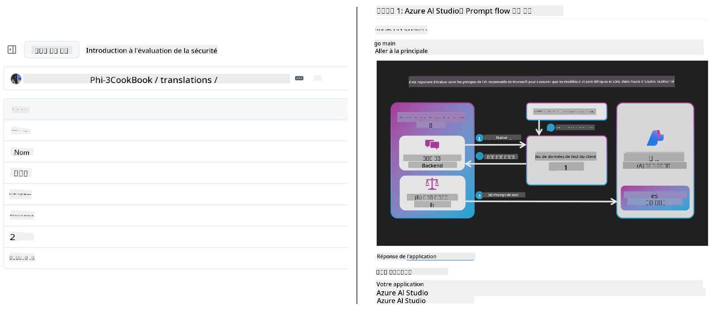
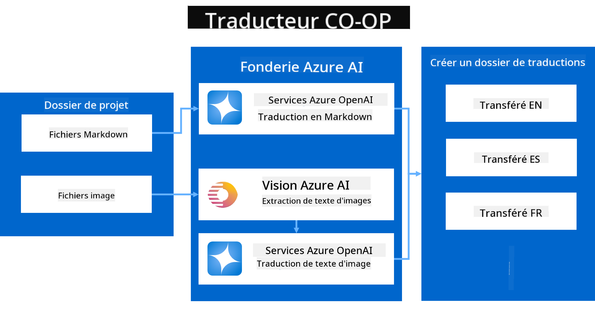
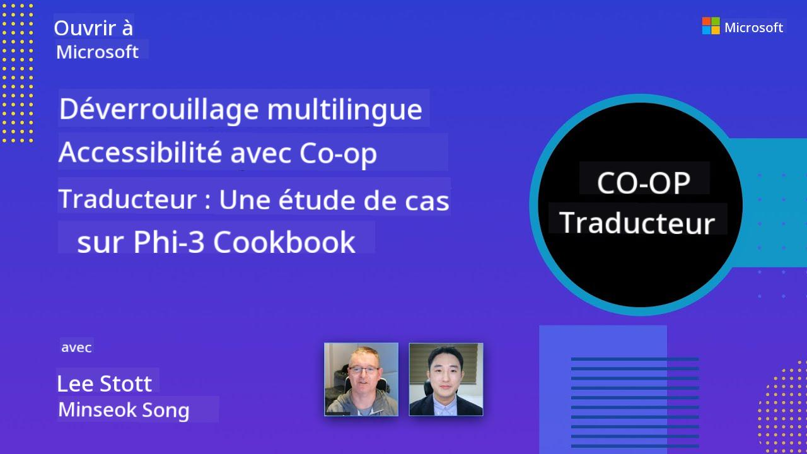

<!--
CO_OP_TRANSLATOR_METADATA:
{
  "original_hash": "044724537b57868117aadae8e7728c7c",
  "translation_date": "2025-06-12T09:47:34+00:00",
  "source_file": "README.md",
  "language_code": "fr"
}
-->


# Co-op Translator : Automatisez facilement la traduction de la documentation éducative

_Automatiquez simplement la traduction de votre documentation en plusieurs langues pour toucher un public mondial._

[](https://pypi.org/project/co-op-translator/)
[](https://github.com/azure/co-op-translator/blob/main/LICENSE)
[](https://pepy.tech/project/co-op-translator)
[](https://pepy.tech/project/co-op-translator)
[](https://github.com/psf/black)

[](https://GitHub.com/azure/co-op-translator/graphs/contributors/)
[](https://GitHub.com/azure/co-op-translator/issues/)
[](https://GitHub.com/azure/co-op-translator/pulls/)
[](http://makeapullrequest.com)

### Support linguistique propulsé par Co-op Translator
[Français](./README.md) | [Espagnol](../es/README.md) | [Allemand](../de/README.md) | [Russe](../ru/README.md) | [Arabe](../ar/README.md) | [Persan (Farsi)](../fa/README.md) | [Ourdou](../ur/README.md) | [Chinois (Simplifié)](../zh/README.md) | [Chinois (Traditionnel, Macao)](../mo/README.md) | [Chinois (Traditionnel, Hong Kong)](../hk/README.md) | [Chinois (Traditionnel, Taïwan)](../tw/README.md) | [Japonais](../ja/README.md) | [Coréen](../ko/README.md) | [Hindi](../hi/README.md) | [Bengali](../bn/README.md) | [Marathi](../mr/README.md) | [Népalais](../ne/README.md) | [Pendjabi (Gurmukhi)](../pa/README.md) | [Portugais (Portugal)](../pt/README.md) | [Portugais (Brésil)](../br/README.md) | [Italien](../it/README.md) | [Polonais](../pl/README.md) | [Turc](../tr/README.md) | [Grec](../el/README.md) | [Thaï](../th/README.md) | [Suédois](../sv/README.md) | [Danois](../da/README.md) | [Norvégien](../no/README.md) | [Finnois](../fi/README.md) | [Néerlandais](../nl/README.md) | [Hébreu](../he/README.md) | [Vietnamien](../vi/README.md) | [Indonésien](../id/README.md) | [Malais](../ms/README.md) | [Tagalog (Filipino)](../tl/README.md) | [Swahili](../sw/README.md) | [Hongrois](../hu/README.md) | [Tchèque](../cs/README.md) | [Slovaque](../sk/README.md) | [Roumain](../ro/README.md) | [Bulgare](../bg/README.md) | [Serbe (Cyrillique)](../sr/README.md) | [Croate](../hr/README.md) | [Slovène](../sl/README.md) | [Ukrainien](../uk/README.md) | [Birman (Myanmar)](../my/README.md)
> [!NOTE]  
> Voici les traductions actuelles du contenu de ce dépôt. Pour une liste complète des langues prises en charge par Co-op Translator, consultez la section [Language Support](../..).

[](https://GitHub.com/azure/co-op-translator/watchers/)  
[](https://GitHub.com/azure/co-op-translator/network/)  
[](https://GitHub.com/azure/co-op-translator/stargazers/)

[](https://discord.com/invite/ByRwuEEgH4)

[](https://codespaces.new/azure/co-op-translator)  
[](https://vscode.dev/redirect?url=vscode://ms-vscode-remote.remote-containers/cloneInVolume?url=https://github.com/azure/co-op-translator)

## Aperçu : Simplifiez la traduction de vos contenus éducatifs

Les barrières linguistiques limitent fortement l'accès à des ressources éducatives précieuses et à des connaissances techniques pour les apprenants et développeurs du monde entier. Cela freine la participation et ralentit le rythme de l'innovation et de l'apprentissage à l’échelle globale.

**Co-op Translator** est né du besoin d’optimiser le processus manuel et inefficace de traduction pour les grandes séries éducatives de Microsoft (comme les guides « For Beginners »). Il est devenu un outil puissant et facile à utiliser, conçu pour lever ces barrières pour tous. En fournissant des traductions automatiques de haute qualité via CLI et GitHub Actions, Co-op Translator permet aux éducateurs, étudiants, chercheurs et développeurs du monde entier de partager et d’accéder au savoir sans contraintes linguistiques.

Découvrez comment Co-op Translator organise le contenu éducatif traduit :



Les fichiers Markdown et les textes des images sont automatiquement traduits et soigneusement classés dans des dossiers spécifiques à chaque langue.

**Offrez un accès mondial à vos contenus éducatifs grâce à Co-op Translator dès aujourd’hui !**

## Soutenir l’accès mondial aux ressources d’apprentissage de Microsoft

Co-op Translator aide à combler le fossé linguistique pour les principales initiatives éducatives de Microsoft, en automatisant la traduction des dépôts qui servent une communauté mondiale de développeurs. Voici quelques exemples utilisant actuellement Co-op Translator :

[](https://github.com/microsoft/Generative-AI-for-beginners)  
[](https://github.com/microsoft/ML-For-Beginners)  
[](https://github.com/microsoft/AI-For-Beginners)  
[](https://github.com/microsoft/ai-agents-for-beginners)  
[](https://github.com/microsoft/PhiCookBook)  
[](https://github.com/microsoft/Generative-AI-for-beginners-dotnet)

## Fonctionnalités principales

- **Traductions automatisées** : Traduisez du texte en plusieurs langues sans effort.  
- **Intégration GitHub Actions** : Automatisez les traductions dans votre pipeline CI/CD.  
- **Conservation du Markdown** : Préservez la syntaxe Markdown correcte pendant la traduction.  
- **Traduction de texte dans les images** : Extraction et traduction du texte présent dans les images.  
- **Technologie avancée LLM** : Utilisez des modèles de langue de pointe pour des traductions de haute qualité.  
- **Intégration facile** : S’intègre parfaitement à votre configuration de projet existante.  
- **Simplification de la localisation** : Facilitez la localisation de votre projet pour les marchés internationaux.

## Comment ça marche



Co-op Translator prend en charge les fichiers Markdown et les images de votre dossier projet et les traite ainsi :

1. **Extraction du texte** : Extraction du texte des fichiers Markdown et, si configuré (par exemple avec Azure AI Vision), du texte contenu dans les images.  
1. **Traduction par IA** : Envoi du texte extrait au LLM configuré (Azure OpenAI, OpenAI, etc.) pour traduction.  
1. **Sauvegarde des résultats** : Enregistrement des fichiers Markdown traduits et des images (avec texte traduit) dans des dossiers spécifiques à chaque langue, en conservant la mise en forme originale.

## Prise en main

Commencez rapidement avec la CLI ou configurez une automatisation complète avec GitHub Actions. Choisissez la méthode qui correspond le mieux à votre flux de travail :

1. **Ligne de commande (CLI)** – Pour des traductions ponctuelles ou un contrôle manuel  
2. **GitHub Actions** – Pour des traductions automatisées à chaque push

> [!NOTE]  
> Bien que ce tutoriel se concentre sur les ressources Azure, vous pouvez utiliser n’importe quel modèle linguistique pris en charge.

### Support des langues

Co-op Translator prend en charge un large éventail de langues pour vous aider à toucher un public mondial. Voici l’essentiel à savoir :

#### Référence rapide

| Langue | Code | Langue | Code | Langue | Code |  
|--------|------|--------|------|--------|------|  
| Arabe | ar | Bengali | bn | Bulgare | bg |  
| Birman (Myanmar) | my | Chinois (simplifié) | zh | Chinois (traditionnel, HK) | hk |  
| Chinois (traditionnel, Macao) | mo | Chinois (traditionnel, TW) | tw | Croate | hr |  
| Tchèque | cs | Danois | da | Néerlandais | nl |  
| Finnois | fi | Français | fr | Allemand | de |  
| Grec | el | Hébreu | he | Hindi | hi |  
| Hongrois | hu | Indonésien | id | Italien | it |  
| Japonais | ja | Coréen | ko | Malais | ms |  
| Marathi | mr | Népali | ne | Norvégien | no |  
| Persan (Farsi) | fa | Polonais | pl | Portugais (Brésil) | br |  
| Portugais (Portugal) | pt | Punjabi (Gurmukhi) | pa | Roumain | ro |  
| Russe | ru | Serbe (cyrillique) | sr | Slovaque | sk |  
| Slovène | sl | Espagnol | es | Swahili | sw |  
| Suédois | sv | Tagalog (Philippin) | tl | Thaï | th |  
| Turc | tr | Ukrainien | uk | Ourdou | ur |  
| Vietnamien | vi | — | — | — | — |

#### Utilisation des codes langue

Avec Co-op Translator, vous devez spécifier les langues par leurs codes. Par exemple :

```bash
# Translate to French, Spanish, and German
translate -l "fr es de"

# Translate to Chinese (Simplified) and Japanese
translate -l "zh ja"
```

> [!NOTE]  
> Pour des informations techniques détaillées sur le support des langues, incluant :  
>  
> - Les polices recommandées pour chaque langue  
> - Les problèmes connus  
> - Comment ajouter de nouvelles langues  
>  
> Consultez notre [Documentation sur les langues supportées](./getting_started/supported-languages.md).

### Modèles et services supportés

| Type                | Nom                           |  
|---------------------|-------------------------------|  
| Modèle de langue    |   |  
| AI Vision           |  |

> [!NOTE]  
> Si un service AI vision n’est pas disponible, Co-op Translator passera en [mode Markdown uniquement](./getting_started/markdown-only-mode.md).

### Configuration initiale

Avant de commencer, vous devez configurer les ressources suivantes :

1. Ressource Modèle de Langue (obligatoire) :  
   - Azure OpenAI (recommandé) – Offre des traductions de haute qualité avec une fiabilité entreprise  
   - OpenAI – Option alternative si vous n’avez pas accès à Azure  
   - Pour plus de détails sur les modèles supportés, voir [Supported Models and Services](../..)

1. Ressource AI Vision (optionnelle) :  
   - Azure AI Vision – Permet la traduction du texte contenu dans les images  
   - Si non configuré, le traducteur utilisera automatiquement le [mode Markdown uniquement](./getting_started/markdown-only-mode.md)  
   - Recommandé pour les projets contenant des images avec du texte à traduire

1. Étapes de configuration :  
   - Suivez notre [guide de configuration Azure AI](./getting_started/set-up-azure-ai.md) pour les instructions détaillées  
   - Créez un fichier `.env` avec vos clés API et points de terminaison (voir la section [Quick Start](../..))  
   - Assurez-vous d’avoir les permissions et quotas nécessaires pour les services choisis

### Préparation du projet avant traduction

Avant de lancer la traduction, préparez votre projet comme suit :

1. Préparez votre README :  
   - Ajoutez un tableau des traductions dans votre README.md pour lier les versions traduites  
   - Exemple de format :

     ```markdown

     ### 🌐 Multi-Language Support
     
     [French](./README.md) | [Spanish](../es/README.md) | [German](../de/README.md) | [Russian](../ru/README.md) | [Arabic](../ar/README.md) | [Persian (Farsi)](../fa/README.md) | [Urdu](../ur/README.md) | [Chinese (Simplified)](../zh/README.md) | [Chinese (Traditional, Macau)](../mo/README.md) | [Chinese (Traditional, Hong Kong)](../hk/README.md) | [Chinese (Traditional, Taiwan)](../tw/README.md) | [Japanese](../ja/README.md) | [Korean](../ko/README.md) | [Hindi](../hi/README.md) | [Bengali](../bn/README.md) | [Marathi](../mr/README.md) | [Nepali](../ne/README.md) | [Punjabi (Gurmukhi)](../pa/README.md) | [Portuguese (Portugal)](../pt/README.md) | [Portuguese (Brazil)](../br/README.md) | [Italian](../it/README.md) | [Polish](../pl/README.md) | [Turkish](../tr/README.md) | [Greek](../el/README.md) | [Thai](../th/README.md) | [Swedish](../sv/README.md) | [Danish](../da/README.md) | [Norwegian](../no/README.md) | [Finnish](../fi/README.md) | [Dutch](../nl/README.md) | [Hebrew](../he/README.md) | [Vietnamese](../vi/README.md) | [Indonesian](../id/README.md) | [Malay](../ms/README.md) | [Tagalog (Filipino)](../tl/README.md) | [Swahili](../sw/README.md) | [Hungarian](../hu/README.md) | [Czech](../cs/README.md) | [Slovak](../sk/README.md) | [Romanian](../ro/README.md) | [Bulgarian](../bg/README.md) | [Serbian (Cyrillic)](../sr/README.md) | [Croatian](../hr/README.md) | [Slovenian](../sl/README.md) | [Ukrainian](../uk/README.md) | [Burmese (Myanmar)](../my/README.md) 
    
     ```

1. Nettoyez les traductions existantes (si nécessaire) :  
   - Supprimez les dossiers de traduction existants (par exemple `translations/`)  
   - Supprimez les anciens fichiers de traduction pour repartir à zéro  
   - Cela évite les conflits avec le nouveau processus de traduction

### Démarrage rapide : ligne de commande

Pour un démarrage rapide en ligne de commande :

1. Créez un environnement virtuel :

    ```bash
    python -m venv .venv
    ```

1. Activez l’environnement virtuel :

    - Sous Windows :

    ```bash
    .venv\scripts\activate
    ```

    - Sous Linux/macOS :

    ```bash
    source .venv/bin/activate
    ```

1. Installez le package :

    ```bash
    pip install co-op-translator
    ```

1. Configurez les identifiants :

    - Créez un fichier `.env` file in your project's root directory.
    - Copy the contents from the [.env.template](../../.env.template) file into your new `.env` file.
    - Fill in the required API keys and endpoint information in your `.env` file.

1. Run Translation:
    - Navigate to your project's root directory in your terminal.
    - Execute the translate command, specifying target languages with the `-l` flag :

    ```bash
    translate -l "ko ja fr"
    ```

_(Remplacez `"ko ja fr"` with your desired space-separated language codes)_

### Detailed Usage Guides

Choose the approach that best fits your workflow:

#### 1. Using the Command Line (CLI)

- Best for: One-time translations, manual control, or integration into custom scripts.
- Requires: Local installation of Python and the `co-op-translator` package.
- Guide: [Command Line Guide](./getting_started/command-line-guide/command-line-guide.md)

#### 2. Using GitHub Actions (Automation)

- Best for: Automatically translating content whenever changes are pushed to your repository. Keeps translations consistently up-to-date.
- Requires: Setting up a workflow file (`.github/workflows`) dans votre dépôt. Aucune installation locale nécessaire.  
- Guides :  
  - [Guide GitHub Actions (dépôts publics & secrets standards)](./getting_started/github-actions-guide/github-actions-guide-public.md) – Utilisez ce guide pour la plupart des dépôts publics ou personnels utilisant les secrets standards du dépôt.  
  - [Guide GitHub Actions (dépôts organisation Microsoft & configurations au niveau org)](./getting_started/github-actions-guide/github-actions-guide-org.md) – À utiliser si vous travaillez dans l’organisation GitHub Microsoft ou si vous devez exploiter des secrets ou runners au niveau organisation.

### Dépannage et astuces

- [Guide de dépannage](./getting_started/troubleshooting.md)

### Ressources complémentaires

- [Référence des commandes](./getting_started/command-reference.md) : Guide détaillé de toutes les commandes et options disponibles.  
- [Langues supportées](./getting_started/supported-languages.md) : Liste des langues supportées et instructions pour en ajouter de nouvelles.  
- [Mode Markdown uniquement](./getting_started/markdown-only-mode.md) : Comment traduire uniquement le texte, sans traduction des images.

## Présentations vidéo

Découvrez Co-op Translator à travers nos présentations _(cliquez sur l’image ci-dessous pour regarder sur YouTube)_ :

- **Open at Microsoft** : Une introduction rapide de 18 minutes et un guide express pour utiliser Co-op Translator.
[](https://www.youtube.com/watch?v=jX_swfH_KNU)

## Soutenez-nous et favorisez l'apprentissage mondial

Rejoignez-nous pour révolutionner la manière dont le contenu éducatif est partagé à l'échelle mondiale ! Donnez une ⭐ à [Co-op Translator](https://github.com/azure/co-op-translator) sur GitHub et soutenez notre mission de supprimer les barrières linguistiques dans l'apprentissage et la technologie. Votre intérêt et vos contributions ont un impact significatif ! Les contributions de code et les suggestions de fonctionnalités sont toujours les bienvenues.

## Contributions

Ce projet accueille contributions et suggestions. Vous souhaitez participer au développement d’Azure Co-op Translator ? Veuillez consulter notre [CONTRIBUTING.md](./CONTRIBUTING.md) pour connaître les directives sur la manière dont vous pouvez aider à rendre Co-op Translator plus accessible.

## Contributeurs

[](https://github.com/Azure/co-op-translator/graphs/contributors)

## Code de conduite

Ce projet a adopté le [Microsoft Open Source Code of Conduct](https://opensource.microsoft.com/codeofconduct/).  
Pour plus d’informations, consultez la [FAQ sur le Code de Conduite](https://opensource.microsoft.com/codeofconduct/faq/) ou  
contactez [opencode@microsoft.com](mailto:opencode@microsoft.com) pour toute question ou remarque supplémentaire.

## IA responsable

Microsoft s’engage à aider ses clients à utiliser nos produits d’IA de manière responsable, à partager nos enseignements et à construire des partenariats basés sur la confiance grâce à des outils comme Transparency Notes et Impact Assessments. Vous trouverez de nombreuses ressources sur [https://aka.ms/RAI](https://aka.ms/RAI).  
L’approche de Microsoft en matière d’IA responsable repose sur nos principes d’IA : équité, fiabilité et sécurité, confidentialité et protection, inclusion, transparence et responsabilité.

Les modèles à grande échelle de langage naturel, d’image et de parole – comme ceux utilisés dans cet exemple – peuvent potentiellement se comporter de manière injuste, peu fiable ou offensante, ce qui peut causer des préjudices. Veuillez consulter la [Transparency note du service Azure OpenAI](https://learn.microsoft.com/legal/cognitive-services/openai/transparency-note?tabs=text) pour être informé des risques et limitations.

La méthode recommandée pour atténuer ces risques est d’inclure un système de sécurité dans votre architecture capable de détecter et prévenir les comportements nuisibles. [Azure AI Content Safety](https://learn.microsoft.com/azure/ai-services/content-safety/overview) fournit une couche de protection indépendante, capable de détecter les contenus nuisibles générés par les utilisateurs ou par l’IA dans les applications et services. Azure AI Content Safety inclut des API texte et image qui vous permettent d’identifier les contenus problématiques. Nous proposons également un Content Safety Studio interactif qui vous permet de visualiser, explorer et tester des exemples de code pour détecter les contenus nuisibles dans différentes modalités. La [documentation quickstart suivante](https://learn.microsoft.com/azure/ai-services/content-safety/quickstart-text?tabs=visual-studio%2Clinux&pivots=programming-language-rest) vous guide pour faire des requêtes au service.

Un autre aspect à prendre en compte est la performance globale de l’application. Pour les applications multi-modales et multi-modèles, la performance signifie que le système fonctionne comme vous et vos utilisateurs l’attendez, notamment en évitant la génération de contenus nuisibles. Il est important d’évaluer la performance globale de votre application en utilisant les [métriques de qualité de génération, de risque et de sécurité](https://learn.microsoft.com/azure/ai-studio/concepts/evaluation-metrics-built-in).

Vous pouvez évaluer votre application d’IA dans votre environnement de développement grâce au [prompt flow SDK](https://microsoft.github.io/promptflow/index.html). Que vous disposiez d’un jeu de données test ou d’un objectif précis, les générations de votre application d’IA générative sont mesurées quantitativement avec des évaluateurs intégrés ou personnalisés selon vos choix. Pour commencer avec le prompt flow sdk et évaluer votre système, vous pouvez suivre le [guide quickstart](https://learn.microsoft.com/azure/ai-studio/how-to/develop/flow-evaluate-sdk). Une fois une évaluation lancée, vous pouvez [visualiser les résultats dans Azure AI Studio](https://learn.microsoft.com/azure/ai-studio/how-to/evaluate-flow-results).

## Marques déposées

Ce projet peut contenir des marques ou logos de projets, produits ou services. L’utilisation autorisée des marques ou logos Microsoft est soumise et doit respecter les  
[Microsoft's Trademark & Brand Guidelines](https://www.microsoft.com/en-us/legal/intellectualproperty/trademarks/usage/general).  
L’utilisation des marques ou logos Microsoft dans des versions modifiées de ce projet ne doit pas créer de confusion ni laisser entendre un parrainage par Microsoft.  
Toute utilisation de marques ou logos tiers est soumise aux politiques de ces tiers.

**Avertissement** :  
Ce document a été traduit à l’aide du service de traduction automatique [Co-op Translator](https://github.com/Azure/co-op-translator). Bien que nous nous efforçons d’assurer l’exactitude, veuillez noter que les traductions automatiques peuvent contenir des erreurs ou des inexactitudes. Le document original dans sa langue d’origine doit être considéré comme la source faisant foi. Pour les informations critiques, une traduction professionnelle réalisée par un humain est recommandée. Nous déclinons toute responsabilité en cas de malentendus ou de mauvaises interprétations résultant de l’utilisation de cette traduction.