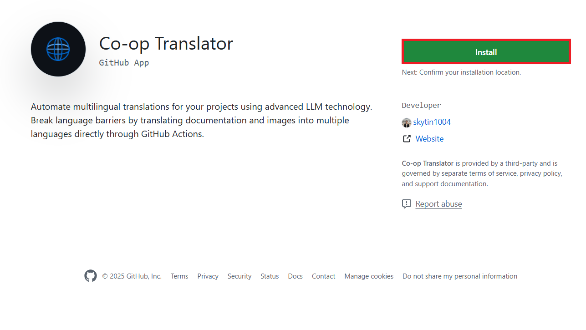

<!--
CO_OP_TRANSLATOR_METADATA:
{
  "original_hash": "9fac847815936ef6e6c8bfde6d191571",
  "translation_date": "2025-10-15T02:09:02+00:00",
  "source_file": "getting_started/github-actions-guide/github-actions-guide-org.md",
  "language_code": "fr"
}
-->
# Utilisation de l’Action GitHub Co-op Translator (Guide pour les organisations)

**Public visé :** Ce guide s’adresse aux **utilisateurs internes de Microsoft** ou aux **équipes disposant des identifiants nécessaires pour l’application GitHub Co-op Translator préconfigurée** ou pouvant créer leur propre application GitHub personnalisée.

Automatisez la traduction de la documentation de votre dépôt en toute simplicité grâce à l’Action GitHub Co-op Translator. Ce guide vous explique comment configurer l’action pour créer automatiquement des pull requests avec les traductions mises à jour dès que vos fichiers Markdown sources ou images sont modifiés.

> [!IMPORTANT]
> 
> **Choisir le bon guide :**
>
> Ce guide explique la configuration à l’aide d’un **ID d’application GitHub et d’une clé privée**. Vous aurez généralement besoin de cette méthode « Guide pour les organisations » si : **`GITHUB_TOKEN` Permissions restreintes :** Les paramètres de votre organisation ou de votre dépôt restreignent les autorisations par défaut accordées au `GITHUB_TOKEN` standard. Plus précisément, si le `GITHUB_TOKEN` n’a pas les autorisations `write` nécessaires (comme `contents: write` ou `pull-requests: write`), le workflow du [Guide de configuration public](./github-actions-guide-public.md) échouera par manque d’autorisations. Utiliser une application GitHub dédiée avec des autorisations explicitement accordées permet de contourner cette limitation.
>
> **Si ce qui précède ne s’applique pas à vous :**
>
> Si le `GITHUB_TOKEN` standard dispose des autorisations suffisantes dans votre dépôt (c’est-à-dire que vous n’êtes pas bloqué par des restrictions organisationnelles), veuillez utiliser le **[Guide de configuration public utilisant GITHUB_TOKEN](./github-actions-guide-public.md)**. Le guide public ne nécessite pas d’obtenir ou de gérer des ID d’application ou des clés privées et s’appuie uniquement sur le `GITHUB_TOKEN` standard et les autorisations du dépôt.

## Prérequis

Avant de configurer l’Action GitHub, assurez-vous de disposer des identifiants nécessaires pour le service d’IA.

**1. Obligatoire : Identifiants du modèle de langage IA**  
Vous devez disposer des identifiants pour au moins un modèle de langage pris en charge :

- **Azure OpenAI** : Nécessite un endpoint, une clé API, des noms de modèle/déploiement, une version d’API.
- **OpenAI** : Nécessite une clé API, (optionnel : ID d’organisation, URL de base, ID de modèle).
- Voir [Modèles et services pris en charge](../../../../README.md) pour plus de détails.
- Guide de configuration : [Configurer Azure OpenAI](../set-up-resources/set-up-azure-openai.md).

**2. Optionnel : Identifiants Computer Vision (pour la traduction d’images)**

- Nécessaire uniquement si vous souhaitez traduire du texte dans des images.
- **Azure Computer Vision** : Nécessite un endpoint et une clé d’abonnement.
- Si non fourni, l’action fonctionne en [mode Markdown uniquement](../markdown-only-mode.md).
- Guide de configuration : [Configurer Azure Computer Vision](../set-up-resources/set-up-azure-computer-vision.md).

## Configuration

Suivez ces étapes pour configurer l’Action GitHub Co-op Translator dans votre dépôt :

### Étape 1 : Installer et configurer l’authentification via une application GitHub

Le workflow utilise l’authentification via une application GitHub pour interagir de manière sécurisée avec votre dépôt (par exemple, créer des pull requests) en votre nom. Choisissez une option :

#### **Option A : Installer l’application GitHub Co-op Translator préconfigurée (pour usage interne Microsoft)**

1. Rendez-vous sur la page de l’[application GitHub Co-op Translator](https://github.com/apps/co-op-translator).

1. Sélectionnez **Installer** et choisissez le compte ou l’organisation où se trouve votre dépôt cible.

    

1. Choisissez **Sélectionner uniquement certains dépôts** et sélectionnez votre dépôt cible (par exemple, `PhiCookBook`). Cliquez sur **Installer**. Une authentification peut être demandée.

    

1. **Obtenir les identifiants de l’application (procédure interne requise) :** Pour permettre au workflow de s’authentifier en tant qu’application, vous avez besoin de deux informations fournies par l’équipe Co-op Translator :
  - **App ID :** L’identifiant unique de l’application Co-op Translator. L’App ID est : `1164076`.
  - **Clé privée :** Vous devez obtenir le **contenu complet** du fichier clé privée `.pem` auprès du contact mainteneur. **Traitez cette clé comme un mot de passe et gardez-la en sécurité.**

1. Passez à l’étape 2.

#### **Option B : Utiliser votre propre application GitHub personnalisée**

- Si vous le souhaitez, vous pouvez créer et configurer votre propre application GitHub. Assurez-vous qu’elle dispose d’un accès en lecture et écriture au contenu et aux pull requests. Vous aurez besoin de son App ID et d’une clé privée générée.

### Étape 2 : Configurer les secrets du dépôt

Vous devez ajouter les identifiants de l’application GitHub et ceux de votre service d’IA en tant que secrets chiffrés dans les paramètres de votre dépôt.

1. Accédez à votre dépôt GitHub cible (par exemple, `PhiCookBook`).

1. Allez dans **Settings** > **Secrets and variables** > **Actions**.

1. Sous **Repository secrets**, cliquez sur **New repository secret** pour chaque secret listé ci-dessous.

   

**Secrets obligatoires (pour l’authentification via l’application GitHub) :**

| Nom du secret         | Description                                         | Source de la valeur                              |
| :------------------- | :-------------------------------------------------- | :----------------------------------------------- |
| `GH_APP_ID`          | L’App ID de l’application GitHub (étape 1).         | Paramètres de l’application GitHub               |
| `GH_APP_PRIVATE_KEY` | **Contenu complet** du fichier `.pem` téléchargé.   | Fichier `.pem` (étape 1)                         |

**Secrets pour le service d’IA (ajoutez TOUS ceux qui s’appliquent selon vos prérequis) :**

| Nom du secret                         | Description                                   | Source de la valeur                |
| :------------------------------------ | :-------------------------------------------- | :--------------------------------- |
| `AZURE_AI_SERVICE_API_KEY`            | Clé pour Azure AI Service (Computer Vision)   | Azure AI Foundry                   |
| `AZURE_AI_SERVICE_ENDPOINT`           | Endpoint pour Azure AI Service (Computer Vision) | Azure AI Foundry                |
| `AZURE_OPENAI_API_KEY`                | Clé pour le service Azure OpenAI              | Azure AI Foundry                   |
| `AZURE_OPENAI_ENDPOINT`               | Endpoint pour le service Azure OpenAI         | Azure AI Foundry                   |
| `AZURE_OPENAI_MODEL_NAME`             | Nom de votre modèle Azure OpenAI              | Azure AI Foundry                   |
| `AZURE_OPENAI_CHAT_DEPLOYMENT_NAME`   | Nom de déploiement Azure OpenAI               | Azure AI Foundry                   |
| `AZURE_OPENAI_API_VERSION`            | Version d’API pour Azure OpenAI               | Azure AI Foundry                   |
| `OPENAI_API_KEY`                      | Clé API pour OpenAI                           | Plateforme OpenAI                  |
| `OPENAI_ORG_ID`                       | ID d’organisation OpenAI                      | Plateforme OpenAI                  |
| `OPENAI_CHAT_MODEL_ID`                | ID de modèle OpenAI spécifique                | Plateforme OpenAI                  |
| `OPENAI_BASE_URL`                     | URL de base personnalisée pour l’API OpenAI   | Plateforme OpenAI                  |


### Étape 3 : Créer le fichier de workflow

Enfin, créez le fichier YAML qui définit le workflow automatisé.

1. À la racine de votre dépôt, créez le dossier `.github/workflows/` s’il n’existe pas déjà.

1. À l’intérieur de `.github/workflows/`, créez un fichier nommé `co-op-translator.yml`.

1. Collez le contenu suivant dans co-op-translator.yml.

```
name: Co-op Translator

on:
  push:
    branches:
      - main

jobs:
  co-op-translator:
    runs-on: ubuntu-latest

    permissions:
      contents: write
      pull-requests: write

    steps:
      - name: Checkout repository
        uses: actions/checkout@v4
        with:
          fetch-depth: 0

      - name: Set up Python
        uses: actions/setup-python@v4
        with:
          python-version: '3.10'

      - name: Install Co-op Translator
        run: |
          python -m pip install --upgrade pip
          pip install co-op-translator

      - name: Run Co-op Translator
        env:
          PYTHONIOENCODING: utf-8
          # Azure AI Service Credentials
          AZURE_AI_SERVICE_API_KEY: ${{ secrets.AZURE_AI_SERVICE_API_KEY }}
          AZURE_AI_SERVICE_ENDPOINT: ${{ secrets.AZURE_AI_SERVICE_ENDPOINT }}

          # Azure OpenAI Credentials
          AZURE_OPENAI_API_KEY: ${{ secrets.AZURE_OPENAI_API_KEY }}
          AZURE_OPENAI_ENDPOINT: ${{ secrets.AZURE_OPENAI_ENDPOINT }}
          AZURE_OPENAI_MODEL_NAME: ${{ secrets.AZURE_OPENAI_MODEL_NAME }}
          AZURE_OPENAI_CHAT_DEPLOYMENT_NAME: ${{ secrets.AZURE_OPENAI_CHAT_DEPLOYMENT_NAME }}
          AZURE_OPENAI_API_VERSION: ${{ secrets.AZURE_OPENAI_API_VERSION }}

          # OpenAI Credentials
          OPENAI_API_KEY: ${{ secrets.OPENAI_API_KEY }}
          OPENAI_ORG_ID: ${{ secrets.OPENAI_ORG_ID }}
          OPENAI_CHAT_MODEL_ID: ${{ secrets.OPENAI_CHAT_MODEL_ID }}
          OPENAI_BASE_URL: ${{ secrets.OPENAI_BASE_URL }}
        run: |
          # =====================================================================
          # IMPORTANT: Set your target languages here (REQUIRED CONFIGURATION)
          # =====================================================================
          # Example: Translate to Spanish, French, German. Add -y to auto-confirm.
          translate -l "es fr de" -y  # <--- MODIFY THIS LINE with your desired languages

      - name: Authenticate GitHub App
        id: generate_token
        uses: tibdex/github-app-token@v1
        with:
          app_id: ${{ secrets.GH_APP_ID }}
          private_key: ${{ secrets.GH_APP_PRIVATE_KEY }}

      - name: Create Pull Request with translations
        uses: peter-evans/create-pull-request@v5
        with:
          token: ${{ steps.generate_token.outputs.token }}
          commit-message: "🌐 Update translations via Co-op Translator"
          title: "🌐 Update translations via Co-op Translator"
          body: |
            This PR updates translations for recent changes to the main branch.

            ### 📋 Changes included
            - Translated contents are available in the `translations/` directory
            - Translated images are available in the `translated_images/` directory

            ---
            🌐 Automatically generated by the [Co-op Translator](https://github.com/Azure/co-op-translator) GitHub Action.
          branch: update-translations
          base: main
          labels: translation, automated-pr
          delete-branch: true
          add-paths: |
            translations/
            translated_images/

```

4.  **Personnaliser le workflow :**
  - **[!IMPORTANT] Langues cibles :** Dans l’étape `Run Co-op Translator`, vous **DEVEZ vérifier et modifier la liste des codes de langue** dans la commande `translate -l "..." -y` pour qu’elle corresponde aux besoins de votre projet. La liste d’exemple (`ar de es...`) doit être remplacée ou ajustée.
  - **Déclencheur (`on:`) :** Le déclencheur actuel s’exécute à chaque push sur `main`. Pour les grands dépôts, envisagez d’ajouter un filtre `paths:` (voir l’exemple commenté dans le YAML) pour n’exécuter le workflow que lorsque les fichiers pertinents (par exemple, la documentation source) sont modifiés, afin d’économiser des minutes de runner.
  - **Détails de la PR :** Personnalisez le `commit-message`, le `title`, le `body`, le nom de la `branch` et les `labels` dans l’étape `Create Pull Request` si besoin.

## Gestion et renouvellement des identifiants

- **Sécurité :** Stockez toujours les identifiants sensibles (clés API, clés privées) en tant que secrets GitHub Actions. Ne les exposez jamais dans votre fichier de workflow ou dans le code du dépôt.
- **[!IMPORTANT] Renouvellement des clés (utilisateurs internes Microsoft) :** Notez que la clé Azure OpenAI utilisée en interne chez Microsoft peut être soumise à une politique de renouvellement obligatoire (par exemple, tous les 5 mois). Veillez à mettre à jour les secrets GitHub correspondants (`AZURE_OPENAI_...`) **avant leur expiration** pour éviter l’échec des workflows.

## Exécution du workflow

> [!WARNING]  
> **Limite de temps des runners hébergés par GitHub :**  
> Les runners hébergés par GitHub comme `ubuntu-latest` ont une **durée d’exécution maximale de 6 heures**.  
> Pour les grands dépôts de documentation, si le processus de traduction dépasse 6 heures, le workflow sera automatiquement interrompu.  
> Pour éviter cela, vous pouvez :  
> - Utiliser un **runner auto-hébergé** (pas de limite de temps)  
> - Réduire le nombre de langues cibles par exécution

Une fois le fichier `co-op-translator.yml` fusionné dans votre branche principale (ou la branche spécifiée dans le déclencheur `on:`), le workflow s’exécutera automatiquement à chaque modification poussée sur cette branche (et correspondant au filtre `paths`, si configuré).

Si des traductions sont générées ou mises à jour, l’action créera automatiquement une Pull Request contenant les modifications, prête à être relue et fusionnée.

---

**Avertissement** :  
Ce document a été traduit à l’aide du service de traduction IA [Co-op Translator](https://github.com/Azure/co-op-translator). Bien que nous nous efforcions d’assurer l’exactitude, veuillez noter que les traductions automatisées peuvent comporter des erreurs ou des imprécisions. Le document original dans sa langue d’origine doit être considéré comme la source faisant autorité. Pour les informations critiques, il est recommandé de recourir à une traduction humaine professionnelle. Nous déclinons toute responsabilité en cas de malentendus ou d’interprétations erronées résultant de l’utilisation de cette traduction.