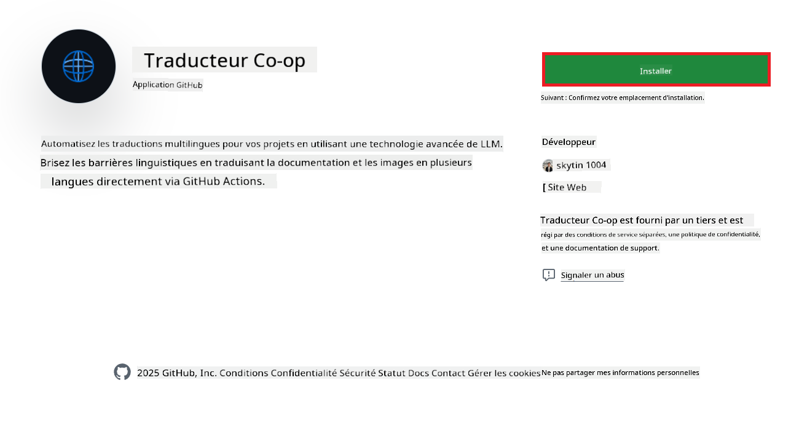
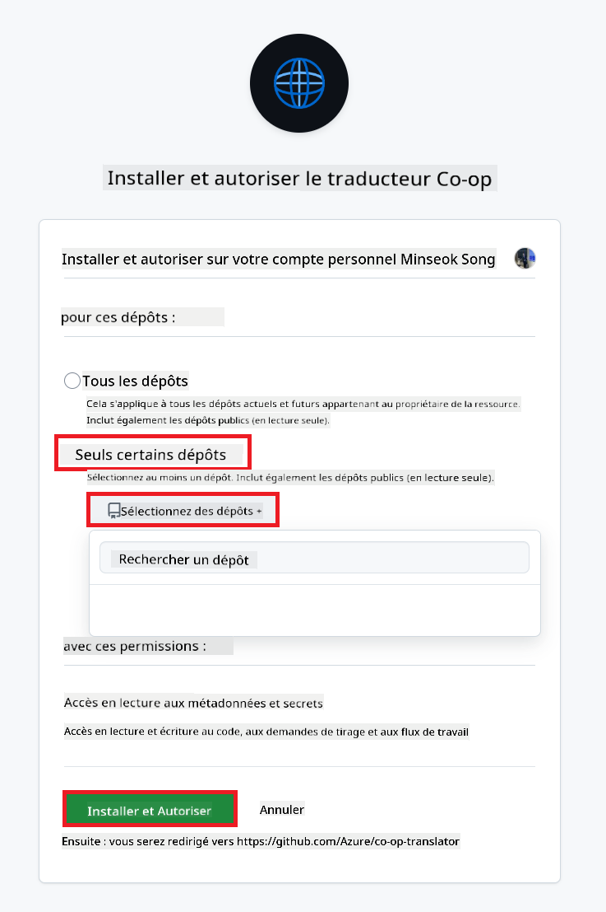
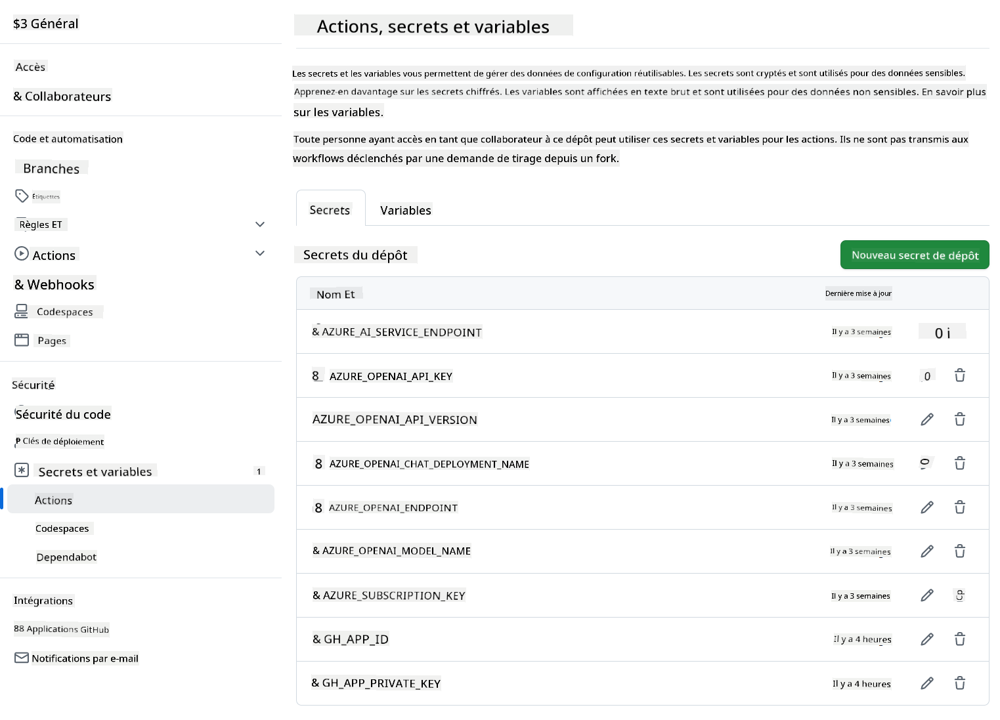

<!--
CO_OP_TRANSLATOR_METADATA:
{
  "original_hash": "c437820027c197f25fb2cbee95bae28c",
  "translation_date": "2025-06-12T18:59:13+00:00",
  "source_file": "getting_started/github-actions-guide/github-actions-guide-org.md",
  "language_code": "fr"
}
-->
# Utilisation de l’action GitHub Co-op Translator (Guide pour les organisations)

**Public cible :** Ce guide s’adresse aux **utilisateurs internes Microsoft** ou aux **équipes disposant des identifiants nécessaires pour l’application GitHub Co-op Translator préconfigurée** ou pouvant créer leur propre application GitHub personnalisée.

Automatisez la traduction de la documentation de votre dépôt facilement grâce à l’action GitHub Co-op Translator. Ce guide vous accompagne dans la configuration de l’action pour créer automatiquement des pull requests avec les traductions mises à jour dès que vos fichiers Markdown source ou images changent.

> [!IMPORTANT]
> 
> **Choisir le guide approprié :**
>
> Ce guide détaille la configuration utilisant un **ID d’application GitHub et une clé privée**. Vous aurez généralement besoin de cette méthode "Guide pour les organisations" si : **`GITHUB_TOKEN` Permissions restreintes :** Les paramètres de votre organisation ou dépôt limitent les permissions par défaut accordées au `GITHUB_TOKEN` standard. Plus précisément, si le `GITHUB_TOKEN` ne dispose pas des permissions `write` nécessaires (comme `contents: write` ou `pull-requests: write`), le workflow décrit dans le [Guide de configuration publique](./github-actions-guide-public.md) échouera faute de permissions suffisantes. Utiliser une application GitHub dédiée avec des permissions explicitement accordées contourne cette limitation.
>
> **Si ce qui précède ne s’applique pas à vous :**
>
> Si le `GITHUB_TOKEN` standard dispose de permissions suffisantes dans votre dépôt (c’est-à-dire que vous n’êtes pas bloqué par des restrictions organisationnelles), veuillez utiliser le **[Guide de configuration publique avec GITHUB_TOKEN](./github-actions-guide-public.md)**. Ce guide public ne nécessite pas d’obtenir ou gérer des ID d’application ou clés privées et s’appuie uniquement sur le `GITHUB_TOKEN` standard et les permissions du dépôt.

## Prérequis

Avant de configurer l’action GitHub, assurez-vous de disposer des identifiants nécessaires pour les services IA.

**1. Obligatoire : Identifiants du modèle de langage IA**  
Vous devez disposer des identifiants pour au moins un modèle de langage supporté :

- **Azure OpenAI** : nécessite Endpoint, clé API, noms de modèle/déploiement, version API.  
- **OpenAI** : nécessite clé API, (optionnel : ID organisation, URL de base, ID modèle).  
- Consultez [Modèles et services supportés](../../../../README.md) pour plus de détails.  
- Guide d’installation : [Configurer Azure OpenAI](../set-up-resources/set-up-azure-openai.md).

**2. Optionnel : Identifiants Computer Vision (pour la traduction d’images)**

- Nécessaire uniquement si vous souhaitez traduire le texte contenu dans des images.  
- **Azure Computer Vision** : nécessite Endpoint et clé d’abonnement.  
- Si non fourni, l’action fonctionnera en [mode Markdown uniquement](../markdown-only-mode.md).  
- Guide d’installation : [Configurer Azure Computer Vision](../set-up-resources/set-up-azure-computer-vision.md).

## Installation et configuration

Suivez ces étapes pour configurer l’action GitHub Co-op Translator dans votre dépôt :

### Étape 1 : Installer et configurer l’authentification via l’application GitHub

Le workflow utilise l’authentification par application GitHub pour interagir en toute sécurité avec votre dépôt (par exemple, créer des pull requests) en votre nom. Choisissez une des options :

#### **Option A : Installer l’application GitHub Co-op Translator préconfigurée (usage interne Microsoft)**

1. Rendez-vous sur la page de l’[application GitHub Co-op Translator](https://github.com/apps/co-op-translator).

1. Sélectionnez **Installer** et choisissez le compte ou l’organisation où se trouve votre dépôt cible.

    

1. Choisissez **Sélectionner uniquement des dépôts** et sélectionnez votre dépôt cible (ex. `PhiCookBook`). Cliquez sur **Installer**. Une authentification peut vous être demandée.

    

1. **Obtenez les identifiants de l’application (processus interne requis) :** Pour que le workflow puisse s’authentifier en tant qu’application, vous devez obtenir deux informations fournies par l’équipe Co-op Translator :  
  - **App ID :** l’identifiant unique de l’application Co-op Translator. L’App ID est : `1164076`.  
  - **Clé privée :** vous devez obtenir le **contenu complet** du fichier de clé privée `.pem` auprès du contact responsable. **Traitez cette clé comme un mot de passe et conservez-la en sécurité.**

1. Passez à l’étape 2.

#### **Option B : Utiliser votre propre application GitHub personnalisée**

- Si vous préférez, vous pouvez créer et configurer votre propre application GitHub. Assurez-vous qu’elle dispose des accès Lecture & écriture sur Contents et Pull requests. Vous aurez besoin de son App ID et d’une clé privée générée.

### Étape 2 : Configurer les secrets du dépôt

Vous devez ajouter les identifiants de l’application GitHub ainsi que ceux de vos services IA en tant que secrets chiffrés dans les paramètres de votre dépôt.

1. Accédez à votre dépôt GitHub cible (ex. `PhiCookBook`).

1. Allez dans **Settings** > **Secrets and variables** > **Actions**.

1. Sous **Repository secrets**, cliquez sur **New repository secret** pour chaque secret listé ci-dessous.

   

**Secrets obligatoires (pour l’authentification via l’application GitHub) :**

| Nom du secret         | Description                                     | Source de la valeur                              |
| :-------------------- | :---------------------------------------------- | :----------------------------------------------- |
| `GH_APP_ID`          | L’App ID de l’application GitHub (étape 1).    | Paramètres de l’application GitHub               |
| `GH_APP_PRIVATE_KEY` | Le **contenu complet** du fichier `.pem` téléchargé. | Fichier `.pem` (étape 1)              |

**Secrets pour les services IA (ajoutez TOUS ceux qui s’appliquent selon vos prérequis) :**

| Nom du secret                         | Description                              | Source de la valeur                |
| :----------------------------------- | :------------------------------------- | :------------------------------- |
| `AZURE_SUBSCRIPTION_KEY`            | Clé pour le service Azure AI (Computer Vision) | Azure AI Foundry                   |
| `AZURE_AI_SERVICE_ENDPOINT`         | Endpoint pour le service Azure AI (Computer Vision) | Azure AI Foundry                   |
| `AZURE_OPENAI_API_KEY`              | Clé pour le service Azure OpenAI           | Azure AI Foundry                   |
| `AZURE_OPENAI_ENDPOINT`             | Endpoint pour le service Azure OpenAI      | Azure AI Foundry                   |
| `AZURE_OPENAI_MODEL_NAME`           | Nom de votre modèle Azure OpenAI            | Azure AI Foundry                   |
| `AZURE_OPENAI_CHAT_DEPLOYMENT_NAME` | Nom de votre déploiement Azure OpenAI        | Azure AI Foundry                   |
| `AZURE_OPENAI_API_VERSION`          | Version API pour Azure OpenAI                | Azure AI Foundry                   |
| `OPENAI_API_KEY`                    | Clé API pour OpenAI                         | Plateforme OpenAI                 |
| `OPENAI_ORG_ID`                     | ID d’organisation OpenAI                    | Plateforme OpenAI                 |
| `OPENAI_CHAT_MODEL_ID`              | ID spécifique du modèle OpenAI               | Plateforme OpenAI                 |
| `OPENAI_BASE_URL`                   | URL de base personnalisée de l’API OpenAI   | Plateforme OpenAI                 |



### Étape 3 : Créer le fichier de workflow

Enfin, créez le fichier YAML qui définit le workflow automatisé.

1. À la racine de votre dépôt, créez le répertoire `.github/workflows/` s’il n’existe pas.

1. Dans `.github/workflows/`, créez un fichier nommé `co-op-translator.yml`.

1. Collez-y le contenu suivant.

```
name: Co-op Translator

on:
  push:
    branches:
      - main

jobs:
  co-op-translator:
    runs-on: ubuntu-latest

    permissions:
      contents: write
      pull-requests: write

    steps:
      - name: Checkout repository
        uses: actions/checkout@v4
        with:
          fetch-depth: 0

      - name: Set up Python
        uses: actions/setup-python@v4
        with:
          python-version: '3.10'

      - name: Install Co-op Translator
        run: |
          python -m pip install --upgrade pip
          pip install co-op-translator

      - name: Run Co-op Translator
        env:
          PYTHONIOENCODING: utf-8
          # Azure AI Service Credentials
          AZURE_SUBSCRIPTION_KEY: ${{ secrets.AZURE_SUBSCRIPTION_KEY }}
          AZURE_AI_SERVICE_ENDPOINT: ${{ secrets.AZURE_AI_SERVICE_ENDPOINT }}

          # Azure OpenAI Credentials
          AZURE_OPENAI_API_KEY: ${{ secrets.AZURE_OPENAI_API_KEY }}
          AZURE_OPENAI_ENDPOINT: ${{ secrets.AZURE_OPENAI_ENDPOINT }}
          AZURE_OPENAI_MODEL_NAME: ${{ secrets.AZURE_OPENAI_MODEL_NAME }}
          AZURE_OPENAI_CHAT_DEPLOYMENT_NAME: ${{ secrets.AZURE_OPENAI_CHAT_DEPLOYMENT_NAME }}
          AZURE_OPENAI_API_VERSION: ${{ secrets.AZURE_OPENAI_API_VERSION }}

          # OpenAI Credentials
          OPENAI_API_KEY: ${{ secrets.OPENAI_API_KEY }}
          OPENAI_ORG_ID: ${{ secrets.OPENAI_ORG_ID }}
          OPENAI_CHAT_MODEL_ID: ${{ secrets.OPENAI_CHAT_MODEL_ID }}
          OPENAI_BASE_URL: ${{ secrets.OPENAI_BASE_URL }}
        run: |
          # =====================================================================
          # IMPORTANT: Set your target languages here (REQUIRED CONFIGURATION)
          # =====================================================================
          # Example: Translate to Spanish, French, German. Add -y to auto-confirm.
          translate -l "es fr de" -y  # <--- MODIFY THIS LINE with your desired languages

      - name: Authenticate GitHub App
        id: generate_token
        uses: tibdex/github-app-token@v1
        with:
          app_id: ${{ secrets.GH_APP_ID }}
          private_key: ${{ secrets.GH_APP_PRIVATE_KEY }}

      - name: Create Pull Request with translations
        uses: peter-evans/create-pull-request@v5
        with:
          token: ${{ steps.generate_token.outputs.token }}
          commit-message: "🌐 Update translations via Co-op Translator"
          title: "🌐 Update translations via Co-op Translator"
          body: |
            This PR updates translations for recent changes to the main branch.

            ### 📋 Changes included
            - Translated contents are available in the `translations/` directory
            - Translated images are available in the `translated_images/` directory

            ---
            🌐 Automatically generated by the [Co-op Translator](https://github.com/Azure/co-op-translator) GitHub Action.
          branch: update-translations
          base: main
          labels: translation, automated-pr
          delete-branch: true
          add-paths: |
            translations/
            translated_images/

```

4.  **Personnalisez le workflow :**  
  - **[!IMPORTANT] Langues cibles :** Dans la commande `Run Co-op Translator` step, you **MUST review and modify the list of language codes** within the `translate -l "..." -y` command to match your project's requirements. The example list (`ar de es...`) needs to be replaced or adjusted.
  - **Trigger (`on:`):** The current trigger runs on every push to `main`. For large repositories, consider adding a `paths:` filter (see commented example in the YAML) to run the workflow only when relevant files (e.g., source documentation) change, saving runner minutes.
  - **PR Details:** Customize the `commit-message`, `title`, `body`, `branch` name, and `labels` in the `Create Pull Request` step if needed.

## Credential Management and Renewal

- **Security:** Always store sensitive credentials (API keys, private keys) as GitHub Actions secrets. Never expose them in your workflow file or repository code.
- **[!IMPORTANT] Key Renewal (Internal Microsoft Users):** Be aware that Azure OpenAI key used within Microsoft might have a mandatory renewal policy (e.g., every 5 months). Ensure you update the corresponding GitHub secrets (`AZURE_OPENAI_...` avant leur expiration pour éviter des échecs du workflow.

## Exécution du workflow

Une fois le fichier `co-op-translator.yml` fusionné dans votre branche principale (ou la branche spécifiée dans le filtre `on:` trigger), the workflow will automatically run whenever changes are pushed to that branch (and match the `paths`, si configuré).

Si des traductions sont générées ou mises à jour, l’action créera automatiquement une Pull Request contenant les modifications, prête à être examinée et fusionnée.

**Avertissement** :  
Ce document a été traduit à l’aide du service de traduction automatique [Co-op Translator](https://github.com/Azure/co-op-translator). Bien que nous nous efforçons d’assurer l’exactitude, veuillez noter que les traductions automatiques peuvent contenir des erreurs ou des inexactitudes. Le document original dans sa langue d’origine doit être considéré comme la source faisant foi. Pour les informations critiques, il est recommandé de recourir à une traduction professionnelle réalisée par un humain. Nous déclinons toute responsabilité en cas de malentendus ou de mauvaises interprétations résultant de l’utilisation de cette traduction.