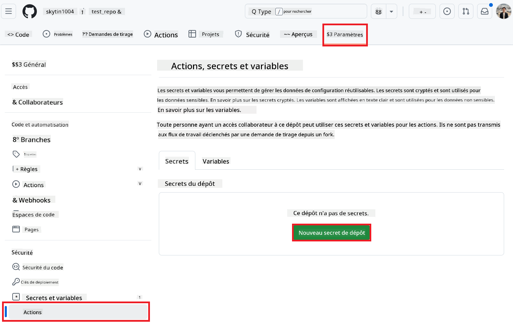
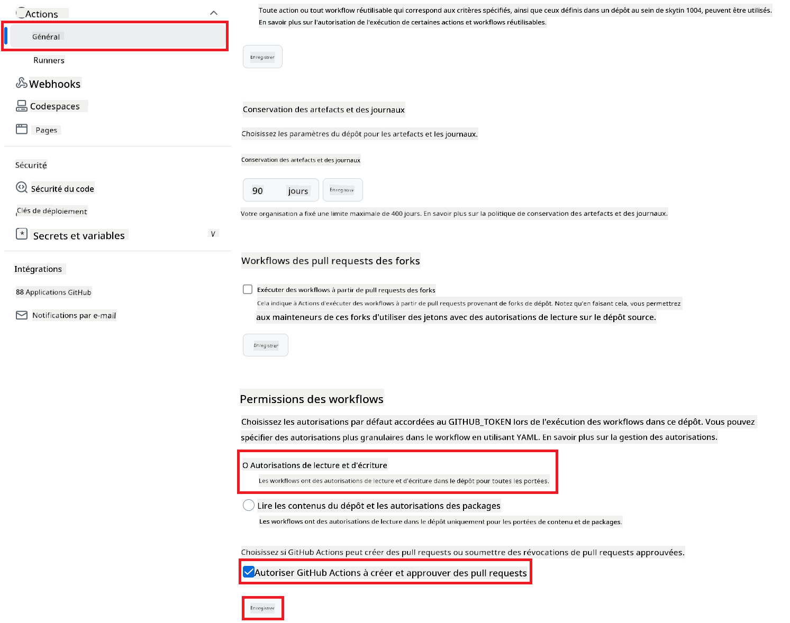

<!--
CO_OP_TRANSLATOR_METADATA:
{
  "original_hash": "a52587a512e667f70d92db853d3c61d5",
  "translation_date": "2025-06-12T19:20:49+00:00",
  "source_file": "getting_started/github-actions-guide/github-actions-guide-public.md",
  "language_code": "fr"
}
-->
# Utilisation de l’action GitHub Co-op Translator (Configuration publique)

**Public cible :** Ce guide s’adresse aux utilisateurs de la plupart des dépôts publics ou privés où les permissions standard de GitHub Actions sont suffisantes. Il utilise le `GITHUB_TOKEN` intégré.

Automatisez la traduction de la documentation de votre dépôt en toute simplicité grâce à l’action GitHub Co-op Translator. Ce guide vous explique comment configurer l’action pour créer automatiquement des pull requests avec des traductions mises à jour dès que vos fichiers source Markdown ou images changent.

> [!IMPORTANT]
>
> **Choisir le bon guide :**
>
> Ce guide détaille la **configuration la plus simple utilisant le `GITHUB_TOKEN` standard**. C’est la méthode recommandée pour la plupart des utilisateurs car elle ne nécessite pas de gérer des clés privées sensibles d’une GitHub App.
>

## Prérequis

Avant de configurer l’action GitHub, assurez-vous d’avoir les identifiants nécessaires pour les services d’IA.

**1. Obligatoire : Identifiants du modèle de langage IA**  
Vous devez disposer des identifiants d’au moins un modèle de langage supporté :

- **Azure OpenAI** : nécessite Endpoint, clé API, noms de modèle/déploiement, version API.  
- **OpenAI** : nécessite clé API, (optionnel : ID organisation, URL de base, ID modèle).  
- Consultez [Supported Models and Services](../../../../README.md) pour plus de détails.

**2. Optionnel : Identifiants AI Vision (pour la traduction d’images)**

- Nécessaire uniquement si vous souhaitez traduire du texte dans des images.  
- **Azure AI Vision** : nécessite Endpoint et clé d’abonnement.  
- Si non fournis, l’action bascule en [mode Markdown uniquement](../markdown-only-mode.md).

## Configuration et mise en place

Suivez ces étapes pour configurer l’action GitHub Co-op Translator dans votre dépôt en utilisant le `GITHUB_TOKEN` standard.

### Étape 1 : Comprendre l’authentification (avec `GITHUB_TOKEN`)

Ce workflow utilise le `GITHUB_TOKEN` intégré fourni par GitHub Actions. Ce token accorde automatiquement les permissions nécessaires au workflow pour interagir avec votre dépôt selon les réglages configurés à l’**Étape 3**.

### Étape 2 : Configurer les secrets du dépôt

Vous devez simplement ajouter vos **identifiants des services IA** en tant que secrets chiffrés dans les paramètres de votre dépôt.

1.  Rendez-vous dans le dépôt GitHub cible.  
2.  Allez dans **Settings** > **Secrets and variables** > **Actions**.  
3.  Sous **Repository secrets**, cliquez sur **New repository secret** pour chaque secret requis listé ci-dessous.

     *(Référence image : montre où ajouter les secrets)*

**Secrets requis pour les services IA (ajoutez TOUS ceux qui s’appliquent selon vos prérequis) :**

| Nom du secret                      | Description                               | Source de la valeur               |
| :-------------------------------- | :---------------------------------------- | :------------------------------- |
| `AZURE_SUBSCRIPTION_KEY`            | Clé pour Azure AI Service (Computer Vision)  | Votre Azure AI Foundry               |
| `AZURE_AI_SERVICE_ENDPOINT`         | Endpoint pour Azure AI Service (Computer Vision) | Votre Azure AI Foundry               |
| `AZURE_OPENAI_API_KEY`              | Clé pour le service Azure OpenAI              | Votre Azure AI Foundry               |
| `AZURE_OPENAI_ENDPOINT`             | Endpoint pour le service Azure OpenAI         | Votre Azure AI Foundry               |
| `AZURE_OPENAI_MODEL_NAME`           | Nom de votre modèle Azure OpenAI              | Votre Azure AI Foundry               |
| `AZURE_OPENAI_CHAT_DEPLOYMENT_NAME` | Nom de votre déploiement Azure OpenAI         | Votre Azure AI Foundry               |
| `AZURE_OPENAI_API_VERSION`          | Version API pour Azure OpenAI              | Votre Azure AI Foundry               |
| `OPENAI_API_KEY`                    | Clé API pour OpenAI                        | Votre plateforme OpenAI              |
| `OPENAI_ORG_ID`                     | ID organisation OpenAI (optionnel)         | Votre plateforme OpenAI              |
| `OPENAI_CHAT_MODEL_ID`              | ID modèle OpenAI spécifique (optionnel)       | Votre plateforme OpenAI              |
| `OPENAI_BASE_URL`                   | URL de base API OpenAI personnalisée (optionnel)     | Votre plateforme OpenAI              |

### Étape 3 : Configurer les permissions du workflow

L’action GitHub nécessite que le `GITHUB_TOKEN` ait les permissions pour récupérer le code et créer des pull requests.

1.  Dans votre dépôt, allez dans **Settings** > **Actions** > **General**.  
2.  Descendez jusqu’à la section **Workflow permissions**.  
3.  Sélectionnez **Read and write permissions**. Cela donne au `GITHUB_TOKEN` les permissions `contents: write` et `pull-requests: write` nécessaires pour ce workflow.  
4.  Vérifiez que la case **Allow GitHub Actions to create and approve pull requests** est **cochée**.  
5.  Cliquez sur **Save**.



### Étape 4 : Créer le fichier de workflow

Enfin, créez le fichier YAML qui définit le workflow automatisé utilisant `GITHUB_TOKEN`.

1.  À la racine de votre dépôt, créez le répertoire `.github/workflows/` s’il n’existe pas.  
2.  Dans `.github/workflows/`, créez un fichier nommé `co-op-translator.yml`.  
3.  Collez le contenu suivant dans `co-op-translator.yml`.

```yaml
name: Co-op Translator

on:
  push:
    branches:
      - main

jobs:
  co-op-translator:
    runs-on: ubuntu-latest

    permissions:
      contents: write
      pull-requests: write

    steps:
      - name: Checkout repository
        uses: actions/checkout@v4
        with:
          fetch-depth: 0

      - name: Set up Python
        uses: actions/setup-python@v4
        with:
          python-version: '3.10'

      - name: Install Co-op Translator
        run: |
          python -m pip install --upgrade pip
          pip install co-op-translator

      - name: Run Co-op Translator
        env:
          PYTHONIOENCODING: utf-8
          # === AI Service Credentials ===
          AZURE_SUBSCRIPTION_KEY: ${{ secrets.AZURE_SUBSCRIPTION_KEY }}
          AZURE_AI_SERVICE_ENDPOINT: ${{ secrets.AZURE_AI_SERVICE_ENDPOINT }}
          AZURE_OPENAI_API_KEY: ${{ secrets.AZURE_OPENAI_API_KEY }}
          AZURE_OPENAI_ENDPOINT: ${{ secrets.AZURE_OPENAI_ENDPOINT }}
          AZURE_OPENAI_MODEL_NAME: ${{ secrets.AZURE_OPENAI_MODEL_NAME }}
          AZURE_OPENAI_CHAT_DEPLOYMENT_NAME: ${{ secrets.AZURE_OPENAI_CHAT_DEPLOYMENT_NAME }}
          AZURE_OPENAI_API_VERSION: ${{ secrets.AZURE_OPENAI_API_VERSION }}
          OPENAI_API_KEY: ${{ secrets.OPENAI_API_KEY }}
          OPENAI_ORG_ID: ${{ secrets.OPENAI_ORG_ID }}
          OPENAI_CHAT_MODEL_ID: ${{ secrets.OPENAI_CHAT_MODEL_ID }}
          OPENAI_BASE_URL: ${{ secrets.OPENAI_BASE_URL }}
        run: |
          # =====================================================================
          # IMPORTANT: Set your target languages here (REQUIRED CONFIGURATION)
          # =====================================================================
          # Example: Translate to Spanish, French, German. Add -y to auto-confirm.
          translate -l "es fr de" -y  # <--- MODIFY THIS LINE with your desired languages

      - name: Create Pull Request with translations
        uses: peter-evans/create-pull-request@v5
        with:
          token: ${{ secrets.GITHUB_TOKEN }}
          commit-message: "🌐 Update translations via Co-op Translator"
          title: "🌐 Update translations via Co-op Translator"
          body: |
            This PR updates translations for recent changes to the main branch.

            ### 📋 Changes included
            - Translated contents are available in the `translations/` directory
            - Translated images are available in the `translated_images/` directory

            ---
            🌐 Automatically generated by the [Co-op Translator](https://github.com/Azure/co-op-translator) GitHub Action.
          branch: update-translations
          base: main
          labels: translation, automated-pr
          delete-branch: true
          add-paths: |
            translations/
            translated_images/
```  
4.  **Personnalisez le workflow :**  
  - **[!IMPORTANT] Langues cibles :** Dans l’étape `Run Co-op Translator` step, you **MUST review and modify the list of language codes** within the `translate -l "..." -y` command to match your project's requirements. The example list (`ar de es...`) needs to be replaced or adjusted.
  - **Trigger (`on:`):** The current trigger runs on every push to `main`. For large repositories, consider adding a `paths:` filter (see commented example in the YAML) to run the workflow only when relevant files (e.g., source documentation) change, saving runner minutes.
  - **PR Details:** Customize the `commit-message`, `title`, `body`, `branch` name, and `labels` in the `Create Pull Request` si nécessaire.

**Avertissement** :  
Ce document a été traduit à l'aide du service de traduction automatique [Co-op Translator](https://github.com/Azure/co-op-translator). Bien que nous nous efforcions d'assurer l'exactitude, veuillez noter que les traductions automatiques peuvent contenir des erreurs ou des inexactitudes. Le document original dans sa langue d'origine doit être considéré comme la source faisant foi. Pour les informations critiques, une traduction professionnelle humaine est recommandée. Nous déclinons toute responsabilité en cas de malentendus ou de mauvaises interprétations résultant de l'utilisation de cette traduction.