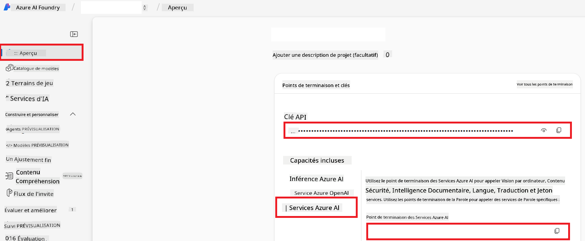

<!--
CO_OP_TRANSLATOR_METADATA:
{
  "original_hash": "b58d7c3cb4210697a073d20eb3064945",
  "translation_date": "2025-06-12T11:44:55+00:00",
  "source_file": "getting_started/set-up-azure-ai.md",
  "language_code": "fr"
}
-->
# Configurer Azure AI pour Co-op Translator (Azure OpenAI & Azure AI Vision)

Ce guide vous explique comment configurer Azure OpenAI pour la traduction linguistique et Azure Computer Vision pour l’analyse de contenu d’image (qui peut ensuite être utilisée pour la traduction basée sur l’image) au sein d’Azure AI Foundry.

**Prérequis :**
- Un compte Azure avec un abonnement actif.
- Les autorisations suffisantes pour créer des ressources et des déploiements dans votre abonnement Azure.

## Créer un projet Azure AI

Commencez par créer un projet Azure AI, qui sert de centre de gestion pour vos ressources IA.

1. Rendez-vous sur [https://ai.azure.com](https://ai.azure.com) et connectez-vous avec votre compte Azure.

1. Sélectionnez **+Create** pour créer un nouveau projet.

1. Effectuez les opérations suivantes :
   - Saisissez un **Nom de projet** (par exemple, `CoopTranslator-Project`).
   - Sélectionnez le **AI hub** (par exemple, `CoopTranslator-Hub`) (Créez-en un nouveau si nécessaire).

1. Cliquez sur "**Review and Create**" pour configurer votre projet. Vous serez redirigé vers la page d’aperçu de votre projet.

## Configurer Azure OpenAI pour la traduction linguistique

Dans votre projet, vous allez déployer un modèle Azure OpenAI qui servira de backend pour la traduction de texte.

### Accéder à votre projet

Si ce n’est pas déjà fait, ouvrez votre projet nouvellement créé (par exemple, `CoopTranslator-Project`) dans Azure AI Foundry.

### Déployer un modèle OpenAI

1. Dans le menu de gauche de votre projet, sous "My assets", sélectionnez "**Models + endpoints**".

1. Sélectionnez **+ Deploy model**.

1. Choisissez **Deploy Base Model**.

1. Une liste de modèles disponibles s’affichera. Filtrez ou recherchez un modèle GPT adapté. Nous recommandons `gpt-4o`.

1. Sélectionnez le modèle souhaité et cliquez sur **Confirm**.

1. Cliquez sur **Deploy**.

### Configuration Azure OpenAI

Une fois déployé, vous pouvez sélectionner le déploiement depuis la page "**Models + endpoints**" pour retrouver son **URL de point de terminaison REST**, sa **clé**, son **nom de déploiement**, son **nom de modèle** et sa **version d’API**. Ces informations seront nécessaires pour intégrer le modèle de traduction à votre application.

> [!NOTE]
> Vous pouvez choisir les versions d’API depuis la page [API version deprecation](https://learn.microsoft.com/azure/ai-services/openai/api-version-deprecation) selon vos besoins. Notez que la **version d’API** est différente de la **version de modèle** affichée sur la page **Models + endpoints** dans Azure AI Foundry.

## Configurer Azure Computer Vision pour la traduction d’images

Pour permettre la traduction du texte contenu dans les images, vous devez récupérer la clé API et le point de terminaison du service Azure AI.

1. Accédez à votre projet Azure AI (par exemple, `CoopTranslator-Project`). Assurez-vous d’être sur la page d’aperçu du projet.

### Configuration du service Azure AI

Récupérez la clé API et le point de terminaison depuis le service Azure AI.

1. Accédez à votre projet Azure AI (par exemple, `CoopTranslator-Project`). Assurez-vous d’être sur la page d’aperçu du projet.

1. Trouvez la **clé API** et le **point de terminaison** dans l’onglet Azure AI Service.

    

Cette connexion rend les capacités de la ressource Azure AI Services associée (y compris l’analyse d’image) disponibles pour votre projet AI Foundry. Vous pouvez ensuite utiliser cette connexion dans vos notebooks ou applications pour extraire du texte des images, qui pourra ensuite être envoyé au modèle Azure OpenAI pour traduction.

## Consolider vos identifiants

À ce stade, vous devriez avoir rassemblé les éléments suivants :

**Pour Azure OpenAI (Traduction de texte) :**
- Endpoint Azure OpenAI
- Clé API Azure OpenAI
- Nom du modèle Azure OpenAI (par exemple, `gpt-4o`)
- Nom du déploiement Azure OpenAI (par exemple, `cooptranslator-gpt4o`)
- Version d’API Azure OpenAI

**Pour Azure AI Services (Extraction de texte d’image via Vision) :**
- Endpoint Azure AI Service
- Clé API Azure AI Service

### Exemple : Configuration des variables d’environnement (Aperçu)

Plus tard, lors de la création de votre application, vous configurerez probablement ces informations en variables d’environnement comme suit :

```bash
# Azure AI Service Credentials (Required for image translation)
AZURE_AI_SERVICE_API_KEY="your_azure_ai_service_api_key" # e.g., 21xasd...
AZURE_AI_SERVICE_ENDPOINT="https://your_azure_ai_service_endpoint.cognitiveservices.azure.com/"

# Azure OpenAI Credentials (Required for text translation)
AZURE_OPENAI_API_KEY="your_azure_openai_api_key" # e.g., 21xasd...
AZURE_OPENAI_ENDPOINT="https://your_azure_openai_endpoint.openai.azure.com/"
AZURE_OPENAI_MODEL_NAME="your_model_name" # e.g., gpt-4o
AZURE_OPENAI_CHAT_DEPLOYMENT_NAME="your_deployment_name" # e.g., cooptranslator-gpt4o
AZURE_OPENAI_API_VERSION="your_api_version" # e.g., 2024-12-01-preview
```

---

### Lectures complémentaires

- [Comment créer un projet dans Azure AI Foundry](https://learn.microsoft.com/azure/ai-foundry/how-to/create-projects?tabs=ai-studio)
- [Comment créer des ressources Azure AI](https://learn.microsoft.com/azure/ai-foundry/how-to/create-azure-ai-resource?tabs=portal)
- [Comment déployer des modèles OpenAI dans Azure AI Foundry](https://learn.microsoft.com/en-us/azure/ai-foundry/how-to/deploy-models-openai)

**Avertissement** :  
Ce document a été traduit à l’aide du service de traduction automatique [Co-op Translator](https://github.com/Azure/co-op-translator). Bien que nous nous efforcions d’assurer l’exactitude, veuillez noter que les traductions automatiques peuvent contenir des erreurs ou des inexactitudes. Le document original dans sa langue d’origine doit être considéré comme la source faisant foi. Pour les informations critiques, une traduction professionnelle réalisée par un humain est recommandée. Nous déclinons toute responsabilité en cas de malentendus ou d’interprétations erronées résultant de l’utilisation de cette traduction.