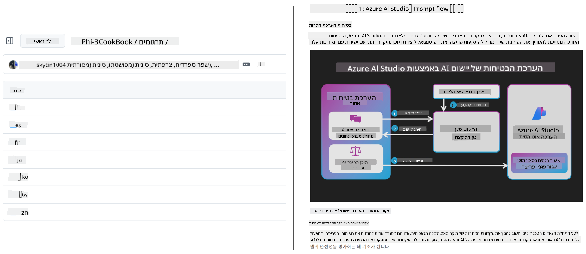
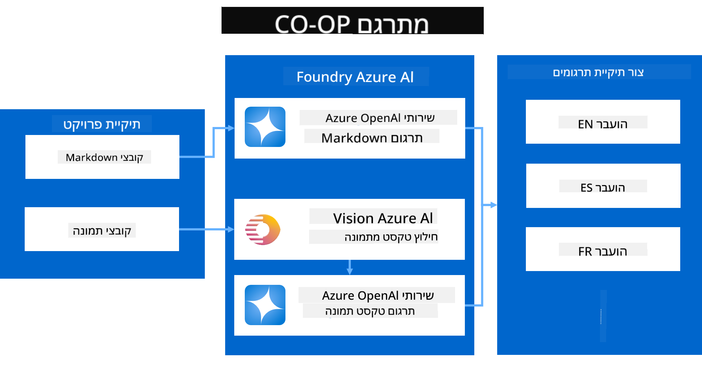
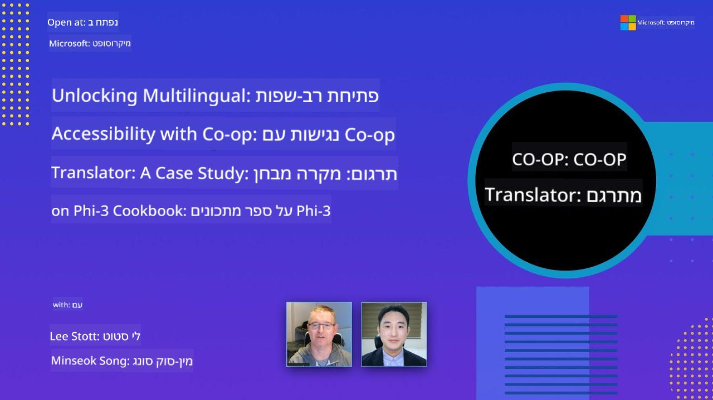

<!--
CO_OP_TRANSLATOR_METADATA:
{
  "original_hash": "044724537b57868117aadae8e7728c7c",
  "translation_date": "2025-06-12T10:39:07+00:00",
  "source_file": "README.md",
  "language_code": "he"
}
-->


# Co-op Translator: לתרגם בקלות תיעוד חינוכי באופן אוטומטי

_אוטומציה פשוטה של תרגום התיעוד שלך למספר שפות כדי להגיע לקהל עולמי._

[](https://pypi.org/project/co-op-translator/)
[](https://github.com/azure/co-op-translator/blob/main/LICENSE)
[](https://pepy.tech/project/co-op-translator)
[](https://pepy.tech/project/co-op-translator)
[](https://github.com/psf/black)

[](https://GitHub.com/azure/co-op-translator/graphs/contributors/)
[](https://GitHub.com/azure/co-op-translator/issues/)
[](https://GitHub.com/azure/co-op-translator/pulls/)
[](http://makeapullrequest.com)

### תמיכה בשפות מופעלת על ידי Co-op Translator

> [!NOTE]
> אלה התרגומים הנוכחיים של תוכן המאגר הזה. לרשימה מלאה של השפות הנתמכות על ידי Co-op Translator, ראה את הסעיף [Language Support](../..).

[](https://GitHub.com/azure/co-op-translator/watchers/)
[](https://GitHub.com/azure/co-op-translator/network/)
[](https://GitHub.com/azure/co-op-translator/stargazers/)

[](https://discord.com/invite/ByRwuEEgH4)

[](https://codespaces.new/azure/co-op-translator)
[](https://vscode.dev/redirect?url=vscode://ms-vscode-remote.remote-containers/cloneInVolume?url=https://github.com/azure/co-op-translator)

## סקירה כללית: הפשט את תהליך תרגום התוכן החינוכי שלך

מחסומי שפה מקשים משמעותית על הגישה למשאבים חינוכיים חשובים ולידע טכני עבור לומדים ומפתחים ברחבי העולם. זה מגביל את ההשתתפות ומאט את קצב החדשנות והלמידה הגלובלית.

**Co-op Translator** נולד מתוך הצורך לטפל בתהליך התרגום הידני הבלתי יעיל לסדרות החינוך הרחבות של מיקרוסופט (כמו מדריכי "למתחילים"). הוא התפתח לכלי חזק ונוח לשימוש שנועד לפרוץ את המחסומים האלה עבור כולם. באמצעות תרגומים אוטומטיים איכותיים דרך CLI ו-GitHub Actions, Co-op Translator מאפשר למורים, תלמידים, חוקרים ומפתחים ברחבי העולם לשתף ולקבל ידע ללא מגבלות שפה.

ראה כיצד Co-op Translator מארגן תוכן חינוכי מתורגם:



קבצי Markdown וטקסט בתמונות מתורגמים אוטומטית ומאורגנים באופן מסודר בתיקיות לפי שפה.

**פתח גישה גלובלית לתוכן החינוכי שלך עם Co-op Translator כבר היום!**

## תמיכה בגישה גלובלית למשאבי הלמידה של מיקרוסופט

Co-op Translator עוזר לגשר על פער השפה ביוזמות החינוך המרכזיות של מיקרוסופט, ומאוטומט את תהליך התרגום עבור מאגרים שמשרתים קהילת מפתחים גלובלית. דוגמאות שמשתמשות כיום ב-Co-op Translator כוללות:

[](https://github.com/microsoft/Generative-AI-for-beginners)
[](https://github.com/microsoft/ML-For-Beginners)
[](https://github.com/microsoft/AI-For-Beginners)
[](https://github.com/microsoft/ai-agents-for-beginners)
[](https://github.com/microsoft/PhiCookBook)
[](https://github.com/microsoft/Generative-AI-for-beginners-dotnet)

## תכונות מרכזיות

- **תרגומים אוטומטיים**: תרגום טקסט למספר שפות בקלות.
- **אינטגרציה עם GitHub Actions**: אוטומציה של תרגומים כחלק מצינור ה-CI/CD שלך.
- **שימור Markdown**: שמירה על תחביר Markdown תקין במהלך התרגום.
- **תרגום טקסט בתמונות**: חילוץ ותרגום טקסט מתוך תמונות.
- **טכנולוגיית LLM מתקדמת**: שימוש במודלי שפה חדישים לתרגומים איכותיים.
- **אינטגרציה פשוטה**: שילוב חלק עם תצורת הפרויקט הקיימת שלך.
- **פישוט לוקליזציה**: הפשטת תהליך הלוקליזציה של הפרויקט לשווקים בינלאומיים.

## איך זה עובד



Co-op Translator לוקח קבצי Markdown ותמונות מתיקיית הפרויקט שלך ומעבד אותם כך:

1. **חילוץ טקסט**: מחלץ טקסט מקבצי Markdown ואם מוגדר (למשל עם Azure AI Vision), גם מטקסט המוטמע בתוך תמונות.
1. **תרגום בינה מלאכותית**: שולח את הטקסט שחולץ למודל השפה המוגדר (Azure OpenAI, OpenAI וכו') לתרגום.
1. **שמירת תוצאות**: שומר את קבצי Markdown המתורגמים והתמונות (עם הטקסט המתורגם) בתיקיות לפי שפה, תוך שמירה על הפורמט המקורי.

## התחלה מהירה

התחל במהירות עם CLI או הגדר אוטומציה מלאה עם GitHub Actions. בחר את הגישה שהכי מתאימה לך:

1. **שורת פקודה (CLI)** - לתרגומים חד-פעמיים או שליטה ידנית
2. **GitHub Actions** - לתרגומים אוטומטיים בכל דחיפה

> [!NOTE]
> מדריך זה מתמקד במשאבי Azure, אך ניתן להשתמש בכל מודל שפה נתמך.

### תמיכת שפות

Co-op Translator תומך במגוון רחב של שפות כדי לעזור לך להגיע לקהל גלובלי. הנה מה שחשוב לדעת:

#### התייחסות מהירה

| שפה | קוד | שפה | קוד | שפה | קוד |
|------|-----|------|-----|------|-----|
| Arabic | ar | Bengali | bn | Bulgarian | bg |
| Burmese (Myanmar) | my | Chinese (Simplified) | zh | Chinese (Traditional, HK) | hk |
| Chinese (Traditional, Macau) | mo | Chinese (Traditional, TW) | tw | Croatian | hr |
| Czech | cs | Danish | da | Dutch | nl |
| Finnish | fi | French | fr | German | de |
| Greek | el | Hebrew | he | Hindi | hi |
| Hungarian | hu | Indonesian | id | Italian | it |
| Japanese | ja | Korean | ko | Malay | ms |
| Marathi | mr | Nepali | ne | Norwegian | no |
| Persian (Farsi) | fa | Polish | pl | Portuguese (Brazil) | br |
| Portuguese (Portugal) | pt | Punjabi (Gurmukhi) | pa | Romanian | ro |
| Russian | ru | Serbian (Cyrillic) | sr | Slovak | sk |
| Slovenian | sl | Spanish | es | Swahili | sw |
| Swedish | sv | Tagalog (Filipino) | tl | Thai | th |
| Turkish | tr | Ukrainian | uk | Urdu | ur |
| Vietnamese | vi | — | — | — | — |

#### שימוש בקודי שפה

כשמשתמשים ב-Co-op Translator, יש לציין את השפות באמצעות הקודים שלהן. לדוגמה:

```bash
# Translate to French, Spanish, and German
translate -l "fr es de"

# Translate to Chinese (Simplified) and Japanese
translate -l "zh ja"
```

> [!NOTE]
> למידע טכני מפורט על תמיכת שפות, כולל:
>
> - מפרטי פונטים לכל שפה
> - בעיות ידועות
> - איך להוסיף שפות חדשות
>
> ראה את [Supported Languages Documentation](./getting_started/supported-languages.md).

### דגמים ושירותים נתמכים

| סוג                  | שם                           |
|-----------------------|------------------------------|
| מודל שפה              |   |
| AI Vision             |  |

> [!NOTE]
> אם שירות AI Vision אינו זמין, Co-op Translator יעבור למצב [Markdown-only mode](./getting_started/markdown-only-mode.md).

### הגדרה ראשונית

לפני שמתחילים, יש להגדיר את המשאבים הבאים:

1. משאב מודל שפה (חובה):
   - Azure OpenAI (מומלץ) - מספק תרגומים איכותיים עם אמינות ברמת ארגון
   - OpenAI - אופציה חלופית אם אין לך גישה ל-Azure
   - למידע מפורט על דגמים נתמכים, ראה [Supported Models and Services](../..)

1. משאב AI Vision (אופציונלי):
   - Azure AI Vision - מאפשר תרגום טקסט בתוך תמונות
   - אם לא מוגדר, התרגום יעבור אוטומטית למצב [Markdown-only mode](./getting_started/markdown-only-mode.md)
   - מומלץ לפרויקטים עם תמונות המכילות טקסט שצריך לתרגם

1. שלבי קונפיגורציה:
   - עקוב אחרי [מדריך ההגדרה של Azure AI](./getting_started/set-up-azure-ai.md) לקבלת הוראות מפורטות
   - צור קובץ `.env` עם מפתחות API וכתובות ה-endpoints (ראה את הסעיף [Quick Start](../..))
   - ודא שיש לך הרשאות ומכסים מתאימים לשירותים שבחרת

### הכנת הפרויקט לפני תרגום

לפני התחלת תהליך התרגום, בצע את השלבים הבאים להכנת הפרויקט:

1. הכנת README:
   - הוסף טבלה של תרגומים ל-README.md שלך כדי לקשר לגרסאות המתורגמות
   - דוגמה לפורמט:

     ```markdown

     ### 🌐 Multi-Language Support
     
     [French](../fr/README.md) | [Spanish](../es/README.md) | [German](../de/README.md) | [Russian](../ru/README.md) | [Arabic](../ar/README.md) | [Persian (Farsi)](../fa/README.md) | [Urdu](../ur/README.md) | [Chinese (Simplified)](../zh/README.md) | [Chinese (Traditional, Macau)](../mo/README.md) | [Chinese (Traditional, Hong Kong)](../hk/README.md) | [Chinese (Traditional, Taiwan)](../tw/README.md) | [Japanese](../ja/README.md) | [Korean](../ko/README.md) | [Hindi](../hi/README.md) | [Bengali](../bn/README.md) | [Marathi](../mr/README.md) | [Nepali](../ne/README.md) | [Punjabi (Gurmukhi)](../pa/README.md) | [Portuguese (Portugal)](../pt/README.md) | [Portuguese (Brazil)](../br/README.md) | [Italian](../it/README.md) | [Polish](../pl/README.md) | [Turkish](../tr/README.md) | [Greek](../el/README.md) | [Thai](../th/README.md) | [Swedish](../sv/README.md) | [Danish](../da/README.md) | [Norwegian](../no/README.md) | [Finnish](../fi/README.md) | [Dutch](../nl/README.md) | [Hebrew](./README.md) | [Vietnamese](../vi/README.md) | [Indonesian](../id/README.md) | [Malay](../ms/README.md) | [Tagalog (Filipino)](../tl/README.md) | [Swahili](../sw/README.md) | [Hungarian](../hu/README.md) | [Czech](../cs/README.md) | [Slovak](../sk/README.md) | [Romanian](../ro/README.md) | [Bulgarian](../bg/README.md) | [Serbian (Cyrillic)](../sr/README.md) | [Croatian](../hr/README.md) | [Slovenian](../sl/README.md) | [Ukrainian](../uk/README.md) | [Burmese (Myanmar)](../my/README.md) 
    
     ```

1. ניקוי תרגומים קיימים (אם נדרש):
   - הסר תיקיות תרגום קיימות (כגון `translations/`)
   - מחק קבצי תרגום ישנים כדי להתחיל מחדש
   - כך תימנע התנגשויות עם תהליך התרגום החדש

### התחלה מהירה: שורת פקודה

להתחלה מהירה עם שורת הפקודה:

1. צור סביבה וירטואלית:

    ```bash
    python -m venv .venv
    ```

1. הפעל את הסביבה הווירטואלית:

    - ב-Windows:

    ```bash
    .venv\scripts\activate
    ```

    - בלינוקס/macOS:

    ```bash
    source .venv/bin/activate
    ```

1. התקן את החבילה:

    ```bash
    pip install co-op-translator
    ```

1. הגדר הרשאות:

    - צור קובץ `.env` file in your project's root directory.
    - Copy the contents from the [.env.template](../../.env.template) file into your new `.env` file.
    - Fill in the required API keys and endpoint information in your `.env` file.

1. Run Translation:
    - Navigate to your project's root directory in your terminal.
    - Execute the translate command, specifying target languages with the `-l` עם הדגל:

    ```bash
    translate -l "ko ja fr"
    ```

    _(החלף את `"ko ja fr"` with your desired space-separated language codes)_

### Detailed Usage Guides

Choose the approach that best fits your workflow:

#### 1. Using the Command Line (CLI)

- Best for: One-time translations, manual control, or integration into custom scripts.
- Requires: Local installation of Python and the `co-op-translator` package.
- Guide: [Command Line Guide](./getting_started/command-line-guide/command-line-guide.md)

#### 2. Using GitHub Actions (Automation)

- Best for: Automatically translating content whenever changes are pushed to your repository. Keeps translations consistently up-to-date.
- Requires: Setting up a workflow file (`.github/workflows`) במאגר שלך. אין צורך בהתקנה מקומית.
- מדריכים:
  - [GitHub Actions Guide (Public Repositories & Standard Secrets)](./getting_started/github-actions-guide/github-actions-guide-public.md) - השתמש בזה עבור רוב המאגרי הקוד הציבוריים או האישיים המשתמשים בסודות סטנדרטיים של המאגר.
  - [GitHub Actions Guide (Microsoft Organization Repos & Org-Level Setups)](./getting_started/github-actions-guide/github-actions-guide-org.md) - השתמש במדריך זה אם אתה עובד בתוך ארגון Microsoft ב-GitHub או צריך לנצל סודות או ראנרים ברמת הארגון.

### פתרון תקלות וטיפים

- [מדריך פתרון תקלות](./getting_started/troubleshooting.md)

### משאבים נוספים

- [מדריך פקודות](./getting_started/command-reference.md): מדריך מפורט לכל הפקודות והאפשרויות הזמינות.
- [שפות נתמכות](./getting_started/supported-languages.md): בדוק את רשימת השפות הנתמכות והוראות להוספת שפות חדשות.
- [מצב Markdown בלבד](./getting_started/markdown-only-mode.md): איך לתרגם רק טקסט, בלי תרגום תמונות.

## מצגות וידאו

למד עוד על Co-op Translator דרך המצגות שלנו _(לחץ על התמונה למטה לצפייה ביוטיוב)_:

- **Open at Microsoft**: מבוא קצר של 18 דקות ומדריך מהיר לשימוש ב-Co-op Translator.
[](https://www.youtube.com/watch?v=jX_swfH_KNU)

## תמכו בנו וטפחו למידה גלובלית

הצטרפו אלינו למהפכה בדרך שבה תוכן חינוכי משותף ברחבי העולם! תנו ל-[Co-op Translator](https://github.com/azure/co-op-translator) ⭐ ב-GitHub ותמכו במשימתנו לפרוץ מחסומי שפה בלמידה ובטכנולוגיה. העניין שלכם והתרומות שלכם עושים שינוי משמעותי! תרומות קוד והצעות לפיצ'רים תמיד מתקבלות בברכה.

## תרומה לפרויקט

הפרויקט הזה מקבל בברכה תרומות והצעות. מעוניינים לתרום ל-Azure Co-op Translator? אנא עיינו ב-[CONTRIBUTING.md](./CONTRIBUTING.md) לקבלת הנחיות כיצד תוכלו לעזור להפוך את Co-op Translator לנגיש יותר.

## תורמים

[](https://github.com/Azure/co-op-translator/graphs/contributors)

## קוד התנהגות

הפרויקט אימץ את [Microsoft Open Source Code of Conduct](https://opensource.microsoft.com/codeofconduct/).
למידע נוסף ראו את ה-[Code of Conduct FAQ](https://opensource.microsoft.com/codeofconduct/faq/) או
צרו קשר ב-[opencode@microsoft.com](mailto:opencode@microsoft.com) עם שאלות או הערות נוספות.

## בינה מלאכותית אחראית

מיקרוסופט מחויבת לסייע ללקוחותינו להשתמש במוצרי הבינה המלאכותית שלנו באחריות, לשתף את הלקחים שלנו ולבנות שותפויות מבוססות אמון באמצעות כלים כמו Transparency Notes ו-Impact Assessments. משאבים רבים אלה זמינים ב-[https://aka.ms/RAI](https://aka.ms/RAI).
הגישה של מיקרוסופט לבינה מלאכותית אחראית מבוססת על עקרונות הבינה המלאכותית שלנו: הוגנות, אמינות ובטיחות, פרטיות ואבטחה, הכללה, שקיפות ואחריות.

מודלים רחבי היקף של שפה טבעית, תמונות ודיבור – כמו אלו שבדוגמה זו – עלולים לפעול בצורה לא הוגנת, לא אמינה או פוגענית, ולגרום נזקים. אנא עיינו ב-[Azure OpenAI service Transparency note](https://learn.microsoft.com/legal/cognitive-services/openai/transparency-note?tabs=text) כדי להתעדכן בסיכונים ובמגבלות.

הגישה המומלצת להפחתת סיכונים אלו היא לכלול במערכת שלכם מערכת בטיחות שיכולה לזהות ולמנוע התנהגות מזיקה. [Azure AI Content Safety](https://learn.microsoft.com/azure/ai-services/content-safety/overview) מספק שכבת הגנה עצמאית, היכולה לזהות תוכן מזיק שנוצר על ידי משתמשים או על ידי בינה מלאכותית באפליקציות ושירותים. Azure AI Content Safety כוללת APIs לטקסט ותמונות המאפשרים לזהות חומר מזיק. בנוסף, יש לנו Content Safety Studio אינטראקטיבי המאפשר לכם לצפות, לחקור ולנסות דוגמאות קוד לזיהוי תוכן מזיק במגוון מודאליות. [תיעוד התחלה מהירה](https://learn.microsoft.com/azure/ai-services/content-safety/quickstart-text?tabs=visual-studio%2Clinux&pivots=programming-language-rest) מדריך אתכם כיצד לבצע בקשות לשירות.

היבט נוסף שיש לקחת בחשבון הוא ביצועי האפליקציה הכוללים. באפליקציות רב-מודאליות ורב-מודליות, אנו מגדירים ביצועים כהתנהגות המערכת בהתאם לציפיות שלכם ושל המשתמשים, כולל אי יצירת תוצרים מזיקים. חשוב להעריך את ביצועי האפליקציה הכוללת באמצעות [מדדי איכות יצירה וסיכון ובטיחות](https://learn.microsoft.com/azure/ai-studio/concepts/evaluation-metrics-built-in).

ניתן להעריך את אפליקציית הבינה המלאכותית שלכם בסביבת הפיתוח באמצעות [prompt flow SDK](https://microsoft.github.io/promptflow/index.html). עם קובץ נתוני בדיקה או יעד, היצירות של אפליקציית הבינה המלאכותית שלכם נמדדות כמותית באמצעות מעריכים מובנים או מותאמים אישית לבחירתכם. כדי להתחיל עם ה-prompt flow SDK להערכת המערכת, ניתן לעקוב אחרי [מדריך התחלה מהירה](https://learn.microsoft.com/azure/ai-studio/how-to/develop/flow-evaluate-sdk). לאחר הרצת הערכה, ניתן [להציג את התוצאות ב-Azure AI Studio](https://learn.microsoft.com/azure/ai-studio/how-to/evaluate-flow-results).

## סימני מסחר

פרויקט זה עשוי להכיל סימני מסחר או לוגואים של פרויקטים, מוצרים או שירותים. השימוש המורשה בסימני המסחר או בלוגואים של מיקרוסופט כפוף ל-[Microsoft's Trademark & Brand Guidelines](https://www.microsoft.com/en-us/legal/intellectualproperty/trademarks/usage/general).
שימוש בסימני המסחר או בלוגואים של מיקרוסופט בגרסאות מותאמות של פרויקט זה אסור שיגרום לבלבול או ייתן רושם של חסות מצד מיקרוסופט.
שימוש בסימני מסחר או לוגואים של צד שלישי כפוף למדיניות אותם צדדים.

**כתב ויתור**:  
מסמך זה תורגם באמצעות שירות תרגום מבוסס בינה מלאכותית [Co-op Translator](https://github.com/Azure/co-op-translator). למרות שאנו שואפים לדיוק, יש לקחת בחשבון שתרגומים אוטומטיים עלולים להכיל שגיאות או אי-דיוקים. יש להסתמך על המסמך המקורי בשפת המקור כמקור הסמכותי. למידע קריטי מומלץ להשתמש בתרגום מקצועי של אדם. אנו לא נושאים באחריות לכל אי-הבנה או פרשנות שגויה הנובעת משימוש בתרגום זה.