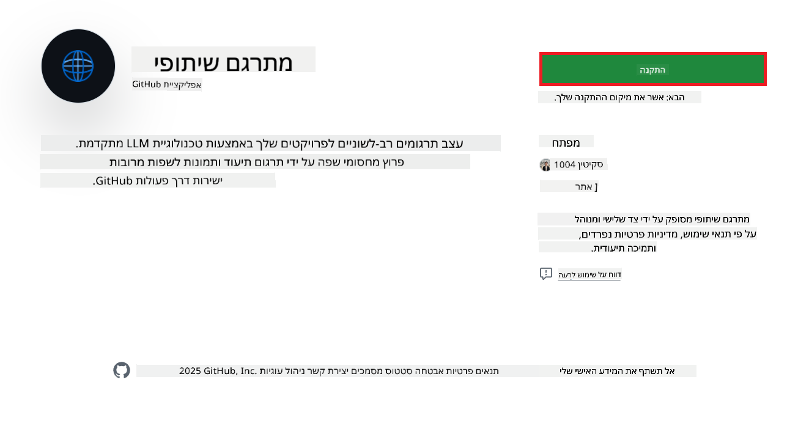
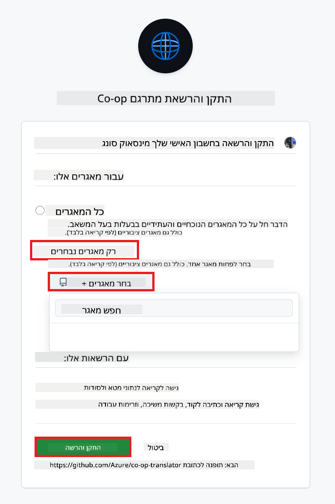
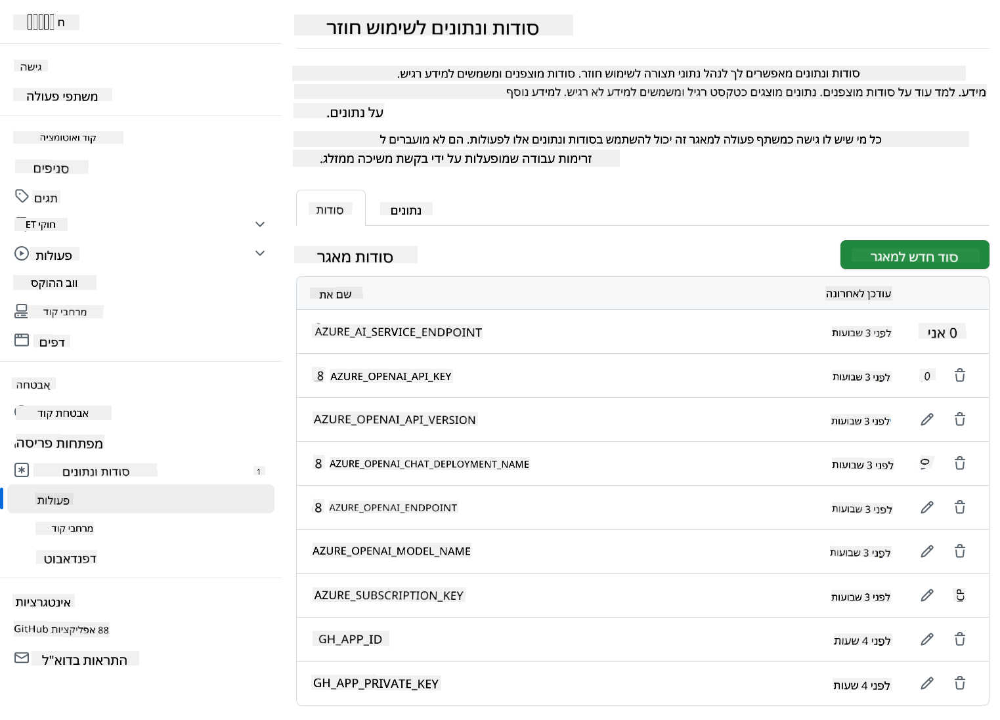

<!--
CO_OP_TRANSLATOR_METADATA:
{
  "original_hash": "c437820027c197f25fb2cbee95bae28c",
  "translation_date": "2025-06-12T19:13:20+00:00",
  "source_file": "getting_started/github-actions-guide/github-actions-guide-org.md",
  "language_code": "he"
}
-->
# שימוש ב-Co-op Translator GitHub Action (מדריך לארגון)

**קהל יעד:** מדריך זה מיועד ל**משתמשים פנימיים של מיקרוסופט** או **לצוותים שיש להם גישה לאישורים הדרושים עבור אפליקציית Co-op Translator המובנית ב-GitHub** או שיכולים ליצור אפליקציית GitHub מותאמת אישית משלהם.

אוטומט את תרגום התיעוד של המאגר שלך בקלות בעזרת Co-op Translator GitHub Action. מדריך זה מלווה אותך בתהליך הגדרת האקשן ליצירת בקשות משיכה אוטומטיות עם תרגומים מעודכנים בכל פעם שקבצי Markdown המקוריים או התמונות משתנים.

> [!IMPORTANT]
> 
> **בחירת המדריך המתאים:**
>
> מדריך זה מפרט את ההגדרה באמצעות **GitHub App ID ומפתח פרטי**. בדרך כלל תזדקק לשיטת "מדריך הארגון" אם: **`GITHUB_TOKEN` הרשאות מוגבלות:** הארגון או הגדרות המאגר שלך מגבילות את ההרשאות המוגדרות כברירת מחדל ל-`GITHUB_TOKEN` הסטנדרטי. במיוחד, אם ל-`GITHUB_TOKEN` אין הרשאות `write` הנדרשות (כמו `contents: write` או `pull-requests: write`), תהליך העבודה במדריך [Public Setup Guide](./github-actions-guide-public.md) ייכשל עקב חוסר הרשאות. שימוש באפליקציית GitHub ייעודית עם הרשאות מפורשות עוקף את המגבלה הזו.
>
> **אם זה לא רלוונטי עבורך:**
>
> אם ל-`GITHUB_TOKEN` הסטנדרטי יש הרשאות מספקות במאגר שלך (כלומר, אין חסימות על ידי הגבלות ארגוניות), אנא השתמש ב**[מדריך ההגדרה הציבורי עם GITHUB_TOKEN](./github-actions-guide-public.md)**. המדריך הציבורי אינו דורש קבלת או ניהול App ID או מפתחות פרטיים ומתבסס רק על הרשאות ה-`GITHUB_TOKEN` הסטנדרטי והמאגר.

## דרישות מוקדמות

לפני הגדרת GitHub Action, ודא שיש ברשותך את האישורים הדרושים לשירותי ה-AI.

**1. דרוש: אישורי מודל שפה מבוסס AI**  
יש צורך באישורים לפחות עבור מודל שפה אחד נתמך:

- **Azure OpenAI**: דורש Endpoint, מפתח API, שמות מודל/פריסה, גרסת API.  
- **OpenAI**: דורש מפתח API, (אופציונלי: מזהה ארגון, URL בסיס, מזהה מודל).  
- עיין ב-[Supported Models and Services](../../../../README.md) לפרטים.  
- מדריך הגדרה: [Set up Azure OpenAI](../set-up-resources/set-up-azure-openai.md).

**2. אופציונלי: אישורי Computer Vision (לתרגום תמונות)**

- דרוש רק אם יש צורך לתרגם טקסט בתוך תמונות.  
- **Azure Computer Vision**: דורש Endpoint ומפתח מנוי.  
- אם לא יסופקו, האקשן יפעל במצב [Markdown בלבד](../markdown-only-mode.md).  
- מדריך הגדרה: [Set up Azure Computer Vision](../set-up-resources/set-up-azure-computer-vision.md).

## הגדרה וקונפיגורציה

עקוב אחרי השלבים הבאים כדי להגדיר את Co-op Translator GitHub Action במאגר שלך:

### שלב 1: התקן והגדר אימות אפליקציית GitHub

תהליך העבודה משתמש באימות אפליקציית GitHub כדי לתקשר בצורה מאובטחת עם המאגר שלך (למשל, ליצירת בקשות משיכה) בשמך. בחר באפשרות אחת:

#### **אפשרות א: התקנת אפליקציית Co-op Translator המובנית (לשימוש פנימי במיקרוסופט)**

1. עבור לעמוד [Co-op Translator GitHub App](https://github.com/apps/co-op-translator).

1. בחר **Install** ובחר את החשבון או הארגון שבו נמצא המאגר הרצוי.

    

1. בחר **Only select repositories** וסמן את המאגר הרצוי (למשל `PhiCookBook`). לחץ על **Install**. ייתכן שתתבקש לאמת.

    

1. **קבל את אישורי האפליקציה (תהליך פנימי נדרש):** כדי לאפשר לאקשן לאמת את עצמו כאפליקציה, עליך לקבל שני פרטים מהצוות של Co-op Translator:  
  - **App ID:** מזהה ייחודי לאפליקציית Co-op Translator. App ID הוא: `1164076`.  
  - **מפתח פרטי:** עליך לקבל את **התוכן המלא** של קובץ המפתח הפרטי `.pem` מהאחראי. **טפל במפתח זה כמו בסיסמה ושמור עליו בקפידה.**

1. המשך לשלב 2.

#### **אפשרות ב: השתמש באפליקציית GitHub מותאמת אישית משלך**

- אם תרצה, תוכל ליצור ולהגדיר אפליקציית GitHub משלך. ודא שיש לה גישה קריאה וכתיבה לתוכן ולקשות משיכה. תזדקק ל-App ID ולמפתח פרטי שנוצר.

### שלב 2: הגדרת סודות המאגר

עליך להוסיף את אישורי אפליקציית GitHub ואת אישורי שירות ה-AI כסודות מוצפנים בהגדרות המאגר שלך.

1. עבור למאגר היעד שלך (למשל `PhiCookBook`).

1. עבור אל **Settings** > **Secrets and variables** > **Actions**.

1. תחת **Repository secrets**, לחץ על **New repository secret** עבור כל סוד מהרשימה הבאה.

   

**סודות דרושים (לאימות אפליקציית GitHub):**

| שם הסוד            | תיאור                                    | מקור הערך                                  |
| :----------------- | :--------------------------------------- | :----------------------------------------- |
| `GH_APP_ID`          | App ID של אפליקציית GitHub (משלב 1).    | הגדרות אפליקציית GitHub                    |
| `GH_APP_PRIVATE_KEY` | **התוכן המלא** של קובץ `.pem` שהורדת. | קובץ `.pem` (משלב 1)             |

**סודות שירות AI (הוסף את כל המתאימים בהתאם לדרישותיך):**

| שם הסוד                         | תיאור                                     | מקור הערך                          |
| :------------------------------ | :---------------------------------------- | :--------------------------------- |
| `AZURE_SUBSCRIPTION_KEY`            | מפתח לשירות Azure AI (Computer Vision)     | Azure AI Foundry                   |
| `AZURE_AI_SERVICE_ENDPOINT`         | Endpoint לשירות Azure AI (Computer Vision)  | Azure AI Foundry                   |
| `AZURE_OPENAI_API_KEY`              | מפתח לשירות Azure OpenAI                   | Azure AI Foundry                   |
| `AZURE_OPENAI_ENDPOINT`             | Endpoint לשירות Azure OpenAI                | Azure AI Foundry                   |
| `AZURE_OPENAI_MODEL_NAME`           | שם המודל שלך ב-Azure OpenAI                  | Azure AI Foundry                   |
| `AZURE_OPENAI_CHAT_DEPLOYMENT_NAME` | שם הפריסה שלך ב-Azure OpenAI                   | Azure AI Foundry                   |
| `AZURE_OPENAI_API_VERSION`          | גרסת API לשירות Azure OpenAI                  | Azure AI Foundry                   |
| `OPENAI_API_KEY`                    | מפתח API לשירות OpenAI                      | OpenAI Platform                   |
| `OPENAI_ORG_ID`                     | מזהה ארגון OpenAI                            | OpenAI Platform                   |
| `OPENAI_CHAT_MODEL_ID`              | מזהה מודל ספציפי ב-OpenAI                    | OpenAI Platform                   |
| `OPENAI_BASE_URL`                   | כתובת בסיס API מותאמת אישית ל-OpenAI         | OpenAI Platform                   |



### שלב 3: צור את קובץ תהליך העבודה

לבסוף, צור את קובץ ה-YAML שמגדיר את תהליך העבודה האוטומטי.

1. בתיקיית השורש של המאגר, צור את התיקייה `.github/workflows/` אם אינה קיימת.

1. בתוך `.github/workflows/`, צור קובץ בשם `co-op-translator.yml`.

1. הדבק את התוכן הבא בקובץ co-op-translator.yml.

```
name: Co-op Translator

on:
  push:
    branches:
      - main

jobs:
  co-op-translator:
    runs-on: ubuntu-latest

    permissions:
      contents: write
      pull-requests: write

    steps:
      - name: Checkout repository
        uses: actions/checkout@v4
        with:
          fetch-depth: 0

      - name: Set up Python
        uses: actions/setup-python@v4
        with:
          python-version: '3.10'

      - name: Install Co-op Translator
        run: |
          python -m pip install --upgrade pip
          pip install co-op-translator

      - name: Run Co-op Translator
        env:
          PYTHONIOENCODING: utf-8
          # Azure AI Service Credentials
          AZURE_SUBSCRIPTION_KEY: ${{ secrets.AZURE_SUBSCRIPTION_KEY }}
          AZURE_AI_SERVICE_ENDPOINT: ${{ secrets.AZURE_AI_SERVICE_ENDPOINT }}

          # Azure OpenAI Credentials
          AZURE_OPENAI_API_KEY: ${{ secrets.AZURE_OPENAI_API_KEY }}
          AZURE_OPENAI_ENDPOINT: ${{ secrets.AZURE_OPENAI_ENDPOINT }}
          AZURE_OPENAI_MODEL_NAME: ${{ secrets.AZURE_OPENAI_MODEL_NAME }}
          AZURE_OPENAI_CHAT_DEPLOYMENT_NAME: ${{ secrets.AZURE_OPENAI_CHAT_DEPLOYMENT_NAME }}
          AZURE_OPENAI_API_VERSION: ${{ secrets.AZURE_OPENAI_API_VERSION }}

          # OpenAI Credentials
          OPENAI_API_KEY: ${{ secrets.OPENAI_API_KEY }}
          OPENAI_ORG_ID: ${{ secrets.OPENAI_ORG_ID }}
          OPENAI_CHAT_MODEL_ID: ${{ secrets.OPENAI_CHAT_MODEL_ID }}
          OPENAI_BASE_URL: ${{ secrets.OPENAI_BASE_URL }}
        run: |
          # =====================================================================
          # IMPORTANT: Set your target languages here (REQUIRED CONFIGURATION)
          # =====================================================================
          # Example: Translate to Spanish, French, German. Add -y to auto-confirm.
          translate -l "es fr de" -y  # <--- MODIFY THIS LINE with your desired languages

      - name: Authenticate GitHub App
        id: generate_token
        uses: tibdex/github-app-token@v1
        with:
          app_id: ${{ secrets.GH_APP_ID }}
          private_key: ${{ secrets.GH_APP_PRIVATE_KEY }}

      - name: Create Pull Request with translations
        uses: peter-evans/create-pull-request@v5
        with:
          token: ${{ steps.generate_token.outputs.token }}
          commit-message: "🌐 Update translations via Co-op Translator"
          title: "🌐 Update translations via Co-op Translator"
          body: |
            This PR updates translations for recent changes to the main branch.

            ### 📋 Changes included
            - Translated contents are available in the `translations/` directory
            - Translated images are available in the `translated_images/` directory

            ---
            🌐 Automatically generated by the [Co-op Translator](https://github.com/Azure/co-op-translator) GitHub Action.
          branch: update-translations
          base: main
          labels: translation, automated-pr
          delete-branch: true
          add-paths: |
            translations/
            translated_images/

```

4.  **התאם אישית את תהליך העבודה:**  
  - **[!IMPORTANT] שפות יעד:** בפקודה `Run Co-op Translator` step, you **MUST review and modify the list of language codes** within the `translate -l "..." -y` command to match your project's requirements. The example list (`ar de es...`) needs to be replaced or adjusted.
  - **Trigger (`on:`):** The current trigger runs on every push to `main`. For large repositories, consider adding a `paths:` filter (see commented example in the YAML) to run the workflow only when relevant files (e.g., source documentation) change, saving runner minutes.
  - **PR Details:** Customize the `commit-message`, `title`, `body`, `branch` name, and `labels` in the `Create Pull Request` step if needed.

## Credential Management and Renewal

- **Security:** Always store sensitive credentials (API keys, private keys) as GitHub Actions secrets. Never expose them in your workflow file or repository code.
- **[!IMPORTANT] Key Renewal (Internal Microsoft Users):** Be aware that Azure OpenAI key used within Microsoft might have a mandatory renewal policy (e.g., every 5 months). Ensure you update the corresponding GitHub secrets (`AZURE_OPENAI_...` יש לעדכן את שפות היעד הרצויות **לפני שפג תוקפן** כדי למנוע כשלים בתהליך העבודה.

## הפעלת תהליך העבודה

לאחר שקובץ `co-op-translator.yml` מאוחד לענף הראשי שלך (או לענף שצויין במסנן `on:` trigger), the workflow will automatically run whenever changes are pushed to that branch (and match the `paths`, אם הוגדר).

אם התרגומים נוצרים או מתעדכנים, האקשן ייצור אוטומטית בקשת משיכה המכילה את השינויים, מוכנה לסקירה ולמיזוג מצדך.

**כתב ויתור**:  
מסמך זה תורגם באמצעות שירות תרגום מבוסס בינה מלאכותית [Co-op Translator](https://github.com/Azure/co-op-translator). למרות שאנו שואפים לדיוק, יש לקחת בחשבון כי תרגומים אוטומטיים עלולים להכיל שגיאות או אי-דיוקים. יש להתייחס למסמך המקורי בשפתו המקורית כמקור הסמכותי. למידע קריטי מומלץ תרגום מקצועי על ידי אדם. אנו לא נושאים באחריות לכל אי-הבנה או פרשנות שגויה הנובעים משימוש בתרגום זה.