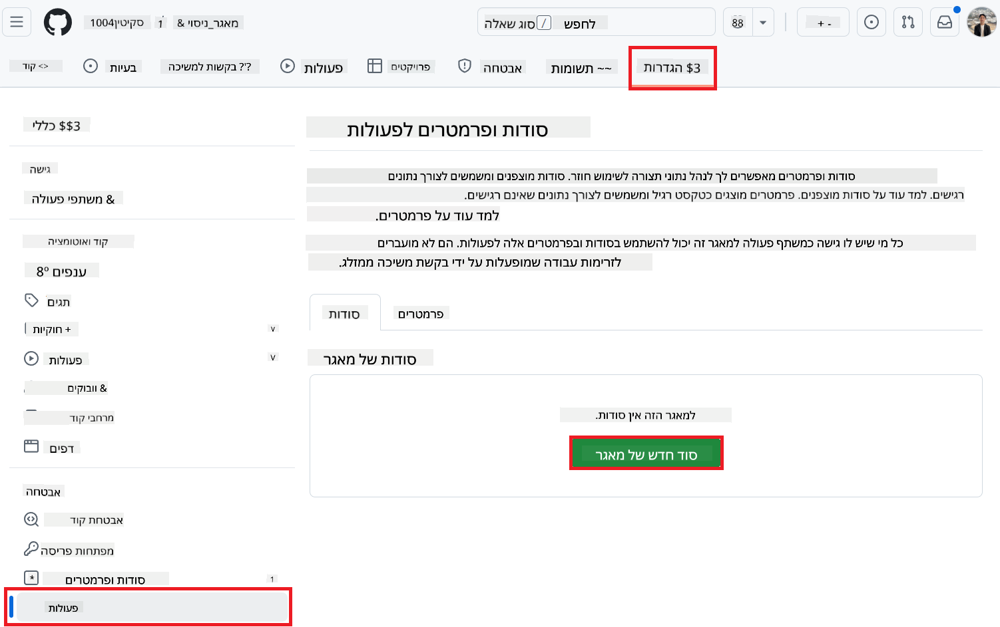
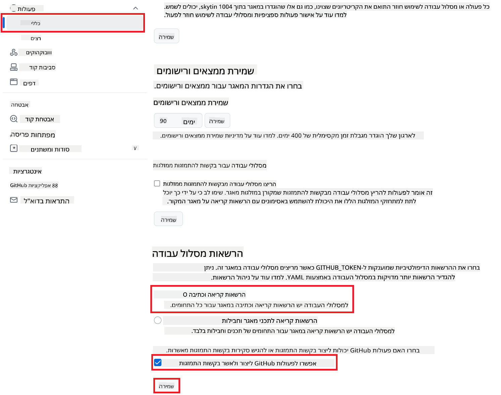

<!--
CO_OP_TRANSLATOR_METADATA:
{
  "original_hash": "a52587a512e667f70d92db853d3c61d5",
  "translation_date": "2025-06-12T19:31:23+00:00",
  "source_file": "getting_started/github-actions-guide/github-actions-guide-public.md",
  "language_code": "he"
}
-->
# שימוש ב-Co-op Translator GitHub Action (הגדרה ציבורית)

**קהל יעד:** מדריך זה מיועד למשתמשים ברוב המאגרי קוד הציבוריים או הפרטיים שבהם ההרשאות הסטנדרטיות של GitHub Actions מספיקות. הוא משתמש ב-`GITHUB_TOKEN` המובנה.

אוטומציה של תרגום התיעוד במאגר שלך בקלות בעזרת Co-op Translator GitHub Action. מדריך זה ילווה אותך בהגדרת האקשן ליצירת בקשות משיכה עם תרגומים מעודכנים אוטומטית בכל פעם שקבצי Markdown או תמונות המקור משתנים.

> [!IMPORTANT]
>
> **בחירת המדריך הנכון:**
>
> מדריך זה מפרט את **ההגדרה הפשוטה יותר באמצעות `GITHUB_TOKEN` הסטנדרטי**. זו השיטה המומלצת לרוב המשתמשים שכן אינה דורשת ניהול מפתחות פרטיים רגישים של אפליקציית GitHub.
>

## דרישות מוקדמות

לפני הגדרת ה-GitHub Action, ודא שיש ברשותך את האישורים הנדרשים לשירותי ה-AI.

**1. דרוש: אישורים למודל שפה מבוסס AI**  
עליך להחזיק באישורים לפחות לאחד מהמודלים הנתמכים:

- **Azure OpenAI**: דורש Endpoint, מפתח API, שמות מודל/פריסה, גרסת API.  
- **OpenAI**: דורש מפתח API, (אופציונלי: מזהה ארגון, כתובת בסיס, מזהה מודל).  
- ראה [Supported Models and Services](../../../../README.md) לפרטים.

**2. אופציונלי: אישורים ל-AI Vision (לתרגום תמונות)**

- דרוש רק אם ברצונך לתרגם טקסט מתוך תמונות.  
- **Azure AI Vision**: דורש Endpoint ומפתח מנוי.  
- אם לא יסופקו, האקשן יעבוד במצב [Markdown בלבד](../markdown-only-mode.md).

## הגדרה וקונפיגורציה

עקוב אחר השלבים הבאים כדי להגדיר את Co-op Translator GitHub Action במאגר שלך באמצעות `GITHUB_TOKEN` הסטנדרטי.

### שלב 1: הבנת האימות (שימוש ב-`GITHUB_TOKEN`)

תהליך העבודה הזה משתמש ב-`GITHUB_TOKEN` המובנה שמסופק על ידי GitHub Actions. טוקן זה מעניק אוטומטית הרשאות לתהליך העבודה לפעול עם המאגר שלך בהתאם להגדרות שבוצעו ב**שלב 3**.

### שלב 2: קביעת סודות המאגר

כל שעליך לעשות הוא להוסיף את **אישורי שירותי ה-AI** כסודות מוצפנים בהגדרות המאגר שלך.

1. עבור למאגר GitHub הרלוונטי.  
2. עבור ל-**Settings** > **Secrets and variables** > **Actions**.  
3. תחת **Repository secrets**, לחץ על **New repository secret** עבור כל סוד שירות AI נדרש מהרשימה למטה.

     *(תמונה להמחשה: מראה היכן להוסיף סודות)*

**סודות שירות AI נדרשים (הוסף את כולם החלים על פי הדרישות שלך):**

| שם הסוד                           | תיאור                                    | מקור הערך                      |
| :-------------------------------- | :---------------------------------------- | :----------------------------- |
| `AZURE_SUBSCRIPTION_KEY`            | מפתח לשירות Azure AI (ראייה ממוחשבת)        | Azure AI Foundry שלך            |
| `AZURE_AI_SERVICE_ENDPOINT`         | Endpoint לשירות Azure AI (ראייה ממוחשבת)      | Azure AI Foundry שלך            |
| `AZURE_OPENAI_API_KEY`              | מפתח לשירות Azure OpenAI                    | Azure AI Foundry שלך            |
| `AZURE_OPENAI_ENDPOINT`             | Endpoint לשירות Azure OpenAI                 | Azure AI Foundry שלך            |
| `AZURE_OPENAI_MODEL_NAME`           | שם מודל Azure OpenAI שלך                       | Azure AI Foundry שלך            |
| `AZURE_OPENAI_CHAT_DEPLOYMENT_NAME` | שם פריסת Azure OpenAI שלך                       | Azure AI Foundry שלך            |
| `AZURE_OPENAI_API_VERSION`          | גרסת API של Azure OpenAI                      | Azure AI Foundry שלך            |
| `OPENAI_API_KEY`                    | מפתח API של OpenAI                          | פלטפורמת OpenAI שלך            |
| `OPENAI_ORG_ID`                     | מזהה ארגון OpenAI (אופציונלי)                 | פלטפורמת OpenAI שלך            |
| `OPENAI_CHAT_MODEL_ID`              | מזהה מודל OpenAI ספציפי (אופציונלי)           | פלטפורמת OpenAI שלך            |
| `OPENAI_BASE_URL`                   | כתובת בסיס API מותאמת אישית של OpenAI (אופציונלי) | פלטפורמת OpenAI שלך            |

### שלב 3: קביעת הרשאות התהליך

ה-GitHub Action דורש הרשאות דרך `GITHUB_TOKEN` כדי למשוך קוד וליצור בקשות משיכה.

1. במאגר שלך, עבור ל-**Settings** > **Actions** > **General**.  
2. גלול למטה אל סעיף **Workflow permissions**.  
3. בחר **Read and write permissions**. פעולה זו מעניקה ל-`GITHUB_TOKEN` את ההרשאות הנדרשות של `contents: write` ו-`pull-requests: write` לתהליך העבודה.  
4. ודא שסמן הסימון עבור **Allow GitHub Actions to create and approve pull requests** מסומן.  
5. לחץ על **Save**.



### שלב 4: יצירת קובץ תהליך העבודה

לבסוף, צור את קובץ ה-YAML שמגדיר את תהליך העבודה האוטומטי באמצעות `GITHUB_TOKEN`.

1. בתיקיית השורש של המאגר שלך, צור את התיקייה `.github/workflows/` אם היא אינה קיימת.  
2. בתוך `.github/workflows/`, צור קובץ בשם `co-op-translator.yml`.  
3. הדבק לתוכו את התוכן הבא.

```yaml
name: Co-op Translator

on:
  push:
    branches:
      - main

jobs:
  co-op-translator:
    runs-on: ubuntu-latest

    permissions:
      contents: write
      pull-requests: write

    steps:
      - name: Checkout repository
        uses: actions/checkout@v4
        with:
          fetch-depth: 0

      - name: Set up Python
        uses: actions/setup-python@v4
        with:
          python-version: '3.10'

      - name: Install Co-op Translator
        run: |
          python -m pip install --upgrade pip
          pip install co-op-translator

      - name: Run Co-op Translator
        env:
          PYTHONIOENCODING: utf-8
          # === AI Service Credentials ===
          AZURE_SUBSCRIPTION_KEY: ${{ secrets.AZURE_SUBSCRIPTION_KEY }}
          AZURE_AI_SERVICE_ENDPOINT: ${{ secrets.AZURE_AI_SERVICE_ENDPOINT }}
          AZURE_OPENAI_API_KEY: ${{ secrets.AZURE_OPENAI_API_KEY }}
          AZURE_OPENAI_ENDPOINT: ${{ secrets.AZURE_OPENAI_ENDPOINT }}
          AZURE_OPENAI_MODEL_NAME: ${{ secrets.AZURE_OPENAI_MODEL_NAME }}
          AZURE_OPENAI_CHAT_DEPLOYMENT_NAME: ${{ secrets.AZURE_OPENAI_CHAT_DEPLOYMENT_NAME }}
          AZURE_OPENAI_API_VERSION: ${{ secrets.AZURE_OPENAI_API_VERSION }}
          OPENAI_API_KEY: ${{ secrets.OPENAI_API_KEY }}
          OPENAI_ORG_ID: ${{ secrets.OPENAI_ORG_ID }}
          OPENAI_CHAT_MODEL_ID: ${{ secrets.OPENAI_CHAT_MODEL_ID }}
          OPENAI_BASE_URL: ${{ secrets.OPENAI_BASE_URL }}
        run: |
          # =====================================================================
          # IMPORTANT: Set your target languages here (REQUIRED CONFIGURATION)
          # =====================================================================
          # Example: Translate to Spanish, French, German. Add -y to auto-confirm.
          translate -l "es fr de" -y  # <--- MODIFY THIS LINE with your desired languages

      - name: Create Pull Request with translations
        uses: peter-evans/create-pull-request@v5
        with:
          token: ${{ secrets.GITHUB_TOKEN }}
          commit-message: "🌐 Update translations via Co-op Translator"
          title: "🌐 Update translations via Co-op Translator"
          body: |
            This PR updates translations for recent changes to the main branch.

            ### 📋 Changes included
            - Translated contents are available in the `translations/` directory
            - Translated images are available in the `translated_images/` directory

            ---
            🌐 Automatically generated by the [Co-op Translator](https://github.com/Azure/co-op-translator) GitHub Action.
          branch: update-translations
          base: main
          labels: translation, automated-pr
          delete-branch: true
          add-paths: |
            translations/
            translated_images/
```  
4. **התאמת תהליך העבודה:**  
  - **[!IMPORTANT] שפות יעד:** בשלב `Run Co-op Translator` step, you **MUST review and modify the list of language codes** within the `translate -l "..." -y` command to match your project's requirements. The example list (`ar de es...`) needs to be replaced or adjusted.
  - **Trigger (`on:`):** The current trigger runs on every push to `main`. For large repositories, consider adding a `paths:` filter (see commented example in the YAML) to run the workflow only when relevant files (e.g., source documentation) change, saving runner minutes.
  - **PR Details:** Customize the `commit-message`, `title`, `body`, `branch` name, and `labels` in the `Create Pull Request` במידת הצורך.

**כתב ויתור**:  
מסמך זה תורגם באמצעות שירות תרגום מבוסס בינה מלאכותית [Co-op Translator](https://github.com/Azure/co-op-translator). למרות שאנו שואפים לדיוק, יש לקחת בחשבון כי תרגומים אוטומטיים עלולים להכיל שגיאות או אי-דיוקים. המסמך המקורי בשפת המקור שלו נחשב למקור הסמכותי. למידע קריטי מומלץ להשתמש בתרגום מקצועי של אדם. איננו אחראים לכל אי-הבנות או פרשנויות שגויות הנובעות מהשימוש בתרגום זה.