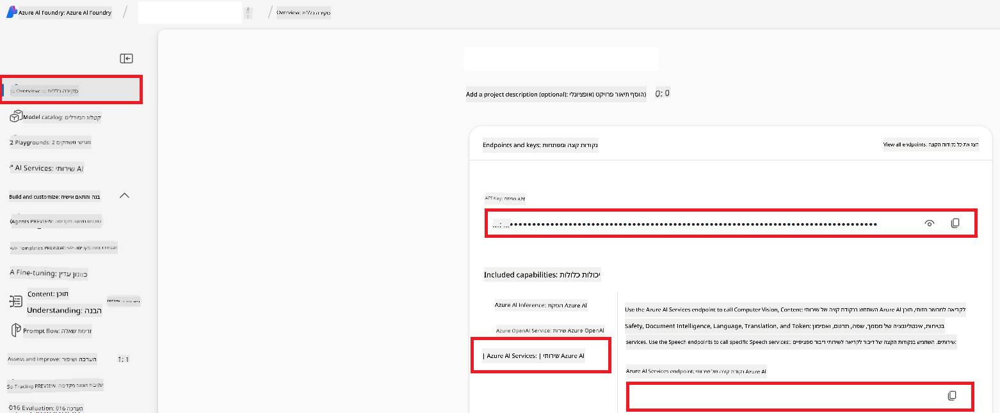

<!--
CO_OP_TRANSLATOR_METADATA:
{
  "original_hash": "b58d7c3cb4210697a073d20eb3064945",
  "translation_date": "2025-06-12T11:55:22+00:00",
  "source_file": "getting_started/set-up-azure-ai.md",
  "language_code": "he"
}
-->
# הקמת Azure AI עבור מתרגם שיתופי (Azure OpenAI ו-Azure AI Vision)

מדריך זה יוביל אותך בהקמת Azure OpenAI לתרגום שפות ו-Azure Computer Vision לניתוח תוכן תמונות (שניתן להשתמש בו לתרגום מבוסס תמונה) בתוך Azure AI Foundry.

**דרישות מוקדמות:**
- חשבון Azure עם מנוי פעיל.
- הרשאות מספיקות ליצירת משאבים ופריסות במנוי ה-Azure שלך.

## יצירת פרויקט Azure AI

תתחיל ביצירת פרויקט Azure AI, שמשמש כמקום מרכזי לניהול משאבי ה-AI שלך.

1. עבור אל [https://ai.azure.com](https://ai.azure.com) והתחבר עם חשבון ה-Azure שלך.

1. בחר **+Create** כדי ליצור פרויקט חדש.

1. בצע את המשימות הבאות:
   - הזן **שם פרויקט** (לדוגמה, `CoopTranslator-Project`).
   - בחר את **AI hub**  (לדוגמה, `CoopTranslator-Hub`) (צור חדש במידת הצורך).

1. לחץ על "**Review and Create**" כדי להקים את הפרויקט. תועבר לדף הסקירה של הפרויקט שלך.

## הקמת Azure OpenAI לתרגום שפות

בתוך הפרויקט שלך, תפרוס מודל Azure OpenAI שישמש כשרת תרגום טקסט.

### ניווט לפרויקט שלך

אם אינך נמצא שם כבר, פתח את הפרויקט החדש שיצרת (לדוגמה, `CoopTranslator-Project`) ב-Azure AI Foundry.

### פריסת מודל OpenAI

1. מתפריט הפרויקט בצד שמאל, תחת "My assets", בחר "**Models + endpoints**".

1. בחר **+ Deploy model**.

1. בחר **Deploy Base Model**.

1. יוצג לך רשימת מודלים זמינים. סנן או חפש מודל GPT מתאים. אנו ממליצים על `gpt-4o`.

1. בחר את המודל הרצוי ולחץ על **Confirm**.

1. בחר **Deploy**.

### קונפיגורציית Azure OpenAI

לאחר הפריסה, תוכל לבחור בפריסה מדף "**Models + endpoints**" כדי למצוא את **כתובת ה-REST endpoint**, **מפתח**, **שם הפריסה**, **שם המודל** ו-**גרסת ה-API**. אלו יידרשו לשילוב מודל התרגום באפליקציה שלך.

> [!NOTE]
> ניתן לבחור גרסאות API מדף [API version deprecation](https://learn.microsoft.com/azure/ai-services/openai/api-version-deprecation) בהתאם לצרכים שלך. שים לב ש**גרסת ה-API** שונה מ**גרסת המודל** שמופיעה בדף **Models + endpoints** ב-Azure AI Foundry.

## הקמת Azure Computer Vision לתרגום תמונות

כדי לאפשר תרגום טקסט מתוך תמונות, עליך למצוא את מפתח ה-API וכתובת ה-Endpoint של שירות Azure AI.

1. עבור לפרויקט Azure AI שלך (לדוגמה, `CoopTranslator-Project`). ודא שאתה בדף סקירת הפרויקט.

### קונפיגורציית שירות Azure AI

מצא את מפתח ה-API ואת כתובת ה-Endpoint משירות Azure AI.

1. עבור לפרויקט Azure AI שלך (לדוגמה, `CoopTranslator-Project`). ודא שאתה בדף סקירת הפרויקט.

1. מצא את **API Key** ו-**Endpoint** בכרטיסיית שירות Azure AI.

    

חיבור זה מאפשר את יכולות משאב שירותי Azure AI המקושר (כולל ניתוח תמונות) לפרויקט שלך ב-AI Foundry. לאחר מכן תוכל להשתמש בחיבור זה במחברות או באפליקציות שלך כדי לחלץ טקסט מתמונות, שניתן לשלוח לאחר מכן למודל Azure OpenAI לתרגום.

## איחוד האישורים שלך

עד כה, עליך לאסוף את הפרטים הבאים:

**עבור Azure OpenAI (תרגום טקסט):**
- כתובת ה-Endpoint של Azure OpenAI
- מפתח ה-API של Azure OpenAI
- שם מודל Azure OpenAI (לדוגמה, `gpt-4o`)
- שם פריסת Azure OpenAI (לדוגמה, `cooptranslator-gpt4o`)
- גרסת API של Azure OpenAI

**עבור שירותי Azure AI (חילוץ טקסט מתמונה באמצעות Vision):**
- כתובת Endpoint של שירות Azure AI
- מפתח ה-API של שירות Azure AI

### דוגמה: קונפיגורציית משתני סביבה (בתצוגה מוקדמת)

בהמשך, כשבונה את האפליקציה שלך, סביר שתגדיר אותה באמצעות האישורים שאספת. לדוגמה, תוכל להגדיר אותם כמשתני סביבה כך:

```bash
# Azure AI Service Credentials (Required for image translation)
AZURE_AI_SERVICE_API_KEY="your_azure_ai_service_api_key" # e.g., 21xasd...
AZURE_AI_SERVICE_ENDPOINT="https://your_azure_ai_service_endpoint.cognitiveservices.azure.com/"

# Azure OpenAI Credentials (Required for text translation)
AZURE_OPENAI_API_KEY="your_azure_openai_api_key" # e.g., 21xasd...
AZURE_OPENAI_ENDPOINT="https://your_azure_openai_endpoint.openai.azure.com/"
AZURE_OPENAI_MODEL_NAME="your_model_name" # e.g., gpt-4o
AZURE_OPENAI_CHAT_DEPLOYMENT_NAME="your_deployment_name" # e.g., cooptranslator-gpt4o
AZURE_OPENAI_API_VERSION="your_api_version" # e.g., 2024-12-01-preview
```

---

### קריאה נוספת

- [כיצד ליצור פרויקט ב-Azure AI Foundry](https://learn.microsoft.com/azure/ai-foundry/how-to/create-projects?tabs=ai-studio)
- [כיצד ליצור משאבי Azure AI](https://learn.microsoft.com/azure/ai-foundry/how-to/create-azure-ai-resource?tabs=portal)
- [כיצד לפרוס מודלי OpenAI ב-Azure AI Foundry](https://learn.microsoft.com/en-us/azure/ai-foundry/how-to/deploy-models-openai)

**כתב ויתור**:  
מסמך זה תורגם באמצעות שירות תרגום מבוסס בינה מלאכותית [Co-op Translator](https://github.com/Azure/co-op-translator). בעוד שאנו שואפים לדיוק, יש לקחת בחשבון כי תרגומים אוטומטיים עלולים להכיל שגיאות או אי-דיוקים. המסמך המקורי בשפת המקור שלו צריך להיחשב כמקור הסמכותי. למידע קריטי, מומלץ להשתמש בתרגום מקצועי על ידי אדם. אנו לא נושאים באחריות לכל אי הבנה או פרשנות שגויה הנובעת מהשימוש בתרגום זה.