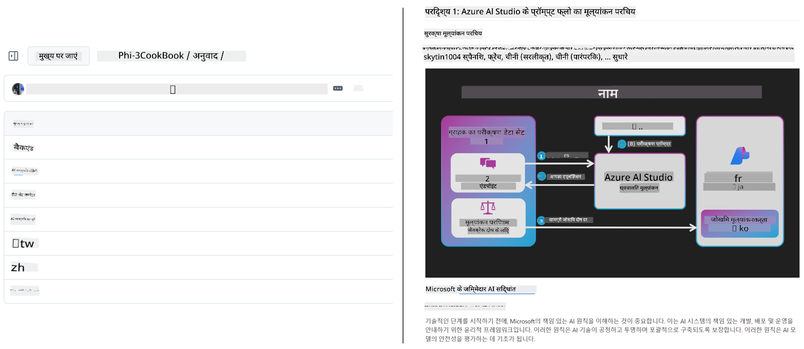
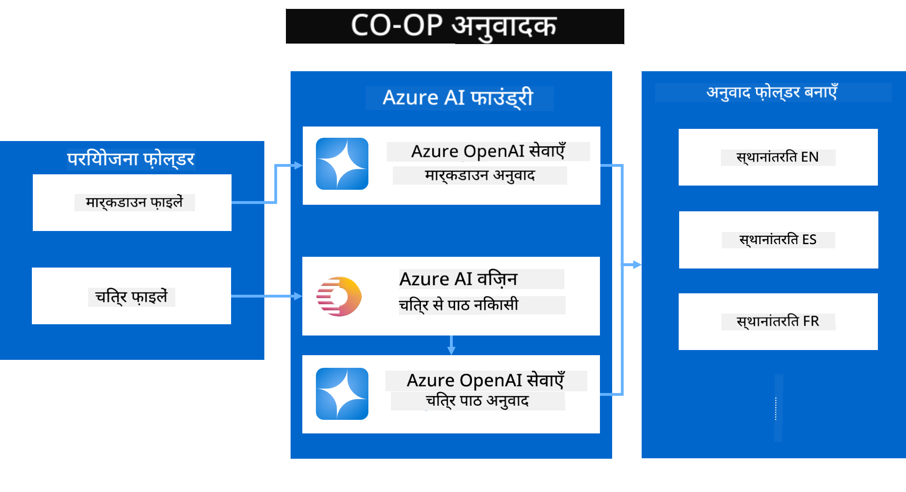

<!--
CO_OP_TRANSLATOR_METADATA:
{
  "original_hash": "044724537b57868117aadae8e7728c7c",
  "translation_date": "2025-06-12T10:09:21+00:00",
  "source_file": "README.md",
  "language_code": "hi"
}
-->


# Co-op Translator: शैक्षिक दस्तावेज़ीकरण के अनुवाद को सहजता से स्वचालित करें

_अपनी दस्तावेज़ीकरण का अनुवाद कई भाषाओं में आसानी से स्वचालित करें और वैश्विक दर्शकों तक पहुँचें।_

[](https://pypi.org/project/co-op-translator/)
[](https://github.com/azure/co-op-translator/blob/main/LICENSE)
[](https://pepy.tech/project/co-op-translator)
[](https://pepy.tech/project/co-op-translator)
[](https://github.com/psf/black)

[](https://GitHub.com/azure/co-op-translator/graphs/contributors/)
[](https://GitHub.com/azure/co-op-translator/issues/)
[](https://GitHub.com/azure/co-op-translator/pulls/)
[](http://makeapullrequest.com)

### भाषा समर्थन Co-op Translator द्वारा संचालित

> [!NOTE]
> ये इस रिपॉजिटरी की वर्तमान अनुवादित सामग्री हैं। Co-op Translator द्वारा समर्थित भाषाओं की पूरी सूची के लिए कृपया [Language Support](../..) अनुभाग देखें।

[](https://GitHub.com/azure/co-op-translator/watchers/)
[](https://GitHub.com/azure/co-op-translator/network/)
[](https://GitHub.com/azure/co-op-translator/stargazers/)

[](https://discord.com/invite/ByRwuEEgH4)

[](https://codespaces.new/azure/co-op-translator)
[](https://vscode.dev/redirect?url=vscode://ms-vscode-remote.remote-containers/cloneInVolume?url=https://github.com/azure/co-op-translator)

## अवलोकन: अपने शैक्षिक सामग्री अनुवाद को सरल बनाएं

भाषाई बाधाएं विश्वभर के शिक्षार्थियों और डेवलपर्स के लिए मूल्यवान शैक्षिक संसाधनों और तकनीकी ज्ञान तक पहुंच को काफी सीमित करती हैं। इससे भागीदारी कम होती है और वैश्विक नवाचार और सीखने की गति धीमी पड़ जाती है।

**Co-op Translator** Microsoft की अपनी बड़े पैमाने की शैक्षिक श्रृंखला (जैसे "For Beginners" गाइड्स) के अनुवाद के किफायती और धीमे मैनुअल प्रक्रिया की समस्या को हल करने के लिए बना था। यह एक सरल और शक्तिशाली उपकरण बन गया है, जो सभी के लिए इन बाधाओं को तोड़ने के लिए डिज़ाइन किया गया है। CLI और GitHub Actions के माध्यम से उच्च गुणवत्ता वाले स्वचालित अनुवाद प्रदान करके, Co-op Translator शिक्षकों, छात्रों, शोधकर्ताओं और डेवलपर्स को भाषा की सीमाओं के बिना ज्ञान साझा करने और प्राप्त करने का अधिकार देता है।

देखें कि Co-op Translator कैसे अनुवादित शैक्षिक सामग्री को व्यवस्थित करता है:



Markdown फ़ाइलें और छवि के टेक्स्ट अपने आप अनुवादित होकर भाषा-विशिष्ट फ़ोल्डरों में व्यवस्थित हो जाते हैं।

**आज ही Co-op Translator के साथ अपनी शैक्षिक सामग्री को वैश्विक पहुंच दें!**

## Microsoft के लर्निंग रिसोर्सेज के लिए वैश्विक पहुंच का समर्थन

Co-op Translator मुख्य Microsoft शैक्षिक पहलों के लिए भाषा की खाई को पाटने में मदद करता है, रिपॉजिटरीज़ के अनुवाद प्रक्रिया को स्वचालित करता है जो वैश्विक डेवलपर समुदाय की सेवा करते हैं। वर्तमान में Co-op Translator का उपयोग कर रहे उदाहरणों में शामिल हैं:

[](https://github.com/microsoft/Generative-AI-for-beginners)
[](https://github.com/microsoft/ML-For-Beginners)
[](https://github.com/microsoft/AI-For-Beginners)
[](https://github.com/microsoft/ai-agents-for-beginners)
[](https://github.com/microsoft/PhiCookBook)
[](https://github.com/microsoft/Generative-AI-for-beginners-dotnet)

## मुख्य विशेषताएँ

- **स्वचालित अनुवाद**: बिना किसी मेहनत के टेक्स्ट को कई भाषाओं में अनुवादित करें।
- **GitHub Actions इंटीग्रेशन**: अपने CI/CD पाइपलाइन का हिस्सा बनाकर अनुवाद प्रक्रिया को स्वचालित करें।
- **Markdown संरक्षा**: अनुवाद के दौरान Markdown सिंटैक्स को सही बनाए रखें।
- **छवि टेक्स्ट अनुवाद**: छवियों में मौजूद टेक्स्ट को निकालकर अनुवादित करें।
- **उन्नत LLM तकनीक**: उच्च गुणवत्ता वाले अनुवाद के लिए नवीनतम भाषा मॉडल का उपयोग करें।
- **सरल इंटीग्रेशन**: अपने मौजूदा प्रोजेक्ट सेटअप के साथ आसानी से जुड़ें।
- **स्थानीयकरण सरल बनाएं**: अपने प्रोजेक्ट को अंतरराष्ट्रीय बाजारों के लिए स्थानीयकृत करना आसान बनाएं।

## यह कैसे काम करता है



Co-op Translator आपके प्रोजेक्ट फ़ोल्डर से Markdown फ़ाइलें और छवियां लेता है और उन्हें इस प्रकार प्रोसेस करता है:

1. **टेक्स्ट निकालना**: Markdown फ़ाइलों से टेक्स्ट निकालता है और यदि कॉन्फ़िगर किया गया हो (जैसे Azure AI Vision के साथ), तो छवियों में मौजूद टेक्स्ट भी निकालता है।
1. **AI अनुवाद**: निकाले गए टेक्स्ट को कॉन्फ़िगर किए गए LLM (Azure OpenAI, OpenAI आदि) को अनुवाद के लिए भेजता है।
1. **परिणाम सहेजना**: अनुवादित Markdown फ़ाइलें और छवियां (अनुवादित टेक्स्ट के साथ) भाषा-विशिष्ट फ़ोल्डरों में सहेजता है, मूल फॉर्मेटिंग को बरकरार रखते हुए।

## शुरुआत कैसे करें

CLI के साथ जल्दी शुरू करें या GitHub Actions के साथ पूरी स्वचालन सेट करें। अपनी वर्कफ़्लो के अनुसार सबसे उपयुक्त तरीका चुनें:

1. **कमांड लाइन (CLI)** - एक बार के अनुवाद या मैनुअल नियंत्रण के लिए
2. **GitHub Actions** - हर पुश पर स्वचालित अनुवाद के लिए

> [!NOTE]
> यह ट्यूटोरियल Azure संसाधनों पर केंद्रित है, लेकिन आप किसी भी समर्थित भाषा मॉडल का उपयोग कर सकते हैं।

### भाषा समर्थन

Co-op Translator कई भाषाओं का समर्थन करता है ताकि आप वैश्विक दर्शकों तक पहुंच सकें। जानिए आपको क्या पता होना चाहिए:

#### त्वरित संदर्भ

| भाषा | कोड | भाषा | कोड | भाषा | कोड |
|----------|------|----------|------|----------|------|
| Arabic | ar | Bengali | bn | Bulgarian | bg |
| Burmese (Myanmar) | my | Chinese (Simplified) | zh | Chinese (Traditional, HK) | hk |
| Chinese (Traditional, Macau) | mo | Chinese (Traditional, TW) | tw | Croatian | hr |
| Czech | cs | Danish | da | Dutch | nl |
| Finnish | fi | French | fr | German | de |
| Greek | el | Hebrew | he | Hindi | hi |
| Hungarian | hu | Indonesian | id | Italian | it |
| Japanese | ja | Korean | ko | Malay | ms |
| Marathi | mr | Nepali | ne | Norwegian | no |
| Persian (Farsi) | fa | Polish | pl | Portuguese (Brazil) | br |
| Portuguese (Portugal) | pt | Punjabi (Gurmukhi) | pa | Romanian | ro |
| Russian | ru | Serbian (Cyrillic) | sr | Slovak | sk |
| Slovenian | sl | Spanish | es | Swahili | sw |
| Swedish | sv | Tagalog (Filipino) | tl | Thai | th |
| Turkish | tr | Ukrainian | uk | Urdu | ur |
| Vietnamese | vi | — | — | — | — |

#### भाषा कोड का उपयोग

Co-op Translator का उपयोग करते समय, आपको भाषाओं को उनके कोड के साथ निर्दिष्ट करना होगा। उदाहरण के लिए:

```bash
# Translate to French, Spanish, and German
translate -l "fr es de"

# Translate to Chinese (Simplified) and Japanese
translate -l "zh ja"
```

> [!NOTE]
> भाषा समर्थन से संबंधित विस्तृत तकनीकी जानकारी के लिए, जिसमें शामिल हैं:
>
> - प्रत्येक भाषा के लिए फ़ॉन्ट स्पेसिफिकेशन
> - ज्ञात समस्याएं
> - नई भाषाओं को जोड़ने का तरीका
>
> हमारी [Supported Languages Documentation](./getting_started/supported-languages.md) देखें।

### समर्थित मॉडल और सेवाएँ

| प्रकार                  | नाम                           |
|-----------------------|--------------------------------|
| Language Model        |   |
| AI Vision       |  |

> [!NOTE]
> यदि AI vision सेवा उपलब्ध नहीं है, तो co-op translator [Markdown-only mode](./getting_started/markdown-only-mode.md) में स्विच कर जाएगा।

### प्रारंभिक सेटअप

शुरू करने से पहले, आपको निम्नलिखित संसाधनों को सेटअप करना होगा:

1. भाषा मॉडल संसाधन (आवश्यक):
   - Azure OpenAI (सिफारिश की गई) - उच्च गुणवत्ता वाले अनुवाद और एंटरप्राइज स्तर की विश्वसनीयता प्रदान करता है
   - OpenAI - वैकल्पिक विकल्प यदि आपके पास Azure एक्सेस नहीं है
   - समर्थित मॉडलों के बारे में विस्तृत जानकारी के लिए देखें [Supported Models and Services](../..)

1. AI Vision संसाधन (वैकल्पिक):
   - Azure AI Vision - छवियों में मौजूद टेक्स्ट के अनुवाद को सक्षम करता है
   - यदि कॉन्फ़िगर नहीं किया गया है, तो ट्रांसलेटर स्वचालित रूप से [Markdown-only mode](./getting_started/markdown-only-mode.md) का उपयोग करेगा
   - उन प्रोजेक्ट्स के लिए अनुशंसित जिनमें अनुवाद के लिए टेक्स्ट वाली छवियां शामिल हैं

1. कॉन्फ़िगरेशन कदम:
   - विस्तृत निर्देशों के लिए हमारे [Azure AI setup guide](./getting_started/set-up-azure-ai.md) का पालन करें
   - अपनी API कुंजी और एंडपॉइंट्स के साथ `.env` फ़ाइल बनाएं (देखें [Quick Start](../..) सेक्शन)
   - सुनिश्चित करें कि आपके पास चुनी गई सेवाओं के लिए आवश्यक अनुमतियाँ और कोटा हैं

### अनुवाद से पहले प्रोजेक्ट सेटअप

अनुवाद प्रक्रिया शुरू करने से पहले, अपने प्रोजेक्ट को तैयार करने के लिए ये कदम उठाएं:

1. अपना README तैयार करें:
   - अपने README.md में अनुवादित संस्करणों के लिंक के लिए एक ट्रांसलेशंस टेबल जोड़ें
   - उदाहरण स्वरूप:

     ```markdown

     ### 🌐 Multi-Language Support
     
     [French](../fr/README.md) | [Spanish](../es/README.md) | [German](../de/README.md) | [Russian](../ru/README.md) | [Arabic](../ar/README.md) | [Persian (Farsi)](../fa/README.md) | [Urdu](../ur/README.md) | [Chinese (Simplified)](../zh/README.md) | [Chinese (Traditional, Macau)](../mo/README.md) | [Chinese (Traditional, Hong Kong)](../hk/README.md) | [Chinese (Traditional, Taiwan)](../tw/README.md) | [Japanese](../ja/README.md) | [Korean](../ko/README.md) | [Hindi](./README.md) | [Bengali](../bn/README.md) | [Marathi](../mr/README.md) | [Nepali](../ne/README.md) | [Punjabi (Gurmukhi)](../pa/README.md) | [Portuguese (Portugal)](../pt/README.md) | [Portuguese (Brazil)](../br/README.md) | [Italian](../it/README.md) | [Polish](../pl/README.md) | [Turkish](../tr/README.md) | [Greek](../el/README.md) | [Thai](../th/README.md) | [Swedish](../sv/README.md) | [Danish](../da/README.md) | [Norwegian](../no/README.md) | [Finnish](../fi/README.md) | [Dutch](../nl/README.md) | [Hebrew](../he/README.md) | [Vietnamese](../vi/README.md) | [Indonesian](../id/README.md) | [Malay](../ms/README.md) | [Tagalog (Filipino)](../tl/README.md) | [Swahili](../sw/README.md) | [Hungarian](../hu/README.md) | [Czech](../cs/README.md) | [Slovak](../sk/README.md) | [Romanian](../ro/README.md) | [Bulgarian](../bg/README.md) | [Serbian (Cyrillic)](../sr/README.md) | [Croatian](../hr/README.md) | [Slovenian](../sl/README.md) | [Ukrainian](../uk/README.md) | [Burmese (Myanmar)](../my/README.md) 
    
     ```

1. मौजूदा अनुवाद साफ करें (यदि आवश्यक हो):
   - किसी भी मौजूदा अनुवाद फ़ोल्डर (जैसे `translations/`) को हटा दें
   - पुराने अनुवाद फ़ाइलों को हटाकर नया शुरुआत करें
   - इससे नए अनुवाद प्रक्रिया में कोई टकराव नहीं होगा

### त्वरित शुरुआत: कमांड लाइन

कमांड लाइन का उपयोग करके जल्दी शुरू करने के लिए:

1. वर्चुअल एनवायरनमेंट बनाएं:

    ```bash
    python -m venv .venv
    ```

1. वर्चुअल एनवायरनमेंट सक्रिय करें:

    - Windows पर:

    ```bash
    .venv\scripts\activate
    ```

    - Linux/macOS पर:

    ```bash
    source .venv/bin/activate
    ```

1. पैकेज इंस्टॉल करें:

    ```bash
    pip install co-op-translator
    ```

1. क्रेडेंशियल्स कॉन्फ़िगर करें:

    - `.env` file in your project's root directory.
    - Copy the contents from the [.env.template](../../.env.template) file into your new `.env` file.
    - Fill in the required API keys and endpoint information in your `.env` file.

1. Run Translation:
    - Navigate to your project's root directory in your terminal.
    - Execute the translate command, specifying target languages with the `-l` फ़्लैग के साथ:

    ```bash
    translate -l "ko ja fr"
    ```

_(यहाँ `"ko ja fr"` with your desired space-separated language codes)_

### Detailed Usage Guides

Choose the approach that best fits your workflow:

#### 1. Using the Command Line (CLI)

- Best for: One-time translations, manual control, or integration into custom scripts.
- Requires: Local installation of Python and the `co-op-translator` package.
- Guide: [Command Line Guide](./getting_started/command-line-guide/command-line-guide.md)

#### 2. Using GitHub Actions (Automation)

- Best for: Automatically translating content whenever changes are pushed to your repository. Keeps translations consistently up-to-date.
- Requires: Setting up a workflow file (`.github/workflows`) अपने रिपॉजिटरी में बदलें। लोकल इंस्टॉलेशन की जरूरत नहीं है।_

- गाइड्स:
  - [GitHub Actions Guide (Public Repositories & Standard Secrets)](./getting_started/github-actions-guide/github-actions-guide-public.md) - अधिकांश सार्वजनिक या व्यक्तिगत रिपॉजिटरीज़ के लिए, जो स्टैंडर्ड रिपॉजिटरी सीक्रेट्स पर निर्भर करते हैं, इसे उपयोग करें।
  - [GitHub Actions Guide (Microsoft Organization Repos & Org-Level Setups)](./getting_started/github-actions-guide/github-actions-guide-org.md) - यदि आप Microsoft GitHub संगठन के अंतर्गत काम कर रहे हैं या संगठन-स्तरीय सीक्रेट्स या रनर्स का उपयोग करना चाहते हैं, तो इस गाइड का उपयोग करें।

### समस्या निवारण और सुझाव

- [Troubleshooting Guide](./getting_started/troubleshooting.md)

### अतिरिक्त संसाधन

- [Command Reference](./getting_started/command-reference.md): उपलब्ध सभी कमांड और विकल्पों का विस्तृत गाइड।
- [Supported Languages](./getting_started/supported-languages.md): समर्थित भाषाओं की सूची और नई भाषाएं जोड़ने के निर्देश।
- [Markdown-Only Mode](./getting_started/markdown-only-mode.md): केवल टेक्स्ट का अनुवाद कैसे करें, बिना छवि अनुवाद के।

## वीडियो प्रस्तुतियाँ

Co-op Translator के बारे में अधिक जानने के लिए हमारी प्रस्तुतियाँ देखें _(नीचे दी गई छवि पर क्लिक करके YouTube पर देखें)_:

- **Open at Microsoft**: Co-op Translator का संक्षिप्त 18 मिनट का परिचय और त्वरित मार्गदर्शिका।
[](https://www.youtube.com/watch?v=jX_swfH_KNU)

## हमारा समर्थन करें और वैश्विक शिक्षा को बढ़ावा दें

शैक्षिक सामग्री को वैश्विक स्तर पर साझा करने के तरीके में क्रांति लाने में हमारे साथ जुड़ें! GitHub पर [Co-op Translator](https://github.com/azure/co-op-translator) को ⭐ दें और भाषा की बाधाओं को सीखने और तकनीक में तोड़ने के हमारे मिशन का समर्थन करें। आपकी रुचि और योगदान का बड़ा प्रभाव पड़ता है! कोड योगदान और फीचर सुझाव हमेशा स्वागत योग्य हैं।

## योगदान

यह परियोजना योगदान और सुझावों का स्वागत करती है। Azure Co-op Translator में योगदान करने में रुचि रखते हैं? कृपया देखें हमारे [CONTRIBUTING.md](./CONTRIBUTING.md) में दिशानिर्देश कि आप Co-op Translator को और अधिक सुलभ बनाने में कैसे मदद कर सकते हैं।

## योगदानकर्ता

[](https://github.com/Azure/co-op-translator/graphs/contributors)

## आचार संहिता

इस परियोजना ने [Microsoft Open Source Code of Conduct](https://opensource.microsoft.com/codeofconduct/) को अपनाया है।  
अधिक जानकारी के लिए देखें [Code of Conduct FAQ](https://opensource.microsoft.com/codeofconduct/faq/) या  
किसी भी अतिरिक्त प्रश्न या टिप्पणी के लिए संपर्क करें [opencode@microsoft.com](mailto:opencode@microsoft.com)।

## जिम्मेदार AI

Microsoft अपने ग्राहकों को हमारे AI उत्पादों का जिम्मेदारी से उपयोग करने में मदद करने के लिए प्रतिबद्ध है, अपने अनुभव साझा करता है, और ट्रांसपेरेंसी नोट्स और प्रभाव आकलनों जैसे उपकरणों के माध्यम से भरोसेमंद साझेदारी बनाता है। इन संसाधनों में से कई [https://aka.ms/RAI](https://aka.ms/RAI) पर उपलब्ध हैं।  
Microsoft का जिम्मेदार AI दृष्टिकोण हमारे AI सिद्धांतों पर आधारित है: निष्पक्षता, विश्वसनीयता और सुरक्षा, गोपनीयता और सुरक्षा, समावेशन, पारदर्शिता, और जवाबदेही।

इस उदाहरण में उपयोग किए गए बड़े पैमाने पर प्राकृतिक भाषा, छवि, और भाषण मॉडल संभावित रूप से ऐसे व्यवहार कर सकते हैं जो अनुचित, अविश्वसनीय, या आपत्तिजनक हो सकते हैं, जिससे नुकसान हो सकता है। कृपया जोखिमों और सीमाओं के बारे में जानने के लिए [Azure OpenAI service Transparency note](https://learn.microsoft.com/legal/cognitive-services/openai/transparency-note?tabs=text) देखें।

इन जोखिमों को कम करने के लिए अनुशंसित तरीका यह है कि आपकी संरचना में एक सुरक्षा प्रणाली शामिल हो जो हानिकारक व्यवहार का पता लगा सके और उसे रोक सके। [Azure AI Content Safety](https://learn.microsoft.com/azure/ai-services/content-safety/overview) एक स्वतंत्र सुरक्षा परत प्रदान करता है, जो एप्लिकेशन और सेवाओं में हानिकारक उपयोगकर्ता-जनित और AI-जनित सामग्री का पता लगा सकता है। Azure AI Content Safety में टेक्स्ट और इमेज API शामिल हैं जो हानिकारक सामग्री का पता लगाने में सक्षम हैं। हमारे पास एक इंटरैक्टिव Content Safety Studio भी है जो आपको विभिन्न माध्यमों में हानिकारक सामग्री का पता लगाने के लिए नमूना कोड देखने, एक्सप्लोर करने और आज़माने की सुविधा देता है। निम्नलिखित [quickstart documentation](https://learn.microsoft.com/azure/ai-services/content-safety/quickstart-text?tabs=visual-studio%2Clinux&pivots=programming-language-rest) आपको सेवा को अनुरोध भेजने के लिए मार्गदर्शन करता है।

एक और पहलू जिसे ध्यान में रखना जरूरी है वह है समग्र एप्लिकेशन प्रदर्शन। मल्टी-मोडल और मल्टी-मॉडल एप्लिकेशन के साथ, हम प्रदर्शन को इस रूप में मानते हैं कि सिस्टम आपके और आपके उपयोगकर्ताओं की अपेक्षा के अनुसार काम करे, जिसमें हानिकारक आउटपुट न उत्पन्न करना भी शामिल है। अपने समग्र एप्लिकेशन के प्रदर्शन का मूल्यांकन करना महत्वपूर्ण है, इसके लिए [generation quality and risk and safety metrics](https://learn.microsoft.com/azure/ai-studio/concepts/evaluation-metrics-built-in) का उपयोग करें।

आप अपने विकास वातावरण में अपने AI एप्लिकेशन का मूल्यांकन [prompt flow SDK](https://microsoft.github.io/promptflow/index.html) का उपयोग करके कर सकते हैं। चाहे आपके पास टेस्ट डेटा सेट हो या लक्ष्य, आपके जनरेटिव AI एप्लिकेशन की जनरेशन की मात्रात्मक माप आपके द्वारा चुने गए बिल्ट-इन या कस्टम इवैलुएटर्स के साथ की जाती है। prompt flow sdk के साथ अपनी प्रणाली का मूल्यांकन शुरू करने के लिए, आप [quickstart guide](https://learn.microsoft.com/azure/ai-studio/how-to/develop/flow-evaluate-sdk) का पालन कर सकते हैं। एक बार जब आप मूल्यांकन रन निष्पादित कर लेते हैं, तो आप [Azure AI Studio में परिणामों को विज़ुअलाइज़](https://learn.microsoft.com/azure/ai-studio/how-to/evaluate-flow-results) कर सकते हैं।

## ट्रेडमार्क

इस परियोजना में परियोजनाओं, उत्पादों, या सेवाओं के ट्रेडमार्क या लोगो हो सकते हैं। Microsoft ट्रेडमार्क या लोगो का अधिकृत उपयोग [Microsoft's Trademark & Brand Guidelines](https://www.microsoft.com/en-us/legal/intellectualproperty/trademarks/usage/general) के अधीन है और इसका पालन करना आवश्यक है।  
इस परियोजना के संशोधित संस्करणों में Microsoft ट्रेडमार्क या लोगो का उपयोग भ्रम पैदा नहीं करना चाहिए या Microsoft के प्रायोजन का संकेत नहीं देना चाहिए।  
किसी भी तृतीय-पक्ष ट्रेडमार्क या लोगो का उपयोग संबंधित तृतीय-पक्ष की नीतियों के अधीन है।

**अस्वीकरण**:  
यह दस्तावेज़ AI अनुवाद सेवा [Co-op Translator](https://github.com/Azure/co-op-translator) का उपयोग करके अनुवादित किया गया है। जबकि हम सटीकता के लिए प्रयासरत हैं, कृपया ध्यान दें कि स्वचालित अनुवादों में त्रुटियाँ या गलतियाँ हो सकती हैं। मूल दस्तावेज़ अपनी मूल भाषा में ही अधिकारिक स्रोत माना जाना चाहिए। महत्वपूर्ण जानकारी के लिए, पेशेवर मानव अनुवाद की सलाह दी जाती है। इस अनुवाद के उपयोग से उत्पन्न किसी भी गलतफहमी या गलत व्याख्या के लिए हम जिम्मेदार नहीं हैं।