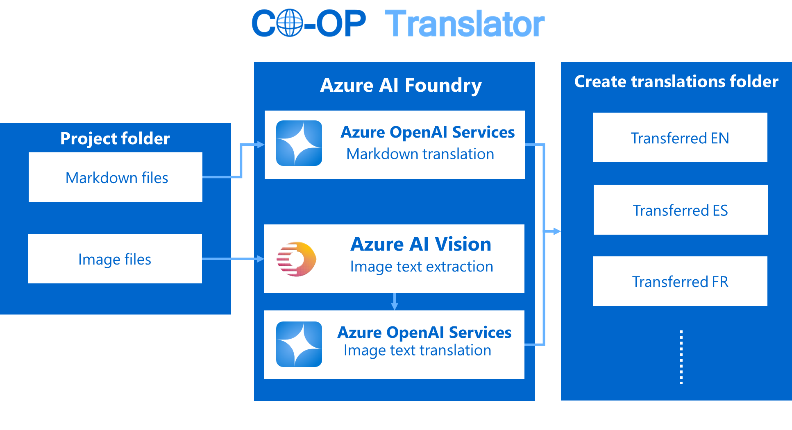

<!--
CO_OP_TRANSLATOR_METADATA:
{
  "original_hash": "18318279bb851dc2c709bfc6a26f6e1d",
  "translation_date": "2025-05-07T14:08:50+00:00",
  "source_file": "README.md",
  "language_code": "hi"
}
-->


# Co-op Translator: शैक्षिक दस्तावेज़ों के अनुवाद को आसानी से स्वचालित करें

_अपने दस्तावेज़ों का अनुवाद कई भाषाओं में आसानी से स्वचालित करें और वैश्विक दर्शकों तक पहुंचें।_

[](https://pypi.org/project/co-op-translator/)
[](https://github.com/azure/co-op-translator/blob/main/LICENSE)
[](https://pepy.tech/project/co-op-translator)
[](https://pepy.tech/project/co-op-translator)
[](https://github.com/psf/black)

[](https://GitHub.com/azure/co-op-translator/graphs/contributors/)
[](https://GitHub.com/azure/co-op-translator/issues/)
[](https://GitHub.com/azure/co-op-translator/pulls/)
[](http://makeapullrequest.com)

### Co-op Translator द्वारा समर्थित भाषाएँ

[Korean](../ko/README.md) | [Japanese](../ja/README.md) | [Chinese (Simplified)](../zh/README.md) | [Chinese (Traditional, Taiwan)](../tw/README.md) | [Spanish](../es/README.md) | [French](../fr/README.md) | [German](../de/README.md) | [Portuguese (Brazil)](../br/README.md) | [Hindi](./README.md) | [Russian](../ru/README.md) | [Turkish](../tr/README.md) | [Arabic](../ar/README.md) | [Indonesian](../id/README.md) | [Vietnamese](../vi/README.md)

[](https://GitHub.com/azure/co-op-translator/watchers/)
[](https://GitHub.com/azure/co-op-translator/network/)
[](https://GitHub.com/azure/co-op-translator/stargazers/)

[](https://discord.com/invite/ByRwuEEgH4)

[](https://codespaces.new/azure/co-op-translator)
[](https://vscode.dev/redirect?url=vscode://ms-vscode-remote.remote-containers/cloneInVolume?url=https://github.com/azure/co-op-translator)

> [!TIP]
>
> **शक्तिशाली स्वचालन**: अब GitHub Actions सपोर्ट के साथ! जब भी आपके रिपॉजिटरी में बदलाव होते हैं, अपने दस्तावेज़ों का स्वचालित अनुवाद करें और सब कुछ बिना किसी मेहनत के हमेशा अपडेट रखें। [और जानें](../..)।

## समर्थित मॉडल और सेवाएं

| प्रकार                 | नाम                            |
|-----------------------|--------------------------------|
| भाषा मॉडल             |   |
| कंप्यूटर विज़न         |  |

> [!NOTE]
> यदि कोई कंप्यूटर विज़न सेवा उपलब्ध नहीं है, तो co-op translator [Markdown-only mode](./getting_started/markdown-only-mode.md) में स्विच कर जाएगा।

## अवलोकन: अपने शैक्षिक सामग्री के अनुवाद को सरल बनाएं

भाषाई बाधाएं विश्वभर के शिक्षार्थियों और डेवलपर्स के लिए मूल्यवान शैक्षिक संसाधनों और तकनीकी ज्ञान तक पहुंच को काफी सीमित करती हैं। इससे भागीदारी कम होती है और वैश्विक नवाचार तथा सीखने की गति धीमी पड़ती है।

**Co-op Translator** Microsoft की अपनी बड़ी शैक्षिक श्रृंखला (जैसे "For Beginners" गाइड) के लिए अप्रभावी मैनुअल अनुवाद प्रक्रिया को सुधारने की जरूरत से उत्पन्न हुआ। यह एक आसान-से-उपयोग, शक्तिशाली टूल बन गया है जो सभी के लिए इन बाधाओं को तोड़ने के लिए डिज़ाइन किया गया है। CLI और GitHub Actions के माध्यम से उच्च गुणवत्ता वाले स्वचालित अनुवाद प्रदान करके, Co-op Translator शिक्षकों, छात्रों, शोधकर्ताओं और डेवलपर्स को भाषा की सीमाओं के बिना ज्ञान साझा करने और प्राप्त करने में सक्षम बनाता है।

देखें कि Co-op Translator अनुवादित शैक्षिक सामग्री को कैसे व्यवस्थित करता है:


Markdown फाइलें और छवि के टेक्स्ट अपने आप अनुवादित होकर भाषा-विशिष्ट फोल्डरों में सुव्यवस्थित हो जाते हैं।

**Co-op Translator के साथ आज ही अपनी शैक्षिक सामग्री को वैश्विक पहुंच दें!**

## Microsoft के लर्निंग रिसोर्सेज के लिए वैश्विक पहुंच का समर्थन

Co-op Translator Microsoft की प्रमुख शैक्षिक पहलों के लिए भाषा की बाधा को पाटने में मदद करता है, उन रिपॉजिटरीज़ के लिए अनुवाद प्रक्रिया को स्वचालित करता है जो वैश्विक डेवलपर समुदाय की सेवा करती हैं। वर्तमान में Co-op Translator का उपयोग करने वाले उदाहरणों में शामिल हैं:

[](https://github.com/microsoft/ML-For-Beginners)
[](https://github.com/microsoft/Generative-AI-for-beginners-dotnet)
[](https://github.com/microsoft/AI-For-Beginners)
[](https://github.com/microsoft/ai-agents-for-beginners)
[](https://github.com/microsoft/PhiCookBook)

## मुख्य विशेषताएं

- **स्वचालित अनुवाद**: आसानी से टेक्स्ट को कई भाषाओं में अनुवादित करें।
- **GitHub Actions इंटीग्रेशन**: अपने CI/CD पाइपलाइन के हिस्से के रूप में अनुवाद को स्वचालित करें।
- **Markdown संरक्षा**: अनुवाद के दौरान Markdown सिंटैक्स को सही बनाए रखें।
- **छवि टेक्स्ट अनुवाद**: छवियों के भीतर टेक्स्ट निकालें और अनुवाद करें।
- **उन्नत LLM तकनीक**: उच्च गुणवत्ता वाले अनुवाद के लिए नवीनतम भाषा मॉडल का उपयोग करें।
- **आसान इंटीग्रेशन**: अपने मौजूदा प्रोजेक्ट सेटअप के साथ सहज रूप से इंटीग्रेट करें।
- **स्थानीयकरण को सरल बनाएं**: अपने प्रोजेक्ट के अंतरराष्ट्रीय बाजारों के लिए स्थानीयकरण की प्रक्रिया को सुव्यवस्थित करें।

## यह कैसे काम करता है



Co-op Translator आपके प्रोजेक्ट फोल्डर से Markdown फाइलें और छवियां लेता है और उन्हें निम्नलिखित तरीके से प्रोसेस करता है:

1. **टेक्स्ट निष्कर्षण**: Markdown फाइलों से और यदि कॉन्फ़िगर किया गया हो (जैसे Azure Computer Vision के साथ), तो छवियों के भीतर के टेक्स्ट को निकालता है।
1. **AI अनुवाद**: निकाले गए टेक्स्ट को कॉन्फ़िगर किए गए LLM (Azure OpenAI, OpenAI आदि) को अनुवाद के लिए भेजता है।
1. **परिणाम सहेजना**: अनुवादित Markdown फाइलें और छवियां (अनुवादित टेक्स्ट के साथ) भाषा-विशिष्ट फोल्डरों में सहेजता है, मूल फॉर्मेटिंग को बनाए रखते हुए।

## शुरूआत कैसे करें

> [!NOTE]
> यह ट्यूटोरियल Azure संसाधनों पर केंद्रित है, लेकिन आप [supported models and services](../..) सूची में से कोई भी समर्थित भाषा मॉडल उपयोग कर सकते हैं।

CLI के साथ जल्दी शुरुआत करें या GitHub Actions के साथ पूर्ण स्वचालन सेटअप करें।

### प्रारंभिक सेटअप

- [Azure AI सेटअप करें](./getting_started/set-up-azure-ai.md)

### त्वरित शुरुआत: कमांड लाइन

कमांड लाइन का उपयोग करके तेज शुरुआत के लिए:

1. पैकेज इंस्टॉल करें:
    ```bash
    pip install co-op-translator
    ```
2. क्रेडेंशियल्स कॉन्फ़िगर करें:
  - `.env` file in your project's root directory.
  - Copy the contents from the [.env.template](../../.env.template) file into your new `.env` file.
  - Fill in the required API keys and endpoint information in your `.env` file.
3. Run Translation:
  - Navigate to your project's root directory in your terminal.
  - Execute the translate command, specifying target languages with the `-l` फ़्लैग बनाएं:
    ```bash
    translate -l "ko ja fr"
    ```
    *(अपने रिपॉजिटरी में `"ko ja fr"` with your desired space-separated language codes)*

### Detailed Usage Guides

Choose the approach that best fits your workflow:

#### 1. Using the Command Line (CLI)

- Best for: One-time translations, manual control, or integration into custom scripts.
- Requires: Local installation of Python and the `co-op-translator` package.
- Guide: [Command Line Guide](./getting_started/command-line-guide/command-line-guide.md)

#### 2. Using GitHub Actions (Automation)

- Best for: Automatically translating content whenever changes are pushed to your repository. Keeps translations consistently up-to-date.
- Requires: Setting up a workflow file (`.github/workflows` को बदलें। स्थानीय इंस्टॉलेशन की जरूरत नहीं।*
- गाइड्स:
  - [GitHub Actions गाइड (पब्लिक रिपॉजिटरी और स्टैण्डर्ड सीक्रेट्स)](./getting_started/github-actions-guide/github-actions-guide-public.md) - अधिकांश सार्वजनिक या व्यक्तिगत रिपॉजिटरीज़ के लिए जो स्टैण्डर्ड रिपॉजिटरी सीक्रेट्स पर निर्भर हैं।
  - [GitHub Actions गाइड (Microsoft संगठन रिपॉजिटरी और संगठन-स्तरीय सेटअप)](./getting_started/github-actions-guide/github-actions-guide-org.md) - यदि आप Microsoft GitHub संगठन के अंतर्गत काम कर रहे हैं या संगठन-स्तरीय सीक्रेट्स या रनर का उपयोग करना चाहते हैं, तो इस गाइड का उपयोग करें।

### समस्या निवारण और सुझाव

- [समस्या निवारण गाइड](./getting_started/troubleshooting.md)

### अतिरिक्त संसाधन

- [कमांड संदर्भ](./getting_started/command-reference.md): उपलब्ध सभी कमांड और विकल्पों का विस्तृत मार्गदर्शन।
- [मल्टी-भाषा सपोर्ट सेटअप](./getting_started/multi-language-support.md): README में अनुवादित संस्करणों के लिंक वाली तालिका कैसे जोड़ें।
- [समर्थित भाषाएं](./getting_started/supported-languages.md): समर्थित भाषाओं की सूची और नई भाषाएं जोड़ने के निर्देश।
- [Markdown-Only मोड](./getting_started/markdown-only-mode.md): केवल टेक्स्ट का अनुवाद कैसे करें, बिना छवि अनुवाद के।

## वीडियो प्रस्तुतिकरण

Co-op Translator के बारे में अधिक जानें हमारे प्रस्तुतिकरणों के माध्यम से _(नीचे छवि पर क्लिक करके YouTube पर देखें)_:

- **Open at Microsoft**: Co-op Translator का संक्षिप्त 18 मिनट का परिचय और त्वरित मार्गदर्शिका।

  [](https://www.youtube.com/watch?v=jX_swfH_KNU)

- **Microsoft Reactor**: एक घंटे की विस्तृत स्टेप-बाय-स्टेप गाइड, जिसमें Co-op Translator क्या है, इसे सेटअप कैसे करें, प्रभावी ढंग से कैसे उपयोग करें, और इसके फीचर्स का लाइव डेमो शामिल है।

  [](https://www.youtube.com/watch?v=boTtKVPBLAc)

## हमारा समर्थन करें और वैश्विक शिक्षा को बढ़ावा दें

शैक्षिक सामग्री को वैश्विक स्तर पर साझा करने के तरीके में क्रांति लाने में हमारा साथ दें! [Co-op Translator](https://github.com/azure/co-op-translator) को GitHub पर ⭐ दें और भाषा की बाधाओं को तोड़ने के हमारे मिशन का समर्थन करें। आपकी रुचि और योगदान से बड़ा प्रभाव पड़ता है! कोड योगदान और फीचर सुझाव हमेशा स्वागत योग्य हैं।

## योगदान करना

यह प्रोजेक्ट योगदान और सुझावों का स्वागत करता है। Azure Co-op Translator में योगदान करने में रुचि रखते हैं? कृपया हमारे [CONTRIBUTING.md](./CONTRIBUTING.md) को देखें, जिसमें बताया गया है कि आप Co-op Translator को और अधिक सुलभ बनाने में कैसे मदद कर सकते हैं।

## योगदानकर्ता

[](https://github.com/Azure/co-op-translator/graphs/contributors)

## आचार संहिता

इस प्रोजेक्ट ने [Microsoft Open Source Code of Conduct](https://opensource.microsoft.com/codeofconduct/) को अपनाया है।  
अधिक जानकारी के लिए [Code of Conduct FAQ](https://opensource.microsoft.com/codeofconduct/faq/) देखें या किसी भी अतिरिक्त प्रश्न या टिप्पणियों के लिए [opencode@microsoft.com](mailto:opencode@microsoft.com) से संपर्क करें।

## जिम्मेदार AI

Microsoft अपने ग्राहकों को AI उत्पादों का जिम्मेदारी से उपयोग करने में मदद करने, अपने अनुभव साझा करने, और ट्रांसपेरेंसी नोट्स और इम्पैक्ट असेसमेंट जैसे टूल्स के माध्यम से भरोसेमंद साझेदारी बनाने के लिए प्रतिबद्ध है। इन संसाधनों में से कई [https://aka.ms/RAI](https://aka.ms/RAI) पर उपलब्ध हैं।  
Microsoft का जिम्मेदार AI दृष्टिकोण हमारे AI सिद्धांतों पर आधारित है: निष्पक्षता, विश्वसनीयता और सुरक्षा, गोपनीयता और सुरक्षा, समावेशन, पारदर्शिता, और जवाबदेही।
बड़े पैमाने पर प्राकृतिक भाषा, छवि, और भाषण मॉडल - जैसे कि इस उदाहरण में उपयोग किए गए मॉडल - संभावित रूप से ऐसे तरीके से व्यवहार कर सकते हैं जो अनुचित, अविश्वसनीय, या आपत्तिजनक हो सकते हैं, जिससे नुकसान हो सकता है। कृपया जोखिमों और सीमाओं के बारे में जानकारी के लिए [Azure OpenAI सेवा पारदर्शिता नोट](https://learn.microsoft.com/legal/cognitive-services/openai/transparency-note?tabs=text) देखें।

इन जोखिमों को कम करने के लिए अनुशंसित तरीका यह है कि आपकी वास्तुकला में एक सुरक्षा प्रणाली शामिल हो जो हानिकारक व्यवहार का पता लगा सके और उसे रोक सके। [Azure AI Content Safety](https://learn.microsoft.com/azure/ai-services/content-safety/overview) एक स्वतंत्र सुरक्षा परत प्रदान करता है, जो अनुप्रयोगों और सेवाओं में हानिकारक उपयोगकर्ता-जनित और AI-जनित सामग्री का पता लगाने में सक्षम है। Azure AI Content Safety में टेक्स्ट और इमेज API शामिल हैं जो हानिकारक सामग्री का पता लगाने की अनुमति देते हैं। हमारे पास एक इंटरैक्टिव Content Safety Studio भी है जो आपको विभिन्न माध्यमों में हानिकारक सामग्री का पता लगाने के लिए नमूना कोड देखने, एक्सप्लोर करने और आज़माने की सुविधा देता है। निम्नलिखित [त्वरित प्रारंभ दस्तावेज़](https://learn.microsoft.com/azure/ai-services/content-safety/quickstart-text?tabs=visual-studio%2Clinux&pivots=programming-language-rest) आपको सेवा के लिए अनुरोध करने में मार्गदर्शन करता है।

एक अन्य महत्वपूर्ण पहलू है समग्र अनुप्रयोग प्रदर्शन। मल्टी-मोडल और मल्टी-मॉडल अनुप्रयोगों के साथ, हम प्रदर्शन को इस रूप में समझते हैं कि सिस्टम आपकी और आपके उपयोगकर्ताओं की अपेक्षाओं के अनुसार काम करे, जिसमें हानिकारक आउटपुट न उत्पन्न होना भी शामिल है। अपने समग्र अनुप्रयोग के प्रदर्शन का आकलन करना महत्वपूर्ण है, इसके लिए आप [उत्पादन गुणवत्ता और जोखिम एवं सुरक्षा मेट्रिक्स](https://learn.microsoft.com/azure/ai-studio/concepts/evaluation-metrics-built-in) का उपयोग कर सकते हैं।

आप अपने विकास वातावरण में अपने AI अनुप्रयोग का मूल्यांकन [prompt flow SDK](https://microsoft.github.io/promptflow/index.html) का उपयोग करके कर सकते हैं। चाहे आपके पास परीक्षण डेटा सेट हो या लक्ष्य, आपके जनरेटिव AI अनुप्रयोग की पीढ़ियों को अंतर्निहित मूल्यांकनकर्ता या आपकी पसंद के कस्टम मूल्यांकनकर्ताओं के साथ मात्रात्मक रूप से मापा जाता है। अपने सिस्टम का मूल्यांकन करने के लिए prompt flow sdk के साथ शुरू करने के लिए, आप [त्वरित प्रारंभ गाइड](https://learn.microsoft.com/azure/ai-studio/how-to/develop/flow-evaluate-sdk) का पालन कर सकते हैं। एक बार जब आप मूल्यांकन रन निष्पादित कर लेते हैं, तो आप [Azure AI Studio में परिणामों का दृश्यांकन](https://learn.microsoft.com/azure/ai-studio/how-to/evaluate-flow-results) कर सकते हैं।

## ट्रेडमार्क

यह परियोजना प्रोजेक्ट्स, उत्पादों, या सेवाओं के ट्रेडमार्क या लोगो शामिल कर सकती है। Microsoft ट्रेडमार्क या लोगो का अधिकृत उपयोग [Microsoft के ट्रेडमार्क और ब्रांड दिशानिर्देशों](https://www.microsoft.com/en-us/legal/intellectualproperty/trademarks/usage/general) के अनुसार होना चाहिए। इस परियोजना के संशोधित संस्करणों में Microsoft ट्रेडमार्क या लोगो के उपयोग से भ्रम नहीं होना चाहिए या Microsoft प्रायोजन का संकेत नहीं देना चाहिए। किसी भी तृतीय-पक्ष ट्रेडमार्क या लोगो का उपयोग संबंधित तृतीय-पक्ष की नीतियों के अधीन होगा।

**अस्वीकरण**:  
इस दस्तावेज़ का अनुवाद AI अनुवाद सेवा [Co-op Translator](https://github.com/Azure/co-op-translator) का उपयोग करके किया गया है। जबकि हम सटीकता के लिए प्रयासरत हैं, कृपया ध्यान दें कि स्वचालित अनुवादों में त्रुटियाँ या अशुद्धियाँ हो सकती हैं। मूल दस्तावेज़ अपनी मूल भाषा में ही प्रामाणिक स्रोत माना जाना चाहिए। महत्वपूर्ण जानकारी के लिए, पेशेवर मानव अनुवाद की सलाह दी जाती है। इस अनुवाद के उपयोग से उत्पन्न किसी भी गलतफहमी या गलत व्याख्या के लिए हम जिम्मेदार नहीं हैं।