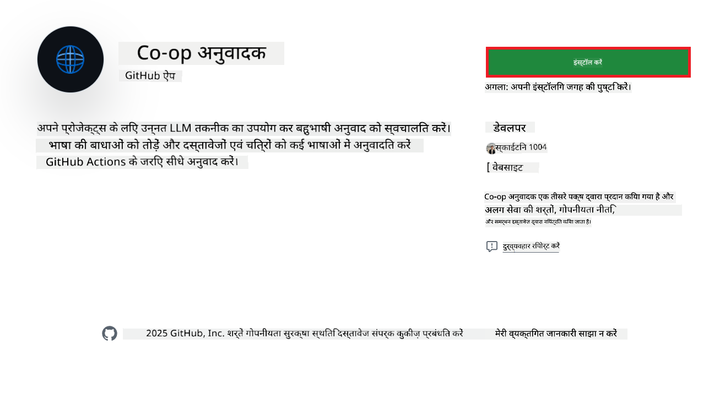
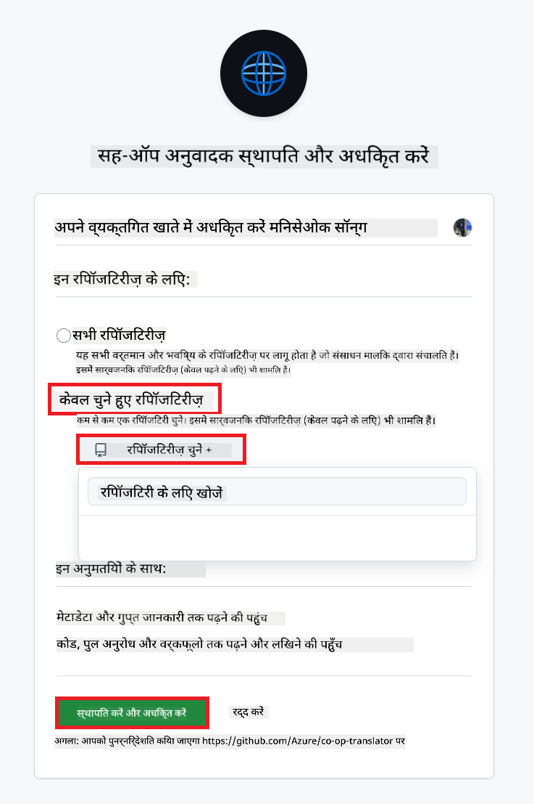
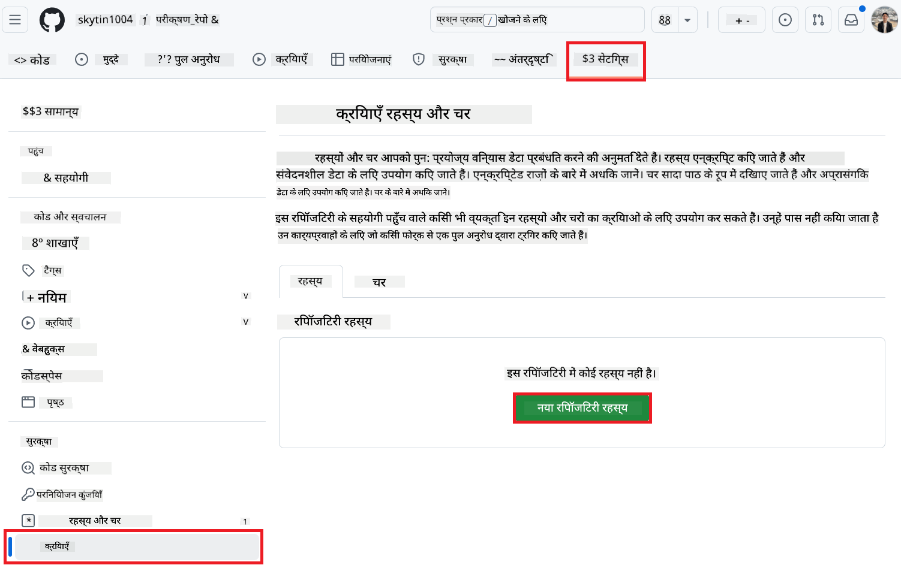
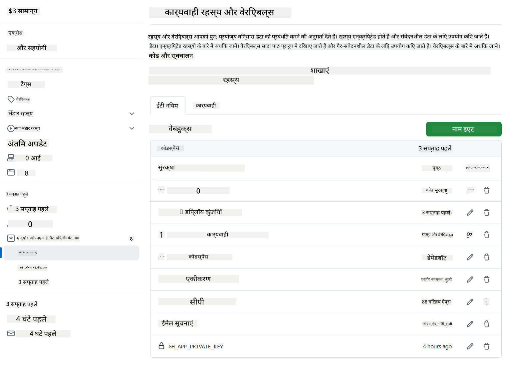

<!--
CO_OP_TRANSLATOR_METADATA:
{
  "original_hash": "c437820027c197f25fb2cbee95bae28c",
  "translation_date": "2025-06-12T19:05:36+00:00",
  "source_file": "getting_started/github-actions-guide/github-actions-guide-org.md",
  "language_code": "hi"
}
-->
# Co-op Translator GitHub Action का उपयोग करना (संगठन मार्गदर्शिका)

**लक्षित दर्शक:** यह मार्गदर्शिका **Microsoft के आंतरिक उपयोगकर्ताओं** या **उन टीमों के लिए है जिनके पास पूर्व-निर्मित Co-op Translator GitHub App के लिए आवश्यक प्रमाण-पत्र उपलब्ध हैं** या जो अपना खुद का कस्टम GitHub App बना सकते हैं।

अपने रिपॉजिटरी के दस्तावेज़ीकरण का अनुवाद स्वचालित रूप से Co-op Translator GitHub Action के माध्यम से करें। यह मार्गदर्शिका आपको यह दिखाती है कि कैसे जब भी आपके स्रोत Markdown फ़ाइलें या चित्र बदलें, तो अपडेटेड अनुवादों के साथ स्वचालित रूप से पुल रिक्वेस्ट बनाने के लिए यह Action सेटअप किया जाए।

> [!IMPORTANT]
> 
> **सही मार्गदर्शिका चुनना:**
>
> यह मार्गदर्शिका **GitHub App ID और Private Key** का उपयोग कर सेटअप करने का विवरण देती है। आमतौर पर आपको यह "संगठन मार्गदर्शिका" विधि तब उपयोग करनी होती है जब: **`GITHUB_TOKEN` अनुमतियाँ प्रतिबंधित हों:** आपकी संगठन या रिपॉजिटरी सेटिंग्स मानक `GITHUB_TOKEN` को दिए गए डिफ़ॉल्ट अनुमतियों को प्रतिबंधित करती हैं। विशेष रूप से, यदि `GITHUB_TOKEN` को आवश्यक `write` अनुमतियाँ (जैसे `contents: write` या `pull-requests: write`) नहीं दी जाती हैं, तो [Public Setup Guide](./github-actions-guide-public.md) में दिया गया वर्कफ़्लो अपर्याप्त अनुमतियों के कारण विफल हो जाएगा। स्पष्ट रूप से अनुमतियाँ प्रदान किए गए समर्पित GitHub App का उपयोग करके इस सीमा को पार किया जा सकता है।
>
> **यदि उपरोक्त आपके लिए लागू नहीं है:**
>
> यदि आपके रिपॉजिटरी में मानक `GITHUB_TOKEN` के पास पर्याप्त अनुमतियाँ हैं (यानी, आप संगठनात्मक प्रतिबंधों से अवरुद्ध नहीं हैं), तो कृपया **[GITHUB_TOKEN का उपयोग करते हुए Public Setup Guide](./github-actions-guide-public.md)** का उपयोग करें। सार्वजनिक मार्गदर्शिका में App IDs या Private Keys प्राप्त करने या प्रबंधित करने की आवश्यकता नहीं होती और यह केवल मानक `GITHUB_TOKEN` और रिपॉजिटरी अनुमतियों पर निर्भर करती है।

## पूर्वापेक्षाएँ

GitHub Action कॉन्फ़िगर करने से पहले, सुनिश्चित करें कि आपके पास आवश्यक AI सेवा प्रमाण-पत्र तैयार हैं।

**1. आवश्यक: AI भाषा मॉडल प्रमाण-पत्र**  
आपको कम से कम एक समर्थित भाषा मॉडल के लिए प्रमाण-पत्र चाहिए:

- **Azure OpenAI**: Endpoint, API Key, Model/Deployment नाम, API Version चाहिए।  
- **OpenAI**: API Key चाहिए, (वैकल्पिक: Org ID, Base URL, Model ID)।  
- विवरण के लिए देखें [Supported Models and Services](../../../../README.md)।  
- सेटअप गाइड: [Azure OpenAI सेटअप करें](../set-up-resources/set-up-azure-openai.md)।

**2. वैकल्पिक: कंप्यूटर विज़न प्रमाण-पत्र (छवि अनुवाद के लिए)**

- केवल तब आवश्यक जब आपको छवियों में टेक्स्ट का अनुवाद करना हो।  
- **Azure Computer Vision**: Endpoint और Subscription Key चाहिए।  
- यदि प्रदान नहीं किया गया, तो Action डिफ़ॉल्ट रूप से [Markdown-only mode](../markdown-only-mode.md) में चलेगा।  
- सेटअप गाइड: [Azure Computer Vision सेटअप करें](../set-up-resources/set-up-azure-computer-vision.md)।

## सेटअप और कॉन्फ़िगरेशन

अपने रिपॉजिटरी में Co-op Translator GitHub Action कॉन्फ़िगर करने के लिए निम्न चरणों का पालन करें:

### चरण 1: GitHub App Authentication इंस्टॉल और कॉन्फ़िगर करें

वर्कफ़्लो आपके रिपॉजिटरी के साथ सुरक्षित रूप से इंटरैक्ट करने के लिए GitHub App प्रमाणीकरण का उपयोग करता है (जैसे पुल रिक्वेस्ट बनाना)। एक विकल्प चुनें:

#### **विकल्प A: पूर्व-निर्मित Co-op Translator GitHub App इंस्टॉल करें (Microsoft आंतरिक उपयोग के लिए)**

1. [Co-op Translator GitHub App](https://github.com/apps/co-op-translator) पेज पर जाएँ।

1. **Install** चुनें और उस अकाउंट या संगठन का चयन करें जहाँ आपका लक्ष्य रिपॉजिटरी है।

    

1. **Only select repositories** चुनें और अपना लक्ष्य रिपॉजिटरी (जैसे `PhiCookBook`) चुनें। फिर **Install** पर क्लिक करें। आपको प्रमाणीकरण के लिए कहा जा सकता है।

    

1. **App Credentials प्राप्त करें (आंतरिक प्रक्रिया आवश्यक):** वर्कफ़्लो को ऐप के रूप में प्रमाणीकरण करने के लिए, आपको Co-op Translator टीम से दो जानकारी चाहिए:  
  - **App ID:** Co-op Translator ऐप का अद्वितीय पहचानकर्ता। App ID है: `1164076`।  
  - **Private Key:** आपको `.pem` प्राइवेट की फ़ाइल की **पूरी सामग्री** मेंटेनर संपर्क से प्राप्त करनी होगी। **इस कुंजी को पासवर्ड की तरह समझें और सुरक्षित रखें।**

1. चरण 2 पर आगे बढ़ें।

#### **विकल्प B: अपना कस्टम GitHub App उपयोग करें**

- यदि आप चाहें, तो अपना GitHub App बना सकते हैं और कॉन्फ़िगर कर सकते हैं। सुनिश्चित करें कि इसे Contents और Pull requests के लिए Read & write एक्सेस मिले। आपको इसका App ID और जनरेट किया गया Private Key चाहिए होगा।

### चरण 2: रिपॉजिटरी सीक्रेट्स कॉन्फ़िगर करें

आपको GitHub App प्रमाण-पत्र और AI सेवा प्रमाण-पत्र को अपने रिपॉजिटरी सेटिंग्स में एन्क्रिप्टेड सीक्रेट्स के रूप में जोड़ना होगा।

1. अपने लक्ष्य GitHub रिपॉजिटरी (जैसे `PhiCookBook`) पर जाएँ।

1. **Settings** > **Secrets and variables** > **Actions** पर जाएँ।

1. **Repository secrets** के अंतर्गत, नीचे सूचीबद्ध प्रत्येक सीक्रेट के लिए **New repository secret** पर क्लिक करें।

   

**आवश्यक सीक्रेट्स (GitHub App Authentication के लिए):**

| Secret Name          | विवरण                                       | मूल्य स्रोत                                     |
| :------------------- | :------------------------------------------- | :----------------------------------------------- |
| `GH_APP_ID`          | GitHub App का App ID (चरण 1 से)।             | GitHub App सेटिंग्स                              |
| `GH_APP_PRIVATE_KEY` | डाउनलोड की गई `.pem` फ़ाइल की **पूरी सामग्री**। | `.pem` फ़ाइल (चरण 1 से)                      |

**AI सेवा सीक्रेट्स (अपने पूर्वापेक्षाओं के अनुसार सभी लागू जोड़ें):**

| Secret Name                         | विवरण                               | मूल्य स्रोत                     |
| :---------------------------------- | :---------------------------------- | :------------------------------ |
| `AZURE_SUBSCRIPTION_KEY`            | Azure AI सेवा (कंप्यूटर विज़न) के लिए Key  | Azure AI Foundry                    |
| `AZURE_AI_SERVICE_ENDPOINT`         | Azure AI सेवा (कंप्यूटर विज़न) के लिए Endpoint | Azure AI Foundry                     |
| `AZURE_OPENAI_API_KEY`              | Azure OpenAI सेवा के लिए Key           | Azure AI Foundry                     |
| `AZURE_OPENAI_ENDPOINT`             | Azure OpenAI सेवा के लिए Endpoint      | Azure AI Foundry                     |
| `AZURE_OPENAI_MODEL_NAME`           | आपका Azure OpenAI मॉडल नाम             | Azure AI Foundry                     |
| `AZURE_OPENAI_CHAT_DEPLOYMENT_NAME` | आपका Azure OpenAI Deployment नाम        | Azure AI Foundry                     |
| `AZURE_OPENAI_API_VERSION`          | Azure OpenAI के लिए API Version          | Azure AI Foundry                     |
| `OPENAI_API_KEY`                    | OpenAI के लिए API Key                   | OpenAI Platform                  |
| `OPENAI_ORG_ID`                     | OpenAI Organization ID                  | OpenAI Platform                  |
| `OPENAI_CHAT_MODEL_ID`              | विशिष्ट OpenAI मॉडल ID                  | OpenAI Platform                    |
| `OPENAI_BASE_URL`                   | कस्टम OpenAI API Base URL               | OpenAI Platform                    |



### चरण 3: वर्कफ़्लो फ़ाइल बनाएँ

अंत में, स्वचालित वर्कफ़्लो को परिभाषित करने वाली YAML फ़ाइल बनाएँ।

1. अपने रिपॉजिटरी की रूट डायरेक्टरी में, `.github/workflows/` डायरेक्टरी बनाएँ यदि वह मौजूद नहीं है।

1. `.github/workflows/` के अंदर, `co-op-translator.yml` नामक एक फ़ाइल बनाएँ।

1. निम्नलिखित सामग्री को co-op-translator.yml में पेस्ट करें।

```
name: Co-op Translator

on:
  push:
    branches:
      - main

jobs:
  co-op-translator:
    runs-on: ubuntu-latest

    permissions:
      contents: write
      pull-requests: write

    steps:
      - name: Checkout repository
        uses: actions/checkout@v4
        with:
          fetch-depth: 0

      - name: Set up Python
        uses: actions/setup-python@v4
        with:
          python-version: '3.10'

      - name: Install Co-op Translator
        run: |
          python -m pip install --upgrade pip
          pip install co-op-translator

      - name: Run Co-op Translator
        env:
          PYTHONIOENCODING: utf-8
          # Azure AI Service Credentials
          AZURE_SUBSCRIPTION_KEY: ${{ secrets.AZURE_SUBSCRIPTION_KEY }}
          AZURE_AI_SERVICE_ENDPOINT: ${{ secrets.AZURE_AI_SERVICE_ENDPOINT }}

          # Azure OpenAI Credentials
          AZURE_OPENAI_API_KEY: ${{ secrets.AZURE_OPENAI_API_KEY }}
          AZURE_OPENAI_ENDPOINT: ${{ secrets.AZURE_OPENAI_ENDPOINT }}
          AZURE_OPENAI_MODEL_NAME: ${{ secrets.AZURE_OPENAI_MODEL_NAME }}
          AZURE_OPENAI_CHAT_DEPLOYMENT_NAME: ${{ secrets.AZURE_OPENAI_CHAT_DEPLOYMENT_NAME }}
          AZURE_OPENAI_API_VERSION: ${{ secrets.AZURE_OPENAI_API_VERSION }}

          # OpenAI Credentials
          OPENAI_API_KEY: ${{ secrets.OPENAI_API_KEY }}
          OPENAI_ORG_ID: ${{ secrets.OPENAI_ORG_ID }}
          OPENAI_CHAT_MODEL_ID: ${{ secrets.OPENAI_CHAT_MODEL_ID }}
          OPENAI_BASE_URL: ${{ secrets.OPENAI_BASE_URL }}
        run: |
          # =====================================================================
          # IMPORTANT: Set your target languages here (REQUIRED CONFIGURATION)
          # =====================================================================
          # Example: Translate to Spanish, French, German. Add -y to auto-confirm.
          translate -l "es fr de" -y  # <--- MODIFY THIS LINE with your desired languages

      - name: Authenticate GitHub App
        id: generate_token
        uses: tibdex/github-app-token@v1
        with:
          app_id: ${{ secrets.GH_APP_ID }}
          private_key: ${{ secrets.GH_APP_PRIVATE_KEY }}

      - name: Create Pull Request with translations
        uses: peter-evans/create-pull-request@v5
        with:
          token: ${{ steps.generate_token.outputs.token }}
          commit-message: "🌐 Update translations via Co-op Translator"
          title: "🌐 Update translations via Co-op Translator"
          body: |
            This PR updates translations for recent changes to the main branch.

            ### 📋 Changes included
            - Translated contents are available in the `translations/` directory
            - Translated images are available in the `translated_images/` directory

            ---
            🌐 Automatically generated by the [Co-op Translator](https://github.com/Azure/co-op-translator) GitHub Action.
          branch: update-translations
          base: main
          labels: translation, automated-pr
          delete-branch: true
          add-paths: |
            translations/
            translated_images/

```

4.  **वर्कफ़्लो को कस्टमाइज़ करें:**  
  - **[!IMPORTANT] लक्ष्य भाषाएँ:** `Run Co-op Translator` step, you **MUST review and modify the list of language codes** within the `translate -l "..." -y` command to match your project's requirements. The example list (`ar de es...`) needs to be replaced or adjusted.
  - **Trigger (`on:`):** The current trigger runs on every push to `main`. For large repositories, consider adding a `paths:` filter (see commented example in the YAML) to run the workflow only when relevant files (e.g., source documentation) change, saving runner minutes.
  - **PR Details:** Customize the `commit-message`, `title`, `body`, `branch` name, and `labels` in the `Create Pull Request` step if needed.

## Credential Management and Renewal

- **Security:** Always store sensitive credentials (API keys, private keys) as GitHub Actions secrets. Never expose them in your workflow file or repository code.
- **[!IMPORTANT] Key Renewal (Internal Microsoft Users):** Be aware that Azure OpenAI key used within Microsoft might have a mandatory renewal policy (e.g., every 5 months). Ensure you update the corresponding GitHub secrets (`AZURE_OPENAI_...` कुंजियाँ) **उनकी एक्सपायरी से पहले** सेट करें ताकि वर्कफ़्लो विफल न हो।

## वर्कफ़्लो चलाना

जब `co-op-translator.yml` फ़ाइल आपकी main शाखा (या `on:` trigger), the workflow will automatically run whenever changes are pushed to that branch (and match the `paths` फ़िल्टर में निर्दिष्ट शाखा, यदि कॉन्फ़िगर किया गया हो) में मर्ज हो जाती है।

यदि अनुवाद उत्पन्न या अपडेट होते हैं, तो यह Action स्वचालित रूप से परिवर्तनों के साथ एक पुल रिक्वेस्ट बनाएगा, जो आपकी समीक्षा और मर्जिंग के लिए तैयार होगा।

**अस्वीकरण**:  
यह दस्तावेज़ AI अनुवाद सेवा [Co-op Translator](https://github.com/Azure/co-op-translator) का उपयोग करके अनुवादित किया गया है। जबकि हम सटीकता के लिए प्रयासरत हैं, कृपया ध्यान दें कि स्वचालित अनुवादों में त्रुटियाँ या अशुद्धियाँ हो सकती हैं। मूल दस्तावेज़ अपनी मूल भाषा में ही अधिकारिक स्रोत माना जाना चाहिए। महत्वपूर्ण जानकारी के लिए पेशेवर मानव अनुवाद की सलाह दी जाती है। इस अनुवाद के उपयोग से उत्पन्न किसी भी गलतफहमी या गलत व्याख्या के लिए हम जिम्मेदार नहीं हैं।