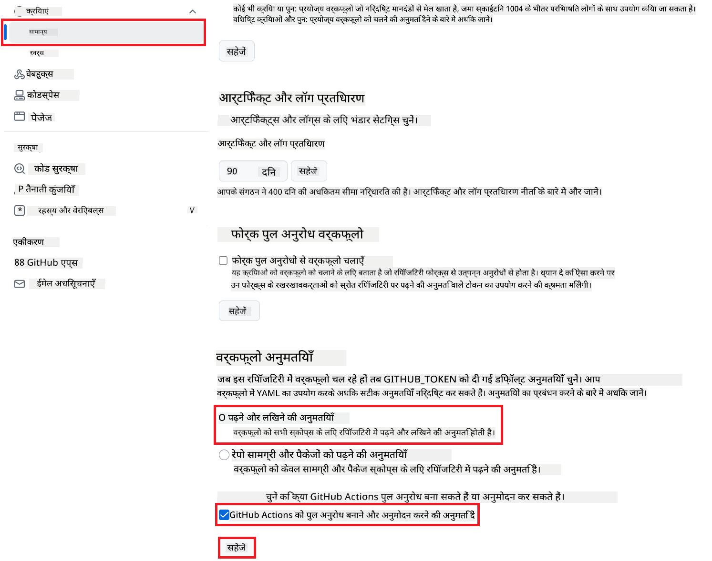

<!--
CO_OP_TRANSLATOR_METADATA:
{
  "original_hash": "a52587a512e667f70d92db853d3c61d5",
  "translation_date": "2025-06-12T19:25:08+00:00",
  "source_file": "getting_started/github-actions-guide/github-actions-guide-public.md",
  "language_code": "hi"
}
-->
# Co-op Translator GitHub Action का उपयोग करना (सार्वजनिक सेटअप)

**लक्षित दर्शक:** यह गाइड अधिकांश सार्वजनिक या निजी रिपॉजिटरी उपयोगकर्ताओं के लिए है जहाँ मानक GitHub Actions अनुमतियाँ पर्याप्त होती हैं। यह अंतर्निर्मित `GITHUB_TOKEN` का उपयोग करता है।

अपने रिपॉजिटरी के दस्तावेज़ीकरण का अनुवाद आसानी से स्वचालित करें Co-op Translator GitHub Action के माध्यम से। यह गाइड आपको यह दिखाता है कि कैसे इस एक्शन को सेटअप करें ताकि जब भी आपके स्रोत Markdown फाइलें या चित्र बदलें, तो यह स्वचालित रूप से अपडेटेड अनुवादों के साथ पुल रिक्वेस्ट बनाए।

> [!IMPORTANT]
>
> **सही गाइड चुनना:**
>
> यह गाइड **मानक `GITHUB_TOKEN` का उपयोग करके सरल सेटअप** बताता है। यह अधिकांश उपयोगकर्ताओं के लिए अनुशंसित तरीका है क्योंकि इसमें संवेदनशील GitHub App प्राइवेट कीज़ प्रबंधित करने की आवश्यकता नहीं होती।
>

## आवश्यकताएँ

GitHub Action को कॉन्फ़िगर करने से पहले, सुनिश्चित करें कि आपके पास आवश्यक AI सेवा क्रेडेंशियल्स तैयार हैं।

**1. आवश्यक: AI भाषा मॉडल क्रेडेंशियल्स**  
आपको कम से कम एक समर्थित भाषा मॉडल के लिए क्रेडेंशियल्स चाहिए:

- **Azure OpenAI**: Endpoint, API Key, Model/Deployment Names, API Version चाहिए।  
- **OpenAI**: API Key चाहिए, (वैकल्पिक: Org ID, Base URL, Model ID)।  
- विवरण के लिए देखें [Supported Models and Services](../../../../README.md)।

**2. वैकल्पिक: AI विज़न क्रेडेंशियल्स (इमेज अनुवाद के लिए)**

- केवल तब आवश्यक जब आपको छवियों के भीतर टेक्स्ट का अनुवाद करना हो।  
- **Azure AI Vision**: Endpoint और Subscription Key चाहिए।  
- यदि यह प्रदान नहीं किया गया, तो एक्शन डिफ़ॉल्ट रूप से [Markdown-only mode](../markdown-only-mode.md) में चलता है।

## सेटअप और कॉन्फ़िगरेशन

मानक `GITHUB_TOKEN` का उपयोग करके अपने रिपॉजिटरी में Co-op Translator GitHub Action को सेटअप करने के लिए निम्न चरणों का पालन करें।

### चरण 1: प्रमाणीकरण समझें (`GITHUB_TOKEN` का उपयोग)

यह वर्कफ़्लो GitHub Actions द्वारा प्रदान किए गए अंतर्निर्मित `GITHUB_TOKEN` का उपयोग करता है। यह टोकन स्वचालित रूप से आपके रिपॉजिटरी के साथ इंटरैक्ट करने के लिए आवश्यक अनुमतियाँ देता है, जो **चरण 3** में कॉन्फ़िगर की गई सेटिंग्स पर आधारित होती हैं।

### चरण 2: रिपॉजिटरी सीक्रेट्स कॉन्फ़िगर करें

आपको केवल अपने **AI सेवा क्रेडेंशियल्स** को अपने रिपॉजिटरी सेटिंग्स में एन्क्रिप्टेड सीक्रेट्स के रूप में जोड़ना होगा।

1.  अपने लक्षित GitHub रिपॉजिटरी पर जाएँ।  
2.  **Settings** > **Secrets and variables** > **Actions** पर जाएँ।  
3.  **Repository secrets** के अंतर्गत, प्रत्येक आवश्यक AI सेवा सीक्रेट के लिए **New repository secret** पर क्लिक करें।

     *(छवि संदर्भ: दिखाता है कि सीक्रेट्स कहाँ जोड़े जाएं)*

**आवश्यक AI सेवा सीक्रेट्स (अपने आवश्यकतानुसार सभी जोड़ें):**

| Secret Name                         | विवरण                                    | मूल्य स्रोत                       |
| :---------------------------------- | :---------------------------------------- | :------------------------------- |
| `AZURE_SUBSCRIPTION_KEY`            | Azure AI सेवा (कंप्यूटर विज़न) के लिए कुंजी  | आपका Azure AI Foundry              |
| `AZURE_AI_SERVICE_ENDPOINT`         | Azure AI सेवा (कंप्यूटर विज़न) के लिए Endpoint | आपका Azure AI Foundry              |
| `AZURE_OPENAI_API_KEY`              | Azure OpenAI सेवा के लिए कुंजी              | आपका Azure AI Foundry              |
| `AZURE_OPENAI_ENDPOINT`             | Azure OpenAI सेवा के लिए Endpoint         | आपका Azure AI Foundry              |
| `AZURE_OPENAI_MODEL_NAME`           | आपका Azure OpenAI मॉडल नाम              | आपका Azure AI Foundry              |
| `AZURE_OPENAI_CHAT_DEPLOYMENT_NAME` | आपका Azure OpenAI डिप्लॉयमेंट नाम         | आपका Azure AI Foundry              |
| `AZURE_OPENAI_API_VERSION`          | Azure OpenAI के लिए API संस्करण              | आपका Azure AI Foundry              |
| `OPENAI_API_KEY`                    | OpenAI के लिए API कुंजी                        | आपका OpenAI प्लेटफ़ॉर्म            |
| `OPENAI_ORG_ID`                     | OpenAI संगठन ID (वैकल्पिक)                     | आपका OpenAI प्लेटफ़ॉर्म            |
| `OPENAI_CHAT_MODEL_ID`              | विशिष्ट OpenAI मॉडल ID (वैकल्पिक)             | आपका OpenAI प्लेटफ़ॉर्म            |
| `OPENAI_BASE_URL`                   | कस्टम OpenAI API बेस URL (वैकल्पिक)           | आपका OpenAI प्लेटफ़ॉर्म            |

### चरण 3: वर्कफ़्लो अनुमतियाँ कॉन्फ़िगर करें

GitHub Action को कोड चेक आउट करने और पुल रिक्वेस्ट बनाने के लिए `GITHUB_TOKEN` के माध्यम से अनुमतियाँ चाहिए।

1.  अपने रिपॉजिटरी में **Settings** > **Actions** > **General** पर जाएँ।  
2.  नीचे स्क्रॉल करें **Workflow permissions** सेक्शन तक।  
3.  **Read and write permissions** चुनें। यह इस वर्कफ़्लो के लिए `GITHUB_TOKEN` को आवश्यक `contents: write` और `pull-requests: write` अनुमतियाँ देता है।  
4.  सुनिश्चित करें कि **Allow GitHub Actions to create and approve pull requests** के लिए चेकबॉक्स **चेक** किया गया हो।  
5.  **Save** पर क्लिक करें।



### चरण 4: वर्कफ़्लो फ़ाइल बनाएं

अंत में, YAML फ़ाइल बनाएं जो स्वचालित वर्कफ़्लो को परिभाषित करती है, जिसमें `GITHUB_TOKEN` का उपयोग होता है।

1.  अपने रिपॉजिटरी की रूट डायरेक्टरी में, यदि मौजूद नहीं है तो `.github/workflows/` डायरेक्टरी बनाएं।  
2.  `.github/workflows/` के अंदर, `co-op-translator.yml` नामक एक फ़ाइल बनाएं।  
3.  नीचे दिया गया कंटेंट `co-op-translator.yml` में पेस्ट करें।

```yaml
name: Co-op Translator

on:
  push:
    branches:
      - main

jobs:
  co-op-translator:
    runs-on: ubuntu-latest

    permissions:
      contents: write
      pull-requests: write

    steps:
      - name: Checkout repository
        uses: actions/checkout@v4
        with:
          fetch-depth: 0

      - name: Set up Python
        uses: actions/setup-python@v4
        with:
          python-version: '3.10'

      - name: Install Co-op Translator
        run: |
          python -m pip install --upgrade pip
          pip install co-op-translator

      - name: Run Co-op Translator
        env:
          PYTHONIOENCODING: utf-8
          # === AI Service Credentials ===
          AZURE_SUBSCRIPTION_KEY: ${{ secrets.AZURE_SUBSCRIPTION_KEY }}
          AZURE_AI_SERVICE_ENDPOINT: ${{ secrets.AZURE_AI_SERVICE_ENDPOINT }}
          AZURE_OPENAI_API_KEY: ${{ secrets.AZURE_OPENAI_API_KEY }}
          AZURE_OPENAI_ENDPOINT: ${{ secrets.AZURE_OPENAI_ENDPOINT }}
          AZURE_OPENAI_MODEL_NAME: ${{ secrets.AZURE_OPENAI_MODEL_NAME }}
          AZURE_OPENAI_CHAT_DEPLOYMENT_NAME: ${{ secrets.AZURE_OPENAI_CHAT_DEPLOYMENT_NAME }}
          AZURE_OPENAI_API_VERSION: ${{ secrets.AZURE_OPENAI_API_VERSION }}
          OPENAI_API_KEY: ${{ secrets.OPENAI_API_KEY }}
          OPENAI_ORG_ID: ${{ secrets.OPENAI_ORG_ID }}
          OPENAI_CHAT_MODEL_ID: ${{ secrets.OPENAI_CHAT_MODEL_ID }}
          OPENAI_BASE_URL: ${{ secrets.OPENAI_BASE_URL }}
        run: |
          # =====================================================================
          # IMPORTANT: Set your target languages here (REQUIRED CONFIGURATION)
          # =====================================================================
          # Example: Translate to Spanish, French, German. Add -y to auto-confirm.
          translate -l "es fr de" -y  # <--- MODIFY THIS LINE with your desired languages

      - name: Create Pull Request with translations
        uses: peter-evans/create-pull-request@v5
        with:
          token: ${{ secrets.GITHUB_TOKEN }}
          commit-message: "🌐 Update translations via Co-op Translator"
          title: "🌐 Update translations via Co-op Translator"
          body: |
            This PR updates translations for recent changes to the main branch.

            ### 📋 Changes included
            - Translated contents are available in the `translations/` directory
            - Translated images are available in the `translated_images/` directory

            ---
            🌐 Automatically generated by the [Co-op Translator](https://github.com/Azure/co-op-translator) GitHub Action.
          branch: update-translations
          base: main
          labels: translation, automated-pr
          delete-branch: true
          add-paths: |
            translations/
            translated_images/
```  
4.  **वर्कफ़्लो को कस्टमाइज़ करें:**  
  - **[!IMPORTANT] लक्षित भाषाएँ:** यदि आवश्यक हो तो `Run Co-op Translator` step, you **MUST review and modify the list of language codes** within the `translate -l "..." -y` command to match your project's requirements. The example list (`ar de es...`) needs to be replaced or adjusted.
  - **Trigger (`on:`):** The current trigger runs on every push to `main`. For large repositories, consider adding a `paths:` filter (see commented example in the YAML) to run the workflow only when relevant files (e.g., source documentation) change, saving runner minutes.
  - **PR Details:** Customize the `commit-message`, `title`, `body`, `branch` name, and `labels` in the `Create Pull Request` स्टेप में लक्ष्य भाषाएँ सेट करें।

**अस्वीकरण**:  
इस दस्तावेज़ का अनुवाद AI अनुवाद सेवा [Co-op Translator](https://github.com/Azure/co-op-translator) का उपयोग करके किया गया है। हम सटीकता के लिए प्रयासरत हैं, लेकिन कृपया ध्यान दें कि स्वचालित अनुवादों में त्रुटियाँ या गलतियाँ हो सकती हैं। मूल दस्तावेज़ को उसकी मूल भाषा में ही अधिकारिक स्रोत माना जाना चाहिए। महत्वपूर्ण जानकारी के लिए, पेशेवर मानव अनुवाद की सलाह दी जाती है। इस अनुवाद के उपयोग से उत्पन्न किसी भी गलतफहमी या गलत व्याख्या के लिए हम उत्तरदायी नहीं हैं।