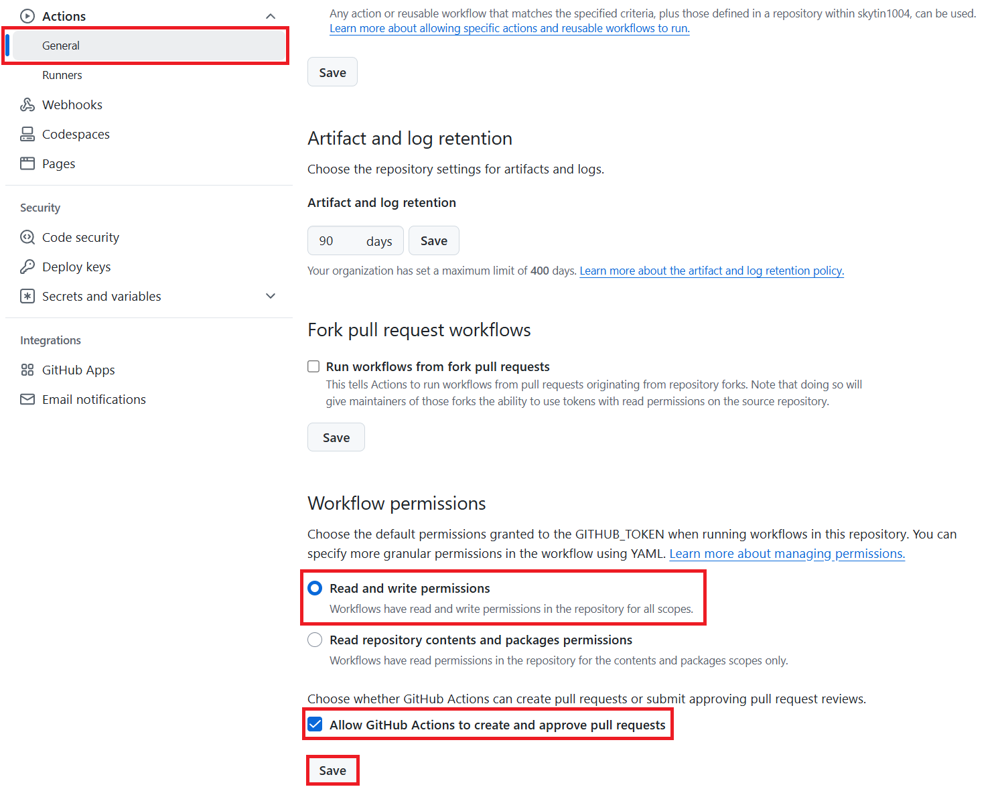

<!--
CO_OP_TRANSLATOR_METADATA:
{
  "original_hash": "a52587a512e667f70d92db853d3c61d5",
  "translation_date": "2025-05-07T14:10:04+00:00",
  "source_file": "getting_started/github-actions-guide/github-actions-guide-public.md",
  "language_code": "hi"
}
-->
# Co-op Translator GitHub Action का उपयोग करना (सार्वजनिक सेटअप)

**लक्षित दर्शक:** यह गाइड उन उपयोगकर्ताओं के लिए है जो अधिकांश सार्वजनिक या निजी रिपॉजिटरी में हैं जहाँ मानक GitHub Actions अनुमतियाँ पर्याप्त होती हैं। यह अंतर्निहित `GITHUB_TOKEN` का उपयोग करता है।

अपने रिपॉजिटरी के दस्तावेज़ों का अनुवाद आसानी से स्वचालित करने के लिए Co-op Translator GitHub Action का उपयोग करें। यह गाइड आपको यह दिखाता है कि जब भी आपके स्रोत Markdown फ़ाइलें या छवियाँ बदलती हैं, तो अपडेटेड अनुवादों के साथ ऑटोमेटिक पुल रिक्वेस्ट कैसे बनाएं।

> [!IMPORTANT]
>
> **सही गाइड चुनना:**
>
> यह गाइड **मानक `GITHUB_TOKEN` का उपयोग करके सरल सेटअप** के बारे में है। यह अधिकांश उपयोगकर्ताओं के लिए अनुशंसित तरीका है क्योंकि इसमें संवेदनशील GitHub App Private Keys को प्रबंधित करने की आवश्यकता नहीं होती।
>

## आवश्यकताएँ

GitHub Action को कॉन्फ़िगर करने से पहले, सुनिश्चित करें कि आपके पास आवश्यक AI सेवा क्रेडेंशियल्स तैयार हैं।

**1. आवश्यक: AI भाषा मॉडल क्रेडेंशियल्स**  
आपको कम से कम एक समर्थित भाषा मॉडल के लिए क्रेडेंशियल्स चाहिए:

- **Azure OpenAI**: Endpoint, API Key, Model/Deployment नाम, API Version की आवश्यकता होती है।  
- **OpenAI**: API Key, (वैकल्पिक: Org ID, Base URL, Model ID) की आवश्यकता होती है।  
- विवरण के लिए [Supported Models and Services](../../../../README.md) देखें।

**2. वैकल्पिक: AI Vision क्रेडेंशियल्स (छवि अनुवाद के लिए)**

- केवल तब आवश्यक जब आपको छवियों में टेक्स्ट का अनुवाद करना हो।  
- **Azure AI Vision**: Endpoint और Subscription Key चाहिए।  
- यदि नहीं दिया गया, तो यह एक्शन [Markdown-only mode](../markdown-only-mode.md) में चलेगा।

## सेटअप और कॉन्फ़िगरेशन

मानक `GITHUB_TOKEN` का उपयोग करते हुए अपने रिपॉजिटरी में Co-op Translator GitHub Action को कॉन्फ़िगर करने के लिए नीचे दिए गए चरणों का पालन करें।

### चरण 1: प्रमाणीकरण को समझें (`GITHUB_TOKEN` का उपयोग)

यह वर्कफ़्लो GitHub Actions द्वारा प्रदान किए गए अंतर्निहित `GITHUB_TOKEN` का उपयोग करता है। यह टोकन स्वचालित रूप से वर्कफ़्लो को आपके रिपॉजिटरी के साथ इंटरैक्ट करने की अनुमति देता है, जैसा कि **चरण 3** में कॉन्फ़िगर किया गया है।

### चरण 2: रिपॉजिटरी सीक्रेट्स कॉन्फ़िगर करें

आपको केवल अपनी **AI सेवा क्रेडेंशियल्स** को अपने रिपॉजिटरी सेटिंग्स में एन्क्रिप्टेड सीक्रेट्स के रूप में जोड़ना होगा।

1.  अपने लक्षित GitHub रिपॉजिटरी पर जाएं।  
2.  **Settings** > **Secrets and variables** > **Actions** पर जाएं।  
3.  **Repository secrets** के तहत, प्रत्येक आवश्यक AI सेवा सीक्रेट के लिए **New repository secret** पर क्लिक करें।

     *(छवि संदर्भ: जहाँ सीक्रेट्स जोड़ने हैं)*

**आवश्यक AI सेवा सीक्रेट्स (अपने आवश्यकतानुसार सभी जोड़ें):**

| Secret Name                         | विवरण                                   | मान स्रोत                         |
| :---------------------------------- | :---------------------------------------- | :------------------------------- |
| `AZURE_SUBSCRIPTION_KEY`            | Azure AI Service (Computer Vision) के लिए Key  | आपका Azure AI Foundry               |
| `AZURE_AI_SERVICE_ENDPOINT`         | Azure AI Service (Computer Vision) के लिए Endpoint | आपका Azure AI Foundry               |
| `AZURE_OPENAI_API_KEY`              | Azure OpenAI सेवा के लिए Key              | आपका Azure AI Foundry               |
| `AZURE_OPENAI_ENDPOINT`             | Azure OpenAI सेवा के लिए Endpoint         | आपका Azure AI Foundry               |
| `AZURE_OPENAI_MODEL_NAME`           | आपका Azure OpenAI मॉडल नाम              | आपका Azure AI Foundry               |
| `AZURE_OPENAI_CHAT_DEPLOYMENT_NAME` | आपका Azure OpenAI Deployment नाम         | आपका Azure AI Foundry               |
| `AZURE_OPENAI_API_VERSION`          | Azure OpenAI के लिए API Version              | आपका Azure AI Foundry               |
| `OPENAI_API_KEY`                    | OpenAI के लिए API Key                        | आपका OpenAI Platform              |
| `OPENAI_ORG_ID`                     | OpenAI Organization ID (वैकल्पिक)         | आपका OpenAI Platform              |
| `OPENAI_CHAT_MODEL_ID`              | विशिष्ट OpenAI मॉडल ID (वैकल्पिक)       | आपका OpenAI Platform              |
| `OPENAI_BASE_URL`                   | कस्टम OpenAI API Base URL (वैकल्पिक)     | आपका OpenAI Platform              |

### चरण 3: वर्कफ़्लो अनुमतियाँ कॉन्फ़िगर करें

GitHub Action को कोड चेकआउट करने और पुल रिक्वेस्ट बनाने के लिए `GITHUB_TOKEN` के माध्यम से अनुमतियाँ चाहिए।

1.  अपने रिपॉजिटरी में, **Settings** > **Actions** > **General** पर जाएं।  
2.  नीचे स्क्रॉल करें और **Workflow permissions** सेक्शन देखें।  
3.  **Read and write permissions** चुनें। इससे `GITHUB_TOKEN` को इस वर्कफ़्लो के लिए आवश्यक `contents: write` और `pull-requests: write` अनुमतियाँ मिलेंगी।  
4.  सुनिश्चित करें कि **Allow GitHub Actions to create and approve pull requests** का चेकबॉक्स चुना हुआ हो।  
5.  **Save** पर क्लिक करें।



### चरण 4: वर्कफ़्लो फ़ाइल बनाएं

अंत में, `GITHUB_TOKEN` का उपयोग करते हुए स्वचालित वर्कफ़्लो को परिभाषित करने वाली YAML फ़ाइल बनाएं।

1.  अपने रिपॉजिटरी की रूट डायरेक्टरी में, यदि मौजूद नहीं है तो `.github/workflows/` डायरेक्टरी बनाएं।  
2.  `.github/workflows/` के अंदर, `co-op-translator.yml` नाम की एक फ़ाइल बनाएं।  
3.  नीचे दिया गया कंटेंट `co-op-translator.yml` में पेस्ट करें।

```yaml
name: Co-op Translator

on:
  push:
    branches:
      - main

jobs:
  co-op-translator:
    runs-on: ubuntu-latest

    permissions:
      contents: write
      pull-requests: write

    steps:
      - name: Checkout repository
        uses: actions/checkout@v4
        with:
          fetch-depth: 0

      - name: Set up Python
        uses: actions/setup-python@v4
        with:
          python-version: '3.10'

      - name: Install Co-op Translator
        run: |
          python -m pip install --upgrade pip
          pip install co-op-translator

      - name: Run Co-op Translator
        env:
          PYTHONIOENCODING: utf-8
          # === AI Service Credentials ===
          AZURE_SUBSCRIPTION_KEY: ${{ secrets.AZURE_SUBSCRIPTION_KEY }}
          AZURE_AI_SERVICE_ENDPOINT: ${{ secrets.AZURE_AI_SERVICE_ENDPOINT }}
          AZURE_OPENAI_API_KEY: ${{ secrets.AZURE_OPENAI_API_KEY }}
          AZURE_OPENAI_ENDPOINT: ${{ secrets.AZURE_OPENAI_ENDPOINT }}
          AZURE_OPENAI_MODEL_NAME: ${{ secrets.AZURE_OPENAI_MODEL_NAME }}
          AZURE_OPENAI_CHAT_DEPLOYMENT_NAME: ${{ secrets.AZURE_OPENAI_CHAT_DEPLOYMENT_NAME }}
          AZURE_OPENAI_API_VERSION: ${{ secrets.AZURE_OPENAI_API_VERSION }}
          OPENAI_API_KEY: ${{ secrets.OPENAI_API_KEY }}
          OPENAI_ORG_ID: ${{ secrets.OPENAI_ORG_ID }}
          OPENAI_CHAT_MODEL_ID: ${{ secrets.OPENAI_CHAT_MODEL_ID }}
          OPENAI_BASE_URL: ${{ secrets.OPENAI_BASE_URL }}
        run: |
          # =====================================================================
          # IMPORTANT: Set your target languages here (REQUIRED CONFIGURATION)
          # =====================================================================
          # Example: Translate to Spanish, French, German. Add -y to auto-confirm.
          translate -l "es fr de" -y  # <--- MODIFY THIS LINE with your desired languages

      - name: Create Pull Request with translations
        uses: peter-evans/create-pull-request@v5
        with:
          token: ${{ secrets.GITHUB_TOKEN }}
          commit-message: "🌐 Update translations via Co-op Translator"
          title: "🌐 Update translations via Co-op Translator"
          body: |
            This PR updates translations for recent changes to the main branch.

            ### 📋 Changes included
            - Translated contents are available in the `translations/` directory
            - Translated images are available in the `translated_images/` directory

            ---
            🌐 Automatically generated by the [Co-op Translator](https://github.com/Azure/co-op-translator) GitHub Action.
          branch: update-translations
          base: main
          labels: translation, automated-pr
          delete-branch: true
          add-paths: |
            translations/
            translated_images/
```
4.  **वर्कफ़्लो को अनुकूलित करें:**  
  - **[!IMPORTANT] लक्षित भाषाएँ:** `Run Co-op Translator` step, you **MUST review and modify the list of language codes** within the `translate -l "..." -y` command to match your project's requirements. The example list (`ar de es...`) needs to be replaced or adjusted.
  - **Trigger (`on:`):** The current trigger runs on every push to `main`. For large repositories, consider adding a `paths:` filter (see commented example in the YAML) to run the workflow only when relevant files (e.g., source documentation) change, saving runner minutes.
  - **PR Details:** Customize the `commit-message`, `title`, `body`, `branch` name, and `labels` in the `Create Pull Request` चरण में आवश्यकतानुसार सेट करें।

**अस्वीकरण**:  
यह दस्तावेज़ AI अनुवाद सेवा [Co-op Translator](https://github.com/Azure/co-op-translator) का उपयोग करके अनुवादित किया गया है। जबकि हम सटीकता के लिए प्रयासरत हैं, कृपया ध्यान दें कि स्वचालित अनुवादों में त्रुटियाँ या अशुद्धियाँ हो सकती हैं। मूल दस्तावेज़ को उसकी मूल भाषा में ही अधिकारिक स्रोत माना जाना चाहिए। महत्वपूर्ण जानकारी के लिए पेशेवर मानव अनुवाद की सलाह दी जाती है। इस अनुवाद के उपयोग से उत्पन्न किसी भी गलतफहमी या गलत व्याख्या के लिए हम जिम्मेदार नहीं हैं।