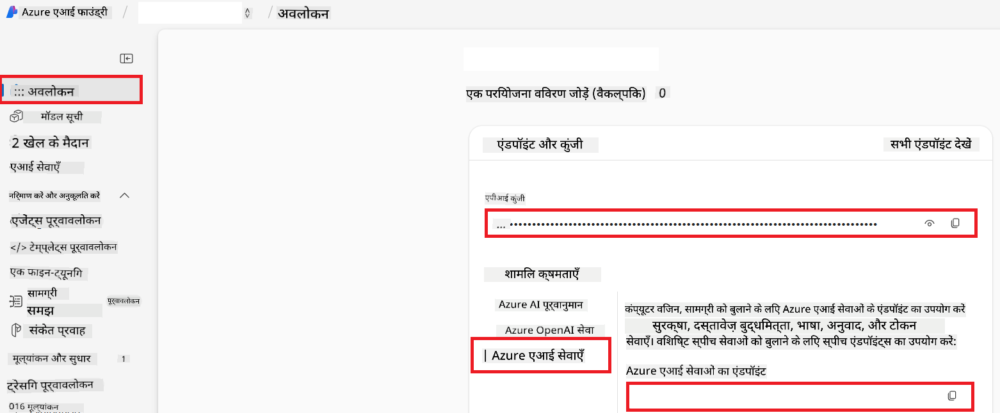

<!--
CO_OP_TRANSLATOR_METADATA:
{
  "original_hash": "b58d7c3cb4210697a073d20eb3064945",
  "translation_date": "2025-06-12T11:49:25+00:00",
  "source_file": "getting_started/set-up-azure-ai.md",
  "language_code": "hi"
}
-->
# Azure AI को-ऑप ट्रांसलेटर (Azure OpenAI & Azure AI Vision) के लिए सेटअप

यह गाइड आपको Azure AI Foundry के अंदर भाषा अनुवाद के लिए Azure OpenAI और छवि सामग्री विश्लेषण के लिए Azure Computer Vision (जिसे बाद में छवि-आधारित अनुवाद के लिए उपयोग किया जा सकता है) सेटअप करने में मदद करता है।

**पूर्व आवश्यकताएँ:**
- एक सक्रिय सब्सक्रिप्शन के साथ Azure खाता।
- आपके Azure सब्सक्रिप्शन में संसाधन और डिप्लॉयमेंट बनाने के लिए पर्याप्त अनुमतियाँ।

## Azure AI प्रोजेक्ट बनाएं

आप Azure AI प्रोजेक्ट बनाकर शुरू करेंगे, जो आपके AI संसाधनों के प्रबंधन के लिए एक केंद्रीय स्थान के रूप में काम करता है।

1. [https://ai.azure.com](https://ai.azure.com) पर जाएं और अपने Azure खाते से साइन इन करें।

1. नया प्रोजेक्ट बनाने के लिए **+Create** चुनें।

1. निम्न कार्य करें:
   - एक **Project name** दर्ज करें (जैसे, `CoopTranslator-Project`)।
   - **AI hub** चुनें (जैसे, `CoopTranslator-Hub`) (यदि आवश्यक हो तो नया बनाएं)।

1. अपना प्रोजेक्ट सेटअप करने के लिए "**Review and Create**" पर क्लिक करें। आप अपने प्रोजेक्ट के अवलोकन पृष्ठ पर पहुंच जाएंगे।

## भाषा अनुवाद के लिए Azure OpenAI सेटअप करें

अपने प्रोजेक्ट के अंदर, आप टेक्स्ट अनुवाद के लिए बैकएंड के रूप में Azure OpenAI मॉडल तैनात करेंगे।

### अपने प्रोजेक्ट पर जाएं

यदि आप पहले से वहां नहीं हैं, तो अपने नए बनाए गए प्रोजेक्ट (जैसे, `CoopTranslator-Project`) को Azure AI Foundry में खोलें।

### OpenAI मॉडल तैनात करें

1. अपने प्रोजेक्ट के बाएं मेनू में, "My assets" के तहत "**Models + endpoints**" चुनें।

1. **+ Deploy model** चुनें।

1. **Deploy Base Model** चुनें।

1. उपलब्ध मॉडलों की सूची दिखाई जाएगी। एक उपयुक्त GPT मॉडल खोजें या फ़िल्टर करें। हम `gpt-4o` की सलाह देते हैं।

1. अपनी पसंद का मॉडल चुनें और **Confirm** पर क्लिक करें।

1. **Deploy** चुनें।

### Azure OpenAI कॉन्फ़िगरेशन

तैनाती के बाद, आप "**Models + endpoints**" पेज से उस डिप्लॉयमेंट को चुन सकते हैं ताकि उसका **REST endpoint URL**, **Key**, **Deployment name**, **Model name** और **API version** मिल सके। इनकी आवश्यकता आपके अनुवाद मॉडल को आपकी एप्लिकेशन में एकीकृत करने के लिए होगी।

> [!NOTE]
> आप अपनी आवश्यकताओं के अनुसार [API version deprecation](https://learn.microsoft.com/azure/ai-services/openai/api-version-deprecation) पृष्ठ से API संस्करण चुन सकते हैं। ध्यान दें कि **API version** Azure AI Foundry के "**Models + endpoints**" पेज पर दिखाए गए **Model version** से अलग होता है।

## छवि अनुवाद के लिए Azure Computer Vision सेटअप करें

छवियों के अंदर टेक्स्ट का अनुवाद सक्षम करने के लिए, आपको Azure AI Service API Key और Endpoint प्राप्त करना होगा।

1. अपने Azure AI प्रोजेक्ट (जैसे, `CoopTranslator-Project`) पर जाएं। सुनिश्चित करें कि आप प्रोजेक्ट अवलोकन पृष्ठ पर हैं।

### Azure AI Service कॉन्फ़िगरेशन

Azure AI Service से API Key और Endpoint प्राप्त करें।

1. अपने Azure AI प्रोजेक्ट (जैसे, `CoopTranslator-Project`) पर जाएं। सुनिश्चित करें कि आप प्रोजेक्ट अवलोकन पृष्ठ पर हैं।

1. Azure AI Service टैब में **API Key** और **Endpoint** खोजें।

    

यह कनेक्शन लिंक किए गए Azure AI Services संसाधन (जिसमें छवि विश्लेषण शामिल है) की क्षमताओं को आपके AI Foundry प्रोजेक्ट के लिए उपलब्ध कराता है। आप फिर इस कनेक्शन का उपयोग अपने नोटबुक या एप्लिकेशन में छवियों से टेक्स्ट निकालने के लिए कर सकते हैं, जिसे बाद में अनुवाद के लिए Azure OpenAI मॉडल को भेजा जा सकता है।

## अपनी क्रेडेंशियल्स को समेकित करना

अब तक, आपको निम्नलिखित एकत्रित कर लेना चाहिए:

**Azure OpenAI (टेक्स्ट अनुवाद) के लिए:**
- Azure OpenAI Endpoint
- Azure OpenAI API Key
- Azure OpenAI Model Name (जैसे, `gpt-4o`)
- Azure OpenAI Deployment Name (जैसे, `cooptranslator-gpt4o`)
- Azure OpenAI API Version

**Azure AI Services (दृश्य के माध्यम से छवि टेक्स्ट निष्कर्षण) के लिए:**
- Azure AI Service Endpoint
- Azure AI Service API Key

### उदाहरण: पर्यावरण चर कॉन्फ़िगरेशन (पूर्वावलोकन)

बाद में, जब आप अपनी एप्लिकेशन बनाएंगे, तो आप संभवतः इन एकत्रित क्रेडेंशियल्स का उपयोग करके कॉन्फ़िगर करेंगे। उदाहरण के लिए, आप इन्हें पर्यावरण चर के रूप में इस तरह सेट कर सकते हैं:

```bash
# Azure AI Service Credentials (Required for image translation)
AZURE_AI_SERVICE_API_KEY="your_azure_ai_service_api_key" # e.g., 21xasd...
AZURE_AI_SERVICE_ENDPOINT="https://your_azure_ai_service_endpoint.cognitiveservices.azure.com/"

# Azure OpenAI Credentials (Required for text translation)
AZURE_OPENAI_API_KEY="your_azure_openai_api_key" # e.g., 21xasd...
AZURE_OPENAI_ENDPOINT="https://your_azure_openai_endpoint.openai.azure.com/"
AZURE_OPENAI_MODEL_NAME="your_model_name" # e.g., gpt-4o
AZURE_OPENAI_CHAT_DEPLOYMENT_NAME="your_deployment_name" # e.g., cooptranslator-gpt4o
AZURE_OPENAI_API_VERSION="your_api_version" # e.g., 2024-12-01-preview
```

---

### आगे पढ़ें

- [Azure AI Foundry में प्रोजेक्ट कैसे बनाएं](https://learn.microsoft.com/azure/ai-foundry/how-to/create-projects?tabs=ai-studio)
- [Azure AI संसाधन कैसे बनाएं](https://learn.microsoft.com/azure/ai-foundry/how-to/create-azure-ai-resource?tabs=portal)
- [Azure AI Foundry में OpenAI मॉडल कैसे तैनात करें](https://learn.microsoft.com/en-us/azure/ai-foundry/how-to/deploy-models-openai)

**अस्वीकरण**:  
इस दस्तावेज़ का अनुवाद AI अनुवाद सेवा [Co-op Translator](https://github.com/Azure/co-op-translator) का उपयोग करके किया गया है। जबकि हम सटीकता के लिए प्रयासरत हैं, कृपया ध्यान रखें कि स्वचालित अनुवादों में त्रुटियाँ या अशुद्धियाँ हो सकती हैं। मूल दस्तावेज़ अपनी मूल भाषा में ही आधिकारिक स्रोत माना जाना चाहिए। महत्वपूर्ण जानकारी के लिए, पेशेवर मानव अनुवाद की सलाह दी जाती है। इस अनुवाद के उपयोग से उत्पन्न किसी भी गलतफहमी या गलत व्याख्या के लिए हम जिम्मेदार नहीं हैं।