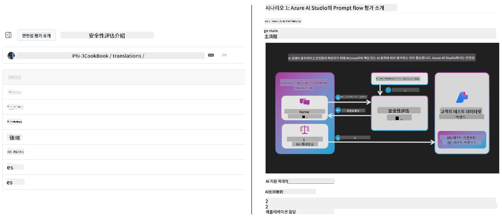
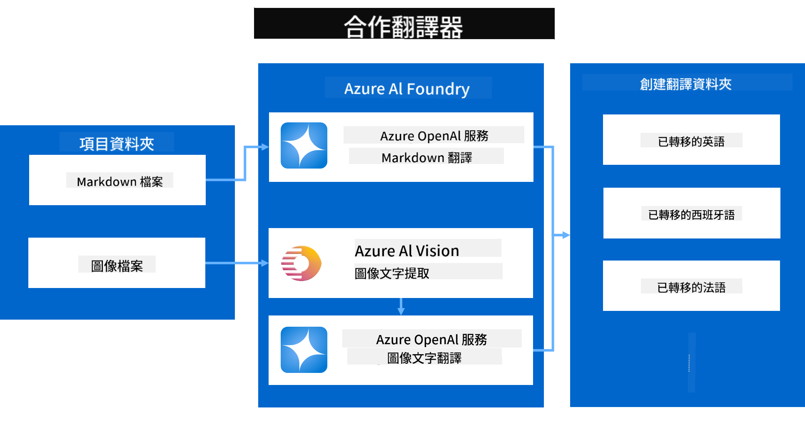

<!--
CO_OP_TRANSLATOR_METADATA:
{
  "original_hash": "044724537b57868117aadae8e7728c7c",
  "translation_date": "2025-06-12T10:02:41+00:00",
  "source_file": "README.md",
  "language_code": "hk"
}
-->


# Co-op Translator：輕鬆自動化教育文件嘅翻譯工作

_輕鬆自動化將你嘅文件翻譯成多種語言，觸及全球觀眾。_

[](https://pypi.org/project/co-op-translator/)
[](https://github.com/azure/co-op-translator/blob/main/LICENSE)
[](https://pepy.tech/project/co-op-translator)
[](https://pepy.tech/project/co-op-translator)
[](https://github.com/psf/black)

[](https://GitHub.com/azure/co-op-translator/graphs/contributors/)
[](https://GitHub.com/azure/co-op-translator/issues/)
[](https://GitHub.com/azure/co-op-translator/pulls/)
[](http://makeapullrequest.com)

### 語言支援由 Co-op Translator 提供
[法文](../fr/README.md) | [西班牙文](../es/README.md) | [德文](../de/README.md) | [俄文](../ru/README.md) | [阿拉伯文](../ar/README.md) | [波斯文 (法爾西語)](../fa/README.md) | [烏爾都文](../ur/README.md) | [中文 (簡體)](../zh/README.md) | [中文 (繁體, 澳門)](../mo/README.md) | [中文 (繁體, 香港)](./README.md) | [中文 (繁體, 台灣)](../tw/README.md) | [日文](../ja/README.md) | [韓文](../ko/README.md) | [印地文](../hi/README.md) | [孟加拉文](../bn/README.md) | [馬拉地文](../mr/README.md) | [尼泊爾文](../ne/README.md) | [旁遮普文 (古魯穆奇)](../pa/README.md) | [葡萄牙文 (葡萄牙)](../pt/README.md) | [葡萄牙文 (巴西)](../br/README.md) | [意大利文](../it/README.md) | [波蘭文](../pl/README.md) | [土耳其文](../tr/README.md) | [希臘文](../el/README.md) | [泰文](../th/README.md) | [瑞典文](../sv/README.md) | [丹麥文](../da/README.md) | [挪威文](../no/README.md) | [芬蘭文](../fi/README.md) | [荷蘭文](../nl/README.md) | [希伯來文](../he/README.md) | [越南文](../vi/README.md) | [印尼文](../id/README.md) | [馬來文](../ms/README.md) | [他加祿文 (菲律賓語)](../tl/README.md) | [斯瓦希里文](../sw/README.md) | [匈牙利文](../hu/README.md) | [捷克文](../cs/README.md) | [斯洛伐克文](../sk/README.md) | [羅馬尼亞文](../ro/README.md) | [保加利亞文](../bg/README.md) | [塞爾維亞文 (西里爾字母)](../sr/README.md) | [克羅地亞文](../hr/README.md) | [斯洛文尼亞文](../sl/README.md) | [烏克蘭文](../uk/README.md) | [緬甸文 (緬甸語)](../my/README.md)Please write the output from left to right.

[法文](../fr/README.md) | [西班牙文](../es/README.md) | [德文](../de/README.md) | [俄文](../ru/README.md) | [阿拉伯文](../ar/README.md) | [波斯文 (法爾西語)](../fa/README.md) | [烏爾都文](../ur/README.md) | [中文 (簡體)](../zh/README.md) | [中文 (繁體, 澳門)](../mo/README.md) | [中文 (繁體, 香港)](./README.md) | [中文 (繁體, 台灣)](../tw/README.md) | [日文](../ja/README.md) | [韓文](../ko/README.md) | [印地文](../hi/README.md) | [孟加拉文](../bn/README.md) | [馬拉地文](../mr/README.md) | [尼泊爾文](../ne/README.md) | [旁遮普文 (古魯穆奇)](../pa/README.md) | [葡萄牙文 (葡萄牙)](../pt/README.md) | [葡萄牙文 (巴西)](../br/README.md) | [意大利文](../it/README.md) | [波蘭文](../pl/README.md) | [土耳其文](../tr/README.md) | [希臘文](../el/README.md) | [泰文](../th/README.md) | [瑞典文](../sv/README.md) | [丹麥文](../da/README.md) | [挪威文](../no/README.md) | [芬蘭文](../fi/README.md) | [荷蘭文](../nl/README.md) | [希伯來文](../he/README.md) | [越南文](../vi/README.md) | [印尼文](../id/README.md) | [馬來文](../ms/README.md) | [他加祿文 (菲律賓語)](../tl/README.md) | [斯瓦希里文](../sw/README.md) | [匈牙利文](../hu/README.md) | [捷克文](../cs/README.md) | [斯洛伐克文](../sk/README.md) | [羅馬尼亞文](../ro/README.md) | [保加利亞文](../bg/README.md) | [塞爾維亞文 (西里爾字母)](../sr/README.md) | [克羅地亞文](../hr/README.md) | [斯洛文尼亞文](../sl/README.md) | [烏克蘭文](../uk/README.md) | [緬甸文 (緬甸語)](../my/README.md)
> [!NOTE]
> 呢啲係呢個儲存庫內容嘅現有翻譯版本。想睇Co-op Translator支援嘅全部語言，請參考[Language Support](../..)部分。

[](https://GitHub.com/azure/co-op-translator/watchers/)
[](https://GitHub.com/azure/co-op-translator/network/)
[](https://GitHub.com/azure/co-op-translator/stargazers/)

[](https://discord.com/invite/ByRwuEEgH4)

[](https://codespaces.new/azure/co-op-translator)
[](https://vscode.dev/redirect?url=vscode://ms-vscode-remote.remote-containers/cloneInVolume?url=https://github.com/azure/co-op-translator)

## 概覽：簡化你嘅教育內容翻譯

語言障礙嚴重限制全球學習者同開發者接觸寶貴嘅教育資源同技術知識，從而影響參與度同減慢全球創新同學習嘅步伐。

**Co-op Translator** 係為咗解決Microsoft自家大型教育系列（例如“For Beginners”指南）嘅低效手動翻譯流程而誕生。依家佢已經發展成一個簡單易用、功能強大嘅工具，幫助大家打破語言隔閡。透過CLI同GitHub Actions提供高質素嘅自動翻譯，Co-op Translator令教育者、學生、研究員同開發者可以無語言限制地分享同獲取知識。

睇下Co-op Translator點樣整理翻譯後嘅教育內容：



Markdown文件同圖片文字會自動翻譯，並整齊地分類到指定語言嘅資料夾。

**今日就用Co-op Translator，打開你嘅教育內容全球通行證！**

## 支援Microsoft學習資源嘅全球存取

Co-op Translator幫助Microsoft嘅主要教育項目打破語言鴻溝，自動化翻譯流程，服務全球開發者社群。依家用緊Co-op Translator嘅項目包括：

[](https://github.com/microsoft/Generative-AI-for-beginners)
[](https://github.com/microsoft/ML-For-Beginners)
[](https://github.com/microsoft/AI-For-Beginners)
[](https://github.com/microsoft/ai-agents-for-beginners)
[](https://github.com/microsoft/PhiCookBook)
[](https://github.com/microsoft/Generative-AI-for-beginners-dotnet)

## 主要功能

- **自動翻譯**：輕鬆將文字翻譯成多種語言。
- **GitHub Actions整合**：將翻譯流程自動化，融入CI/CD管道。
- **保持Markdown格式**：翻譯同時維持正確嘅Markdown語法。
- **圖片文字翻譯**：提取同翻譯圖片內嘅文字。
- **先進LLM技術**：採用尖端語言模型提供高質素翻譯。
- **易於整合**：輕鬆融入你現有嘅項目架構。
- **簡化本地化**：優化項目國際化嘅流程。

## 運作原理



Co-op Translator會從你嘅項目資料夾攞Markdown文件同圖片，然後進行以下處理：

1. **文字提取**：從Markdown文件提取文字，如果有設定（例如用Azure AI Vision），亦會提取圖片中嘅文字。
1. **AI翻譯**：將提取嘅文字發送到設定好嘅LLM（Azure OpenAI、OpenAI等等）進行翻譯。
1. **結果保存**：將翻譯後嘅Markdown文件同帶翻譯文字嘅圖片存入指定語言嘅資料夾，並保留原有格式。

## 快速開始

用CLI快速開始，或者設定GitHub Actions做全自動化。揀最啱你工作流程嘅方法：

1. **命令行 (CLI)** - 適合一次性翻譯或手動控制
2. **GitHub Actions** - 每次推送時自動翻譯

> [!NOTE]
> 呢個教學主要講Azure資源，但你可以用任何支援嘅語言模型。

### 語言支援

Co-op Translator支援多種語言，幫你觸及全球用戶。基本資訊如下：

#### 快速參考

| 語言 | 代碼 | 語言 | 代碼 | 語言 | 代碼 |
|----------|------|----------|------|----------|------|
| 阿拉伯文 | ar | 孟加拉文 | bn | 保加利亞文 | bg |
| 緬甸文 | my | 中文（簡體） | zh | 中文（繁體，香港） | hk |
| 中文（繁體，澳門） | mo | 中文（繁體，台灣） | tw | 克羅地亞文 | hr |
| 捷克文 | cs | 丹麥文 | da | 荷蘭文 | nl |
| 芬蘭文 | fi | 法文 | fr | 德文 | de |
| 希臘文 | el | 希伯來文 | he | 印地文 | hi |
| 匈牙利文 | hu | 印尼文 | id | 意大利文 | it |
| 日文 | ja | 韓文 | ko | 馬來文 | ms |
| 馬拉地文 | mr | 尼泊爾文 | ne | 挪威文 | no |
| 波斯文（法爾西文） | fa | 波蘭文 | pl | 葡萄牙文（巴西） | br |
| 葡萄牙文（葡萄牙） | pt | 旁遮普文（古魯穆奇文） | pa | 羅馬尼亞文 | ro |
| 俄文 | ru | 塞爾維亞文（西里爾字母） | sr | 斯洛伐克文 | sk |
| 斯洛文尼亞文 | sl | 西班牙文 | es | 斯瓦希里文 | sw |
| 瑞典文 | sv | 他加祿文（菲律賓語） | tl | 泰文 | th |
| 土耳其文 | tr | 烏克蘭文 | uk | 烏爾都文 | ur |
| 越南文 | vi | — | — | — | — |

#### 使用語言代碼

用Co-op Translator時，要用語言代碼指定語言。例如：

```bash
# Translate to French, Spanish, and German
translate -l "fr es de"

# Translate to Chinese (Simplified) and Japanese
translate -l "zh ja"
```

> [!NOTE]
> 想了解語言支援嘅詳細技術資料，包括：
>
> - 每種語言嘅字體規格
> - 已知問題
> - 點樣新增語言
>
> 請參考我哋嘅[Supported Languages Documentation](./getting_started/supported-languages.md)。

### 支援嘅模型同服務

| 類型                  | 名稱                           |
|-----------------------|--------------------------------|
| 語言模型        |   |
| AI視覺       |  |

> [!NOTE]
> 如果冇可用嘅AI視覺服務，co-op translator會自動轉用[Markdown-only mode](./getting_started/markdown-only-mode.md)。

### 初始設定

開始之前，你需要設定以下資源：

1. 語言模型資源（必需）：
   - Azure OpenAI（推薦）— 提供企業級可靠性嘅高質素翻譯
   - OpenAI — 如果冇Azure賬戶，可以用呢個替代方案
   - 詳細支援模型資料，請參考[Supported Models and Services](../..)

1. AI視覺資源（可選）：
   - Azure AI Vision — 支援翻譯圖片內文字
   - 如果冇設定，系統會自動用[Markdown-only mode](./getting_started/markdown-only-mode.md)
   - 推薦用於包含需要翻譯文字嘅圖片嘅項目

1. 設定步驟：
   - 跟住我哋嘅[Azure AI設定指南](./getting_started/set-up-azure-ai.md)做詳細設定
   - 建立一個 `.env` 檔案，放入API密鑰同端點（見[Quick Start](../..)部分）
   - 確保你有足夠嘅權限同配額用你揀嘅服務

### 翻譯前嘅項目準備

開始翻譯前，請跟住以下步驟準備你嘅項目：

1. 準備你嘅README：
   - 喺README.md加一個翻譯版本嘅表格，方便連結到唔同語言版本
   - 範例格式：

     ```markdown

     ### 🌐 Multi-Language Support
     
     [French](../fr/README.md) | [Spanish](../es/README.md) | [German](../de/README.md) | [Russian](../ru/README.md) | [Arabic](../ar/README.md) | [Persian (Farsi)](../fa/README.md) | [Urdu](../ur/README.md) | [Chinese (Simplified)](../zh/README.md) | [Chinese (Traditional, Macau)](../mo/README.md) | [Chinese (Traditional, Hong Kong)](./README.md) | [Chinese (Traditional, Taiwan)](../tw/README.md) | [Japanese](../ja/README.md) | [Korean](../ko/README.md) | [Hindi](../hi/README.md) | [Bengali](../bn/README.md) | [Marathi](../mr/README.md) | [Nepali](../ne/README.md) | [Punjabi (Gurmukhi)](../pa/README.md) | [Portuguese (Portugal)](../pt/README.md) | [Portuguese (Brazil)](../br/README.md) | [Italian](../it/README.md) | [Polish](../pl/README.md) | [Turkish](../tr/README.md) | [Greek](../el/README.md) | [Thai](../th/README.md) | [Swedish](../sv/README.md) | [Danish](../da/README.md) | [Norwegian](../no/README.md) | [Finnish](../fi/README.md) | [Dutch](../nl/README.md) | [Hebrew](../he/README.md) | [Vietnamese](../vi/README.md) | [Indonesian](../id/README.md) | [Malay](../ms/README.md) | [Tagalog (Filipino)](../tl/README.md) | [Swahili](../sw/README.md) | [Hungarian](../hu/README.md) | [Czech](../cs/README.md) | [Slovak](../sk/README.md) | [Romanian](../ro/README.md) | [Bulgarian](../bg/README.md) | [Serbian (Cyrillic)](../sr/README.md) | [Croatian](../hr/README.md) | [Slovenian](../sl/README.md) | [Ukrainian](../uk/README.md) | [Burmese (Myanmar)](../my/README.md) 
    
     ```

1. 清理現有翻譯（如有需要）：
   - 刪除現有嘅翻譯資料夾（例如 `translations/`）
   - 刪除舊嘅翻譯文件，確保重新開始
   - 避免同新嘅翻譯流程發生衝突

### 快速開始：命令行

用命令行快速開始：

1. 建立虛擬環境：

    ```bash
    python -m venv .venv
    ```

1. 啟動虛擬環境：

    - Windows 系統：

    ```bash
    .venv\scripts\activate
    ```

    - Linux/macOS 系統：

    ```bash
    source .venv/bin/activate
    ```

1. 安裝套件：

    ```bash
    pip install co-op-translator
    ```

1. 設定憑證：

    - 建立 `.env` file in your project's root directory.
    - Copy the contents from the [.env.template](../../.env.template) file into your new `.env` file.
    - Fill in the required API keys and endpoint information in your `.env` file.

1. Run Translation:
    - Navigate to your project's root directory in your terminal.
    - Execute the translate command, specifying target languages with the `-l` 標誌：

    ```bash
    translate -l "ko ja fr"
    ```

    _(替換 `"ko ja fr"` with your desired space-separated language codes)_

### Detailed Usage Guides

Choose the approach that best fits your workflow:

#### 1. Using the Command Line (CLI)

- Best for: One-time translations, manual control, or integration into custom scripts.
- Requires: Local installation of Python and the `co-op-translator` package.
- Guide: [Command Line Guide](./getting_started/command-line-guide/command-line-guide.md)

#### 2. Using GitHub Actions (Automation)

- Best for: Automatically translating content whenever changes are pushed to your repository. Keeps translations consistently up-to-date.
- Requires: Setting up a workflow file (`.github/workflows`) 喺你嘅儲存庫入面。唔使本地安裝。
- 指南：
  - [GitHub Actions 指南（公共儲存庫同標準秘密）](./getting_started/github-actions-guide/github-actions-guide-public.md) - 適合大部分公共或者私人儲存庫，使用標準儲存庫秘密。
  - [GitHub Actions 指南（Microsoft組織儲存庫同組織級設定）](./getting_started/github-actions-guide/github-actions-guide-org.md) - 如果你喺Microsoft GitHub組織內工作，或者需要用組織級秘密同執行器，請用呢個指南。

### 疑難排解同小貼士

- [疑難排解指南](./getting_started/troubleshooting.md)

### 額外資源

- [命令參考](./getting_started/command-reference.md)：詳細介紹所有可用命令同選項。
- [支援語言](./getting_started/supported-languages.md)：查看支援語言列表同新增語言嘅指引。
- [Markdown-Only模式](./getting_started/markdown-only-mode.md)：點樣只翻譯文字，唔翻譯圖片。

## 影片介紹

透過我哋嘅介紹影片更了解Co-op Translator _(點擊下方圖片喺YouTube觀看)_：

- **Open at Microsoft**：一個18分鐘嘅簡介同快速教學，教你點用Co-op Translator。
[](https://www.youtube.com/watch?v=jX_swfH_KNU)

## 支持我哋，一齊推動全球學習

一齊參與革新教育內容喺全球嘅分享方式啦！喺 GitHub 為 [Co-op Translator](https://github.com/azure/co-op-translator) ⭐，支持我哋打破學習同科技嘅語言障礙。你嘅關注同貢獻會帶嚟重大影響！歡迎隨時提供程式碼貢獻同功能建議。

## 貢獻指南

呢個項目歡迎大家嘅貢獻同建議。有興趣為 Azure Co-op Translator 出一分力？請參考我哋嘅 [CONTRIBUTING.md](./CONTRIBUTING.md) ，了解點樣幫助 Co-op Translator 更加易用。

## 貢獻者

[](https://github.com/Azure/co-op-translator/graphs/contributors)

## 行為守則

本項目已採用 [Microsoft Open Source Code of Conduct](https://opensource.microsoft.com/codeofconduct/)。
詳情請參閱 [Code of Conduct FAQ](https://opensource.microsoft.com/codeofconduct/faq/)，或
有任何問題或意見，歡迎聯絡 [opencode@microsoft.com](mailto:opencode@microsoft.com)。

## 負責任嘅 AI

Microsoft 致力協助客戶負責任地使用我哋嘅 AI 產品，分享我哋嘅經驗，並透過 Transparency Notes 同 Impact Assessments 等工具建立信任夥伴關係。好多資源可以喺 [https://aka.ms/RAI](https://aka.ms/RAI) 搵到。
Microsoft 對負責任 AI 嘅理念，係建立喺公平、可靠同安全、私隱同保安、包容、透明同問責嘅 AI 原則上。

大型自然語言、圖像同語音模型——就好似呢個示範用嘅模型——有機會出現不公平、不可靠或者冒犯嘅行為，可能會造成傷害。請參閱 [Azure OpenAI service Transparency note](https://learn.microsoft.com/legal/cognitive-services/openai/transparency-note?tabs=text)，了解風險同限制。

建議嘅做法係喺系統架構中加入安全機制，偵測同防止有害行為。[Azure AI Content Safety](https://learn.microsoft.com/azure/ai-services/content-safety/overview) 提供獨立嘅保護層，可以偵測應用程式同服務中用戶同 AI 生成嘅有害內容。Azure AI Content Safety 包括文字同圖像 API，幫你偵測有害物料。我哋仲有互動式嘅 Content Safety Studio，方便你瀏覽、探索同試用唔同模態下偵測有害內容嘅範例程式碼。以下嘅 [快速入門文件](https://learn.microsoft.com/azure/ai-services/content-safety/quickstart-text?tabs=visual-studio%2Clinux&pivots=programming-language-rest) 會引導你點樣向服務發送請求。

另一個要考慮嘅係整體應用表現。對於多模態同多模型應用，表現即係系統達到你同用戶預期嘅效果，包括唔會產生有害輸出。評估整體應用嘅表現時，建議使用 [generation quality and risk and safety metrics](https://learn.microsoft.com/azure/ai-studio/concepts/evaluation-metrics-built-in)。

你可以喺開發環境用 [prompt flow SDK](https://microsoft.github.io/promptflow/index.html) 評估 AI 應用。無論係測試數據集定目標，生成嘅 AI 輸出都會用內置或自訂評估器做量化評分。想開始用 prompt flow sdk 評估系統，可以跟住呢個 [快速入門指南](https://learn.microsoft.com/azure/ai-studio/how-to/develop/flow-evaluate-sdk)。執行評估後，可以喺 [Azure AI Studio 視覺化結果](https://learn.microsoft.com/azure/ai-studio/how-to/evaluate-flow-results)。

## 商標

本項目可能包含項目、產品或服務嘅商標或標誌。Microsoft 商標或標誌嘅授權使用須遵守同跟隨
[Microsoft's Trademark & Brand Guidelines](https://www.microsoft.com/en-us/legal/intellectualproperty/trademarks/usage/general)。
修改版本中使用 Microsoft 商標或標誌，唔可以引起混淆或暗示 Microsoft 贊助。
第三方商標或標誌嘅使用須遵守相關第三方嘅政策。

**免責聲明**：  
本文件係使用 AI 翻譯服務 [Co-op Translator](https://github.com/Azure/co-op-translator) 進行翻譯。雖然我哋努力確保準確性，但請注意，自動翻譯可能包含錯誤或不準確之處。原始文件嘅母語版本應視為權威來源。對於重要資訊，建議採用專業人工翻譯。我哋對因使用此翻譯而引致嘅任何誤解或誤釋概不負責。