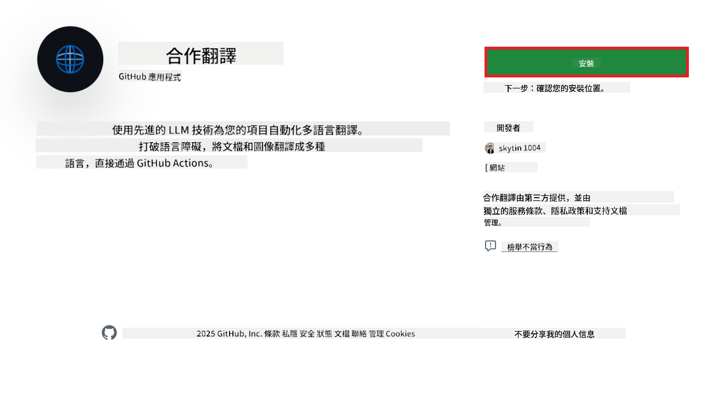
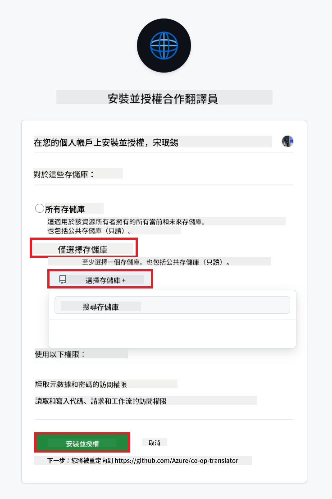
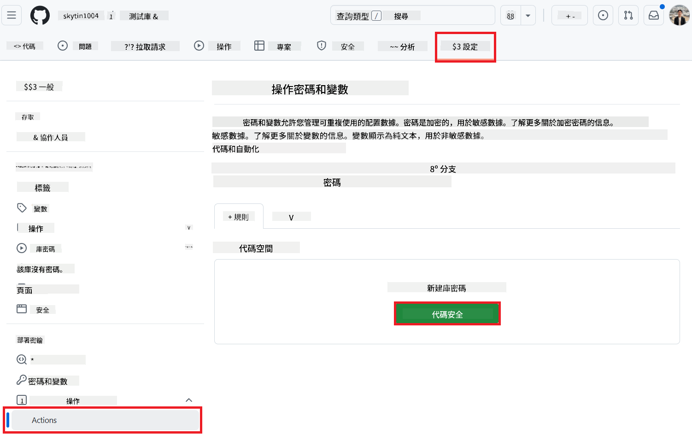
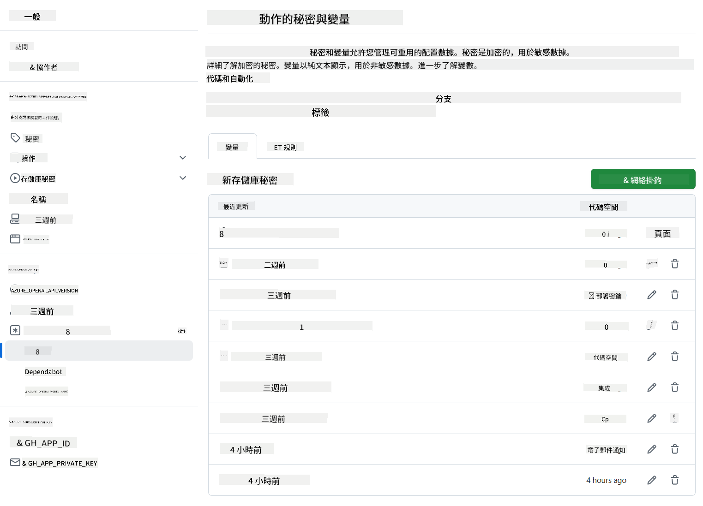

<!--
CO_OP_TRANSLATOR_METADATA:
{
  "original_hash": "c437820027c197f25fb2cbee95bae28c",
  "translation_date": "2025-06-12T19:03:24+00:00",
  "source_file": "getting_started/github-actions-guide/github-actions-guide-org.md",
  "language_code": "hk"
}
-->
# 使用 Co-op Translator GitHub Action（組織指南）

**目標讀者：** 本指南適用於 **Microsoft 內部用戶** 或 **擁有預建 Co-op Translator GitHub App 必要憑證的團隊**，或能自行建立自訂 GitHub App 的團隊。

透過 Co-op Translator GitHub Action，輕鬆自動化翻譯您儲存庫的文件。本指南將引導您設定此 Action，當您的原始 Markdown 檔案或圖片有變更時，自動建立包含更新翻譯的拉取請求。

> [!IMPORTANT]
> 
> **選擇合適的指南：**
>
> 本指南說明如何使用 **GitHub App ID 和 Private Key** 進行設定。通常當您遇到以下情況時，需要使用此「組織指南」方法：**`GITHUB_TOKEN` 權限受限：** 您的組織或儲存庫設定限制了標準 `GITHUB_TOKEN` 預設授權的權限。特別是如果 `GITHUB_TOKEN` 無法取得必要的 `write` 權限（如 `contents: write` 或 `pull-requests: write`），則 [公開設定指南](./github-actions-guide-public.md) 中的工作流程將因權限不足而失敗。使用具明確授權權限的專用 GitHub App 可繞過此限制。
>
> **若上述情況不適用於您：**
>
> 若標準 `GITHUB_TOKEN` 在您的儲存庫中擁有足夠權限（即未受組織限制阻擋），請使用 **[使用 GITHUB_TOKEN 的公開設定指南](./github-actions-guide-public.md)**。公開指南無需取得或管理 App ID 或 Private Key，僅依賴標準 `GITHUB_TOKEN` 與儲存庫權限。

## 前置條件

在設定 GitHub Action 前，請先準備好所需的 AI 服務憑證。

**1. 必要：AI 語言模型憑證**  
您需要至少一種支援的語言模型憑證：

- **Azure OpenAI**：需提供 Endpoint、API Key、Model/Deployment 名稱及 API 版本。  
- **OpenAI**：需提供 API Key，（可選：Org ID、Base URL、Model ID）。  
- 詳情請參考 [支援的模型與服務](../../../../README.md)。  
- 設定指南：[設定 Azure OpenAI](../set-up-resources/set-up-azure-openai.md)。

**2. 選擇性：電腦視覺憑證（用於圖片翻譯）**

- 僅當您需要翻譯圖片中的文字時才需提供。  
- **Azure Computer Vision**：需提供 Endpoint 和訂閱金鑰。  
- 若未提供，Action 將以 [僅限 Markdown 模式](../markdown-only-mode.md) 運作。  
- 設定指南：[設定 Azure Computer Vision](../set-up-resources/set-up-azure-computer-vision.md)。

## 設定與配置

請依照以下步驟，在您的儲存庫中設定 Co-op Translator GitHub Action：

### 步驟 1：安裝與設定 GitHub App 認證

此工作流程使用 GitHub App 認證，安全地代表您與儲存庫互動（例如建立拉取請求）。請選擇以下其中一種方式：

#### **選項 A：安裝預建的 Co-op Translator GitHub App（供 Microsoft 內部使用）**

1. 前往 [Co-op Translator GitHub App](https://github.com/apps/co-op-translator) 頁面。

1. 選擇 **Install** 並選擇目標儲存庫所在的帳戶或組織。

    

1. 選擇 **Only select repositories**，並選擇您的目標儲存庫（例如 `PhiCookBook`）。點擊 **Install**。系統可能會要求您進行驗證。

    

1. **取得 App 憑證（需內部流程）：** 為讓工作流程能以 App 身份驗證，您需要從 Co-op Translator 團隊取得兩項資訊：
  - **App ID：** Co-op Translator App 的唯一識別碼，App ID 為：`1164076`。  
  - **Private Key：** 必須取得 `.pem` 私鑰檔案的**完整內容**，由維護聯絡人提供。**請妥善保管此金鑰，視同密碼。**

1. 繼續至步驟 2。

#### **選項 B：使用您自己的自訂 GitHub App**

- 您也可以自行建立並設定 GitHub App，確保該 App 具有對 Contents 和 Pull requests 的讀寫權限。您將需要其 App ID 與產生的 Private Key。

### 步驟 2：設定儲存庫密鑰

您需要將 GitHub App 憑證及 AI 服務憑證，以加密密鑰形式新增至儲存庫設定。

1. 前往目標 GitHub 儲存庫（例如 `PhiCookBook`）。

1. 點選 **Settings** > **Secrets and variables** > **Actions**。

1. 在 **Repository secrets** 下，點擊 **New repository secret**，為以下每個密鑰新增一筆。

   

**必要密鑰（GitHub App 認證）：**

| 密鑰名稱               | 說明                                  | 值來源                          |
| :--------------------- | :----------------------------------- | :------------------------------ |
| `GH_APP_ID`     | GitHub App 的 App ID（來自步驟 1）    | GitHub App 設定                 |
| `GH_APP_PRIVATE_KEY`     | 下載的 `.pem` 檔案**完整內容** | `.pem` 檔案（步驟 1） |

**AI 服務密鑰（依前置條件新增所有適用者）：**

| 密鑰名稱               | 說明                                  | 值來源                          |
| :--------------------- | :----------------------------------- | :------------------------------ |
| `AZURE_SUBSCRIPTION_KEY`     | Azure AI 服務（Computer Vision）金鑰  | Azure AI Foundry                |
| `AZURE_AI_SERVICE_ENDPOINT`     | Azure AI 服務（Computer Vision）端點  | Azure AI Foundry                |
| `AZURE_OPENAI_API_KEY`     | Azure OpenAI 服務金鑰                  | Azure AI Foundry                |
| `AZURE_OPENAI_ENDPOINT`     | Azure OpenAI 服務端點                  | Azure AI Foundry                |
| `AZURE_OPENAI_MODEL_NAME`     | 您的 Azure OpenAI 模型名稱             | Azure AI Foundry                |
| `AZURE_OPENAI_CHAT_DEPLOYMENT_NAME`     | 您的 Azure OpenAI 部署名稱             | Azure AI Foundry                |
| `AZURE_OPENAI_API_VERSION`     | Azure OpenAI API 版本                  | Azure AI Foundry                |
| `OPENAI_API_KEY`     | OpenAI API 金鑰                        | OpenAI Platform                |
| `OPENAI_ORG_ID`     | OpenAI 組織 ID                        | OpenAI Platform                |
| `OPENAI_CHAT_MODEL_ID`     | 特定 OpenAI 模型 ID                   | OpenAI Platform                |
| `OPENAI_BASE_URL`     | 自訂 OpenAI API 基底 URL              | OpenAI Platform                |



### 步驟 3：建立工作流程檔案

最後，建立定義自動化工作流程的 YAML 檔案。

1. 在儲存庫根目錄中，若不存在 `.github/workflows/` 資料夾，請先建立。

1. 在 `.github/workflows/` 內建立名為 `co-op-translator.yml` 的檔案。

1. 將以下內容貼入 co-op-translator.yml。

```
name: Co-op Translator

on:
  push:
    branches:
      - main

jobs:
  co-op-translator:
    runs-on: ubuntu-latest

    permissions:
      contents: write
      pull-requests: write

    steps:
      - name: Checkout repository
        uses: actions/checkout@v4
        with:
          fetch-depth: 0

      - name: Set up Python
        uses: actions/setup-python@v4
        with:
          python-version: '3.10'

      - name: Install Co-op Translator
        run: |
          python -m pip install --upgrade pip
          pip install co-op-translator

      - name: Run Co-op Translator
        env:
          PYTHONIOENCODING: utf-8
          # Azure AI Service Credentials
          AZURE_SUBSCRIPTION_KEY: ${{ secrets.AZURE_SUBSCRIPTION_KEY }}
          AZURE_AI_SERVICE_ENDPOINT: ${{ secrets.AZURE_AI_SERVICE_ENDPOINT }}

          # Azure OpenAI Credentials
          AZURE_OPENAI_API_KEY: ${{ secrets.AZURE_OPENAI_API_KEY }}
          AZURE_OPENAI_ENDPOINT: ${{ secrets.AZURE_OPENAI_ENDPOINT }}
          AZURE_OPENAI_MODEL_NAME: ${{ secrets.AZURE_OPENAI_MODEL_NAME }}
          AZURE_OPENAI_CHAT_DEPLOYMENT_NAME: ${{ secrets.AZURE_OPENAI_CHAT_DEPLOYMENT_NAME }}
          AZURE_OPENAI_API_VERSION: ${{ secrets.AZURE_OPENAI_API_VERSION }}

          # OpenAI Credentials
          OPENAI_API_KEY: ${{ secrets.OPENAI_API_KEY }}
          OPENAI_ORG_ID: ${{ secrets.OPENAI_ORG_ID }}
          OPENAI_CHAT_MODEL_ID: ${{ secrets.OPENAI_CHAT_MODEL_ID }}
          OPENAI_BASE_URL: ${{ secrets.OPENAI_BASE_URL }}
        run: |
          # =====================================================================
          # IMPORTANT: Set your target languages here (REQUIRED CONFIGURATION)
          # =====================================================================
          # Example: Translate to Spanish, French, German. Add -y to auto-confirm.
          translate -l "es fr de" -y  # <--- MODIFY THIS LINE with your desired languages

      - name: Authenticate GitHub App
        id: generate_token
        uses: tibdex/github-app-token@v1
        with:
          app_id: ${{ secrets.GH_APP_ID }}
          private_key: ${{ secrets.GH_APP_PRIVATE_KEY }}

      - name: Create Pull Request with translations
        uses: peter-evans/create-pull-request@v5
        with:
          token: ${{ steps.generate_token.outputs.token }}
          commit-message: "🌐 Update translations via Co-op Translator"
          title: "🌐 Update translations via Co-op Translator"
          body: |
            This PR updates translations for recent changes to the main branch.

            ### 📋 Changes included
            - Translated contents are available in the `translations/` directory
            - Translated images are available in the `translated_images/` directory

            ---
            🌐 Automatically generated by the [Co-op Translator](https://github.com/Azure/co-op-translator) GitHub Action.
          branch: update-translations
          base: main
          labels: translation, automated-pr
          delete-branch: true
          add-paths: |
            translations/
            translated_images/

```

4.  **自訂工作流程：**
  - **[!IMPORTANT] 目標語言：** 在 `Run Co-op Translator` step, you **MUST review and modify the list of language codes** within the `translate -l "..." -y` command to match your project's requirements. The example list (`ar de es...`) needs to be replaced or adjusted.
  - **Trigger (`on:`):** The current trigger runs on every push to `main`. For large repositories, consider adding a `paths:` filter (see commented example in the YAML) to run the workflow only when relevant files (e.g., source documentation) change, saving runner minutes.
  - **PR Details:** Customize the `commit-message`, `title`, `body`, `branch` name, and `labels` in the `Create Pull Request` step if needed.

## Credential Management and Renewal

- **Security:** Always store sensitive credentials (API keys, private keys) as GitHub Actions secrets. Never expose them in your workflow file or repository code.
- **[!IMPORTANT] Key Renewal (Internal Microsoft Users):** Be aware that Azure OpenAI key used within Microsoft might have a mandatory renewal policy (e.g., every 5 months). Ensure you update the corresponding GitHub secrets (`AZURE_OPENAI_...` 等鍵值中設定目標語言。  
  - 請確保密鑰在 **過期前更新**，以避免工作流程失敗。

## 執行工作流程

當 `co-op-translator.yml` 檔案合併至您的主分支（或設定中 `on:` trigger), the workflow will automatically run whenever changes are pushed to that branch (and match the `paths` 過濾條件指定的分支）後，

若有產生或更新翻譯，該 Action 將自動建立包含變更的拉取請求，供您審核與合併。

**免責聲明**：  
本文件乃使用 AI 翻譯服務 [Co-op Translator](https://github.com/Azure/co-op-translator) 進行翻譯。雖然我們致力於確保準確性，但請注意自動翻譯可能存在錯誤或不準確之處。原始文件的母語版本應視為權威來源。對於重要資訊，建議採用專業人工翻譯。我們不對因使用本翻譯而引起的任何誤解或誤釋負責。