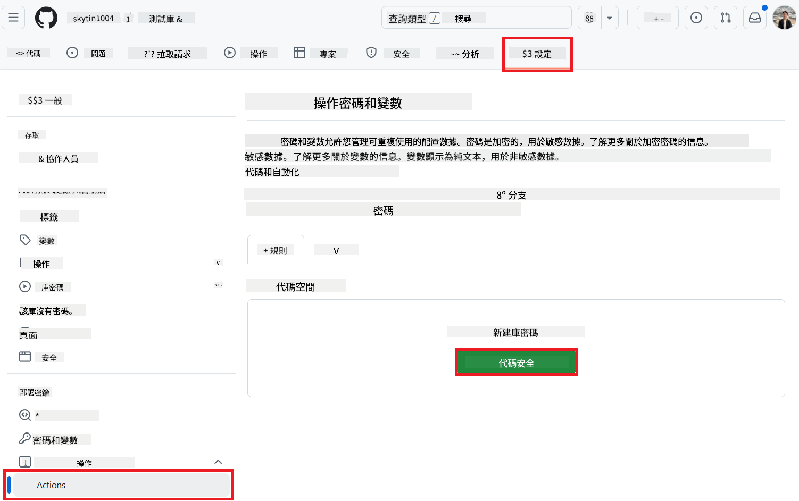
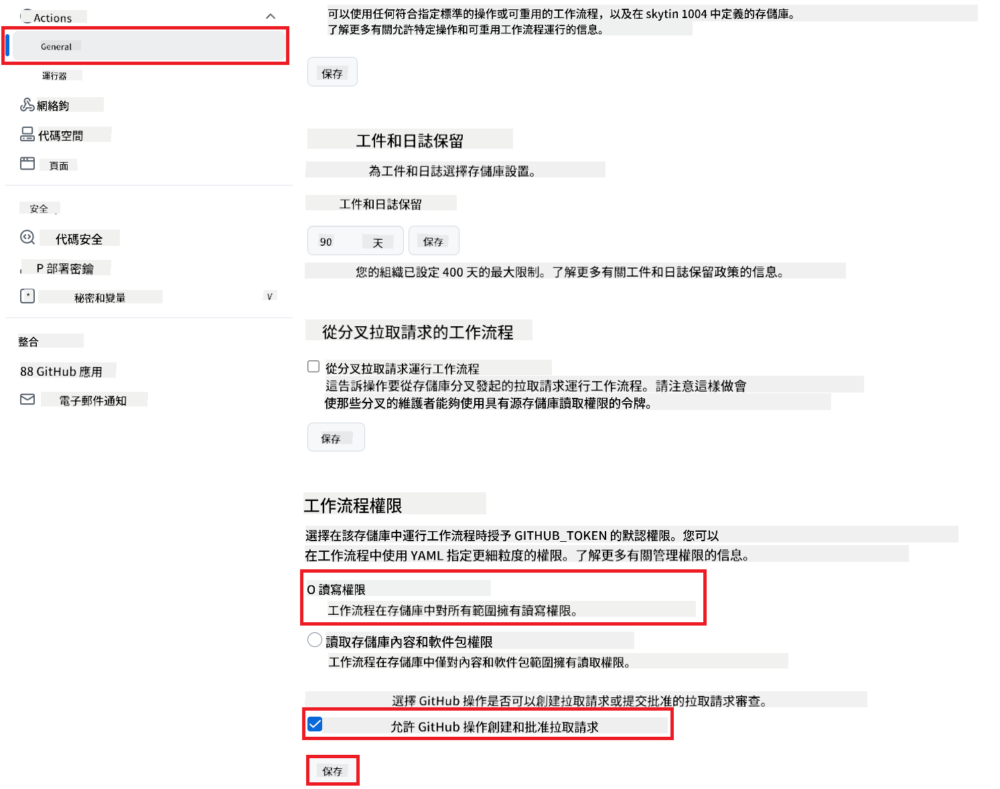

<!--
CO_OP_TRANSLATOR_METADATA:
{
  "original_hash": "a52587a512e667f70d92db853d3c61d5",
  "translation_date": "2025-06-12T19:23:43+00:00",
  "source_file": "getting_started/github-actions-guide/github-actions-guide-public.md",
  "language_code": "hk"
}
-->
# 使用 Co-op Translator GitHub Action（公共設置）

**目標讀者：** 本指南適用於大多數公共或私有倉庫的用戶，當標準 GitHub Actions 權限已足夠時使用。它利用內建的 `GITHUB_TOKEN`。

輕鬆自動化翻譯你的倉庫文件，使用 Co-op Translator GitHub Action。本指南將引導你設置該 Action，當你的原始 Markdown 文件或圖片發生變更時，自動建立包含更新翻譯的拉取請求。

> [!IMPORTANT]
>
> **選擇合適的指南：**
>
> 本指南詳述使用標準 `GITHUB_TOKEN` 的**簡易設置方法**。這是大多數用戶的推薦方式，因為不需要管理敏感的 GitHub App 私鑰。
>

## 前置條件

在配置 GitHub Action 之前，請確保你已準備好所需的 AI 服務憑證。

**1. 必需：AI 語言模型憑證**  
你需要至少一種支援的語言模型憑證：

- **Azure OpenAI**：需要 Endpoint、API Key、模型/部署名稱、API 版本。  
- **OpenAI**：需要 API Key，（可選：組織 ID、基礎 URL、模型 ID）。  
- 詳見 [Supported Models and Services](../../../../README.md)。

**2. 選擇性：AI 視覺憑證（用於圖片翻譯）**

- 僅當你需要翻譯圖片中的文字時需要。  
- **Azure AI Vision**：需要 Endpoint 和訂閱金鑰。  
- 若未提供，該 Action 將預設使用[僅 Markdown 模式](../markdown-only-mode.md)。

## 設置與配置

請依照以下步驟，使用標準 `GITHUB_TOKEN` 在你的倉庫中配置 Co-op Translator GitHub Action。

### 步驟 1：了解身份驗證（使用 `GITHUB_TOKEN`）

此工作流程使用 GitHub Actions 內建的 `GITHUB_TOKEN`。此令牌會根據第 **步驟 3** 中設定的權限，自動授予工作流程與倉庫互動的權限。

### 步驟 2：配置倉庫秘密

你只需在倉庫設定中，將 **AI 服務憑證** 以加密秘密的形式添加。

1. 進入目標 GitHub 倉庫。  
2. 前往 **Settings** > **Secrets and variables** > **Actions**。  
3. 在 **Repository secrets** 下，針對以下所需的 AI 服務秘密，點擊 **New repository secret** 逐一新增。

 *(圖片參考：顯示新增秘密的位置)*

**必需的 AI 服務秘密（根據前置條件，全部適用的都需添加）：**

| 秘密名稱                         | 說明                                     | 來源                             |
| :---------------------------------- | :---------------------------------------- | :------------------------------- |
| `AZURE_SUBSCRIPTION_KEY`            | Azure AI 服務（電腦視覺）的金鑰               | 你的 Azure AI Foundry               |
| `AZURE_AI_SERVICE_ENDPOINT`         | Azure AI 服務（電腦視覺）的端點               | 你的 Azure AI Foundry               |
| `AZURE_OPENAI_API_KEY`              | Azure OpenAI 服務的金鑰                       | 你的 Azure AI Foundry               |
| `AZURE_OPENAI_ENDPOINT`             | Azure OpenAI 服務的端點                       | 你的 Azure AI Foundry               |
| `AZURE_OPENAI_MODEL_NAME`           | 你的 Azure OpenAI 模型名稱                    | 你的 Azure AI Foundry               |
| `AZURE_OPENAI_CHAT_DEPLOYMENT_NAME` | 你的 Azure OpenAI 部署名稱                     | 你的 Azure AI Foundry               |
| `AZURE_OPENAI_API_VERSION`          | Azure OpenAI API 版本                         | 你的 Azure AI Foundry               |
| `OPENAI_API_KEY`                    | OpenAI API 金鑰                             | 你的 OpenAI 平台                   |
| `OPENAI_ORG_ID`                     | OpenAI 組織 ID（可選）                        | 你的 OpenAI 平台                   |
| `OPENAI_CHAT_MODEL_ID`              | 特定 OpenAI 模型 ID（可選）                    | 你的 OpenAI 平台                   |
| `OPENAI_BASE_URL`                   | 自訂 OpenAI API 基礎 URL（可選）                | 你的 OpenAI 平台                   |

### 步驟 3：配置工作流程權限

GitHub Action 需要通過 `GITHUB_TOKEN` 授予權限，以檢出代碼並建立拉取請求。

1. 在你的倉庫中，前往 **Settings** > **Actions** > **General**。  
2. 滾動到 **Workflow permissions** 區塊。  
3. 選擇 **Read and write permissions**。這會賦予 `GITHUB_TOKEN` 進行檢出和拉取請求所需的 `contents: write` 與 `pull-requests: write` 權限。  
4. 確認勾選 **Allow GitHub Actions to create and approve pull requests**。  
5. 點擊 **Save**。



### 步驟 4：建立工作流程檔案

最後，建立定義自動化工作流程的 YAML 檔案，使用 `GITHUB_TOKEN`。

1. 在倉庫根目錄下，若不存在 `.github/workflows/` 目錄，請先建立。  
2. 在 `.github/workflows/` 目錄中，建立名為 `co-op-translator.yml` 的檔案。  
3. 將以下內容貼入 `co-op-translator.yml`。

```yaml
name: Co-op Translator

on:
  push:
    branches:
      - main

jobs:
  co-op-translator:
    runs-on: ubuntu-latest

    permissions:
      contents: write
      pull-requests: write

    steps:
      - name: Checkout repository
        uses: actions/checkout@v4
        with:
          fetch-depth: 0

      - name: Set up Python
        uses: actions/setup-python@v4
        with:
          python-version: '3.10'

      - name: Install Co-op Translator
        run: |
          python -m pip install --upgrade pip
          pip install co-op-translator

      - name: Run Co-op Translator
        env:
          PYTHONIOENCODING: utf-8
          # === AI Service Credentials ===
          AZURE_SUBSCRIPTION_KEY: ${{ secrets.AZURE_SUBSCRIPTION_KEY }}
          AZURE_AI_SERVICE_ENDPOINT: ${{ secrets.AZURE_AI_SERVICE_ENDPOINT }}
          AZURE_OPENAI_API_KEY: ${{ secrets.AZURE_OPENAI_API_KEY }}
          AZURE_OPENAI_ENDPOINT: ${{ secrets.AZURE_OPENAI_ENDPOINT }}
          AZURE_OPENAI_MODEL_NAME: ${{ secrets.AZURE_OPENAI_MODEL_NAME }}
          AZURE_OPENAI_CHAT_DEPLOYMENT_NAME: ${{ secrets.AZURE_OPENAI_CHAT_DEPLOYMENT_NAME }}
          AZURE_OPENAI_API_VERSION: ${{ secrets.AZURE_OPENAI_API_VERSION }}
          OPENAI_API_KEY: ${{ secrets.OPENAI_API_KEY }}
          OPENAI_ORG_ID: ${{ secrets.OPENAI_ORG_ID }}
          OPENAI_CHAT_MODEL_ID: ${{ secrets.OPENAI_CHAT_MODEL_ID }}
          OPENAI_BASE_URL: ${{ secrets.OPENAI_BASE_URL }}
        run: |
          # =====================================================================
          # IMPORTANT: Set your target languages here (REQUIRED CONFIGURATION)
          # =====================================================================
          # Example: Translate to Spanish, French, German. Add -y to auto-confirm.
          translate -l "es fr de" -y  # <--- MODIFY THIS LINE with your desired languages

      - name: Create Pull Request with translations
        uses: peter-evans/create-pull-request@v5
        with:
          token: ${{ secrets.GITHUB_TOKEN }}
          commit-message: "🌐 Update translations via Co-op Translator"
          title: "🌐 Update translations via Co-op Translator"
          body: |
            This PR updates translations for recent changes to the main branch.

            ### 📋 Changes included
            - Translated contents are available in the `translations/` directory
            - Translated images are available in the `translated_images/` directory

            ---
            🌐 Automatically generated by the [Co-op Translator](https://github.com/Azure/co-op-translator) GitHub Action.
          branch: update-translations
          base: main
          labels: translation, automated-pr
          delete-branch: true
          add-paths: |
            translations/
            translated_images/
```  
4. **自訂工作流程：**  
  - **[!IMPORTANT] 目標語言：** 如有需要，可在 `Run Co-op Translator` step, you **MUST review and modify the list of language codes** within the `translate -l "..." -y` command to match your project's requirements. The example list (`ar de es...`) needs to be replaced or adjusted.
  - **Trigger (`on:`):** The current trigger runs on every push to `main`. For large repositories, consider adding a `paths:` filter (see commented example in the YAML) to run the workflow only when relevant files (e.g., source documentation) change, saving runner minutes.
  - **PR Details:** Customize the `commit-message`, `title`, `body`, `branch` name, and `labels` in the `Create Pull Request` 步驟中調整。

**免責聲明**：  
本文件乃使用 AI 翻譯服務 [Co-op Translator](https://github.com/Azure/co-op-translator) 進行翻譯。雖然我們致力於確保準確性，但請注意，自動翻譯可能包含錯誤或不準確之處。原始文件的母語版本應被視為權威來源。對於重要資訊，建議採用專業人工翻譯。我們對因使用此翻譯而引致的任何誤解或誤釋概不負責。