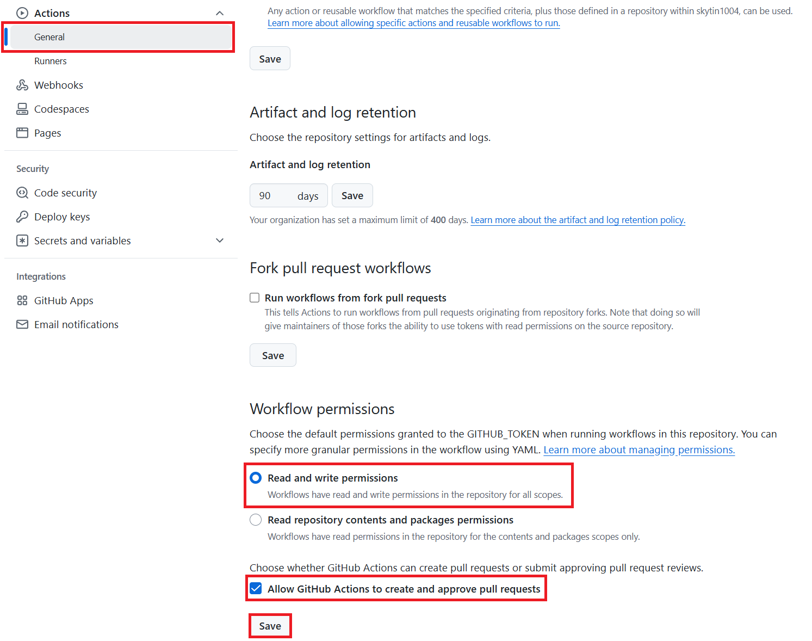

<!--
CO_OP_TRANSLATOR_METADATA:
{
  "original_hash": "527ca4d0a8d3f51087ec3317279e36ee",
  "translation_date": "2025-10-15T02:33:51+00:00",
  "source_file": "getting_started/github-actions-guide/github-actions-guide-public.md",
  "language_code": "hk"
}
-->
# 使用 Co-op Translator GitHub Action（公開設置）

**目標讀者：** 本指南適合大部分公開或私人倉庫用戶，只要標準 GitHub Actions 權限足夠即可。這個方法會用到內建的 `GITHUB_TOKEN`。

利用 Co-op Translator GitHub Action，輕鬆自動化翻譯你倉庫的文件。這份指南會教你如何設置這個 Action，讓它在你的 Markdown 源文件或圖片有變動時，自動建立包含最新翻譯的 Pull Request。

> [!IMPORTANT]
>
> **選擇合適的指南：**
>
> 本指南介紹的是**使用標準 `GITHUB_TOKEN` 的簡易設置**。這是大多數用戶推薦的方法，因為不需要管理敏感的 GitHub App 私鑰。
>

## 先決條件

在設置 GitHub Action 前，請先準備好所需的 AI 服務憑證。

**1. 必需：AI 語言模型憑證**
你需要至少一個支援的語言模型憑證：

- **Azure OpenAI**：需要 Endpoint、API Key、Model/Deployment 名稱、API Version。
- **OpenAI**：需要 API Key，（可選：Org ID、Base URL、Model ID）。
- 詳情請參考 [支援的模型和服務](../../../../README.md)。

**2. 可選：AI Vision 憑證（用於圖片翻譯）**

- 只有需要翻譯圖片內文字時才需要。
- **Azure AI Vision**：需要 Endpoint 和 Subscription Key。
- 如果沒提供，Action 會自動使用 [僅 Markdown 模式](../markdown-only-mode.md)。

## 設置及配置

按照以下步驟，利用標準 `GITHUB_TOKEN` 在你的倉庫設置 Co-op Translator GitHub Action。

### 步驟 1：了解認證方式（使用 `GITHUB_TOKEN`）

這個 workflow 會用到 GitHub Actions 內建的 `GITHUB_TOKEN`。這個 token 會根據你在**步驟 3**設置的權限，自動授權 workflow 操作你的倉庫。

### 步驟 2：設置倉庫密碼

你只需要把**AI 服務憑證**加到倉庫設定的加密密碼裡。

1. 進入目標 GitHub 倉庫。
2. 前往 **Settings** > **Secrets and variables** > **Actions**。
3. 在 **Repository secrets** 下，為每個需要的 AI 服務密碼點選 **New repository secret**。

     *(圖片說明：展示如何新增密碼)*

**必需的 AI 服務密碼（根據你的先決條件全部加入）：**

| 密碼名稱                         | 說明                               | 來源                     |
| :------------------------------ | :---------------------------------- | :----------------------- |
| `AZURE_AI_SERVICE_API_KEY`            | Azure AI Service（Computer Vision）的金鑰  | 你的 Azure AI Foundry         |
| `AZURE_AI_SERVICE_ENDPOINT`         | Azure AI Service（Computer Vision）的 Endpoint | 你的 Azure AI Foundry         |
| `AZURE_OPENAI_API_KEY`              | Azure OpenAI 服務的金鑰              | 你的 Azure AI Foundry         |
| `AZURE_OPENAI_ENDPOINT`             | Azure OpenAI 服務的 Endpoint         | 你的 Azure AI Foundry         |
| `AZURE_OPENAI_MODEL_NAME`           | 你的 Azure OpenAI 模型名稱           | 你的 Azure AI Foundry         |
| `AZURE_OPENAI_CHAT_DEPLOYMENT_NAME` | 你的 Azure OpenAI 部署名稱           | 你的 Azure AI Foundry         |
| `AZURE_OPENAI_API_VERSION`          | Azure OpenAI 的 API 版本             | 你的 Azure AI Foundry         |
| `OPENAI_API_KEY`                    | OpenAI 的 API 金鑰                   | 你的 OpenAI Platform          |
| `OPENAI_ORG_ID`                     | OpenAI 組織 ID（可選）               | 你的 OpenAI Platform          |
| `OPENAI_CHAT_MODEL_ID`              | 指定的 OpenAI 模型 ID（可選）         | 你的 OpenAI Platform          |
| `OPENAI_BASE_URL`                   | 自訂 OpenAI API Base URL（可選）      | 你的 OpenAI Platform          |

### 步驟 3：設置 Workflow 權限

GitHub Action 需要透過 `GITHUB_TOKEN` 取得 checkout 代碼和建立 Pull Request 的權限。

1. 在你的倉庫，前往 **Settings** > **Actions** > **General**。
2. 滾動到 **Workflow permissions** 部分。
3. 選擇 **Read and write permissions**。這樣 `GITHUB_TOKEN` 就有 `contents: write` 和 `pull-requests: write` 權限。
4. 確認 **Allow GitHub Actions to create and approve pull requests** 的核取方塊已**勾選**。
5. 點選 **Save**。



### 步驟 4：建立 Workflow 檔案

最後，建立定義自動化 workflow 的 YAML 檔案，並使用 `GITHUB_TOKEN`。

1. 在倉庫根目錄下，建立 `.github/workflows/` 目錄（如果還沒存在）。
2. 在 `.github/workflows/` 內建立名為 `co-op-translator.yml` 的檔案。
3. 把以下內容貼到 `co-op-translator.yml`。

```yaml
name: Co-op Translator

on:
  push:
    branches:
      - main

jobs:
  co-op-translator:
    runs-on: ubuntu-latest

    permissions:
      contents: write
      pull-requests: write

    steps:
      - name: Checkout repository
        uses: actions/checkout@v4
        with:
          fetch-depth: 0

      - name: Set up Python
        uses: actions/setup-python@v4
        with:
          python-version: '3.10'

      - name: Install Co-op Translator
        run: |
          python -m pip install --upgrade pip
          pip install co-op-translator

      - name: Run Co-op Translator
        env:
          PYTHONIOENCODING: utf-8
          # === AI Service Credentials ===
          AZURE_AI_SERVICE_API_KEY: ${{ secrets.AZURE_AI_SERVICE_API_KEY }}
          AZURE_AI_SERVICE_ENDPOINT: ${{ secrets.AZURE_AI_SERVICE_ENDPOINT }}
          AZURE_OPENAI_API_KEY: ${{ secrets.AZURE_OPENAI_API_KEY }}
          AZURE_OPENAI_ENDPOINT: ${{ secrets.AZURE_OPENAI_ENDPOINT }}
          AZURE_OPENAI_MODEL_NAME: ${{ secrets.AZURE_OPENAI_MODEL_NAME }}
          AZURE_OPENAI_CHAT_DEPLOYMENT_NAME: ${{ secrets.AZURE_OPENAI_CHAT_DEPLOYMENT_NAME }}
          AZURE_OPENAI_API_VERSION: ${{ secrets.AZURE_OPENAI_API_VERSION }}
          OPENAI_API_KEY: ${{ secrets.OPENAI_API_KEY }}
          OPENAI_ORG_ID: ${{ secrets.OPENAI_ORG_ID }}
          OPENAI_CHAT_MODEL_ID: ${{ secrets.OPENAI_CHAT_MODEL_ID }}
          OPENAI_BASE_URL: ${{ secrets.OPENAI_BASE_URL }}
        run: |
          # =====================================================================
          # IMPORTANT: Set your target languages here (REQUIRED CONFIGURATION)
          # =====================================================================
          # Example: Translate to Spanish, French, German. Add -y to auto-confirm.
          translate -l "es fr de" -y  # <--- MODIFY THIS LINE with your desired languages

      - name: Create Pull Request with translations
        uses: peter-evans/create-pull-request@v5
        with:
          token: ${{ secrets.GITHUB_TOKEN }}
          commit-message: "🌐 Update translations via Co-op Translator"
          title: "🌐 Update translations via Co-op Translator"
          body: |
            This PR updates translations for recent changes to the main branch.

            ### 📋 Changes included
            - Translated contents are available in the `translations/` directory
            - Translated images are available in the `translated_images/` directory

            ---
            🌐 Automatically generated by the [Co-op Translator](https://github.com/Azure/co-op-translator) GitHub Action.
          branch: update-translations
          base: main
          labels: translation, automated-pr
          delete-branch: true
          add-paths: |
            translations/
            translated_images/
```
4.  **自訂 Workflow：**
  - **[!IMPORTANT] 目標語言：** 在 `Run Co-op Translator` 步驟中，你**必須檢查並修改 `translate -l "..." -y` 指令裡的語言代碼清單**，以符合你的專案需求。範例清單（`ar de es...`）需要替換或調整。
  - **觸發條件（`on:`）：** 目前設置是每次 push 到 `main` 都會觸發。若你的倉庫很大，建議加上 `paths:` 過濾（YAML 裡有註解範例），只在相關檔案（如原始文件）變動時才執行，節省 runner 時間。
  - **PR 詳情：** 如有需要，可自訂 `commit-message`、`title`、`body`、`branch` 名稱和 `labels`。

## 執行 Workflow

> [!WARNING]  
> **GitHub-hosted Runner 時間限制：**  
> GitHub-hosted runner（如 `ubuntu-latest`）**最多執行 6 小時**。  
> 如果你的文件倉庫很大，翻譯過程超過 6 小時，workflow 會自動被終止。  
> 為避免這情況，建議：  
> - 使用**自架 runner**（沒時間限制）  
> - 每次執行減少目標語言數量

當 `co-op-translator.yml` 檔案合併到你的主分支（或 `on:` 觸發指定的分支）後，只要有變更 push 到該分支（且符合 `paths` 過濾條件，如有設置），workflow 就會自動執行。

---

**免責聲明**：
本文件是使用 AI 翻譯服務 [Co-op Translator](https://github.com/Azure/co-op-translator) 進行翻譯。雖然我們致力於確保準確性，但請注意自動翻譯可能會包含錯誤或不準確之處。原始語言的文件應被視為具權威性的來源。對於重要資訊，建議使用專業人工翻譯。我們不會對因使用本翻譯而產生的任何誤解或誤釋承擔責任。