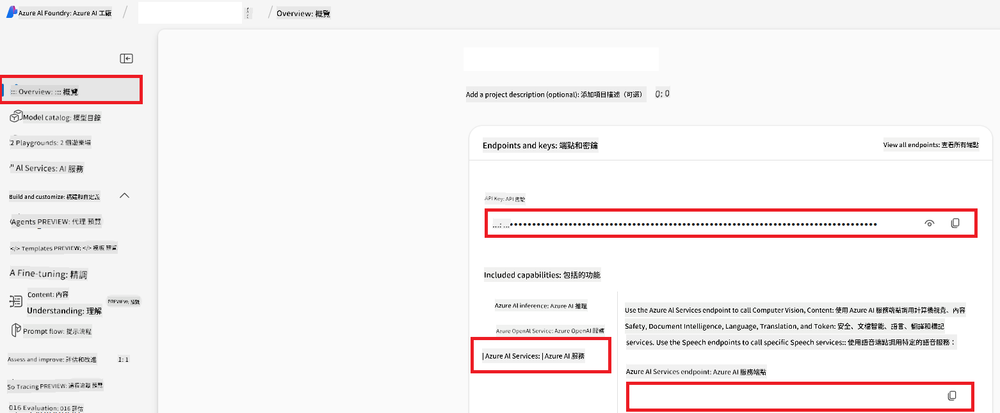

<!--
CO_OP_TRANSLATOR_METADATA:
{
  "original_hash": "b58d7c3cb4210697a073d20eb3064945",
  "translation_date": "2025-06-12T11:48:09+00:00",
  "source_file": "getting_started/set-up-azure-ai.md",
  "language_code": "hk"
}
-->
# 設定 Azure AI 用於 Co-op Translator（Azure OpenAI 及 Azure AI Vision）

本指南會帶你一步步設定 Azure OpenAI 作語言翻譯，以及 Azure Computer Vision 作圖像內容分析（之後可用於圖像翻譯），全部都在 Azure AI Foundry 裡面進行。

**先決條件：**
- 一個有有效訂閱的 Azure 帳戶。
- 有足夠權限在你的 Azure 訂閱內建立資源及部署。

## 建立 Azure AI 項目

你會先建立一個 Azure AI 項目，作為管理 AI 資源的中心位置。

1. 前往 [https://ai.azure.com](https://ai.azure.com) 並用你的 Azure 帳戶登入。

1. 選擇 **+Create** 建立新項目。

1. 完成以下步驟：
   - 輸入 **Project name**（例如 `CoopTranslator-Project`）。
   - 選擇 **AI hub**（例如 `CoopTranslator-Hub`）（需要時可新建）。

1. 按「**Review and Create**」建立項目。你會被帶到項目總覽頁。

## 設定 Azure OpenAI 作語言翻譯

在你的項目內，部署 Azure OpenAI 模型作為文字翻譯的後端。

### 前往你的項目

如果還沒進入，打開你剛建立的項目（例如 `CoopTranslator-Project`）於 Azure AI Foundry。

### 部署 OpenAI 模型

1. 在項目的左側選單中，於「My assets」下選擇「**Models + endpoints**」。

1. 選擇 **+ Deploy model**。

1. 選擇 **Deploy Base Model**。

1. 你會看到可用模型列表。篩選或搜尋合適的 GPT 模型，我們推薦 `gpt-4o`。

1. 選擇你想用的模型，然後按 **Confirm**。

1. 按 **Deploy**。

### Azure OpenAI 配置

部署完成後，你可以在「**Models + endpoints**」頁面選擇該部署，查看其 **REST endpoint URL**、**Key**、**Deployment name**、**Model name** 及 **API version**。這些資訊會用於將翻譯模型整合到你的應用程式。

> [!NOTE]
> 你可根據需要，從 [API version deprecation](https://learn.microsoft.com/azure/ai-services/openai/api-version-deprecation) 頁面選擇 API 版本。請注意，**API version** 與 Azure AI Foundry 「Models + endpoints」頁面顯示的 **Model version** 不同。

## 設定 Azure Computer Vision 作圖像翻譯

要啟用圖片中文字翻譯，你需要找到 Azure AI Service 的 API Key 和 Endpoint。

1. 前往你的 Azure AI 項目（例如 `CoopTranslator-Project`），確保在項目總覽頁。

### Azure AI Service 配置

從 Azure AI Service 找到 API Key 和 Endpoint。

1. 前往你的 Azure AI 項目（例如 `CoopTranslator-Project`），確保在項目總覽頁。

1. 在 Azure AI Service 標籤下找到 **API Key** 和 **Endpoint**。

    

此連接會讓你的 AI Foundry 項目能使用已連結的 Azure AI Services 資源功能（包括圖像分析）。你之後可以在筆記本或應用程式中使用這個連接，從圖片提取文字，再將文字送到 Azure OpenAI 模型作翻譯。

## 整合你的認證資料

到目前為止，你應該已收集以下資料：

**針對 Azure OpenAI（文字翻譯）：**
- Azure OpenAI Endpoint
- Azure OpenAI API Key
- Azure OpenAI Model Name（例如 `gpt-4o`）
- Azure OpenAI Deployment Name（例如 `cooptranslator-gpt4o`）
- Azure OpenAI API Version

**針對 Azure AI Services（透過 Vision 進行圖像文字提取）：**
- Azure AI Service Endpoint
- Azure AI Service API Key

### 範例：環境變數設定（預覽）

日後建立應用程式時，你可能會用這些認證設定環境變數，例如：

```bash
# Azure AI Service Credentials (Required for image translation)
AZURE_AI_SERVICE_API_KEY="your_azure_ai_service_api_key" # e.g., 21xasd...
AZURE_AI_SERVICE_ENDPOINT="https://your_azure_ai_service_endpoint.cognitiveservices.azure.com/"

# Azure OpenAI Credentials (Required for text translation)
AZURE_OPENAI_API_KEY="your_azure_openai_api_key" # e.g., 21xasd...
AZURE_OPENAI_ENDPOINT="https://your_azure_openai_endpoint.openai.azure.com/"
AZURE_OPENAI_MODEL_NAME="your_model_name" # e.g., gpt-4o
AZURE_OPENAI_CHAT_DEPLOYMENT_NAME="your_deployment_name" # e.g., cooptranslator-gpt4o
AZURE_OPENAI_API_VERSION="your_api_version" # e.g., 2024-12-01-preview
```

---

### 延伸閱讀

- [如何在 Azure AI Foundry 建立項目](https://learn.microsoft.com/azure/ai-foundry/how-to/create-projects?tabs=ai-studio)
- [如何建立 Azure AI 資源](https://learn.microsoft.com/azure/ai-foundry/how-to/create-azure-ai-resource?tabs=portal)
- [如何在 Azure AI Foundry 部署 OpenAI 模型](https://learn.microsoft.com/en-us/azure/ai-foundry/how-to/deploy-models-openai)

**免責聲明**：  
本文件係用 AI 翻譯服務 [Co-op Translator](https://github.com/Azure/co-op-translator) 進行翻譯。雖然我哋努力確保準確性，但請注意自動翻譯可能會包含錯誤或不準確之處。原文文件嘅母語版本應視為權威來源。對於重要資訊，建議採用專業人工翻譯。我哋對因使用此翻譯而引致嘅任何誤解或誤釋概不負責。