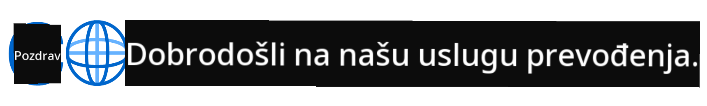
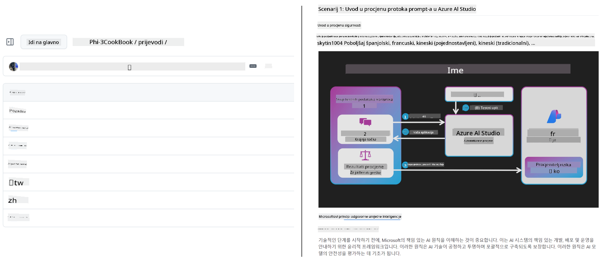
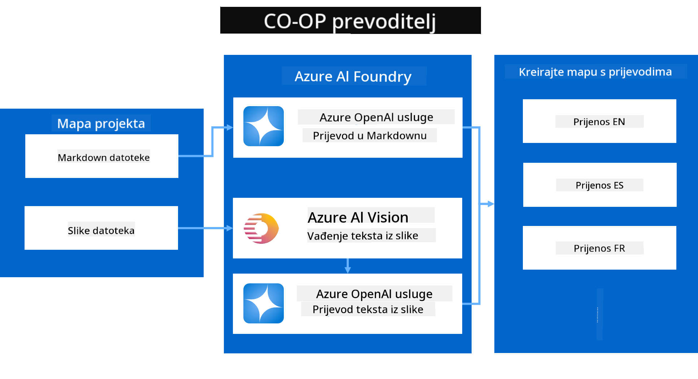

<!--
CO_OP_TRANSLATOR_METADATA:
{
  "original_hash": "044724537b57868117aadae8e7728c7c",
  "translation_date": "2025-06-12T10:56:25+00:00",
  "source_file": "README.md",
  "language_code": "hr"
}
-->


# Co-op Translator: Automatizirajte prijevod obrazovne dokumentacije bez napora

_Lako automatizirajte prijevod svoje dokumentacije na više jezika kako biste dosegli globalnu publiku._

[](https://pypi.org/project/co-op-translator/)
[](https://github.com/azure/co-op-translator/blob/main/LICENSE)
[](https://pepy.tech/project/co-op-translator)
[](https://pepy.tech/project/co-op-translator)
[](https://github.com/psf/black)

[](https://GitHub.com/azure/co-op-translator/graphs/contributors/)
[](https://GitHub.com/azure/co-op-translator/issues/)
[](https://GitHub.com/azure/co-op-translator/pulls/)
[](http://makeapullrequest.com)

### Podrška za jezike pokreće Co-op Translator

> [!NOTE]
> Ovo su trenutni prijevodi sadržaja ovog repozitorija. Za potpuni popis jezika koje podržava Co-op Translator, pogledajte odjeljak [Language Support](../..).

[](https://GitHub.com/azure/co-op-translator/watchers/)
[](https://GitHub.com/azure/co-op-translator/network/)
[](https://GitHub.com/azure/co-op-translator/stargazers/)

[](https://discord.com/invite/ByRwuEEgH4)

[](https://codespaces.new/azure/co-op-translator)
[](https://vscode.dev/redirect?url=vscode://ms-vscode-remote.remote-containers/cloneInVolume?url=https://github.com/azure/co-op-translator)

## Pregled: Pojednostavite Prijevod Vašeg Edukativnog Sadržaja

Jezične barijere znatno otežavaju pristup vrijednim edukativnim materijalima i tehničkom znanju za učenike i developere širom svijeta. To ograničava sudjelovanje i usporava tempo globalnih inovacija i učenja.

**Co-op Translator** je nastao iz potrebe za rješavanjem neučinkovitog ručnog procesa prevođenja Microsoftovih velikih edukativnih serija (poput vodiča "For Beginners"). Razvio se u jednostavan i moćan alat dizajniran da sruši te barijere za sve. Omogućavajući visokokvalitetne automatske prijevode putem CLI-a i GitHub Actions, Co-op Translator osnažuje edukatore, studente, istraživače i developere širom svijeta da dijele i pristupaju znanju bez jezičnih ograničenja.

Pogledajte kako Co-op Translator organizira prevedeni edukativni sadržaj:



Markdown datoteke i tekst na slikama automatski se prevode i uredno organiziraju u mape specifične za jezik.

**Omogućite globalni pristup svom edukativnom sadržaju već danas uz Co-op Translator!**

## Podrška Globalnom Pristupu Microsoftovim Resursima za Učenje

Co-op Translator pomaže premostiti jezičnu barijeru za ključne Microsoftove edukativne inicijative, automatizirajući proces prevođenja repozitorija koji služe globalnoj zajednici developera. Primjeri koji trenutno koriste Co-op Translator uključuju:

[](https://github.com/microsoft/Generative-AI-for-beginners)
[](https://github.com/microsoft/ML-For-Beginners)
[](https://github.com/microsoft/AI-For-Beginners)
[](https://github.com/microsoft/ai-agents-for-beginners)
[](https://github.com/microsoft/PhiCookBook)
[](https://github.com/microsoft/Generative-AI-for-beginners-dotnet)

## Ključne Značajke

- **Automatizirani Prijevodi**: Jednostavno prevedite tekst na više jezika.
- **Integracija s GitHub Actions**: Automatizirajte prijevode kao dio vašeg CI/CD procesa.
- **Očuvanje Markdown Formata**: Sačuvajte ispravnu Markdown sintaksu tijekom prijevoda.
- **Prijevod Teksta na Slikama**: Izvucite i prevedite tekst unutar slika.
- **Napredna LLM Tehnologija**: Koristite najsuvremenije jezične modele za kvalitetne prijevode.
- **Jednostavna Integracija**: Bez problema se uklopite u postojeći projekt.
- **Pojednostavite Lokalizaciju**: Učinite lokalizaciju projekta za međunarodna tržišta lakšom.

## Kako Radi



Co-op Translator uzima Markdown datoteke i slike iz vaše projektne mape i obrađuje ih na sljedeći način:

1. **Ekstrakcija Teksta**: Izvlači tekst iz Markdown datoteka i, ako je konfigurirano (npr. s Azure AI Vision), tekst ugrađen u slike.
1. **AI Prijevod**: Šalje izvučeni tekst na konfigurirani LLM (Azure OpenAI, OpenAI itd.) na prijevod.
1. **Spremanje Rezultata**: Sprema prevedene Markdown datoteke i slike (s prevedenim tekstom) u mape specifične za jezik, pritom čuvajući originalni format.

## Početak Rada

Započnite brzo s CLI-jem ili postavite potpunu automatizaciju pomoću GitHub Actions. Odaberite pristup koji najbolje odgovara vašem načinu rada:

1. **Command Line (CLI)** - Za jednokratne prijevode ili ručnu kontrolu
2. **GitHub Actions** - Za automatske prijevode pri svakom pushu

> [!NOTE]
> Iako se ovaj vodič fokusira na Azure resurse, možete koristiti bilo koji podržani jezični model.

### Podrška za Jezike

Co-op Translator podržava širok raspon jezika kako biste dosegli globalnu publiku. Evo što trebate znati:

#### Brzi Pregled

| Jezik | Kod | Jezik | Kod | Jezik | Kod |
|----------|------|----------|------|----------|------|
| Arabic | ar | Bengali | bn | Bulgarian | bg |
| Burmese (Myanmar) | my | Chinese (Simplified) | zh | Chinese (Traditional, HK) | hk |
| Chinese (Traditional, Macau) | mo | Chinese (Traditional, TW) | tw | Croatian | hr |
| Czech | cs | Danish | da | Dutch | nl |
| Finnish | fi | French | fr | German | de |
| Greek | el | Hebrew | he | Hindi | hi |
| Hungarian | hu | Indonesian | id | Italian | it |
| Japanese | ja | Korean | ko | Malay | ms |
| Marathi | mr | Nepali | ne | Norwegian | no |
| Persian (Farsi) | fa | Polish | pl | Portuguese (Brazil) | br |
| Portuguese (Portugal) | pt | Punjabi (Gurmukhi) | pa | Romanian | ro |
| Russian | ru | Serbian (Cyrillic) | sr | Slovak | sk |
| Slovenian | sl | Spanish | es | Swahili | sw |
| Swedish | sv | Tagalog (Filipino) | tl | Thai | th |
| Turkish | tr | Ukrainian | uk | Urdu | ur |
| Vietnamese | vi | — | — | — | — |

#### Korištenje Kodova Jezika

Kod korištenja Co-op Translatora, potrebno je navesti jezike koristeći njihove kodove. Na primjer:

```bash
# Translate to French, Spanish, and German
translate -l "fr es de"

# Translate to Chinese (Simplified) and Japanese
translate -l "zh ja"
```

> [!NOTE]
> Za detaljne tehničke informacije o podršci jezika, uključujući:
>
> - Specifikacije fontova za svaki jezik
> - Poznate probleme
> - Kako dodati nove jezike
>
> Pogledajte našu [Supported Languages Documentation](./getting_started/supported-languages.md).

### Podržani Modeli i Usluge

| Tip                  | Naziv                           |
|-----------------------|--------------------------------|
| Language Model        |   |
| AI Vision       |  |

> [!NOTE]
> Ako AI vision usluga nije dostupna, co-op translator će preći u [Markdown-only mode](./getting_started/markdown-only-mode.md).

### Početna Postavka

Prije nego što počnete, trebate postaviti sljedeće resurse:

1. Language Model Resource (obavezno):
   - Azure OpenAI (preporučeno) - pruža visokokvalitetne prijevode s pouzdanošću na razini poduzeća
   - OpenAI - alternativa ako nemate pristup Azureu
   - Za detaljne informacije o podržanim modelima, pogledajte [Supported Models and Services](../..)

1. AI Vision Resource (opcionalno):
   - Azure AI Vision - omogućuje prijevod teksta unutar slika
   - Ako nije konfigurirano, prevoditelj će automatski koristiti [Markdown-only mode](./getting_started/markdown-only-mode.md)
   - Preporučeno za projekte sa slikama koje sadrže tekst koji treba prevesti

1. Koraci konfiguracije:
   - Slijedite naš [Azure AI setup guide](./getting_started/set-up-azure-ai.md) za detaljne upute
   - Kreirajte `.env` datoteku s vašim API ključevima i endpointima (pogledajte odjeljak [Quick Start](../..))
   - Provjerite imate li potrebne dozvole i kvote za odabrane usluge

### Priprema Projekta Prije Prijevoda

Prije nego što započnete s prijevodom, slijedite ove korake za pripremu projekta:

1. Pripremite svoj README:
   - Dodajte tablicu prijevoda u README.md za povezivanje prevedenih verzija
   - Primjer formata:

     ```markdown

     ### 🌐 Multi-Language Support
     
     [French](../fr/README.md) | [Spanish](../es/README.md) | [German](../de/README.md) | [Russian](../ru/README.md) | [Arabic](../ar/README.md) | [Persian (Farsi)](../fa/README.md) | [Urdu](../ur/README.md) | [Chinese (Simplified)](../zh/README.md) | [Chinese (Traditional, Macau)](../mo/README.md) | [Chinese (Traditional, Hong Kong)](../hk/README.md) | [Chinese (Traditional, Taiwan)](../tw/README.md) | [Japanese](../ja/README.md) | [Korean](../ko/README.md) | [Hindi](../hi/README.md) | [Bengali](../bn/README.md) | [Marathi](../mr/README.md) | [Nepali](../ne/README.md) | [Punjabi (Gurmukhi)](../pa/README.md) | [Portuguese (Portugal)](../pt/README.md) | [Portuguese (Brazil)](../br/README.md) | [Italian](../it/README.md) | [Polish](../pl/README.md) | [Turkish](../tr/README.md) | [Greek](../el/README.md) | [Thai](../th/README.md) | [Swedish](../sv/README.md) | [Danish](../da/README.md) | [Norwegian](../no/README.md) | [Finnish](../fi/README.md) | [Dutch](../nl/README.md) | [Hebrew](../he/README.md) | [Vietnamese](../vi/README.md) | [Indonesian](../id/README.md) | [Malay](../ms/README.md) | [Tagalog (Filipino)](../tl/README.md) | [Swahili](../sw/README.md) | [Hungarian](../hu/README.md) | [Czech](../cs/README.md) | [Slovak](../sk/README.md) | [Romanian](../ro/README.md) | [Bulgarian](../bg/README.md) | [Serbian (Cyrillic)](../sr/README.md) | [Croatian](./README.md) | [Slovenian](../sl/README.md) | [Ukrainian](../uk/README.md) | [Burmese (Myanmar)](../my/README.md) 
    
     ```

1. Očistite postojeće prijevode (ako je potrebno):
   - Uklonite postojeće mape s prijevodima (npr. `translations/`)
   - Izbrišite stare prijevodne datoteke kako biste započeli svježe
   - Ovo osigurava da nema sukoba s novim procesom prijevoda

### Brzi Početak: Command Line

Za brz početak s korištenjem komandne linije:

1. Kreirajte virtualno okruženje:

    ```bash
    python -m venv .venv
    ```

1. Aktivirajte virtualno okruženje:

    - Na Windowsu:

    ```bash
    .venv\scripts\activate
    ```

    - Na Linux/macOS-u:

    ```bash
    source .venv/bin/activate
    ```

1. Instalirajte paket:

    ```bash
    pip install co-op-translator
    ```

1. Konfigurirajte vjerodajnice:

    - Kreirajte `.env` file in your project's root directory.
    - Copy the contents from the [.env.template](../../.env.template) file into your new `.env` file.
    - Fill in the required API keys and endpoint information in your `.env` file.

1. Run Translation:
    - Navigate to your project's root directory in your terminal.
    - Execute the translate command, specifying target languages with the `-l` zastavicu:

    ```bash
    translate -l "ko ja fr"
    ```

    _(Zamijenite `"ko ja fr"` with your desired space-separated language codes)_

### Detailed Usage Guides

Choose the approach that best fits your workflow:

#### 1. Using the Command Line (CLI)

- Best for: One-time translations, manual control, or integration into custom scripts.
- Requires: Local installation of Python and the `co-op-translator` package.
- Guide: [Command Line Guide](./getting_started/command-line-guide/command-line-guide.md)

#### 2. Using GitHub Actions (Automation)

- Best for: Automatically translating content whenever changes are pushed to your repository. Keeps translations consistently up-to-date.
- Requires: Setting up a workflow file (`.github/workflows`) u vašem repozitoriju. Nije potrebna lokalna instalacija.
- Vodiči:
  - [GitHub Actions Guide (Public Repositories & Standard Secrets)](./getting_started/github-actions-guide/github-actions-guide-public.md) - Koristite ovo za većinu javnih ili osobnih repozitorija koji se oslanjaju na standardne tajne repozitorija.
  - [GitHub Actions Guide (Microsoft Organization Repos & Org-Level Setups)](./getting_started/github-actions-guide/github-actions-guide-org.md) - Koristite ovaj vodič ako radite unutar Microsoftove GitHub organizacije ili trebate iskoristiti tajne ili pokretače na razini organizacije.

### Rješavanje Problema i Savjeti

- [Troubleshooting Guide](./getting_started/troubleshooting.md)

### Dodatni Resursi

- [Command Reference](./getting_started/command-reference.md): Detaljni vodič za sve dostupne naredbe i opcije.
- [Supported Languages](./getting_started/supported-languages.md): Provjerite popis podržanih jezika i upute za dodavanje novih.
- [Markdown-Only Mode](./getting_started/markdown-only-mode.md): Kako prevoditi samo tekst, bez prijevoda slika.

## Video Prezentacije

Saznajte više o Co-op Translatoru kroz naše prezentacije _(kliknite na sliku ispod za gledanje na YouTubeu)_:

- **Open at Microsoft**: Kratki 18-minutni uvod i brzi vodič za korištenje Co-op Translatora.
[](https://www.youtube.com/watch?v=jX_swfH_KNU)

## Podržite nas i potaknite globalno učenje

Pridružite nam se u revoluciji dijeljenja obrazovnog sadržaja širom svijeta! Dajte [Co-op Translator](https://github.com/azure/co-op-translator) ⭐ na GitHubu i podržite našu misiju uklanjanja jezičnih barijera u učenju i tehnologiji. Vaš interes i doprinosi imaju veliki značaj! Kod i prijedlozi za nove značajke su uvijek dobrodošli.

## Doprinos

Ovaj projekt rado prima doprinose i prijedloge. Zanima vas doprinos Azure Co-op Translatoru? Molimo pogledajte naš [CONTRIBUTING.md](./CONTRIBUTING.md) za smjernice kako možete pomoći da Co-op Translator postane pristupačniji.

## Suradnici

[](https://github.com/Azure/co-op-translator/graphs/contributors)

## Kodeks ponašanja

Ovaj projekt usvojio je [Microsoft Open Source Code of Conduct](https://opensource.microsoft.com/codeofconduct/).
Za više informacija pogledajte [Code of Conduct FAQ](https://opensource.microsoft.com/codeofconduct/faq/) ili
kontaktirajte [opencode@microsoft.com](mailto:opencode@microsoft.com) za dodatna pitanja ili komentare.

## Odgovorni AI

Microsoft je posvećen pomaganju korisnicima da odgovorno koriste naše AI proizvode, dijeleći svoja saznanja i gradeći partnerstva temeljena na povjerenju kroz alate poput Transparency Notes i Impact Assessments. Mnoge od ovih resursa možete pronaći na [https://aka.ms/RAI](https://aka.ms/RAI).
Microsoftov pristup odgovornom AI temelji se na našim AI načelima pravednosti, pouzdanosti i sigurnosti, privatnosti i sigurnosti, uključivosti, transparentnosti i odgovornosti.

Veliki modeli za prirodni jezik, slike i govor - poput onih korištenih u ovom primjeru - mogu se potencijalno ponašati na nepravedan, nepouzdan ili uvredljiv način, što može uzrokovati štetu. Molimo konzultirajte [Azure OpenAI service Transparency note](https://learn.microsoft.com/legal/cognitive-services/openai/transparency-note?tabs=text) kako biste bili informirani o rizicima i ograničenjima.

Preporučeni pristup ublažavanju ovih rizika je uključivanje sigurnosnog sustava u vašu arhitekturu koji može otkriti i spriječiti štetno ponašanje. [Azure AI Content Safety](https://learn.microsoft.com/azure/ai-services/content-safety/overview) pruža neovisni sloj zaštite, sposoban otkriti štetni sadržaj generiran od korisnika i AI-ja u aplikacijama i uslugama. Azure AI Content Safety uključuje tekstualne i slikovne API-je koji vam omogućuju otkrivanje štetnog materijala. Također imamo interaktivni Content Safety Studio koji vam omogućuje pregled, istraživanje i isprobavanje primjera koda za otkrivanje štetnog sadržaja u različitim modalitetima. Sljedeća [quickstart dokumentacija](https://learn.microsoft.com/azure/ai-services/content-safety/quickstart-text?tabs=visual-studio%2Clinux&pivots=programming-language-rest) vodi vas kroz slanje zahtjeva servisu.

Još jedan aspekt koji treba uzeti u obzir je ukupna izvedba aplikacije. Kod višemodalnih i višemodelskih aplikacija, izvedba znači da sustav radi onako kako vi i vaši korisnici očekujete, uključujući i ne generiranje štetnih rezultata. Važno je procijeniti izvedbu vaše aplikacije koristeći [generacijske kvalitete i metrike rizika i sigurnosti](https://learn.microsoft.com/azure/ai-studio/concepts/evaluation-metrics-built-in).

Možete ocijeniti svoju AI aplikaciju u razvojnom okruženju koristeći [prompt flow SDK](https://microsoft.github.io/promptflow/index.html). Bilo s testnim skupom podataka ili ciljem, generacije vaše generativne AI aplikacije kvantitativno se mjere ugrađenim ili prilagođenim evaluatorima po vašem izboru. Za početak s prompt flow sdk za evaluaciju vašeg sustava, možete slijediti [quickstart vodič](https://learn.microsoft.com/azure/ai-studio/how-to/develop/flow-evaluate-sdk). Nakon izvršavanja evaluacije, možete [vizualizirati rezultate u Azure AI Studio](https://learn.microsoft.com/azure/ai-studio/how-to/evaluate-flow-results).

## Zaštićeni znakovi

Ovaj projekt može sadržavati zaštitne znakove ili logotipe za projekte, proizvode ili usluge. Ovlaštena upotreba Microsoftovih
zaštićenih znakova ili logotipa podliježe i mora slijediti
[Microsoftove smjernice za zaštitne znakove i brendiranje](https://www.microsoft.com/en-us/legal/intellectualproperty/trademarks/usage/general).
Upotreba Microsoftovih zaštićenih znakova ili logotipa u izmijenjenim verzijama ovog projekta ne smije izazvati zabunu niti sugerirati Microsoftovu sponzorstvo.
Svaka upotreba zaštitnih znakova ili logotipa trećih strana podliježe pravilima tih trećih strana.

**Odricanje od odgovornosti**:  
Ovaj dokument preveden je korištenjem AI usluge za prevođenje [Co-op Translator](https://github.com/Azure/co-op-translator). Iako težimo točnosti, imajte na umu da automatski prijevodi mogu sadržavati pogreške ili netočnosti. Izvorni dokument na izvornom jeziku treba smatrati autoritativnim izvorom. Za kritične informacije preporučuje se profesionalni ljudski prijevod. Ne snosimo odgovornost za bilo kakva nesporazumevanja ili pogrešne interpretacije koje proizlaze iz korištenja ovog prijevoda.