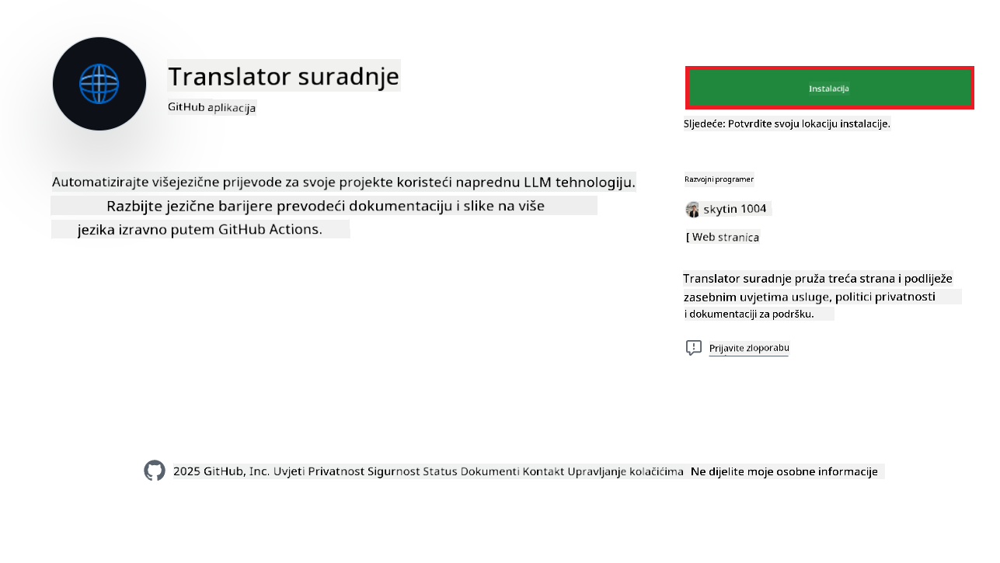
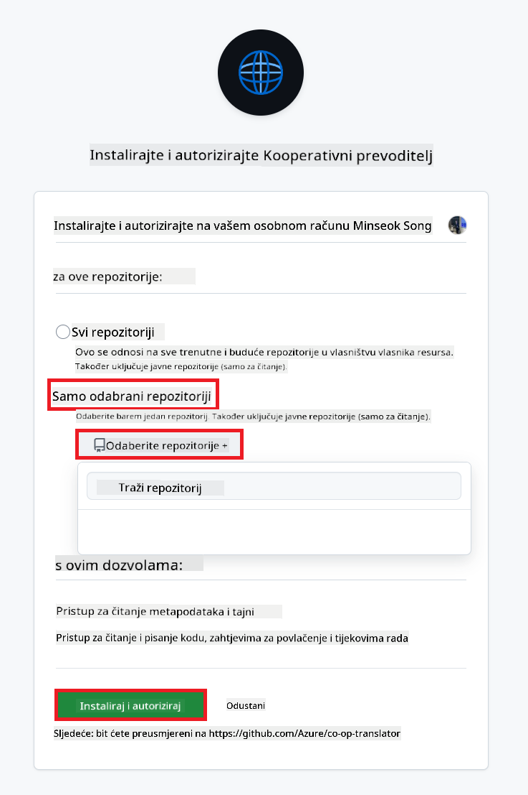
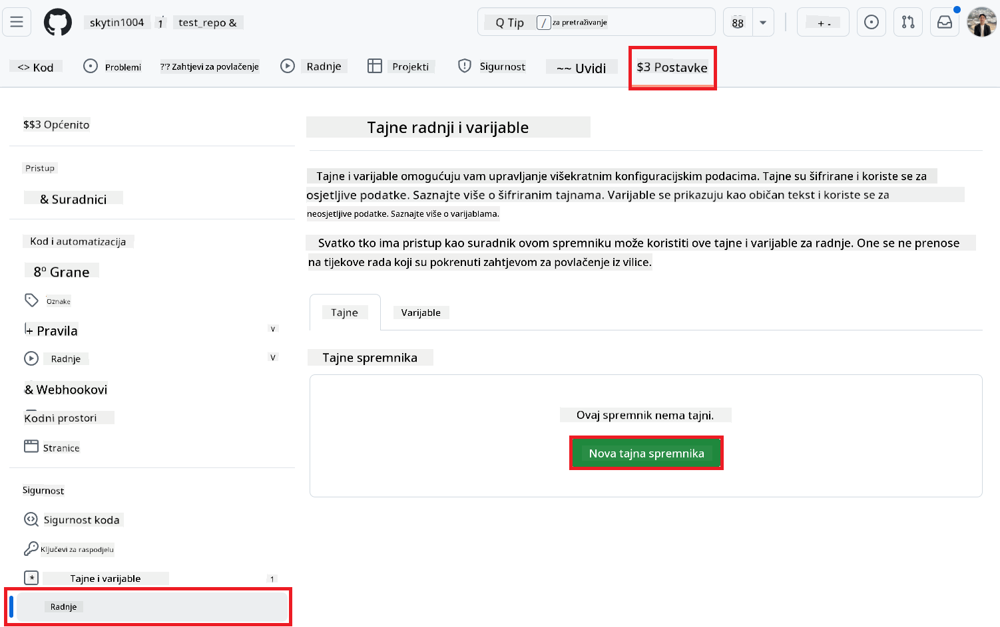
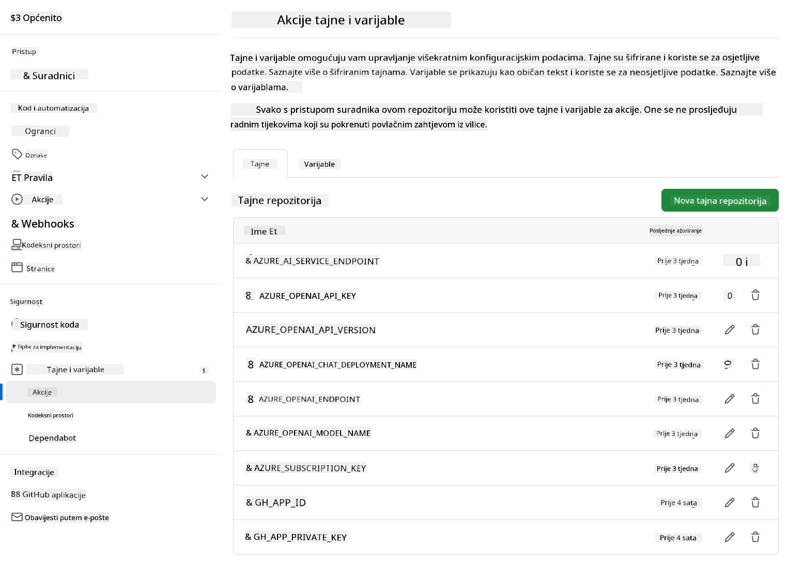

<!--
CO_OP_TRANSLATOR_METADATA:
{
  "original_hash": "c437820027c197f25fb2cbee95bae28c",
  "translation_date": "2025-06-12T19:18:38+00:00",
  "source_file": "getting_started/github-actions-guide/github-actions-guide-org.md",
  "language_code": "hr"
}
-->
# Korištenje Co-op Translator GitHub Akcije (Vodič za organizacije)

**Ciljana publika:** Ovaj vodič namijenjen je **Microsoftovim internim korisnicima** ili **timovima koji imaju pristup potrebnim vjerodajnicama za unaprijed izrađenu Co-op Translator GitHub aplikaciju** ili mogu kreirati vlastitu prilagođenu GitHub aplikaciju.

Automatizirajte prijevod dokumentacije vašeg repozitorija bez napora koristeći Co-op Translator GitHub Akciju. Ovaj vodič vodi vas kroz postavljanje akcije koja automatski kreira pull requestove s ažuriranim prijevodima svaki put kada se promijene vaši izvorišni Markdown fajlovi ili slike.

> [!IMPORTANT]
> 
> **Odabir pravog vodiča:**
>
> Ovaj vodič detaljno opisuje postavljanje koristeći **GitHub App ID i Privatni ključ**. Obično vam je potreban ovaj "Vodič za organizacije" ako: **`GITHUB_TOKEN` dopuštenja su ograničena:** Postavke vaše organizacije ili repozitorija ograničavaju zadana dopuštenja koja standardni `GITHUB_TOKEN` ima. Konkretno, ako `GITHUB_TOKEN` nema potrebna dopuštenja za `write` (kao što su `contents: write` ili `pull-requests: write`), radni tok iz [Javnog vodiča za postavljanje](./github-actions-guide-public.md) neće uspjeti zbog nedostatka dopuštenja. Korištenje namjenske GitHub aplikacije s eksplicitno dodijeljenim dopuštenjima zaobilazi ovo ograničenje.
>
> **Ako ovo ne vrijedi za vas:**
>
> Ako standardni `GITHUB_TOKEN` ima dovoljna dopuštenja u vašem repozitoriju (tj. niste blokirani ograničenjima organizacije), koristite **[Javni vodič za postavljanje koristeći GITHUB_TOKEN](./github-actions-guide-public.md)**. Javni vodič ne zahtijeva pribavljanje ili upravljanje App ID-evima ili Privatnim ključevima te se oslanja isključivo na standardni `GITHUB_TOKEN` i dopuštenja repozitorija.

## Preduvjeti

Prije konfiguriranja GitHub Akcije, osigurajte da imate potrebne vjerodajnice za AI usluge spremne.

**1. Potrebno: Vjerodajnice za AI jezični model**  
Potrebne su vam vjerodajnice za barem jedan podržani jezični model:

- **Azure OpenAI**: Potrebni su Endpoint, API ključ, nazivi modela/implementacija, verzija API-ja.  
- **OpenAI**: Potreban API ključ, (opcionalno: Org ID, Base URL, Model ID).  
- Pogledajte [Podržane modele i usluge](../../../../README.md) za detalje.  
- Vodič za postavljanje: [Postavljanje Azure OpenAI](../set-up-resources/set-up-azure-openai.md).

**2. Opcionalno: Vjerodajnice za Computer Vision (za prijevod slika)**

- Potrebno samo ako želite prevoditi tekst unutar slika.  
- **Azure Computer Vision**: Potrebni su Endpoint i ključ pretplate.  
- Ako nisu navedeni, akcija će raditi u [Markdown-only načinu](../markdown-only-mode.md).  
- Vodič za postavljanje: [Postavljanje Azure Computer Vision](../set-up-resources/set-up-azure-computer-vision.md).

## Postavljanje i konfiguracija

Slijedite ove korake za konfiguraciju Co-op Translator GitHub Akcije u vašem repozitoriju:

### Korak 1: Instalirajte i konfigurirajte GitHub App autentifikaciju

Radni tok koristi autentifikaciju preko GitHub aplikacije kako bi sigurno komunicirao s vašim repozitorijem (npr. kreirao pull requestove) u vaše ime. Odaberite jednu od opcija:

#### **Opcija A: Instalirajte unaprijed izrađenu Co-op Translator GitHub aplikaciju (za Microsoft internu upotrebu)**

1. Posjetite [Co-op Translator GitHub App](https://github.com/apps/co-op-translator) stranicu.

1. Odaberite **Install** i izaberite račun ili organizaciju u kojoj se nalazi vaš cilj repozitorij.

    

1. Odaberite **Only select repositories** i označite svoj cilj repozitorij (npr. `PhiCookBook`). Kliknite **Install**. Možda će biti potrebna autentifikacija.

    

1. **Preuzmite vjerodajnice aplikacije (potreban interni proces):** Da bi radni tok mogao autentificirati kao aplikacija, potrebne su vam dvije informacije koje vam pruža Co-op Translator tim:  
  - **App ID:** Jedinstveni identifikator Co-op Translator aplikacije. App ID je: `1164076`.  
  - **Privatni ključ:** Morate dobiti **cijeli sadržaj** `.pem` privatnog ključa od kontakta održavatelja. **Postupajte s ovim ključem kao s lozinkom i čuvajte ga sigurno.**

1. Nastavite na Korak 2.

#### **Opcija B: Koristite vlastitu prilagođenu GitHub aplikaciju**

- Ako želite, možete kreirati i konfigurirati vlastitu GitHub aplikaciju. Provjerite da ima Read & Write pristup Contents i Pull requests. Trebat će vam njen App ID i generirani Privatni ključ.

### Korak 2: Konfigurirajte tajne u repozitoriju

Morate dodati vjerodajnice GitHub aplikacije i vjerodajnice AI usluga kao šifrirane tajne u postavkama vašeg repozitorija.

1. Otvorite svoj cilj repozitorij na GitHubu (npr. `PhiCookBook`).

1. Idite na **Settings** > **Secrets and variables** > **Actions**.

1. Pod **Repository secrets**, kliknite **New repository secret** za svaku tajnu navedenu u nastavku.

   

**Potrebne tajne (za autentifikaciju GitHub aplikacije):**

| Naziv tajne          | Opis                                      | Izvor vrijednosti                                |
| :------------------- | :----------------------------------------- | :----------------------------------------------- |
| `GH_APP_ID`          | App ID GitHub aplikacije (iz Koraka 1).   | Postavke GitHub aplikacije                        |
| `GH_APP_PRIVATE_KEY` | **Cijeli sadržaj** preuzetog `.pem` fajla. | `.pem` fajl (iz Koraka 1)             |

**Tajne za AI usluge (dodajte SVE koje se odnose na vaše preduvjete):**

| Naziv tajne                         | Opis                                   | Izvor vrijednosti                   |
| :---------------------------------- | :------------------------------------- | :--------------------------------- |
| `AZURE_SUBSCRIPTION_KEY`            | Ključ za Azure AI uslugu (Computer Vision)  | Azure AI Foundry                    |
| `AZURE_AI_SERVICE_ENDPOINT`         | Endpoint za Azure AI uslugu (Computer Vision) | Azure AI Foundry                    |
| `AZURE_OPENAI_API_KEY`              | Ključ za Azure OpenAI uslugu              | Azure AI Foundry                    |
| `AZURE_OPENAI_ENDPOINT`             | Endpoint za Azure OpenAI uslugu            | Azure AI Foundry                    |
| `AZURE_OPENAI_MODEL_NAME`           | Naziv vašeg Azure OpenAI modela            | Azure AI Foundry                    |
| `AZURE_OPENAI_CHAT_DEPLOYMENT_NAME` | Naziv vaše Azure OpenAI implementacije       | Azure AI Foundry                    |
| `AZURE_OPENAI_API_VERSION`          | Verzija API-ja za Azure OpenAI             | Azure AI Foundry                    |
| `OPENAI_API_KEY`                    | API ključ za OpenAI                        | OpenAI Platform                    |
| `OPENAI_ORG_ID`                     | OpenAI Organization ID                    | OpenAI Platform                    |
| `OPENAI_CHAT_MODEL_ID`              | Specifični OpenAI model ID                  | OpenAI Platform                    |
| `OPENAI_BASE_URL`                   | Prilagođeni OpenAI API Base URL            | OpenAI Platform                    |



### Korak 3: Kreirajte workflow datoteku

Na kraju, kreirajte YAML datoteku koja definira automatizirani radni tok.

1. U korijenskom direktoriju vašeg repozitorija kreirajte direktorij `.github/workflows/` ako ne postoji.

1. Unutar `.github/workflows/`, kreirajte datoteku nazvanu `co-op-translator.yml`.

1. Zalijepite sljedeći sadržaj u co-op-translator.yml.

```
name: Co-op Translator

on:
  push:
    branches:
      - main

jobs:
  co-op-translator:
    runs-on: ubuntu-latest

    permissions:
      contents: write
      pull-requests: write

    steps:
      - name: Checkout repository
        uses: actions/checkout@v4
        with:
          fetch-depth: 0

      - name: Set up Python
        uses: actions/setup-python@v4
        with:
          python-version: '3.10'

      - name: Install Co-op Translator
        run: |
          python -m pip install --upgrade pip
          pip install co-op-translator

      - name: Run Co-op Translator
        env:
          PYTHONIOENCODING: utf-8
          # Azure AI Service Credentials
          AZURE_SUBSCRIPTION_KEY: ${{ secrets.AZURE_SUBSCRIPTION_KEY }}
          AZURE_AI_SERVICE_ENDPOINT: ${{ secrets.AZURE_AI_SERVICE_ENDPOINT }}

          # Azure OpenAI Credentials
          AZURE_OPENAI_API_KEY: ${{ secrets.AZURE_OPENAI_API_KEY }}
          AZURE_OPENAI_ENDPOINT: ${{ secrets.AZURE_OPENAI_ENDPOINT }}
          AZURE_OPENAI_MODEL_NAME: ${{ secrets.AZURE_OPENAI_MODEL_NAME }}
          AZURE_OPENAI_CHAT_DEPLOYMENT_NAME: ${{ secrets.AZURE_OPENAI_CHAT_DEPLOYMENT_NAME }}
          AZURE_OPENAI_API_VERSION: ${{ secrets.AZURE_OPENAI_API_VERSION }}

          # OpenAI Credentials
          OPENAI_API_KEY: ${{ secrets.OPENAI_API_KEY }}
          OPENAI_ORG_ID: ${{ secrets.OPENAI_ORG_ID }}
          OPENAI_CHAT_MODEL_ID: ${{ secrets.OPENAI_CHAT_MODEL_ID }}
          OPENAI_BASE_URL: ${{ secrets.OPENAI_BASE_URL }}
        run: |
          # =====================================================================
          # IMPORTANT: Set your target languages here (REQUIRED CONFIGURATION)
          # =====================================================================
          # Example: Translate to Spanish, French, German. Add -y to auto-confirm.
          translate -l "es fr de" -y  # <--- MODIFY THIS LINE with your desired languages

      - name: Authenticate GitHub App
        id: generate_token
        uses: tibdex/github-app-token@v1
        with:
          app_id: ${{ secrets.GH_APP_ID }}
          private_key: ${{ secrets.GH_APP_PRIVATE_KEY }}

      - name: Create Pull Request with translations
        uses: peter-evans/create-pull-request@v5
        with:
          token: ${{ steps.generate_token.outputs.token }}
          commit-message: "🌐 Update translations via Co-op Translator"
          title: "🌐 Update translations via Co-op Translator"
          body: |
            This PR updates translations for recent changes to the main branch.

            ### 📋 Changes included
            - Translated contents are available in the `translations/` directory
            - Translated images are available in the `translated_images/` directory

            ---
            🌐 Automatically generated by the [Co-op Translator](https://github.com/Azure/co-op-translator) GitHub Action.
          branch: update-translations
          base: main
          labels: translation, automated-pr
          delete-branch: true
          add-paths: |
            translations/
            translated_images/

```

4.  **Prilagodite radni tok:**  
  - **[!IMPORTANT] Ciljani jezici:** U `Run Co-op Translator` step, you **MUST review and modify the list of language codes** within the `translate -l "..." -y` command to match your project's requirements. The example list (`ar de es...`) needs to be replaced or adjusted.
  - **Trigger (`on:`):** The current trigger runs on every push to `main`. For large repositories, consider adding a `paths:` filter (see commented example in the YAML) to run the workflow only when relevant files (e.g., source documentation) change, saving runner minutes.
  - **PR Details:** Customize the `commit-message`, `title`, `body`, `branch` name, and `labels` in the `Create Pull Request` step if needed.

## Credential Management and Renewal

- **Security:** Always store sensitive credentials (API keys, private keys) as GitHub Actions secrets. Never expose them in your workflow file or repository code.
- **[!IMPORTANT] Key Renewal (Internal Microsoft Users):** Be aware that Azure OpenAI key used within Microsoft might have a mandatory renewal policy (e.g., every 5 months). Ensure you update the corresponding GitHub secrets (`AZURE_OPENAI_...` ključevima) **prije nego što istekne** kako biste spriječili neuspjehe radnog toka.

## Pokretanje radnog toka

Nakon što je `co-op-translator.yml` datoteka spojena u vaš main branch (ili granu navedenu u `on:` trigger), the workflow will automatically run whenever changes are pushed to that branch (and match the `paths` filteru, ako je konfigurirano).

Ako se prijevodi generiraju ili ažuriraju, akcija će automatski kreirati Pull Request sa promjenama, spreman za vaš pregled i spajanje.

**Odricanje od odgovornosti**:  
Ovaj je dokument preveden korištenjem AI usluge za prijevod [Co-op Translator](https://github.com/Azure/co-op-translator). Iako nastojimo postići točnost, imajte na umu da automatski prijevodi mogu sadržavati pogreške ili netočnosti. Izvorni dokument na izvornom jeziku treba smatrati autoritativnim izvorom. Za kritične informacije preporučuje se profesionalni ljudski prijevod. Nismo odgovorni za bilo kakve nesporazume ili pogrešne interpretacije koje proizlaze iz korištenja ovog prijevoda.