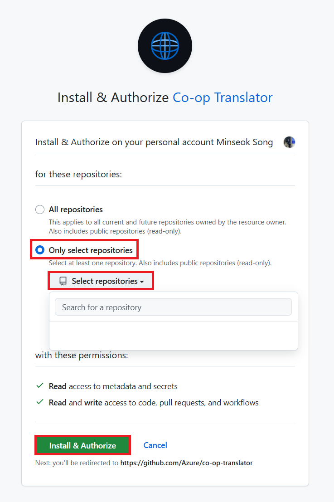

<!--
CO_OP_TRANSLATOR_METADATA:
{
  "original_hash": "9fac847815936ef6e6c8bfde6d191571",
  "translation_date": "2025-10-15T04:07:31+00:00",
  "source_file": "getting_started/github-actions-guide/github-actions-guide-org.md",
  "language_code": "hr"
}
-->
# Korištenje Co-op Translator GitHub Actiona (Vodič za organizacije)

**Ciljana publika:** Ovaj vodič namijenjen je **Microsoftovim internim korisnicima** ili **timovima koji imaju pristup potrebnim vjerodajnicama za unaprijed pripremljenu Co-op Translator GitHub aplikaciju** ili mogu kreirati vlastitu prilagođenu GitHub aplikaciju.

Automatizirajte prijevod dokumentacije vašeg repozitorija bez napora pomoću Co-op Translator GitHub Actiona. Ovaj vodič vas vodi kroz postavljanje actiona koji automatski kreira pull requestove s a쬿riranim prijevodima svaki put kad se promijene izvorne Markdown datoteke ili slike.

> [!IMPORTANT]
> 
> **Odabir pravog vodiča:**
>
> Ovaj vodič opisuje postavljanje pomoću **GitHub App ID-a i privatnog ključa**. Ovu "organizacijsku" metodu obično trebate ako: **`GITHUB_TOKEN` dozvole su ograničene:** Postavke vaše organizacije ili repozitorija ograničavaju zadane dozvole koje standardni `GITHUB_TOKEN` daje. Konkretno, ako `GITHUB_TOKEN` nema potrebne `write` dozvole (poput `contents: write` ili `pull-requests: write`), workflow iz [javnog vodiča za postavljanje](./github-actions-guide-public.md) neće raditi zbog nedovoljnih dozvola. Korištenje namjenske GitHub aplikacije s eksplicitno dodijeljenim dozvolama zaobilazi ovo ograničenje.
>
> **Ako se gore navedeno ne odnosi na vas:**
>
> Ako standardni `GITHUB_TOKEN` ima dovoljne dozvole u vašem repozitoriju (tj. niste blokirani organizacijskim ograničenjima), koristite **[Javni vodič za postavljanje pomoću GITHUB_TOKEN-a](./github-actions-guide-public.md)**. Javni vodič ne zahtijeva dobivanje ili upravljanje App ID-ima ili privatnim ključevima i oslanja se isključivo na standardni `GITHUB_TOKEN` i dozvole repozitorija.

## Preduvjeti

Prije konfiguracije GitHub Actiona, osigurajte da imate spremne potrebne vjerodajnice za AI servis.

**1. Obavezno: Vjerodajnice za AI jezični model**
Potrebne su vam vjerodajnice za barem jedan podr쬬ni jezični model:

- **Azure OpenAI**: Potreban je Endpoint, API ključ, naziv modela/deploymenta, verzija API-ja.
- **OpenAI**: Potreban je API ključ, (Opcionalno: Org ID, Base URL, Model ID).
- Pogledajte [Podr쬬ni modeli i servisi](../../../../README.md) za detalje.
- Vodič za postavljanje: [Postavljanje Azure OpenAI](../set-up-resources/set-up-azure-openai.md).

**2. Opcionalno: Vjerodajnice za računalni vid (za prijevod slika)**

- Potrebno samo ako 쬰lite prevoditi tekst unutar slika.
- **Azure Computer Vision**: Potreban je Endpoint i Subscription Key.
- Ako nije navedeno, action radi u [samo Markdown načinu](../markdown-only-mode.md).
- Vodič za postavljanje: [Postavljanje Azure Computer Vision](../set-up-resources/set-up-azure-computer-vision.md).

## Postavljanje i konfiguracija

Slijedite ove korake za konfiguraciju Co-op Translator GitHub Actiona u vašem repozitoriju:

### Korak 1: Instalirajte i konfigurirajte GitHub App autentikaciju

Workflow koristi GitHub App autentikaciju za sigurno povezivanje s vašim repozitorijem (npr. kreiranje pull requestova) u vaše ime. Odaberite jednu opciju:

#### **Opcija A: Instalirajte unaprijed pripremljenu Co-op Translator GitHub aplikaciju (za Microsoft interne korisnike)**

1. Otvorite stranicu [Co-op Translator GitHub App](https://github.com/apps/co-op-translator).

1. Odaberite **Install** i odaberite račun ili organizaciju gdje se nalazi vaš ciljani repozitorij.

    

1. Odaberite **Only select repositories** i odaberite vaš ciljani repozitorij (npr. `PhiCookBook`). Kliknite **Install**. Mo쬯a ćete morati potvrditi identitet.

    

1. **Dobavite vjerodajnice aplikacije (potreban interni proces):** Da biste omogućili workflowu autentikaciju kao aplikacija, trebate dvije informacije koje daje Co-op Translator tim:
  - **App ID:** Jedinstveni identifikator za Co-op Translator aplikaciju. App ID je: `1164076`.
  - **Privatni ključ:** Morate dobiti **cijeli sadr쬬j** `.pem` privatnog ključa od kontakt osobe za odr쬬vanje. **Tretirajte ovaj ključ kao lozinku i čuvajte ga sigurno.**

1. Nastavite na Korak 2.

#### **Opcija B: Koristite vlastitu prilagođenu GitHub aplikaciju**

- Ako 쬰lite, mo쬰te kreirati i konfigurirati vlastitu GitHub aplikaciju. Osigurajte da ima Read & write pristup za Contents i Pull requests. Trebat će vam njen App ID i generirani privatni ključ.

### Korak 2: Konfigurirajte tajne repozitorija

Morate dodati vjerodajnice GitHub aplikacije i AI servisa kao enkriptirane tajne u postavkama repozitorija.

1. Otvorite vaš ciljani GitHub repozitorij (npr. `PhiCookBook`).

1. Idite na **Settings** > **Secrets and variables** > **Actions**.

1. Pod **Repository secrets**, kliknite **New repository secret** za svaku tajnu s popisa dolje.

   

**Obavezne tajne (za GitHub App autentikaciju):**

| Naziv tajne          | Opis                                      | Izvor vrijednosti                                     |
| :------------------- | :----------------------------------------- | :---------------------------------------------------- |
| `GH_APP_ID`          | App ID GitHub aplikacije (iz Koraka 1).    | Postavke GitHub aplikacije                            |
| `GH_APP_PRIVATE_KEY` | **Cijeli sadr쬬j** preuzetog `.pem` fajla. | `.pem` fajl (iz Koraka 1)                             |

**Tajne za AI servis (dodajte SVE koje se odnose na vaše preduvjete):**

| Naziv tajne                         | Opis                                   | Izvor vrijednosti                |
| :---------------------------------- | :------------------------------------- | :------------------------------- |
| `AZURE_AI_SERVICE_API_KEY`            | Ključ za Azure AI servis (Computer Vision)  | Azure AI Foundry                    |
| `AZURE_AI_SERVICE_ENDPOINT`         | Endpoint za Azure AI servis (Computer Vision) | Azure AI Foundry                     |
| `AZURE_OPENAI_API_KEY`              | Ključ za Azure OpenAI servis           | Azure AI Foundry                     |
| `AZURE_OPENAI_ENDPOINT`             | Endpoint za Azure OpenAI servis        | Azure AI Foundry                     |
| `AZURE_OPENAI_MODEL_NAME`           | Naziv vašeg Azure OpenAI modela        | Azure AI Foundry                     |
| `AZURE_OPENAI_CHAT_DEPLOYMENT_NAME` | Naziv vašeg Azure OpenAI deploymenta   | Azure AI Foundry                     |
| `AZURE_OPENAI_API_VERSION`          | Verzija API-ja za Azure OpenAI         | Azure AI Foundry                     |
| `OPENAI_API_KEY`                    | API ključ za OpenAI                    | OpenAI Platform                  |
| `OPENAI_ORG_ID`                     | OpenAI Organization ID                 | OpenAI Platform                  |
| `OPENAI_CHAT_MODEL_ID`              | ID specifičnog OpenAI modela           | OpenAI Platform                    |
| `OPENAI_BASE_URL`                   | Prilagođeni OpenAI API Base URL        | OpenAI Platform                    |


### Korak 3: Kreirajte workflow datoteku

Na kraju, kreirajte YAML datoteku koja definira automatizirani workflow.

1. U root direktoriju vašeg repozitorija, kreirajte direktorij `.github/workflows/` ako ne postoji.

1. Unutar `.github/workflows/`, kreirajte datoteku naziva `co-op-translator.yml`.

1. Zalijepite sljedeći sadr쬬j u co-op-translator.yml.

```
name: Co-op Translator

on:
  push:
    branches:
      - main

jobs:
  co-op-translator:
    runs-on: ubuntu-latest

    permissions:
      contents: write
      pull-requests: write

    steps:
      - name: Checkout repository
        uses: actions/checkout@v4
        with:
          fetch-depth: 0

      - name: Set up Python
        uses: actions/setup-python@v4
        with:
          python-version: '3.10'

      - name: Install Co-op Translator
        run: |
          python -m pip install --upgrade pip
          pip install co-op-translator

      - name: Run Co-op Translator
        env:
          PYTHONIOENCODING: utf-8
          # Azure AI Service Credentials
          AZURE_AI_SERVICE_API_KEY: ${{ secrets.AZURE_AI_SERVICE_API_KEY }}
          AZURE_AI_SERVICE_ENDPOINT: ${{ secrets.AZURE_AI_SERVICE_ENDPOINT }}

          # Azure OpenAI Credentials
          AZURE_OPENAI_API_KEY: ${{ secrets.AZURE_OPENAI_API_KEY }}
          AZURE_OPENAI_ENDPOINT: ${{ secrets.AZURE_OPENAI_ENDPOINT }}
          AZURE_OPENAI_MODEL_NAME: ${{ secrets.AZURE_OPENAI_MODEL_NAME }}
          AZURE_OPENAI_CHAT_DEPLOYMENT_NAME: ${{ secrets.AZURE_OPENAI_CHAT_DEPLOYMENT_NAME }}
          AZURE_OPENAI_API_VERSION: ${{ secrets.AZURE_OPENAI_API_VERSION }}

          # OpenAI Credentials
          OPENAI_API_KEY: ${{ secrets.OPENAI_API_KEY }}
          OPENAI_ORG_ID: ${{ secrets.OPENAI_ORG_ID }}
          OPENAI_CHAT_MODEL_ID: ${{ secrets.OPENAI_CHAT_MODEL_ID }}
          OPENAI_BASE_URL: ${{ secrets.OPENAI_BASE_URL }}
        run: |
          # =====================================================================
          # IMPORTANT: Set your target languages here (REQUIRED CONFIGURATION)
          # =====================================================================
          # Example: Translate to Spanish, French, German. Add -y to auto-confirm.
          translate -l "es fr de" -y  # <--- MODIFY THIS LINE with your desired languages

      - name: Authenticate GitHub App
        id: generate_token
        uses: tibdex/github-app-token@v1
        with:
          app_id: ${{ secrets.GH_APP_ID }}
          private_key: ${{ secrets.GH_APP_PRIVATE_KEY }}

      - name: Create Pull Request with translations
        uses: peter-evans/create-pull-request@v5
        with:
          token: ${{ steps.generate_token.outputs.token }}
          commit-message: "🌐 Update translations via Co-op Translator"
          title: "🌐 Update translations via Co-op Translator"
          body: |
            This PR updates translations for recent changes to the main branch.

            ### 📋 Changes included
            - Translated contents are available in the `translations/` directory
            - Translated images are available in the `translated_images/` directory

            ---
            🌐 Automatically generated by the [Co-op Translator](https://github.com/Azure/co-op-translator) GitHub Action.
          branch: update-translations
          base: main
          labels: translation, automated-pr
          delete-branch: true
          add-paths: |
            translations/
            translated_images/

```

4.  **Prilagodite workflow:**
  - **[!IMPORTANT] Ciljani jezici:** U koraku `Run Co-op Translator` **OBAVEZNO pregledajte i izmijenite popis jezičnih kodova** unutar naredbe `translate -l "..." -y` prema potrebama vašeg projekta. Primjer popisa (`ar de es...`) treba zamijeniti ili prilagoditi.
  - **Trigger (`on:`):** Trenutni trigger pokreće workflow na svaki push na `main`. Za velike repozitorije, razmislite o dodavanju `paths:` filtera (pogledajte komentirani primjer u YAML-u) kako bi se workflow pokretao samo kad se promijene relevantne datoteke (npr. izvorna dokumentacija), čime štedite vrijeme izvođenja.
  - **Detalji PR-a:** Prilagodite `commit-message`, `title`, `body`, naziv `branch`a i `labels` u koraku `Create Pull Request` po potrebi.

## Upravljanje vjerodajnicama i obnova

- **Sigurnost:** Osjetljive vjerodajnice (API ključeve, privatne ključeve) uvijek pohranjujte kao GitHub Actions tajne. Nikada ih ne izla쬴te u workflow datoteci ili kodu repozitorija.
- **[!IMPORTANT] Obnova ključeva (Microsoft interni korisnici):** Imajte na umu da Azure OpenAI ključ korišten unutar Microsofta mo쬰 imati obaveznu politiku obnove (npr. svakih 5 mjeseci). Obavezno a쬿rirajte odgovarajuće GitHub tajne (`AZURE_OPENAI_...` ključeve) **prije isteka** kako biste spriječili prekid workflowa.

## Pokretanje workflowa

> [!WARNING]  
> **Vremensko ograničenje za GitHub-hosted runner:**  
> GitHub-hosted runneri poput `ubuntu-latest` imaju **maksimalno vrijeme izvođenja od 6 sati**.  
> Za velike repozitorije s dokumentacijom, ako proces prevođenja premaši 6 sati, workflow će automatski biti prekinut.  
> Da biste to spriječili, razmislite o:  
> - Korištenju **self-hosted runnera** (bez vremenskog ograničenja)  
> - Smanjenju broja ciljanih jezika po pokretanju

Kada se datoteka `co-op-translator.yml` spoji na vaš glavni branch (ili branch naveden u `on:` triggeru), workflow će se automatski pokrenuti svaki put kad se promjene pošalju na taj branch (i zadovolje `paths` filter, ako je konfiguriran).

Ako se generiraju ili a쬿riraju prijevodi, action će automatski kreirati Pull Request s promjenama, spreman za vaš pregled i spajanje.

---

**Odricanje od odgovornosti**:
Ovaj dokument je preveden pomoću AI usluge za prevođenje [Co-op Translator](https://github.com/Azure/co-op-translator). Iako nastojimo osigurati točnost, imajte na umu da automatski prijevodi mogu sadr쬬vati pogreške ili netočnosti. Izvorni dokument na svom izvornom jeziku treba smatrati mjerodavnim izvorom. Za ključne informacije preporučuje se profesionalni ljudski prijevod. Ne snosimo odgovornost za bilo kakva nesporazume ili pogrešna tumačenja koja proizlaze iz korištenja ovog prijevoda.