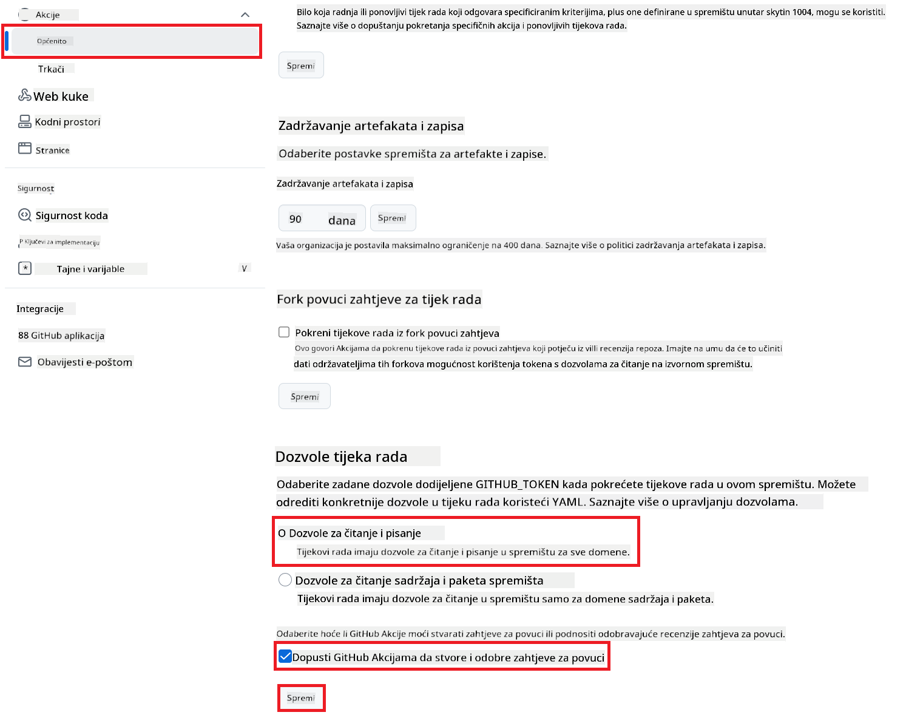

<!--
CO_OP_TRANSLATOR_METADATA:
{
  "original_hash": "a52587a512e667f70d92db853d3c61d5",
  "translation_date": "2025-06-12T19:35:55+00:00",
  "source_file": "getting_started/github-actions-guide/github-actions-guide-public.md",
  "language_code": "hr"
}
-->
# Korištenje Co-op Translator GitHub Action (Javna postavka)

**Ciljana publika:** Ovaj vodič namijenjen je korisnicima u većini javnih ili privatnih repozitorija gdje su dovoljne standardne GitHub Actions dozvole. Koristi ugrađeni `GITHUB_TOKEN`.

Automatizirajte prevođenje dokumentacije vašeg repozitorija bez napora koristeći Co-op Translator GitHub Action. Ovaj vodič vodi vas kroz postavljanje akcije koja automatski stvara pull requestove s ažuriranim prijevodima kad god se promijene vaši izvorišni Markdown fajlovi ili slike.

> [!IMPORTANT]
>
> **Odabir pravog vodiča:**
>
> Ovaj vodič opisuje **jednostavnije postavljanje koristeći standardni `GITHUB_TOKEN`**. Ovo je preporučena metoda za većinu korisnika jer ne zahtijeva upravljanje osjetljivim GitHub App Private Keys.
>

## Preduvjeti

Prije konfiguriranja GitHub Action, provjerite imate li spremne potrebne vjerodajnice za AI uslugu.

**1. Obavezno: Vjerodajnice za AI jezični model**  
Potrebne su vam vjerodajnice za barem jedan podržani jezični model:

- **Azure OpenAI**: Potrebni su Endpoint, API ključ, nazivi modela/deploymenta, verzija API-ja.  
- **OpenAI**: Potreban API ključ, (neobavezno: Org ID, Base URL, Model ID).  
- Pogledajte [Supported Models and Services](../../../../README.md) za detalje.

**2. Neobavezno: Vjerodajnice za AI Vision (za prijevod slika)**

- Potrebno samo ako želite prevoditi tekst unutar slika.  
- **Azure AI Vision**: Potrebni su Endpoint i Subscription Key.  
- Ako nisu navedene, akcija koristi [Markdown-only mode](../markdown-only-mode.md).

## Postavljanje i konfiguracija

Slijedite ove korake za konfiguriranje Co-op Translator GitHub Action u vašem repozitoriju koristeći standardni `GITHUB_TOKEN`.

### Korak 1: Razumijevanje autentifikacije (korištenje `GITHUB_TOKEN`)

Ovaj workflow koristi ugrađeni `GITHUB_TOKEN` koji pružaju GitHub Actions. Ovaj token automatski dodjeljuje dozvole workflowu za interakciju s vašim repozitorijem na temelju postavki konfiguriranih u **Koraku 3**.

### Korak 2: Konfiguriranje tajni repozitorija

Potrebno je samo dodati vaše **vjerodajnice AI usluge** kao šifrirane tajne u postavkama repozitorija.

1.  Otvorite ciljani GitHub repozitorij.  
2.  Idite na **Settings** > **Secrets and variables** > **Actions**.  
3.  Pod **Repository secrets**, kliknite **New repository secret** za svaku potrebnu AI uslužnu tajnu navedenu u nastavku.

     *(Slika prikazuje gdje dodati tajne)*

**Obavezne AI uslužne tajne (dodajte SVE koje se odnose na vaše preduvjete):**

| Naziv tajne                      | Opis                                    | Izvor vrijednosti               |
| :------------------------------- | :------------------------------------- | :----------------------------- |
| `AZURE_SUBSCRIPTION_KEY`            | Ključ za Azure AI uslugu (Computer Vision)  | Vaš Azure AI Foundry            |
| `AZURE_AI_SERVICE_ENDPOINT`         | Endpoint za Azure AI uslugu (Computer Vision) | Vaš Azure AI Foundry            |
| `AZURE_OPENAI_API_KEY`              | Ključ za Azure OpenAI uslugu             | Vaš Azure AI Foundry            |
| `AZURE_OPENAI_ENDPOINT`             | Endpoint za Azure OpenAI uslugu           | Vaš Azure AI Foundry            |
| `AZURE_OPENAI_MODEL_NAME`           | Naziv vašeg Azure OpenAI modela           | Vaš Azure AI Foundry            |
| `AZURE_OPENAI_CHAT_DEPLOYMENT_NAME` | Naziv vašeg Azure OpenAI deploymenta       | Vaš Azure AI Foundry            |
| `AZURE_OPENAI_API_VERSION`          | Verzija API-ja za Azure OpenAI             | Vaš Azure AI Foundry            |
| `OPENAI_API_KEY`                    | API ključ za OpenAI                      | Vaša OpenAI platforma           |
| `OPENAI_ORG_ID`                     | OpenAI Organization ID (neobavezno)      | Vaša OpenAI platforma           |
| `OPENAI_CHAT_MODEL_ID`              | Specifični OpenAI model ID (neobavezno)  | Vaša OpenAI platforma           |
| `OPENAI_BASE_URL`                   | Prilagođeni OpenAI API Base URL (neobavezno) | Vaša OpenAI platforma           |

### Korak 3: Konfiguriranje dozvola workflowa

GitHub Action treba dozvole dodijeljene putem `GITHUB_TOKEN` za dohvat koda i kreiranje pull requestova.

1.  U vašem repozitoriju idite na **Settings** > **Actions** > **General**.  
2.  Pomaknite se do odjeljka **Workflow permissions**.  
3.  Odaberite **Read and write permissions**. Time se `GITHUB_TOKEN` daju potrebne dozvole za `contents: write` i `pull-requests: write` za ovaj workflow.  
4.  Provjerite je li označeno polje **Allow GitHub Actions to create and approve pull requests**.  
5.  Kliknite **Save**.



### Korak 4: Kreiranje workflow datoteke

Na kraju, kreirajte YAML datoteku koja definira automatizirani workflow koristeći `GITHUB_TOKEN`.

1.  U korijenskom direktoriju vašeg repozitorija, kreirajte direktorij `.github/workflows/` ako već ne postoji.  
2.  U direktoriju `.github/workflows/` kreirajte datoteku naziva `co-op-translator.yml`.  
3.  Zalijepite sljedeći sadržaj u `co-op-translator.yml`.

```yaml
name: Co-op Translator

on:
  push:
    branches:
      - main

jobs:
  co-op-translator:
    runs-on: ubuntu-latest

    permissions:
      contents: write
      pull-requests: write

    steps:
      - name: Checkout repository
        uses: actions/checkout@v4
        with:
          fetch-depth: 0

      - name: Set up Python
        uses: actions/setup-python@v4
        with:
          python-version: '3.10'

      - name: Install Co-op Translator
        run: |
          python -m pip install --upgrade pip
          pip install co-op-translator

      - name: Run Co-op Translator
        env:
          PYTHONIOENCODING: utf-8
          # === AI Service Credentials ===
          AZURE_SUBSCRIPTION_KEY: ${{ secrets.AZURE_SUBSCRIPTION_KEY }}
          AZURE_AI_SERVICE_ENDPOINT: ${{ secrets.AZURE_AI_SERVICE_ENDPOINT }}
          AZURE_OPENAI_API_KEY: ${{ secrets.AZURE_OPENAI_API_KEY }}
          AZURE_OPENAI_ENDPOINT: ${{ secrets.AZURE_OPENAI_ENDPOINT }}
          AZURE_OPENAI_MODEL_NAME: ${{ secrets.AZURE_OPENAI_MODEL_NAME }}
          AZURE_OPENAI_CHAT_DEPLOYMENT_NAME: ${{ secrets.AZURE_OPENAI_CHAT_DEPLOYMENT_NAME }}
          AZURE_OPENAI_API_VERSION: ${{ secrets.AZURE_OPENAI_API_VERSION }}
          OPENAI_API_KEY: ${{ secrets.OPENAI_API_KEY }}
          OPENAI_ORG_ID: ${{ secrets.OPENAI_ORG_ID }}
          OPENAI_CHAT_MODEL_ID: ${{ secrets.OPENAI_CHAT_MODEL_ID }}
          OPENAI_BASE_URL: ${{ secrets.OPENAI_BASE_URL }}
        run: |
          # =====================================================================
          # IMPORTANT: Set your target languages here (REQUIRED CONFIGURATION)
          # =====================================================================
          # Example: Translate to Spanish, French, German. Add -y to auto-confirm.
          translate -l "es fr de" -y  # <--- MODIFY THIS LINE with your desired languages

      - name: Create Pull Request with translations
        uses: peter-evans/create-pull-request@v5
        with:
          token: ${{ secrets.GITHUB_TOKEN }}
          commit-message: "🌐 Update translations via Co-op Translator"
          title: "🌐 Update translations via Co-op Translator"
          body: |
            This PR updates translations for recent changes to the main branch.

            ### 📋 Changes included
            - Translated contents are available in the `translations/` directory
            - Translated images are available in the `translated_images/` directory

            ---
            🌐 Automatically generated by the [Co-op Translator](https://github.com/Azure/co-op-translator) GitHub Action.
          branch: update-translations
          base: main
          labels: translation, automated-pr
          delete-branch: true
          add-paths: |
            translations/
            translated_images/
```  
4.  **Prilagodba workflowa:**  
  - **[!IMPORTANT] Ciljani jezici:** U koraku `Run Co-op Translator` step, you **MUST review and modify the list of language codes** within the `translate -l "..." -y` command to match your project's requirements. The example list (`ar de es...`) needs to be replaced or adjusted.
  - **Trigger (`on:`):** The current trigger runs on every push to `main`. For large repositories, consider adding a `paths:` filter (see commented example in the YAML) to run the workflow only when relevant files (e.g., source documentation) change, saving runner minutes.
  - **PR Details:** Customize the `commit-message`, `title`, `body`, `branch` name, and `labels` in the `Create Pull Request` po potrebi izmijenite popis jezika.

**Odricanje od odgovornosti**:  
Ovaj je dokument preveden pomoću AI usluge za prevođenje [Co-op Translator](https://github.com/Azure/co-op-translator). Iako nastojimo postići točnost, imajte na umu da automatski prijevodi mogu sadržavati pogreške ili netočnosti. Izvorni dokument na izvornom jeziku treba smatrati službenim i autoritativnim izvorom. Za važne informacije preporučuje se profesionalni ljudski prijevod. Ne snosimo odgovornost za bilo kakva nesporazuma ili pogrešne interpretacije koje proizlaze iz korištenja ovog prijevoda.