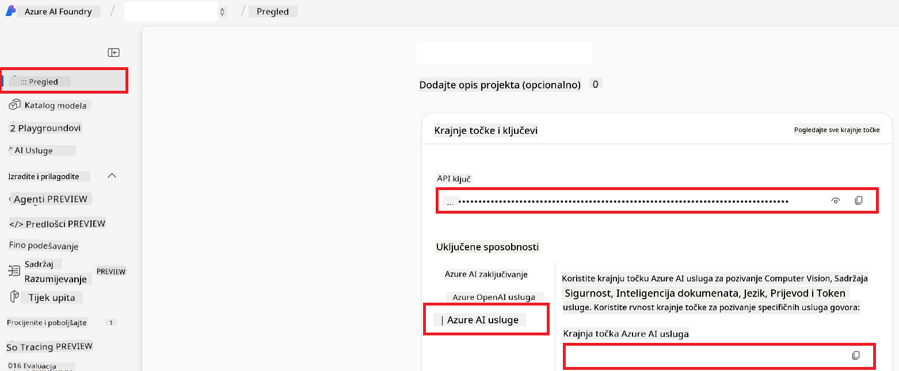

<!--
CO_OP_TRANSLATOR_METADATA:
{
  "original_hash": "b58d7c3cb4210697a073d20eb3064945",
  "translation_date": "2025-06-12T11:59:11+00:00",
  "source_file": "getting_started/set-up-azure-ai.md",
  "language_code": "hr"
}
-->
# Postavljanje Azure AI za Co-op Translator (Azure OpenAI i Azure AI Vision)

Ovaj vodič vodi vas kroz postavljanje Azure OpenAI za prevođenje jezika i Azure Computer Vision za analizu sadržaja slika (koja se potom može koristiti za prijevod temeljen na slikama) unutar Azure AI Foundry.

**Preduvjeti:**
- Azure račun s aktivnom pretplatom.
- Dovoljne dozvole za kreiranje resursa i implementacija u vašoj Azure pretplati.

## Kreirajte Azure AI projekt

Počnite kreiranjem Azure AI projekta, koji služi kao centralno mjesto za upravljanje vašim AI resursima.

1. Idite na [https://ai.azure.com](https://ai.azure.com) i prijavite se svojim Azure računom.

1. Odaberite **+Create** za kreiranje novog projekta.

1. Obavite sljedeće zadatke:
   - Unesite **Project name** (npr. `CoopTranslator-Project`).
   - Odaberite **AI hub** (npr. `CoopTranslator-Hub`) (kreirajte novi ako je potrebno).

1. Kliknite "**Review and Create**" za postavljanje projekta. Bit ćete preusmjereni na stranicu pregleda vašeg projekta.

## Postavljanje Azure OpenAI za prevođenje jezika

Unutar vašeg projekta implementirat ćete Azure OpenAI model koji će služiti kao backend za prijevod teksta.

### Otvorite svoj projekt

Ako već niste, otvorite svoj novokreirani projekt (npr. `CoopTranslator-Project`) u Azure AI Foundry.

### Implementirajte OpenAI model

1. Iz lijevog izbornika vašeg projekta, pod "My assets", odaberite "**Models + endpoints**".

1. Odaberite **+ Deploy model**.

1. Odaberite **Deploy Base Model**.

1. Prikazat će vam se popis dostupnih modela. Filtrirajte ili potražite odgovarajući GPT model. Preporučujemo `gpt-4o`.

1. Odaberite željeni model i kliknite **Confirm**.

1. Odaberite **Deploy**.

### Konfiguracija Azure OpenAI

Nakon implementacije, možete odabrati implementaciju na stranici "**Models + endpoints**" kako biste pronašli **REST endpoint URL**, **Key**, **Deployment name**, **Model name** i **API version**. Ovo će vam trebati za integraciju modela za prijevod u vašu aplikaciju.

> [!NOTE]
> API verzije možete odabrati na stranici [API version deprecation](https://learn.microsoft.com/azure/ai-services/openai/api-version-deprecation) prema vašim potrebama. Imajte na umu da je **API version** različit od **Model version** prikazanog na stranici **Models + endpoints** u Azure AI Foundry.

## Postavljanje Azure Computer Vision za prijevod slika

Da biste omogućili prijevod teksta unutar slika, trebate pronaći Azure AI Service API Key i Endpoint.

1. Idite na svoj Azure AI projekt (npr. `CoopTranslator-Project`). Provjerite da ste na stranici pregleda projekta.

### Konfiguracija Azure AI Service

Pronađite API Key i Endpoint u Azure AI Service.

1. Idite na svoj Azure AI projekt (npr. `CoopTranslator-Project`). Provjerite da ste na stranici pregleda projekta.

1. Pronađite **API Key** i **Endpoint** u kartici Azure AI Service.

    

Ova veza omogućuje dostupnost mogućnosti povezanog Azure AI Services resursa (uključujući analizu slika) vašem AI Foundry projektu. Zatim ovu vezu možete koristiti u svojim bilježnicama ili aplikacijama za izvlačenje teksta iz slika, koji se potom može poslati Azure OpenAI modelu na prijevod.

## Konsolidacija vaših vjerodajnica

Do sada biste trebali imati sljedeće podatke:

**Za Azure OpenAI (Prijevod teksta):**
- Azure OpenAI Endpoint
- Azure OpenAI API Key
- Azure OpenAI Model Name (npr. `gpt-4o`)
- Azure OpenAI Deployment Name (npr. `cooptranslator-gpt4o`)
- Azure OpenAI API Version

**Za Azure AI Services (Izvlačenje teksta iz slike putem Vision):**
- Azure AI Service Endpoint
- Azure AI Service API Key

### Primjer: Konfiguracija varijabli okoline (Pregled)

Kasnije, prilikom izrade vaše aplikacije, vjerojatno ćete ih konfigurirati koristeći ove prikupljene vjerodajnice. Na primjer, možete ih postaviti kao varijable okoline ovako:

```bash
# Azure AI Service Credentials (Required for image translation)
AZURE_AI_SERVICE_API_KEY="your_azure_ai_service_api_key" # e.g., 21xasd...
AZURE_AI_SERVICE_ENDPOINT="https://your_azure_ai_service_endpoint.cognitiveservices.azure.com/"

# Azure OpenAI Credentials (Required for text translation)
AZURE_OPENAI_API_KEY="your_azure_openai_api_key" # e.g., 21xasd...
AZURE_OPENAI_ENDPOINT="https://your_azure_openai_endpoint.openai.azure.com/"
AZURE_OPENAI_MODEL_NAME="your_model_name" # e.g., gpt-4o
AZURE_OPENAI_CHAT_DEPLOYMENT_NAME="your_deployment_name" # e.g., cooptranslator-gpt4o
AZURE_OPENAI_API_VERSION="your_api_version" # e.g., 2024-12-01-preview
```

---

### Dodatno čitanje

- [Kako kreirati projekt u Azure AI Foundry](https://learn.microsoft.com/azure/ai-foundry/how-to/create-projects?tabs=ai-studio)
- [Kako kreirati Azure AI resurse](https://learn.microsoft.com/azure/ai-foundry/how-to/create-azure-ai-resource?tabs=portal)
- [Kako implementirati OpenAI modele u Azure AI Foundry](https://learn.microsoft.com/en-us/azure/ai-foundry/how-to/deploy-models-openai)

**Izjava o odricanju od odgovornosti**:  
Ovaj dokument je preveden pomoću AI usluge za prevođenje [Co-op Translator](https://github.com/Azure/co-op-translator). Iako težimo točnosti, imajte na umu da automatski prijevodi mogu sadržavati pogreške ili netočnosti. Izvorni dokument na izvornom jeziku treba smatrati autoritativnim izvorom. Za kritične informacije preporučuje se profesionalni ljudski prijevod. Ne snosimo odgovornost za bilo kakva nesporazuma ili pogrešna tumačenja koja proizlaze iz korištenja ovog prijevoda.