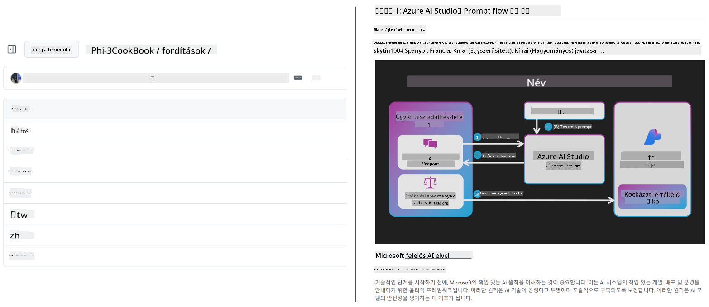
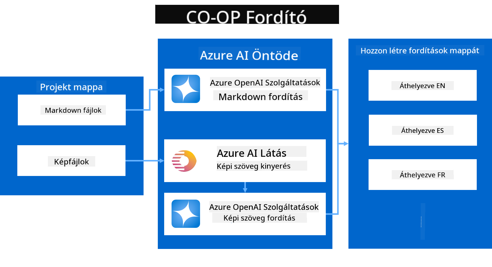
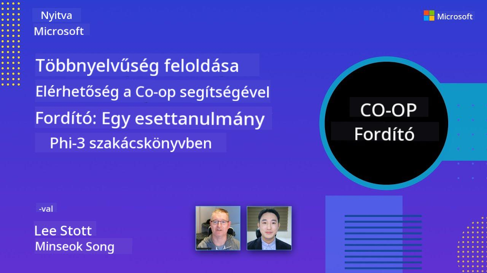

<!--
CO_OP_TRANSLATOR_METADATA:
{
  "original_hash": "044724537b57868117aadae8e7728c7c",
  "translation_date": "2025-06-12T10:46:31+00:00",
  "source_file": "README.md",
  "language_code": "hu"
}
-->


# Co-op Translator: Oktatási dokumentációk fordításának automatizálása könnyedén

_A dokumentáció több nyelvre történő egyszerű automatizált fordításával érjen el globális közönséget._

[](https://pypi.org/project/co-op-translator/)
[](https://github.com/azure/co-op-translator/blob/main/LICENSE)
[](https://pepy.tech/project/co-op-translator)
[](https://pepy.tech/project/co-op-translator)
[](https://github.com/psf/black)

[](https://GitHub.com/azure/co-op-translator/graphs/contributors/)
[](https://GitHub.com/azure/co-op-translator/issues/)
[](https://GitHub.com/azure/co-op-translator/pulls/)
[](http://makeapullrequest.com)

### Nyelvi támogatás a Co-op Translator segítségével

> [!NOTE]
> Ezek a jelenlegi fordítások a repository tartalmához. A Co-op Translator által támogatott összes nyelv teljes listájáért kérjük, tekintse meg a [Language Support](../..) részt.

[](https://GitHub.com/azure/co-op-translator/watchers/)
[](https://GitHub.com/azure/co-op-translator/network/)
[](https://GitHub.com/azure/co-op-translator/stargazers/)

[](https://discord.com/invite/ByRwuEEgH4)

[](https://codespaces.new/azure/co-op-translator)
[](https://vscode.dev/redirect?url=vscode://ms-vscode-remote.remote-containers/cloneInVolume?url=https://github.com/azure/co-op-translator)

## Áttekintés: Egyszerűsítse oktatási tartalmai fordítását

A nyelvi akadályok jelentősen korlátozzák a tanulók és fejlesztők hozzáférését értékes oktatási anyagokhoz és technikai tudáshoz világszerte. Ez csökkenti a részvételt, és lassítja a globális innováció és tanulás ütemét.

A **Co-op Translator** abból a szükségletből született, hogy megoldja a Microsoft saját nagyszabású oktatási sorozatainak (például a "For Beginners" útmutatók) kézi fordításának hatékonysági problémáit. Egy könnyen használható, erőteljes eszközzé fejlődött, amely mindenki számára lebontja ezeket a nyelvi korlátokat. Magas színvonalú, automatikus fordításokat kínál CLI-n és GitHub Actions-en keresztül, így világszerte segíti az oktatókat, diákokat, kutatókat és fejlesztőket a tudás megosztásában és hozzáférésében nyelvi akadályok nélkül.

Nézze meg, hogyan rendezi a Co-op Translator a lefordított oktatási tartalmakat:



A Markdown fájlok és a képek szövege automatikusan fordításra kerül, és nyelvspecifikus mappákba rendezve jelenik meg.

**Nyissa meg oktatási tartalma világméretű elérését még ma a Co-op Translator segítségével!**

## A Microsoft tanulási anyagainak globális elérhetőségének támogatása

A Co-op Translator segít áthidalni a nyelvi szakadékot a Microsoft kulcsfontosságú oktatási kezdeményezései számára, automatizálva a fordítási folyamatokat olyan repókban, amelyek egy globális fejlesztői közösséget szolgálnak ki. Jelenleg a következő projektek használják a Co-op Translator-t:

[](https://github.com/microsoft/Generative-AI-for-beginners)
[](https://github.com/microsoft/ML-For-Beginners)
[](https://github.com/microsoft/AI-For-Beginners)
[](https://github.com/microsoft/ai-agents-for-beginners)
[](https://github.com/microsoft/PhiCookBook)
[](https://github.com/microsoft/Generative-AI-for-beginners-dotnet)

## Főbb jellemzők

- **Automatikus fordítások**: Szöveg több nyelvre történő könnyed fordítása.
- **GitHub Actions integráció**: A fordítások automatizálása CI/CD folyamat részeként.
- **Markdown megőrzése**: A helyes Markdown szintaxis megtartása a fordítás során.
- **Kép szöveg fordítása**: Képekben található szöveg kinyerése és fordítása.
- **Fejlett LLM technológia**: Csúcstechnológiás nyelvi modellek használata a magas színvonalú fordításokért.
- **Egyszerű integráció**: Zökkenőmentes beillesztés a meglévő projektbe.
- **Lokalizáció egyszerűsítése**: A projekt nemzetközi piacokra való lokalizációjának felgyorsítása.

## Hogyan működik



A Co-op Translator a projekt mappájából veszi a Markdown fájlokat és képeket, majd a következőképpen dolgozza fel őket:

1. **Szövegkinyerés**: Kinyeri a szöveget a Markdown fájlokból, és ha be van állítva (pl. Azure AI Vision segítségével), a képekbe ágyazott szöveget is.
1. **AI fordítás**: Az így kinyert szöveget elküldi a konfigurált LLM-nek (Azure OpenAI, OpenAI, stb.) fordításra.
1. **Eredmény mentése**: A lefordított Markdown fájlokat és képeket (a fordított szöveggel) nyelvspecifikus mappákba menti, megőrizve az eredeti formázást.

## Első lépések

Gyorsan elindulhat a CLI használatával, vagy beállíthat teljes automatizálást GitHub Actions segítségével. Válassza ki az Ön munkafolyamatához legjobban illő megoldást:

1. **Parancssor (CLI)** – Egyszeri fordításokhoz vagy manuális vezérléshez
2. **GitHub Actions** – Automatikus fordítás minden push eseménynél

> [!NOTE]
> Bár ez az útmutató az Azure erőforrásokra fókuszál, bármilyen támogatott nyelvi modellt használhat.

### Nyelvi támogatás

A Co-op Translator számos nyelvet támogat, hogy segítsen elérni a globális közönséget. Íme, amit tudnia kell:

#### Gyors referencia

| Nyelv | Kód | Nyelv | Kód | Nyelv | Kód |
|----------|------|----------|------|----------|------|
| Arab | ar | Bengáli | bn | Bolgár | bg |
| Burmai (Myanmar) | my | Kínai (Egyszerűsített) | zh | Kínai (Hagyományos, HK) | hk |
| Kínai (Hagyományos, Makaó) | mo | Kínai (Hagyományos, TW) | tw | Horvát | hr |
| Cseh | cs | Dán | da | Holland | nl |
| Finn | fi | Francia | fr | Német | de |
| Görög | el | Héber | he | Hindi | hi |
| Magyar | hu | Indonéz | id | Olasz | it |
| Japán | ja | Koreai | ko | Maláj | ms |
| Maráthi | mr | Nepáli | ne | Norvég | no |
| Perzsa (Fárszi) | fa | Lengyel | pl | Portugál (Brazília) | br |
| Portugál (Portugália) | pt | Pandzsbí (Gurmukhi) | pa | Román | ro |
| Orosz | ru | Szerb (Cirill) | sr | Szlovák | sk |
| Szlovén | sl | Spanyol | es | Szuahéli | sw |
| Svéd | sv | Tagalog (Filippínó) | tl | Thai | th |
| Török | tr | Ukrán | uk | Urdu | ur |
| Vietnami | vi | — | — | — | — |

#### Nyelvkódok használata

A Co-op Translator használatakor a nyelveket kódokkal kell megadni. Például:

```bash
# Translate to French, Spanish, and German
translate -l "fr es de"

# Translate to Chinese (Simplified) and Japanese
translate -l "zh ja"
```

> [!NOTE]
> A nyelvi támogatás részletes technikai információiért, beleértve:
>
> - Betűtípus-specifikációk nyelvenként
> - Ismert problémák
> - Új nyelvek hozzáadásának módja
>
> Tekintse meg a [Supported Languages Documentation](./getting_started/supported-languages.md) dokumentációt.

### Támogatott modellek és szolgáltatások

| Típus                  | Név                           |
|------------------------|--------------------------------|
| Nyelvi modell          |   |
| AI Vision              |  |

> [!NOTE]
> Ha AI vision szolgáltatás nem érhető el, a co-op translator [Markdown-only mode](./getting_started/markdown-only-mode.md) üzemmódra vált.

### Kezdeti beállítás

Mielőtt elkezdené, állítsa be a következő erőforrásokat:

1. Nyelvi modell erőforrás (kötelező):
   - Azure OpenAI (ajánlott) – Magas színvonalú, vállalati megbízhatóságú fordításokat biztosít
   - OpenAI – Alternatív megoldás, ha nincs Azure hozzáférése
   - Részletes információkért lásd a [Supported Models and Services](../..) részt

1. AI Vision erőforrás (opcionális):
   - Azure AI Vision – Képekben található szöveg fordítását teszi lehetővé
   - Ha nincs beállítva, a fordító automatikusan a [Markdown-only mode](./getting_started/markdown-only-mode.md) üzemmódot használja
   - Ajánlott olyan projektekhez, amelyek képeket tartalmaznak fordítandó szöveggel

1. Konfigurációs lépések:
   - Kövesse az [Azure AI setup guide](./getting_started/set-up-azure-ai.md) részletes útmutatóját
   - Hozzon létre egy `.env` fájlt az API kulcsokkal és végpontokkal (lásd a [Quick Start](../..) részt)
   - Ellenőrizze, hogy rendelkezik a szükséges jogosultságokkal és kvótákkal a választott szolgáltatásokhoz

### Projekt előkészítése a fordítás előtt

A fordítás megkezdése előtt készítse elő a projektet az alábbi lépésekkel:

1. README előkészítése:
   - Adjon hozzá egy fordítási táblázatot a README.md fájlhoz, amely linkel a lefordított verziókra
   - Példa formátum:

     ```markdown

     ### 🌐 Multi-Language Support
     
     [French](../fr/README.md) | [Spanish](../es/README.md) | [German](../de/README.md) | [Russian](../ru/README.md) | [Arabic](../ar/README.md) | [Persian (Farsi)](../fa/README.md) | [Urdu](../ur/README.md) | [Chinese (Simplified)](../zh/README.md) | [Chinese (Traditional, Macau)](../mo/README.md) | [Chinese (Traditional, Hong Kong)](../hk/README.md) | [Chinese (Traditional, Taiwan)](../tw/README.md) | [Japanese](../ja/README.md) | [Korean](../ko/README.md) | [Hindi](../hi/README.md) | [Bengali](../bn/README.md) | [Marathi](../mr/README.md) | [Nepali](../ne/README.md) | [Punjabi (Gurmukhi)](../pa/README.md) | [Portuguese (Portugal)](../pt/README.md) | [Portuguese (Brazil)](../br/README.md) | [Italian](../it/README.md) | [Polish](../pl/README.md) | [Turkish](../tr/README.md) | [Greek](../el/README.md) | [Thai](../th/README.md) | [Swedish](../sv/README.md) | [Danish](../da/README.md) | [Norwegian](../no/README.md) | [Finnish](../fi/README.md) | [Dutch](../nl/README.md) | [Hebrew](../he/README.md) | [Vietnamese](../vi/README.md) | [Indonesian](../id/README.md) | [Malay](../ms/README.md) | [Tagalog (Filipino)](../tl/README.md) | [Swahili](../sw/README.md) | [Hungarian](./README.md) | [Czech](../cs/README.md) | [Slovak](../sk/README.md) | [Romanian](../ro/README.md) | [Bulgarian](../bg/README.md) | [Serbian (Cyrillic)](../sr/README.md) | [Croatian](../hr/README.md) | [Slovenian](../sl/README.md) | [Ukrainian](../uk/README.md) | [Burmese (Myanmar)](../my/README.md) 
    
     ```

1. Korábbi fordítások eltávolítása (ha szükséges):
   - Törölje a meglévő fordítási mappákat (pl. `translations/`)
   - Távolítson el régi fordítási fájlokat, hogy tiszta lappal induljon
   - Ez megakadályozza az esetleges ütközéseket az új fordítási folyamattal

### Gyors kezdés: Parancssor

Gyors indításhoz a parancssor használatával:

1. Hozzon létre egy virtuális környezetet:

    ```bash
    python -m venv .venv
    ```

1. Aktiválja a virtuális környezetet:

    - Windows rendszeren:

    ```bash
    .venv\scripts\activate
    ```

    - Linux/macOS rendszeren:

    ```bash
    source .venv/bin/activate
    ```

1. Telepítse a csomagot:

    ```bash
    pip install co-op-translator
    ```

1. Hitelesítő adatok beállítása:

    - Hozzon létre egy `.env` file in your project's root directory.
    - Copy the contents from the [.env.template](../../.env.template) file into your new `.env` file.
    - Fill in the required API keys and endpoint information in your `.env` file.

1. Run Translation:
    - Navigate to your project's root directory in your terminal.
    - Execute the translate command, specifying target languages with the `-l` kapcsolót:

    ```bash
    translate -l "ko ja fr"
    ```

    _(Cserélje ki a `"ko ja fr"` with your desired space-separated language codes)_

### Detailed Usage Guides

Choose the approach that best fits your workflow:

#### 1. Using the Command Line (CLI)

- Best for: One-time translations, manual control, or integration into custom scripts.
- Requires: Local installation of Python and the `co-op-translator` package.
- Guide: [Command Line Guide](./getting_started/command-line-guide/command-line-guide.md)

#### 2. Using GitHub Actions (Automation)

- Best for: Automatically translating content whenever changes are pushed to your repository. Keeps translations consistently up-to-date.
- Requires: Setting up a workflow file (`.github/workflows`) a repository-jában. Helyi telepítés nem szükséges.
- Útmutatók:
  - [GitHub Actions útmutató (Nyilvános repók és standard titkok)](./getting_started/github-actions-guide/github-actions-guide-public.md) – Használja ezt a legtöbb nyilvános vagy személyes repóhoz, amelyek standard repository titkokat használnak.
  - [GitHub Actions útmutató (Microsoft szervezeti repók és szervezeti szintű beállítások)](./getting_started/github-actions-guide/github-actions-guide-org.md) – Ezt az útmutatót használja, ha a Microsoft GitHub szervezeten belül dolgozik, vagy szervezeti szintű titkokat vagy futtatókat szeretne használni.

### Hibakeresés és tippek

- [Hibakeresési útmutató](./getting_started/troubleshooting.md)

### További források

- [Parancsreferencia](./getting_started/command-reference.md): Részletes útmutató az összes elérhető parancshoz és opcióhoz.
- [Támogatott nyelvek](./getting_started/supported-languages.md): A támogatott nyelvek listája és új nyelvek hozzáadásának útmutatója.
- [Markdown-only mód](./getting_started/markdown-only-mode.md): Hogyan fordítsunk csak szöveget, képfeldolgozás nélkül.

## Videó bemutatók

Ismerje meg jobban a Co-op Translator-t bemutatóinkon keresztül _(Kattintson a lenti képre a YouTube megtekintéséhez.)_:

- **Open at Microsoft**: Egy rövid, 18 perces bevezető és gyors útmutató a Co-op Translator használatához.
[](https://www.youtube.com/watch?v=jX_swfH_KNU)

## Támogass minket és elősegítsd a globális tanulást

Csatlakozz hozzánk az oktatási tartalmak globális megosztásának forradalmasításában! Adj egy ⭐-t a [Co-op Translator](https://github.com/azure/co-op-translator) projektnek a GitHubon, és támogasd küldetésünket, hogy lebontsuk a nyelvi akadályokat a tanulás és a technológia terén. Az érdeklődésed és hozzájárulásod jelentős hatással van! Kódhozzájárulásokat és funkciójavaslatokat mindig szívesen fogadunk.

## Hozzájárulás

Ez a projekt szívesen fogad hozzájárulásokat és javaslatokat. Érdekel a hozzájárulás az Azure Co-op Translatorhoz? Kérjük, nézd meg a [CONTRIBUTING.md](./CONTRIBUTING.md) fájlt, ahol útmutatást találsz arról, hogyan segíthetsz abban, hogy a Co-op Translator még hozzáférhetőbb legyen.

## Közreműködők

[](https://github.com/Azure/co-op-translator/graphs/contributors)

## Magatartási kódex

Ez a projekt elfogadta a [Microsoft Open Source Code of Conduct](https://opensource.microsoft.com/codeofconduct/) irányelveit.
További információkért lásd a [Code of Conduct FAQ](https://opensource.microsoft.com/codeofconduct/faq/) oldalt, vagy
keresd a [opencode@microsoft.com](mailto:opencode@microsoft.com) címet, ha további kérdéseid vagy észrevételeid vannak.

## Felelős mesterséges intelligencia

A Microsoft elkötelezett amellett, hogy ügyfeleink felelősségteljesen használják AI termékeinket, megosszuk tapasztalatainkat, és bizalmon alapuló partnerségeket építsünk olyan eszközök segítségével, mint a Transparency Notes és Impact Assessments. Ezeknek az erőforrásoknak nagy része megtalálható a [https://aka.ms/RAI](https://aka.ms/RAI) címen.
A Microsoft felelős AI megközelítése az AI alapelveinken nyugszik: méltányosság, megbízhatóság és biztonság, adatvédelem és biztonság, befogadás, átláthatóság és elszámoltathatóság.

A nagy léptékű természetes nyelvi, képi és beszédfeldolgozó modellek – mint amilyenek ebben a példában is szerepelnek – potenciálisan méltánytalanul, megbízhatatlanul vagy sértően viselkedhetnek, ami károkat okozhat. Kérjük, tájékozódj az [Azure OpenAI szolgáltatás Transparency note](https://learn.microsoft.com/legal/cognitive-services/openai/transparency-note?tabs=text) dokumentációból a kockázatokról és korlátokról.

A kockázatok mérséklésére ajánlott megoldás egy olyan biztonsági rendszer beépítése az architektúrába, amely képes felismerni és megakadályozni a káros viselkedést. Az [Azure AI Content Safety](https://learn.microsoft.com/azure/ai-services/content-safety/overview) független védelmi réteget kínál, amely képes felismerni a felhasználók és az AI által generált káros tartalmakat alkalmazásokban és szolgáltatásokban. Az Azure AI Content Safety szöveges és képi API-kat tartalmaz, amelyekkel észlelhető a káros anyag. Emellett rendelkezünk egy interaktív Content Safety Studioval, amely lehetővé teszi, hogy megtekintsd, felfedezd és kipróbáld a mintakódokat a különböző modalitásokban előforduló káros tartalmak felismerésére. A következő [gyors kezdési dokumentáció](https://learn.microsoft.com/azure/ai-services/content-safety/quickstart-text?tabs=visual-studio%2Clinux&pivots=programming-language-rest) végigvezet a szolgáltatás kérésének elkészítésén.

Fontos szempont az alkalmazás általános teljesítménye is. Többmodalitású és többmodellű alkalmazások esetén a teljesítmény azt jelenti, hogy a rendszer úgy működik, ahogy te és a felhasználóid elvárják, beleértve azt is, hogy nem generál káros kimeneteket. Fontos értékelni az alkalmazás teljesítményét a [generálási minőség és kockázat- és biztonsági mutatók](https://learn.microsoft.com/azure/ai-studio/concepts/evaluation-metrics-built-in) segítségével.

Az AI alkalmazásodat fejlesztői környezetben a [prompt flow SDK](https://microsoft.github.io/promptflow/index.html) használatával értékelheted. Egy tesztadatkészlet vagy cél alapján a generatív AI alkalmazásod kimenetei mennyiségileg mérhetők beépített vagy saját értékelőkkel. Ha szeretnéd elkezdeni a prompt flow SDK-val a rendszer értékelését, kövesd a [gyors kezdési útmutatót](https://learn.microsoft.com/azure/ai-studio/how-to/develop/flow-evaluate-sdk). Az értékelési futás lefuttatása után az eredményeket [az Azure AI Studioban vizualizálhatod](https://learn.microsoft.com/azure/ai-studio/how-to/evaluate-flow-results).

## Védjegyek

Ez a projekt tartalmazhat védjegyeket vagy logókat projektek, termékek vagy szolgáltatások számára. A Microsoft védjegyek vagy logók engedélyezett használata a [Microsoft Trademark & Brand Guidelines](https://www.microsoft.com/en-us/legal/intellectualproperty/trademarks/usage/general) irányelveinek megfelelően történhet.
A Microsoft védjegyek vagy logók módosított verziókban történő használata nem okozhat félreértést, és nem sugallhat Microsoft szponzorálást.
Harmadik fél védjegyeinek vagy logóinak használata a harmadik fél szabályzatai szerint történik.

**Felelősségkizárás**:  
Ezt a dokumentumot az AI fordító szolgáltatás, a [Co-op Translator](https://github.com/Azure/co-op-translator) segítségével fordítottuk le. Bár a pontosságra törekszünk, kérjük, vegye figyelembe, hogy az automatikus fordítások hibákat vagy pontatlanságokat tartalmazhatnak. Az eredeti dokumentum az anyanyelvén tekintendő hivatalos forrásnak. Fontos információk esetén professzionális emberi fordítást javaslunk. Nem vállalunk felelősséget az ezen fordítás használatából eredő félreértésekért vagy félreértelmezésekért.