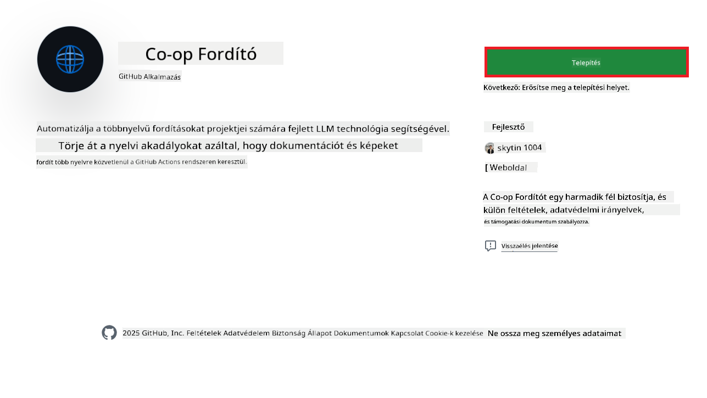
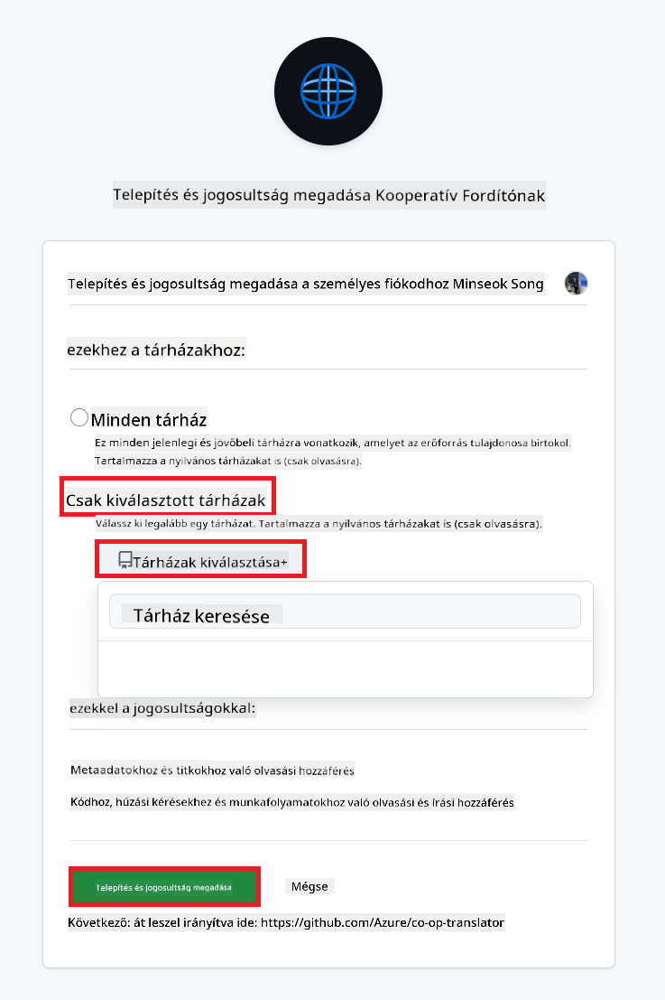
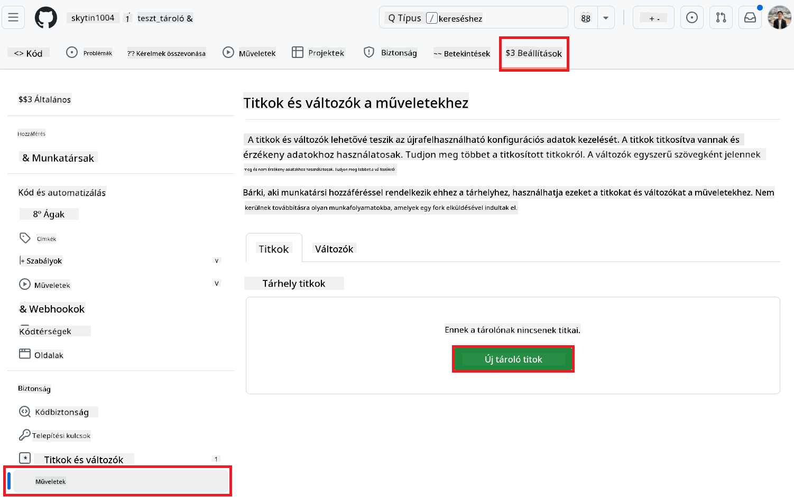
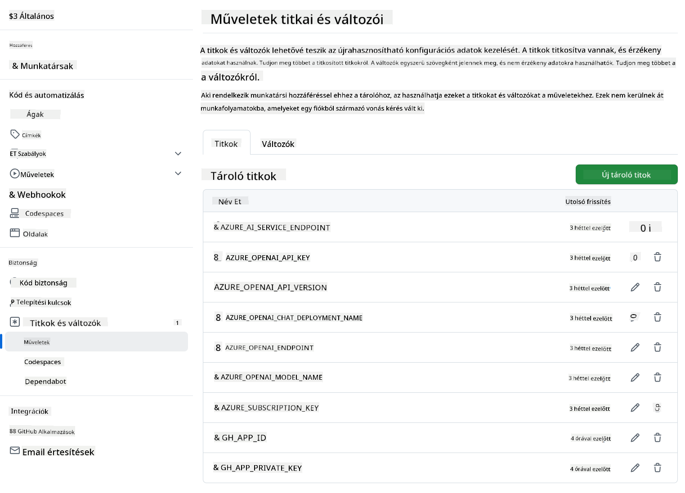

<!--
CO_OP_TRANSLATOR_METADATA:
{
  "original_hash": "c437820027c197f25fb2cbee95bae28c",
  "translation_date": "2025-06-12T19:15:51+00:00",
  "source_file": "getting_started/github-actions-guide/github-actions-guide-org.md",
  "language_code": "hu"
}
-->
# A Co-op Translator GitHub Action használata (Szervezeti útmutató)

**Célközönség:** Ez az útmutató **Microsoft belső felhasználók** vagy **csapatok** számára készült, akik rendelkeznek a szükséges hitelesítő adatokkal a kész Co-op Translator GitHub App használatához, vagy saját egyedi GitHub Appot tudnak létrehozni.

Automatizáld könnyedén a tárolód dokumentációjának fordítását a Co-op Translator GitHub Action segítségével. Ez az útmutató végigvezet a beállításon, amely automatikusan létrehoz pull requesteket frissített fordításokkal, amikor a forrás Markdown fájlok vagy képek megváltoznak.

> [!IMPORTANT]
> 
> **A megfelelő útmutató kiválasztása:**
>
> Ez az útmutató a **GitHub App ID és Privát kulcs** használatával történő beállítást mutatja be. Általában erre a "Szervezeti útmutató" módszerre akkor van szükség, ha: **`GITHUB_TOKEN` jogosultságok korlátozottak:** A szervezet vagy a tároló beállításai korlátozzák az alapértelmezett jogosultságokat, amelyeket a szabványos `GITHUB_TOKEN` kap. Különösen, ha az `GITHUB_TOKEN` nem kapja meg a szükséges `write` jogosultságokat (például `contents: write` vagy `pull-requests: write`), akkor a [Nyilvános beállítási útmutatóban](./github-actions-guide-public.md) szereplő munkafolyamat hibát fog jelezni jogosultság hiány miatt. Egy dedikált GitHub App használata, amelynek kifejezetten megadott jogosultságai vannak, megkerüli ezt a korlátozást.
>
> **Ha ez nem vonatkozik rád:**
>
> Ha a szabványos `GITHUB_TOKEN` elegendő jogosultsággal rendelkezik a tárolódban (azaz nem korlátoz a szervezeti beállítás), kérjük, használd a **[Nyilvános beállítási útmutatót GITHUB_TOKEN használatával](./github-actions-guide-public.md)**. A nyilvános útmutató nem igényel App ID vagy Privát kulcs beszerzését vagy kezelését, kizárólag a szabványos `GITHUB_TOKEN` és a tároló jogosultságaira támaszkodik.

## Előfeltételek

Mielőtt beállítanád a GitHub Action-t, győződj meg róla, hogy rendelkezel a szükséges AI szolgáltatás hitelesítő adatokkal.

**1. Kötelező: AI nyelvi modell hitelesítő adatok**  
Legalább egy támogatott nyelvi modellhez szükséges hitelesítő adat:

- **Azure OpenAI**: Szükséges az Endpoint, API kulcs, Modell/Deployment nevek és API verzió.  
- **OpenAI**: Szükséges az API kulcs, (opcionális: Org ID, Alap URL, Modell ID).  
- Részletekért lásd: [Támogatott modellek és szolgáltatások](../../../../README.md).  
- Beállítási útmutató: [Azure OpenAI beállítása](../set-up-resources/set-up-azure-openai.md).

**2. Opcionális: Computer Vision hitelesítő adatok (képfordításhoz)**

- Csak akkor szükséges, ha képeken belüli szöveget is szeretnél fordítani.  
- **Azure Computer Vision**: Endpoint és előfizetési kulcs szükséges.  
- Ha nincs megadva, az action alapértelmezetten [Markdown-only módba](../markdown-only-mode.md) vált.  
- Beállítási útmutató: [Azure Computer Vision beállítása](../set-up-resources/set-up-azure-computer-vision.md).

## Beállítás és konfiguráció

Kövesd az alábbi lépéseket a Co-op Translator GitHub Action beállításához a tárolódban:

### 1. lépés: GitHub App hitelesítés telepítése és konfigurálása

A munkafolyamat GitHub App hitelesítést használ, hogy biztonságosan tudjon a tárolód nevében műveleteket végezni (pl. pull request létrehozása). Válassz egy lehetőséget:

#### **A lehetőség: Telepítsd a kész Co-op Translator GitHub Appot (Microsoft belső használatra)**

1. Látogass el a [Co-op Translator GitHub App](https://github.com/apps/co-op-translator) oldalra.

1. Válaszd az **Install** lehetőséget, és válaszd ki azt a fiókot vagy szervezetet, ahol a cél tároló található.

    

1. Válaszd a **Only select repositories** opciót, majd jelöld ki a cél tárolót (pl. `PhiCookBook`). Kattints az **Install** gombra. Hitelesítésre kérhet a rendszer.

    

1. **App hitelesítő adatok beszerzése (belső folyamat szükséges):** Ahhoz, hogy a munkafolyamat az app nevében tudjon hitelesíteni, két adatot kell beszerezned a Co-op Translator csapattól:
  - **App ID:** A Co-op Translator app egyedi azonosítója. Az App ID: `1164076`.
  - **Privát kulcs:** Meg kell szerezned a teljes tartalmát a `.pem` privát kulcs fájlnak a fenntartó kapcsolattól. **Kezeld ezt a kulcsot jelszóként, és tartsd biztonságban!**

1. Térj át a 2. lépésre.

#### **B lehetőség: Saját egyedi GitHub App használata**

- Ha szeretnéd, létrehozhatod és konfigurálhatod a saját GitHub Appodat. Ügyelj rá, hogy legyen olvasási és írási hozzáférése a Contents és Pull requests részhez. Szükséged lesz az App ID-ra és egy generált Privát kulcsra.

### 2. lépés: Tároló titkos adatok konfigurálása

A GitHub App hitelesítő adatokat és az AI szolgáltatás hitelesítő adatait titkosított titkokként kell hozzáadnod a tároló beállításaiban.

1. Lépj a cél GitHub tárolódba (pl. `PhiCookBook`).

1. Menj a **Settings** > **Secrets and variables** > **Actions** menüpontra.

1. A **Repository secrets** alatt kattints az **New repository secret** gombra minden szükséges titok hozzáadásához.

   

**Kötelező titkok (GitHub App hitelesítéshez):**

| Titok neve          | Leírás                                      | Érték forrása                                     |
| :------------------- | :------------------------------------------- | :------------------------------------------------ |
| `GH_APP_ID`          | A GitHub App App ID-je (1. lépésből).          | GitHub App beállítások                            |
| `GH_APP_PRIVATE_KEY` | A letöltött `.pem` fájl **teljes tartalma**. | `.pem` fájl (1. lépésből)             |

**AI szolgáltatás titkok (az előfeltételek alapján MINDEN alkalmazandót add hozzá):**

| Titok neve                         | Leírás                                   | Érték forrása                 |
| :---------------------------------- | :---------------------------------------- | :---------------------------- |
| `AZURE_SUBSCRIPTION_KEY`            | Kulcs az Azure AI szolgáltatáshoz (Computer Vision)  | Azure AI Foundry              |
| `AZURE_AI_SERVICE_ENDPOINT`         | Endpoint az Azure AI szolgáltatáshoz (Computer Vision) | Azure AI Foundry              |
| `AZURE_OPENAI_API_KEY`              | Kulcs az Azure OpenAI szolgáltatáshoz              | Azure AI Foundry              |
| `AZURE_OPENAI_ENDPOINT`             | Endpoint az Azure OpenAI szolgáltatáshoz         | Azure AI Foundry              |
| `AZURE_OPENAI_MODEL_NAME`           | Azure OpenAI modell neve              | Azure AI Foundry              |
| `AZURE_OPENAI_CHAT_DEPLOYMENT_NAME` | Azure OpenAI deployment neve         | Azure AI Foundry              |
| `AZURE_OPENAI_API_VERSION`          | Azure OpenAI API verzió              | Azure AI Foundry              |
| `OPENAI_API_KEY`                    | API kulcs az OpenAI-hoz                        | OpenAI Platform              |
| `OPENAI_ORG_ID`                     | OpenAI szervezeti azonosító                    | OpenAI Platform              |
| `OPENAI_CHAT_MODEL_ID`              | Egyedi OpenAI modell azonosító                  | OpenAI Platform              |
| `OPENAI_BASE_URL`                   | Egyedi OpenAI API alap URL                | OpenAI Platform              |



### 3. lépés: Munkafolyamat fájl létrehozása

Végül hozd létre a YAML fájlt, amely meghatározza az automatizált munkafolyamatot.

1. A tárolód gyökérkönyvtárában hozd létre a `.github/workflows/` könyvtárat, ha még nem létezik.

1. A `.github/workflows/` mappán belül hozz létre egy `co-op-translator.yml` nevű fájlt.

1. Illeszd be a következő tartalmat a co-op-translator.yml-be.

```
name: Co-op Translator

on:
  push:
    branches:
      - main

jobs:
  co-op-translator:
    runs-on: ubuntu-latest

    permissions:
      contents: write
      pull-requests: write

    steps:
      - name: Checkout repository
        uses: actions/checkout@v4
        with:
          fetch-depth: 0

      - name: Set up Python
        uses: actions/setup-python@v4
        with:
          python-version: '3.10'

      - name: Install Co-op Translator
        run: |
          python -m pip install --upgrade pip
          pip install co-op-translator

      - name: Run Co-op Translator
        env:
          PYTHONIOENCODING: utf-8
          # Azure AI Service Credentials
          AZURE_SUBSCRIPTION_KEY: ${{ secrets.AZURE_SUBSCRIPTION_KEY }}
          AZURE_AI_SERVICE_ENDPOINT: ${{ secrets.AZURE_AI_SERVICE_ENDPOINT }}

          # Azure OpenAI Credentials
          AZURE_OPENAI_API_KEY: ${{ secrets.AZURE_OPENAI_API_KEY }}
          AZURE_OPENAI_ENDPOINT: ${{ secrets.AZURE_OPENAI_ENDPOINT }}
          AZURE_OPENAI_MODEL_NAME: ${{ secrets.AZURE_OPENAI_MODEL_NAME }}
          AZURE_OPENAI_CHAT_DEPLOYMENT_NAME: ${{ secrets.AZURE_OPENAI_CHAT_DEPLOYMENT_NAME }}
          AZURE_OPENAI_API_VERSION: ${{ secrets.AZURE_OPENAI_API_VERSION }}

          # OpenAI Credentials
          OPENAI_API_KEY: ${{ secrets.OPENAI_API_KEY }}
          OPENAI_ORG_ID: ${{ secrets.OPENAI_ORG_ID }}
          OPENAI_CHAT_MODEL_ID: ${{ secrets.OPENAI_CHAT_MODEL_ID }}
          OPENAI_BASE_URL: ${{ secrets.OPENAI_BASE_URL }}
        run: |
          # =====================================================================
          # IMPORTANT: Set your target languages here (REQUIRED CONFIGURATION)
          # =====================================================================
          # Example: Translate to Spanish, French, German. Add -y to auto-confirm.
          translate -l "es fr de" -y  # <--- MODIFY THIS LINE with your desired languages

      - name: Authenticate GitHub App
        id: generate_token
        uses: tibdex/github-app-token@v1
        with:
          app_id: ${{ secrets.GH_APP_ID }}
          private_key: ${{ secrets.GH_APP_PRIVATE_KEY }}

      - name: Create Pull Request with translations
        uses: peter-evans/create-pull-request@v5
        with:
          token: ${{ steps.generate_token.outputs.token }}
          commit-message: "🌐 Update translations via Co-op Translator"
          title: "🌐 Update translations via Co-op Translator"
          body: |
            This PR updates translations for recent changes to the main branch.

            ### 📋 Changes included
            - Translated contents are available in the `translations/` directory
            - Translated images are available in the `translated_images/` directory

            ---
            🌐 Automatically generated by the [Co-op Translator](https://github.com/Azure/co-op-translator) GitHub Action.
          branch: update-translations
          base: main
          labels: translation, automated-pr
          delete-branch: true
          add-paths: |
            translations/
            translated_images/

```

4.  **Testreszabás:**
  - **[!IMPORTANT] Cél nyelvek:** A `Run Co-op Translator` step, you **MUST review and modify the list of language codes** within the `translate -l "..." -y` command to match your project's requirements. The example list (`ar de es...`) needs to be replaced or adjusted.
  - **Trigger (`on:`):** The current trigger runs on every push to `main`. For large repositories, consider adding a `paths:` filter (see commented example in the YAML) to run the workflow only when relevant files (e.g., source documentation) change, saving runner minutes.
  - **PR Details:** Customize the `commit-message`, `title`, `body`, `branch` name, and `labels` in the `Create Pull Request` step if needed.

## Credential Management and Renewal

- **Security:** Always store sensitive credentials (API keys, private keys) as GitHub Actions secrets. Never expose them in your workflow file or repository code.
- **[!IMPORTANT] Key Renewal (Internal Microsoft Users):** Be aware that Azure OpenAI key used within Microsoft might have a mandatory renewal policy (e.g., every 5 months). Ensure you update the corresponding GitHub secrets (`AZURE_OPENAI_...` kulcsokban add meg a kívánt nyelveket, **mielőtt lejárnának**, hogy elkerüld a munkafolyamat hibáit.

## A munkafolyamat futtatása

Miután a `co-op-translator.yml` fájl bekerült a main ágba (vagy az `on:` trigger), the workflow will automatically run whenever changes are pushed to that branch (and match the `paths` szűrőben megadott ágba, ha konfigurálva van),

ha fordítások készülnek vagy frissülnek, az action automatikusan létrehoz egy Pull Requestet a változtatásokkal, amely készen áll a felülvizsgálatra és az egyesítésre.

**Jogi nyilatkozat**:  
Ez a dokumentum az AI fordító szolgáltatás, a [Co-op Translator](https://github.com/Azure/co-op-translator) segítségével készült. Bár a pontosságra törekszünk, kérjük, vegye figyelembe, hogy az automatikus fordítások tartalmazhatnak hibákat vagy pontatlanságokat. Az eredeti dokumentum az anyanyelvén tekintendő hivatalos forrásnak. Kritikus információk esetén szakmai emberi fordítást javaslunk. Nem vállalunk felelősséget az ebből eredő félreértésekért vagy téves értelmezésekért.