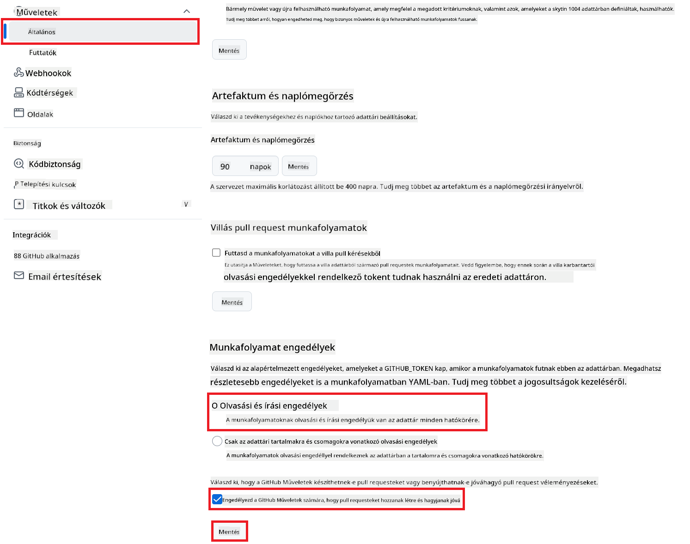

<!--
CO_OP_TRANSLATOR_METADATA:
{
  "original_hash": "a52587a512e667f70d92db853d3c61d5",
  "translation_date": "2025-06-12T19:33:32+00:00",
  "source_file": "getting_started/github-actions-guide/github-actions-guide-public.md",
  "language_code": "hu"
}
-->
# A Co-op Translator GitHub Action használata (Nyilvános beállítás)

**Célközönség:** Ez az útmutató azoknak szól, akik többségében nyilvános vagy privát repókban dolgoznak, ahol az alapértelmezett GitHub Actions jogosultságok elegendőek. A beépített `GITHUB_TOKEN`-t használja.

Automatizáld könnyedén a repód dokumentációjának fordítását a Co-op Translator GitHub Action segítségével. Ez az útmutató végigvezet a beállításon, hogy a forrás Markdown fájlok vagy képek módosulásakor automatikusan létrejöjjenek a frissített fordításokat tartalmazó pull requestek.

> [!IMPORTANT]
>
> **A megfelelő útmutató kiválasztása:**
>
> Ez az útmutató a **könnyebb beállítást mutatja be a standard `GITHUB_TOKEN` használatával**. Ez a legtöbb felhasználó számára ajánlott módszer, mert nem igényel érzékeny GitHub App Private Key kezelését.
>

## Előfeltételek

Mielőtt konfigurálnád a GitHub Actiont, győződj meg róla, hogy megvannak a szükséges AI szolgáltatási hitelesítő adataid.

**1. Kötelező: AI nyelvi modell hitelesítő adatok**  
Legalább egy támogatott nyelvi modellhez szükséges hitelesítő adatok:

- **Azure OpenAI**: Endpoint, API kulcs, modell/deployment nevek, API verzió szükséges.
- **OpenAI**: API kulcs, (opcionálisan: szervezet ID, alap URL, modell ID).
- Részletekért lásd a [Supported Models and Services](../../../../README.md) részt.

**2. Opcionális: AI Vision hitelesítő adatok (képfordításhoz)**

- Csak akkor kell, ha képeken belüli szöveget is szeretnél fordítani.
- **Azure AI Vision**: Endpoint és előfizetési kulcs szükséges.
- Ha nem adod meg, az action [Markdown-only módba](../markdown-only-mode.md) vált.

## Beállítás és konfiguráció

Kövesd az alábbi lépéseket a Co-op Translator GitHub Action beállításához a repódon a standard `GITHUB_TOKEN` használatával.

### 1. lépés: Ismerd meg az autentikációt (`GITHUB_TOKEN` használata)

Ez a workflow a GitHub Actions által biztosított beépített `GITHUB_TOKEN`-t használja. Ez a token automatikusan megadja a workflow-nak a repóval való interakcióhoz szükséges jogosultságokat a **3. lépésben** beállított engedélyek alapján.

### 2. lépés: Repository titkok konfigurálása

Csak az **AI szolgáltatás hitelesítő adataidat** kell titkosított titkokként hozzáadnod a repód beállításaiban.

1. Nyisd meg a cél GitHub repódat.
2. Menj a **Settings** > **Secrets and variables** > **Actions** menüpontra.
3. A **Repository secrets** alatt kattints a **New repository secret** gombra minden szükséges AI szolgáltatás titok esetén, az alábbi lista alapján.

     *(Kép hivatkozás: Hol lehet titkokat hozzáadni)*

**Szükséges AI szolgáltatás titkok (add hozzá az összeset, ami az előfeltételek alapján vonatkozik rád):**

| Titok neve                         | Leírás                                  | Érték forrása                    |
| :---------------------------------- | :---------------------------------------- | :------------------------------- |
| `AZURE_SUBSCRIPTION_KEY`            | Kulcs az Azure AI szolgáltatáshoz (Computer Vision)  | Az Azure AI Foundryd             |
| `AZURE_AI_SERVICE_ENDPOINT`         | Endpoint az Azure AI szolgáltatáshoz (Computer Vision) | Az Azure AI Foundryd             |
| `AZURE_OPENAI_API_KEY`              | Kulcs az Azure OpenAI szolgáltatáshoz              | Az Azure AI Foundryd             |
| `AZURE_OPENAI_ENDPOINT`             | Endpoint az Azure OpenAI szolgáltatáshoz         | Az Azure AI Foundryd             |
| `AZURE_OPENAI_MODEL_NAME`           | Azure OpenAI modell neve              | Az Azure AI Foundryd             |
| `AZURE_OPENAI_CHAT_DEPLOYMENT_NAME` | Azure OpenAI deployment neve         | Az Azure AI Foundryd             |
| `AZURE_OPENAI_API_VERSION`          | Azure OpenAI API verzió              | Az Azure AI Foundryd             |
| `OPENAI_API_KEY`                    | OpenAI API kulcs                        | Az OpenAI platformod             |
| `OPENAI_ORG_ID`                     | OpenAI szervezet ID (opcionális)         | Az OpenAI platformod             |
| `OPENAI_CHAT_MODEL_ID`              | Specifikus OpenAI modell ID (opcionális)       | Az OpenAI platformod             |
| `OPENAI_BASE_URL`                   | Egyedi OpenAI API alap URL (opcionális)     | Az OpenAI platformod             |

### 3. lépés: Workflow jogosultságok beállítása

A GitHub Actionnak szüksége van a `GITHUB_TOKEN` által biztosított jogosultságokra, hogy ki tudja ellenőrizni a kódot és létrehozhasson pull requesteket.

1. A repódban menj a **Settings** > **Actions** > **General** menüpontra.
2. Görgess le a **Workflow permissions** szekcióhoz.
3. Válaszd a **Read and write permissions** opciót. Ez megadja a `GITHUB_TOKEN`-nak a szükséges `contents: write` és `pull-requests: write` jogosultságokat ehhez a workflow-hoz.
4. Győződj meg róla, hogy be van jelölve a **Allow GitHub Actions to create and approve pull requests** opció.
5. Kattints a **Save** gombra.



### 4. lépés: Workflow fájl létrehozása

Végül hozd létre a YAML fájlt, amely definiálja az automatizált workflow-t a `GITHUB_TOKEN` használatával.

1. A repód gyökérkönyvtárában hozd létre a `.github/workflows/` mappát, ha még nem létezik.
2. A `.github/workflows/` mappán belül hozz létre egy `co-op-translator.yml` nevű fájlt.
3. Illeszd be az alábbi tartalmat a `co-op-translator.yml` fájlba.

```yaml
name: Co-op Translator

on:
  push:
    branches:
      - main

jobs:
  co-op-translator:
    runs-on: ubuntu-latest

    permissions:
      contents: write
      pull-requests: write

    steps:
      - name: Checkout repository
        uses: actions/checkout@v4
        with:
          fetch-depth: 0

      - name: Set up Python
        uses: actions/setup-python@v4
        with:
          python-version: '3.10'

      - name: Install Co-op Translator
        run: |
          python -m pip install --upgrade pip
          pip install co-op-translator

      - name: Run Co-op Translator
        env:
          PYTHONIOENCODING: utf-8
          # === AI Service Credentials ===
          AZURE_SUBSCRIPTION_KEY: ${{ secrets.AZURE_SUBSCRIPTION_KEY }}
          AZURE_AI_SERVICE_ENDPOINT: ${{ secrets.AZURE_AI_SERVICE_ENDPOINT }}
          AZURE_OPENAI_API_KEY: ${{ secrets.AZURE_OPENAI_API_KEY }}
          AZURE_OPENAI_ENDPOINT: ${{ secrets.AZURE_OPENAI_ENDPOINT }}
          AZURE_OPENAI_MODEL_NAME: ${{ secrets.AZURE_OPENAI_MODEL_NAME }}
          AZURE_OPENAI_CHAT_DEPLOYMENT_NAME: ${{ secrets.AZURE_OPENAI_CHAT_DEPLOYMENT_NAME }}
          AZURE_OPENAI_API_VERSION: ${{ secrets.AZURE_OPENAI_API_VERSION }}
          OPENAI_API_KEY: ${{ secrets.OPENAI_API_KEY }}
          OPENAI_ORG_ID: ${{ secrets.OPENAI_ORG_ID }}
          OPENAI_CHAT_MODEL_ID: ${{ secrets.OPENAI_CHAT_MODEL_ID }}
          OPENAI_BASE_URL: ${{ secrets.OPENAI_BASE_URL }}
        run: |
          # =====================================================================
          # IMPORTANT: Set your target languages here (REQUIRED CONFIGURATION)
          # =====================================================================
          # Example: Translate to Spanish, French, German. Add -y to auto-confirm.
          translate -l "es fr de" -y  # <--- MODIFY THIS LINE with your desired languages

      - name: Create Pull Request with translations
        uses: peter-evans/create-pull-request@v5
        with:
          token: ${{ secrets.GITHUB_TOKEN }}
          commit-message: "🌐 Update translations via Co-op Translator"
          title: "🌐 Update translations via Co-op Translator"
          body: |
            This PR updates translations for recent changes to the main branch.

            ### 📋 Changes included
            - Translated contents are available in the `translations/` directory
            - Translated images are available in the `translated_images/` directory

            ---
            🌐 Automatically generated by the [Co-op Translator](https://github.com/Azure/co-op-translator) GitHub Action.
          branch: update-translations
          base: main
          labels: translation, automated-pr
          delete-branch: true
          add-paths: |
            translations/
            translated_images/
```  
4. **Workflow testreszabása:**  
  - **[!IMPORTANT] Cél nyelvek:** A `Run Co-op Translator` step, you **MUST review and modify the list of language codes** within the `translate -l "..." -y` command to match your project's requirements. The example list (`ar de es...`) needs to be replaced or adjusted.
  - **Trigger (`on:`):** The current trigger runs on every push to `main`. For large repositories, consider adding a `paths:` filter (see commented example in the YAML) to run the workflow only when relevant files (e.g., source documentation) change, saving runner minutes.
  - **PR Details:** Customize the `commit-message`, `title`, `body`, `branch` name, and `labels` in the `Create Pull Request` lépésben szükség szerint állítsd be.

**Nyilatkozat**:  
Ezt a dokumentumot az AI fordító szolgáltatás, a [Co-op Translator](https://github.com/Azure/co-op-translator) segítségével fordítottuk. Bár igyekszünk a pontosságra, kérjük, vegye figyelembe, hogy az automatikus fordítások hibákat vagy pontatlanságokat tartalmazhatnak. Az eredeti dokumentum az anyanyelvén tekintendő hiteles forrásnak. Fontos információk esetén szakmai, emberi fordítást javaslunk. Nem vállalunk felelősséget az ebből a fordításból eredő félreértésekért vagy téves értelmezésekért.