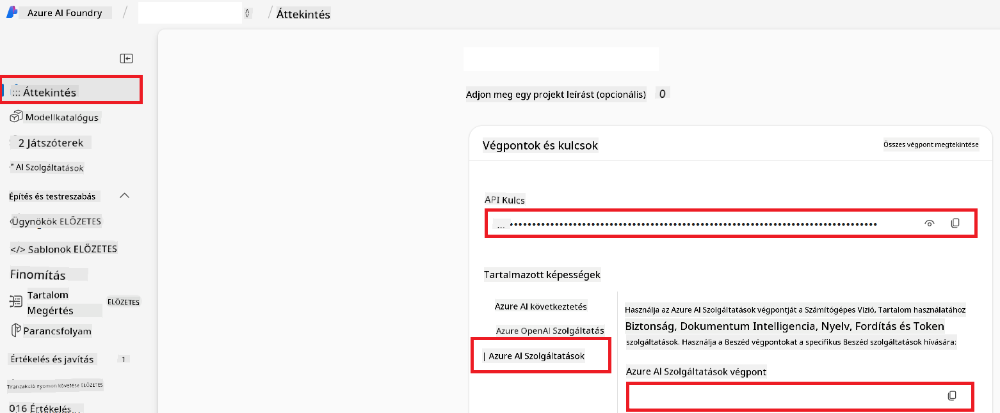

<!--
CO_OP_TRANSLATOR_METADATA:
{
  "original_hash": "b58d7c3cb4210697a073d20eb3064945",
  "translation_date": "2025-06-12T11:57:18+00:00",
  "source_file": "getting_started/set-up-azure-ai.md",
  "language_code": "hu"
}
-->
# Azure AI beállítása Co-op Translatorhoz (Azure OpenAI & Azure AI Vision)

Ez az útmutató végigvezet az Azure OpenAI nyelvi fordításhoz, valamint az Azure Computer Vision képtartalom elemzéséhez (amely később képalapú fordításra is használható) történő beállításán az Azure AI Foundry környezetében.

**Előfeltételek:**
- Egy Azure fiók aktív előfizetéssel.
- Megfelelő jogosultságok az erőforrások és telepítések létrehozásához az Azure előfizetésedben.

## Azure AI projekt létrehozása

Először hozz létre egy Azure AI projektet, amely központi helyként szolgál az AI erőforrásaid kezeléséhez.

1. Lépj a [https://ai.azure.com](https://ai.azure.com) oldalra, és jelentkezz be Azure fiókoddal.

1. Válaszd a **+Create** lehetőséget egy új projekt létrehozásához.

1. Hajtsd végre az alábbi lépéseket:
   - Írd be a **Project name**-et (pl. `CoopTranslator-Project`).
   - Válaszd ki az **AI hub**-ot (pl. `CoopTranslator-Hub`) (ha szükséges, hozz létre újat).

1. Kattints a "**Review and Create**" gombra a projekt létrehozásához. Ekkor a projekt áttekintő oldalára kerülsz.

## Azure OpenAI beállítása nyelvi fordításhoz

A projekteden belül telepíts egy Azure OpenAI modellt, amely a szövegfordítás háttérrendszerét fogja szolgáltatni.

### Navigálás a projekthez

Ha még nem vagy ott, nyisd meg az újonnan létrehozott projektedet (pl. `CoopTranslator-Project`) az Azure AI Foundry-ban.

### OpenAI modell telepítése

1. A projekt bal oldali menüjében, a "My assets" alatt válaszd a "**Models + endpoints**" menüpontot.

1. Kattints a **+ Deploy model** gombra.

1. Válaszd a **Deploy Base Model** lehetőséget.

1. Megjelenik a rendelkezésre álló modellek listája. Szűrj vagy keress egy megfelelő GPT modellt. Ajánljuk a `gpt-4o` modellt.

1. Válaszd ki a kívánt modellt, majd kattints a **Confirm** gombra.

1. Kattints a **Deploy** gombra.

### Azure OpenAI konfiguráció

A telepítés után a "**Models + endpoints**" oldalon kiválaszthatod a telepítést, ahol megtalálod a **REST endpoint URL**-t, **Kulcsot**, **Deployment name**-et, **Model name**-et és az **API verziót**. Ezekre szükséged lesz a fordító modell alkalmazásba való integrálásához.

> [!NOTE]
> Az API verziókat a [API version deprecation](https://learn.microsoft.com/azure/ai-services/openai/api-version-deprecation) oldalon választhatod ki az igényeid szerint. Fontos, hogy az **API verzió** eltér a **Model verziótól**, amely az Azure AI Foundry "**Models + endpoints**" oldalán látható.

## Azure Computer Vision beállítása képfordításhoz

Ahhoz, hogy képeken lévő szöveget fordíthass, meg kell szerezned az Azure AI Service API kulcsát és végpontját.

1. Navigálj az Azure AI projektedhez (pl. `CoopTranslator-Project`). Győződj meg róla, hogy a projekt áttekintő oldalán vagy.

### Azure AI Service konfiguráció

Keresd meg az API kulcsot és a végpontot az Azure AI Service fülön.

1. Navigálj az Azure AI projektedhez (pl. `CoopTranslator-Project`). Győződj meg róla, hogy a projekt áttekintő oldalán vagy.

1. Keresd meg az **API Key**-t és az **Endpoint**-ot az Azure AI Service fülön.

    

Ez a kapcsolat lehetővé teszi, hogy a kapcsolódó Azure AI Services erőforrás (beleértve a képelemzést is) képességei elérhetővé váljanak az AI Foundry projekted számára. Ezt követően használhatod ezt a kapcsolatot jegyzetfüzeteidben vagy alkalmazásaidban a képekből történő szövegkinyeréshez, amelyet aztán továbbíthatsz az Azure OpenAI modellhez fordításra.

## Hitelesítő adatok összegzése

Eddigre összegyűjtötted a következőket:

**Azure OpenAI-hoz (szövegfordításhoz):**
- Azure OpenAI végpont
- Azure OpenAI API kulcs
- Azure OpenAI modell neve (pl. `gpt-4o`)
- Azure OpenAI telepítés neve (pl. `cooptranslator-gpt4o`)
- Azure OpenAI API verzió

**Azure AI Services-hez (kép szövegkinyeréshez Vision segítségével):**
- Azure AI Service végpont
- Azure AI Service API kulcs

### Példa: Környezeti változók beállítása (előnézet)

Később, amikor az alkalmazásodat építed, valószínűleg ezekkel a hitelesítő adatokkal konfigurálod majd. Például így állíthatod be környezeti változóként:

```bash
# Azure AI Service Credentials (Required for image translation)
AZURE_AI_SERVICE_API_KEY="your_azure_ai_service_api_key" # e.g., 21xasd...
AZURE_AI_SERVICE_ENDPOINT="https://your_azure_ai_service_endpoint.cognitiveservices.azure.com/"

# Azure OpenAI Credentials (Required for text translation)
AZURE_OPENAI_API_KEY="your_azure_openai_api_key" # e.g., 21xasd...
AZURE_OPENAI_ENDPOINT="https://your_azure_openai_endpoint.openai.azure.com/"
AZURE_OPENAI_MODEL_NAME="your_model_name" # e.g., gpt-4o
AZURE_OPENAI_CHAT_DEPLOYMENT_NAME="your_deployment_name" # e.g., cooptranslator-gpt4o
AZURE_OPENAI_API_VERSION="your_api_version" # e.g., 2024-12-01-preview
```

---

### További olvasnivaló

- [Hogyan hozz létre projektet az Azure AI Foundry-ban](https://learn.microsoft.com/azure/ai-foundry/how-to/create-projects?tabs=ai-studio)
- [Hogyan hozz létre Azure AI erőforrásokat](https://learn.microsoft.com/azure/ai-foundry/how-to/create-azure-ai-resource?tabs=portal)
- [Hogyan telepíts OpenAI modelleket az Azure AI Foundry-ban](https://learn.microsoft.com/en-us/azure/ai-foundry/how-to/deploy-models-openai)

**Nyilatkozat**:  
Ezt a dokumentumot az AI fordító szolgáltatás, a [Co-op Translator](https://github.com/Azure/co-op-translator) segítségével fordítottuk le. Bár a pontosságra törekszünk, kérjük, vegye figyelembe, hogy az automatikus fordítások hibákat vagy pontatlanságokat tartalmazhatnak. Az eredeti dokumentum az anyanyelvén tekintendő hivatalos forrásnak. Fontos információk esetén szakmai, emberi fordítást javaslunk. Nem vállalunk felelősséget az ebből a fordításból eredő félreértésekért vagy téves értelmezésekért.