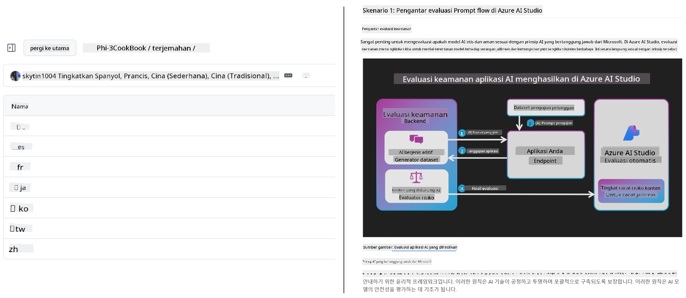
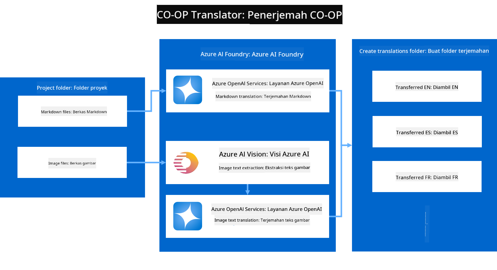
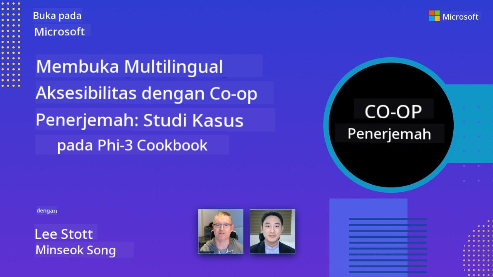

<!--
CO_OP_TRANSLATOR_METADATA:
{
  "original_hash": "044724537b57868117aadae8e7728c7c",
  "translation_date": "2025-06-12T10:41:33+00:00",
  "source_file": "README.md",
  "language_code": "id"
}
-->


# Co-op Translator: Otomatiskan Terjemahan Dokumentasi Pendidikan dengan Mudah

_Mudah otomatiskan terjemahan dokumentasi Anda ke berbagai bahasa untuk menjangkau audiens global._

[](https://pypi.org/project/co-op-translator/)
[](https://github.com/azure/co-op-translator/blob/main/LICENSE)
[](https://pepy.tech/project/co-op-translator)
[](https://pepy.tech/project/co-op-translator)
[](https://github.com/psf/black)

[](https://GitHub.com/azure/co-op-translator/graphs/contributors/)
[](https://GitHub.com/azure/co-op-translator/issues/)
[](https://GitHub.com/azure/co-op-translator/pulls/)
[](http://makeapullrequest.com)

### Dukungan Bahasa Didukung oleh Co-op Translator

> [!NOTE]
> Ini adalah terjemahan konten repositori ini saat ini. Untuk daftar lengkap bahasa yang didukung oleh Co-op Translator, silakan lihat bagian [Language Support](../..).

[](https://GitHub.com/azure/co-op-translator/watchers/)
[](https://GitHub.com/azure/co-op-translator/network/)
[](https://GitHub.com/azure/co-op-translator/stargazers/)

[](https://discord.com/invite/ByRwuEEgH4)

[](https://codespaces.new/azure/co-op-translator)
[](https://vscode.dev/redirect?url=vscode://ms-vscode-remote.remote-containers/cloneInVolume?url=https://github.com/azure/co-op-translator)

## Ikhtisar: Permudah Terjemahan Konten Pendidikan Anda

Hambatan bahasa sangat menghalangi akses ke sumber daya pendidikan dan pengetahuan teknis yang berharga bagi pelajar dan pengembang di seluruh dunia. Hal ini membatasi partisipasi dan memperlambat laju inovasi dan pembelajaran global.

**Co-op Translator** lahir dari kebutuhan untuk mengatasi proses terjemahan manual yang tidak efisien untuk seri edukasi berskala besar milik Microsoft (seperti panduan "For Beginners"). Kini, alat ini berkembang menjadi solusi yang mudah digunakan dan kuat yang dirancang untuk menghapus hambatan tersebut bagi semua orang. Dengan menyediakan terjemahan otomatis berkualitas tinggi melalui CLI dan GitHub Actions, Co-op Translator memberdayakan pendidik, pelajar, peneliti, dan pengembang di seluruh dunia untuk berbagi dan mengakses pengetahuan tanpa batasan bahasa.

Lihat bagaimana Co-op Translator mengorganisir konten edukasi yang sudah diterjemahkan:



File Markdown dan teks gambar diterjemahkan secara otomatis dan disusun rapi ke dalam folder berdasarkan bahasa.

**Buka akses global ke konten edukasi Anda dengan Co-op Translator hari ini!**

## Mendukung Akses Global untuk Sumber Belajar Microsoft

Co-op Translator membantu menjembatani kesenjangan bahasa untuk inisiatif edukasi utama Microsoft, mengotomatisasi proses terjemahan untuk repositori yang melayani komunitas pengembang global. Contoh yang saat ini menggunakan Co-op Translator meliputi:

[](https://github.com/microsoft/Generative-AI-for-beginners)
[](https://github.com/microsoft/ML-For-Beginners)
[](https://github.com/microsoft/AI-For-Beginners)
[](https://github.com/microsoft/ai-agents-for-beginners)
[](https://github.com/microsoft/PhiCookBook)
[](https://github.com/microsoft/Generative-AI-for-beginners-dotnet)

## Fitur Utama

- **Terjemahan Otomatis**: Terjemahkan teks ke berbagai bahasa dengan mudah.
- **Integrasi GitHub Actions**: Otomatiskan terjemahan sebagai bagian dari pipeline CI/CD Anda.
- **Pemeliharaan Markdown**: Jaga sintaks Markdown tetap benar selama proses terjemahan.
- **Terjemahan Teks Gambar**: Ekstrak dan terjemahkan teks dalam gambar.
- **Teknologi LLM Canggih**: Gunakan model bahasa terkini untuk terjemahan berkualitas tinggi.
- **Integrasi Mudah**: Terhubung mulus dengan pengaturan proyek Anda yang sudah ada.
- **Permudah Lokalisasi**: Sederhanakan proses melokalkan proyek Anda untuk pasar internasional.

## Cara Kerja



Co-op Translator mengambil file Markdown dan gambar dari folder proyek Anda dan memprosesnya sebagai berikut:

1. **Ekstraksi Teks**: Mengambil teks dari file Markdown dan, jika dikonfigurasi (misalnya dengan Azure AI Vision), teks yang ada di dalam gambar.
1. **Terjemahan AI**: Mengirim teks yang diekstrak ke LLM yang dikonfigurasi (Azure OpenAI, OpenAI, dll.) untuk diterjemahkan.
1. **Menyimpan Hasil**: Menyimpan file Markdown dan gambar yang sudah diterjemahkan ke dalam folder berdasarkan bahasa, sambil mempertahankan format asli.

## Memulai

Mulai dengan cepat menggunakan CLI atau atur otomatisasi penuh dengan GitHub Actions. Pilih cara yang paling sesuai dengan alur kerja Anda:

1. **Command Line (CLI)** - Untuk terjemahan sekali jalan atau kontrol manual
2. **GitHub Actions** - Untuk terjemahan otomatis setiap kali ada push

> [!NOTE]
> Meskipun tutorial ini fokus pada sumber daya Azure, Anda dapat menggunakan model bahasa apa pun yang didukung.

### Dukungan Bahasa

Co-op Translator mendukung berbagai bahasa untuk membantu Anda menjangkau audiens global. Berikut yang perlu Anda ketahui:

#### Referensi Cepat

| Bahasa | Kode | Bahasa | Kode | Bahasa | Kode |
|----------|------|----------|------|----------|------|
| Arab | ar | Bengali | bn | Bulgaria | bg |
| Burma (Myanmar) | my | Cina (Sederhana) | zh | Cina (Tradisional, HK) | hk |
| Cina (Tradisional, Macau) | mo | Cina (Tradisional, TW) | tw | Kroasia | hr |
| Ceko | cs | Denmark | da | Belanda | nl |
| Finlandia | fi | Perancis | fr | Jerman | de |
| Yunani | el | Ibrani | he | Hindi | hi |
| Hungaria | hu | Indonesia | id | Italia | it |
| Jepang | ja | Korea | ko | Melayu | ms |
| Marathi | mr | Nepali | ne | Norwegia | no |
| Persia (Farsi) | fa | Polandia | pl | Portugis (Brasil) | br |
| Portugis (Portugal) | pt | Punjabi (Gurmukhi) | pa | Rumania | ro |
| Rusia | ru | Serbia (Sirilik) | sr | Slowakia | sk |
| Slovenia | sl | Spanyol | es | Swahili | sw |
| Swedia | sv | Tagalog (Filipina) | tl | Thai | th |
| Turki | tr | Ukraina | uk | Urdu | ur |
| Vietnam | vi | — | — | — | — |

#### Menggunakan Kode Bahasa

Saat menggunakan Co-op Translator, Anda harus menentukan bahasa menggunakan kode-kode tersebut. Contoh:

```bash
# Translate to French, Spanish, and German
translate -l "fr es de"

# Translate to Chinese (Simplified) and Japanese
translate -l "zh ja"
```

> [!NOTE]
> Untuk informasi teknis mendetail tentang dukungan bahasa, termasuk:
>
> - Spesifikasi font untuk tiap bahasa
> - Masalah yang diketahui
> - Cara menambahkan bahasa baru
>
> Lihat [Dokumentasi Bahasa yang Didukung](./getting_started/supported-languages.md).

### Model dan Layanan yang Didukung

| Tipe                  | Nama                           |
|-----------------------|--------------------------------|
| Model Bahasa          |   |
| AI Vision             |  |

> [!NOTE]
> Jika layanan AI vision tidak tersedia, co-op translator akan beralih ke [mode Markdown saja](./getting_started/markdown-only-mode.md).

### Pengaturan Awal

Sebelum memulai, Anda perlu menyiapkan sumber daya berikut:

1. Resource Model Bahasa (Wajib):
   - Azure OpenAI (Direkomendasikan) - Menyediakan terjemahan berkualitas tinggi dengan keandalan kelas enterprise
   - OpenAI - Pilihan alternatif jika Anda tidak memiliki akses Azure
   - Untuk info detail tentang model yang didukung, lihat [Supported Models and Services](../..)

1. Resource AI Vision (Opsional):
   - Azure AI Vision - Memungkinkan terjemahan teks dalam gambar
   - Jika tidak dikonfigurasi, penerjemah otomatis akan menggunakan [mode Markdown saja](./getting_started/markdown-only-mode.md)
   - Direkomendasikan untuk proyek dengan gambar yang mengandung teks yang perlu diterjemahkan

1. Langkah Konfigurasi:
   - Ikuti panduan [penyiapan Azure AI](./getting_started/set-up-azure-ai.md) untuk instruksi lengkap
   - Buat file `.env` dengan API key dan endpoint Anda (lihat bagian [Quick Start](../..))
   - Pastikan Anda memiliki izin dan kuota yang diperlukan untuk layanan yang dipilih

### Persiapan Proyek Sebelum Terjemahan

Sebelum memulai proses terjemahan, ikuti langkah-langkah berikut untuk menyiapkan proyek Anda:

1. Siapkan README Anda:
   - Tambahkan tabel terjemahan ke README.md Anda untuk menghubungkan versi terjemahan
   - Contoh format:

     ```markdown

     ### 🌐 Multi-Language Support
     
     [French](../fr/README.md) | [Spanish](../es/README.md) | [German](../de/README.md) | [Russian](../ru/README.md) | [Arabic](../ar/README.md) | [Persian (Farsi)](../fa/README.md) | [Urdu](../ur/README.md) | [Chinese (Simplified)](../zh/README.md) | [Chinese (Traditional, Macau)](../mo/README.md) | [Chinese (Traditional, Hong Kong)](../hk/README.md) | [Chinese (Traditional, Taiwan)](../tw/README.md) | [Japanese](../ja/README.md) | [Korean](../ko/README.md) | [Hindi](../hi/README.md) | [Bengali](../bn/README.md) | [Marathi](../mr/README.md) | [Nepali](../ne/README.md) | [Punjabi (Gurmukhi)](../pa/README.md) | [Portuguese (Portugal)](../pt/README.md) | [Portuguese (Brazil)](../br/README.md) | [Italian](../it/README.md) | [Polish](../pl/README.md) | [Turkish](../tr/README.md) | [Greek](../el/README.md) | [Thai](../th/README.md) | [Swedish](../sv/README.md) | [Danish](../da/README.md) | [Norwegian](../no/README.md) | [Finnish](../fi/README.md) | [Dutch](../nl/README.md) | [Hebrew](../he/README.md) | [Vietnamese](../vi/README.md) | [Indonesian](./README.md) | [Malay](../ms/README.md) | [Tagalog (Filipino)](../tl/README.md) | [Swahili](../sw/README.md) | [Hungarian](../hu/README.md) | [Czech](../cs/README.md) | [Slovak](../sk/README.md) | [Romanian](../ro/README.md) | [Bulgarian](../bg/README.md) | [Serbian (Cyrillic)](../sr/README.md) | [Croatian](../hr/README.md) | [Slovenian](../sl/README.md) | [Ukrainian](../uk/README.md) | [Burmese (Myanmar)](../my/README.md) 
    
     ```

1. Bersihkan Terjemahan yang Ada (jika perlu):
   - Hapus folder terjemahan yang sudah ada (misalnya `translations/`)
   - Hapus file terjemahan lama agar proses dimulai dari awal
   - Ini memastikan tidak ada konflik dengan proses terjemahan baru

### Mulai Cepat: Command Line

Untuk memulai dengan cepat menggunakan command line:

1. Buat virtual environment:

    ```bash
    python -m venv .venv
    ```

1. Aktifkan virtual environment:

    - Di Windows:

    ```bash
    .venv\scripts\activate
    ```

    - Di Linux/macOS:

    ```bash
    source .venv/bin/activate
    ```

1. Pasang paket:

    ```bash
    pip install co-op-translator
    ```

1. Konfigurasi Kredensial:

    - Buat file `.env` file in your project's root directory.
    - Copy the contents from the [.env.template](../../.env.template) file into your new `.env` file.
    - Fill in the required API keys and endpoint information in your `.env` file.

1. Run Translation:
    - Navigate to your project's root directory in your terminal.
    - Execute the translate command, specifying target languages with the `-l` flag:

    ```bash
    translate -l "ko ja fr"
    ```

    _(Ganti `"ko ja fr"` with your desired space-separated language codes)_

### Detailed Usage Guides

Choose the approach that best fits your workflow:

#### 1. Using the Command Line (CLI)

- Best for: One-time translations, manual control, or integration into custom scripts.
- Requires: Local installation of Python and the `co-op-translator` package.
- Guide: [Command Line Guide](./getting_started/command-line-guide/command-line-guide.md)

#### 2. Using GitHub Actions (Automation)

- Best for: Automatically translating content whenever changes are pushed to your repository. Keeps translations consistently up-to-date.
- Requires: Setting up a workflow file (`.github/workflows`) di repositori Anda. Tidak perlu instalasi lokal.
- Panduan:
  - [Panduan GitHub Actions (Repositori Publik & Secrets Standar)](./getting_started/github-actions-guide/github-actions-guide-public.md) - Gunakan ini untuk repositori publik atau pribadi yang mengandalkan secrets standar repositori.
  - [Panduan GitHub Actions (Repositori Organisasi Microsoft & Pengaturan Level Organisasi)](./getting_started/github-actions-guide/github-actions-guide-org.md) - Gunakan panduan ini jika Anda bekerja dalam organisasi GitHub Microsoft atau perlu menggunakan secrets atau runner tingkat organisasi.

### Pemecahan Masalah dan Tips

- [Panduan Pemecahan Masalah](./getting_started/troubleshooting.md)

### Sumber Tambahan

- [Referensi Perintah](./getting_started/command-reference.md): Panduan lengkap untuk semua perintah dan opsi yang tersedia.
- [Bahasa yang Didukung](./getting_started/supported-languages.md): Cek daftar bahasa yang didukung dan instruksi menambahkan bahasa baru.
- [Mode Markdown Saja](./getting_started/markdown-only-mode.md): Cara menerjemahkan hanya teks tanpa terjemahan gambar.

## Presentasi Video

Pelajari lebih lanjut tentang Co-op Translator lewat presentasi kami _(Klik gambar di bawah untuk menonton di YouTube.)_:

- **Open at Microsoft**: Perkenalan singkat 18 menit dan panduan cepat cara menggunakan Co-op Translator.
[](https://www.youtube.com/watch?v=jX_swfH_KNU)

## Dukung Kami dan Dorong Pembelajaran Global

Bergabunglah bersama kami dalam merevolusi cara konten edukasi dibagikan secara global! Berikan [Co-op Translator](https://github.com/azure/co-op-translator) ⭐ di GitHub dan dukung misi kami untuk menghilangkan hambatan bahasa dalam pembelajaran dan teknologi. Minat dan kontribusi Anda memberikan dampak besar! Kontribusi kode dan saran fitur selalu disambut.

## Kontribusi

Proyek ini menerima kontribusi dan saran. Tertarik berkontribusi ke Azure Co-op Translator? Silakan lihat [CONTRIBUTING.md](./CONTRIBUTING.md) untuk panduan tentang bagaimana Anda dapat membantu membuat Co-op Translator lebih mudah diakses.

## Kontributor

[](https://github.com/Azure/co-op-translator/graphs/contributors)

## Kode Etik

Proyek ini telah mengadopsi [Microsoft Open Source Code of Conduct](https://opensource.microsoft.com/codeofconduct/).
Untuk informasi lebih lanjut lihat [Code of Conduct FAQ](https://opensource.microsoft.com/codeofconduct/faq/) atau
hubungi [opencode@microsoft.com](mailto:opencode@microsoft.com) untuk pertanyaan atau komentar tambahan.

## AI yang Bertanggung Jawab

Microsoft berkomitmen membantu pelanggan kami menggunakan produk AI secara bertanggung jawab, membagikan pembelajaran kami, dan membangun kemitraan yang berbasis kepercayaan melalui alat seperti Transparency Notes dan Impact Assessments. Banyak sumber daya ini dapat ditemukan di [https://aka.ms/RAI](https://aka.ms/RAI).
Pendekatan Microsoft terhadap AI yang bertanggung jawab didasarkan pada prinsip AI kami yaitu keadilan, keandalan dan keselamatan, privasi dan keamanan, inklusivitas, transparansi, dan akuntabilitas.

Model bahasa alami, gambar, dan suara berskala besar - seperti yang digunakan dalam contoh ini - berpotensi berperilaku tidak adil, tidak dapat diandalkan, atau menyinggung, yang pada akhirnya dapat menyebabkan kerugian. Silakan konsultasikan [Azure OpenAI service Transparency note](https://learn.microsoft.com/legal/cognitive-services/openai/transparency-note?tabs=text) untuk informasi tentang risiko dan batasannya.

Pendekatan yang disarankan untuk mengurangi risiko ini adalah dengan menyertakan sistem keamanan dalam arsitektur Anda yang dapat mendeteksi dan mencegah perilaku berbahaya. [Azure AI Content Safety](https://learn.microsoft.com/azure/ai-services/content-safety/overview) menyediakan lapisan perlindungan independen, mampu mendeteksi konten berbahaya yang dihasilkan pengguna dan AI dalam aplikasi dan layanan. Azure AI Content Safety mencakup API teks dan gambar yang memungkinkan Anda mendeteksi materi berbahaya. Kami juga memiliki Content Safety Studio interaktif yang memungkinkan Anda melihat, menjelajah, dan mencoba kode contoh untuk mendeteksi konten berbahaya di berbagai modalitas. Dokumentasi [quickstart berikut](https://learn.microsoft.com/azure/ai-services/content-safety/quickstart-text?tabs=visual-studio%2Clinux&pivots=programming-language-rest) memandu Anda dalam membuat permintaan ke layanan ini.

Aspek lain yang perlu diperhatikan adalah kinerja aplikasi secara keseluruhan. Dengan aplikasi multi-modal dan multi-model, kami mengartikan kinerja sebagai sistem yang bekerja sesuai harapan Anda dan pengguna, termasuk tidak menghasilkan keluaran yang berbahaya. Penting untuk menilai kinerja aplikasi Anda secara keseluruhan menggunakan [metrik kualitas generasi serta risiko dan keselamatan](https://learn.microsoft.com/azure/ai-studio/concepts/evaluation-metrics-built-in).

Anda dapat mengevaluasi aplikasi AI Anda di lingkungan pengembangan menggunakan [prompt flow SDK](https://microsoft.github.io/promptflow/index.html). Dengan menggunakan dataset uji atau target, generasi aplikasi AI generatif Anda diukur secara kuantitatif dengan evaluator bawaan atau evaluator kustom pilihan Anda. Untuk memulai menggunakan prompt flow sdk dalam mengevaluasi sistem Anda, Anda dapat mengikuti [panduan quickstart](https://learn.microsoft.com/azure/ai-studio/how-to/develop/flow-evaluate-sdk). Setelah menjalankan evaluasi, Anda dapat [memvisualisasikan hasilnya di Azure AI Studio](https://learn.microsoft.com/azure/ai-studio/how-to/evaluate-flow-results).

## Merek Dagang

Proyek ini mungkin mengandung merek dagang atau logo untuk proyek, produk, atau layanan. Penggunaan merek dagang atau logo Microsoft yang sah tunduk pada dan harus mengikuti
[Microsoft's Trademark & Brand Guidelines](https://www.microsoft.com/en-us/legal/intellectualproperty/trademarks/usage/general).
Penggunaan merek dagang atau logo Microsoft dalam versi modifikasi proyek ini tidak boleh menimbulkan kebingungan atau menyiratkan sponsor Microsoft.
Penggunaan merek dagang atau logo pihak ketiga tunduk pada kebijakan pihak ketiga tersebut.

**Penafian**:  
Dokumen ini telah diterjemahkan menggunakan layanan terjemahan AI [Co-op Translator](https://github.com/Azure/co-op-translator). Meskipun kami berusaha untuk akurasi, harap diingat bahwa terjemahan otomatis mungkin mengandung kesalahan atau ketidakakuratan. Dokumen asli dalam bahasa aslinya harus dianggap sebagai sumber yang sahih. Untuk informasi yang penting, disarankan menggunakan terjemahan profesional oleh manusia. Kami tidak bertanggung jawab atas kesalahpahaman atau penafsiran yang salah yang timbul dari penggunaan terjemahan ini.