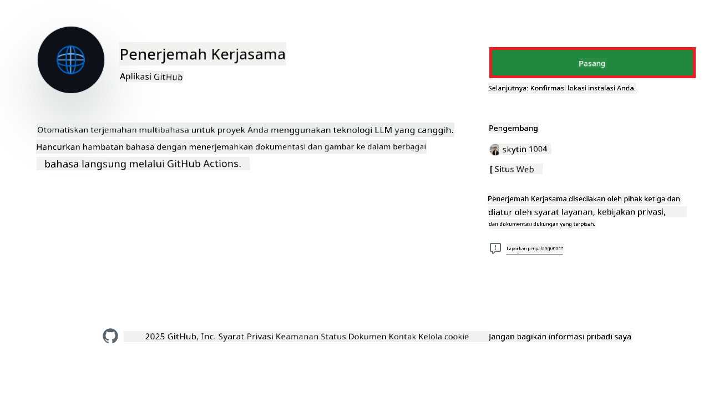
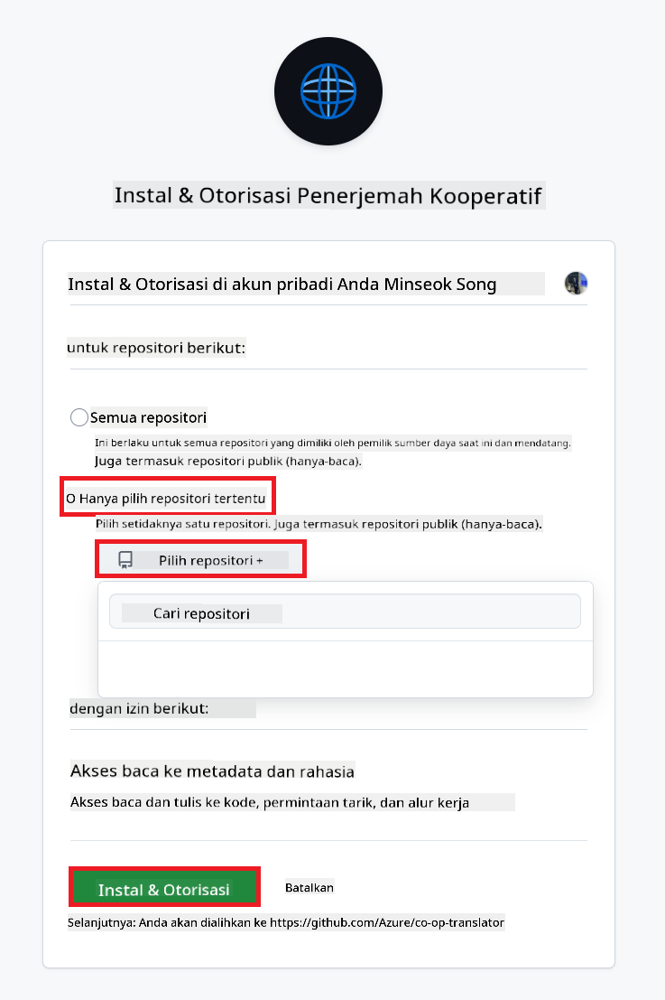
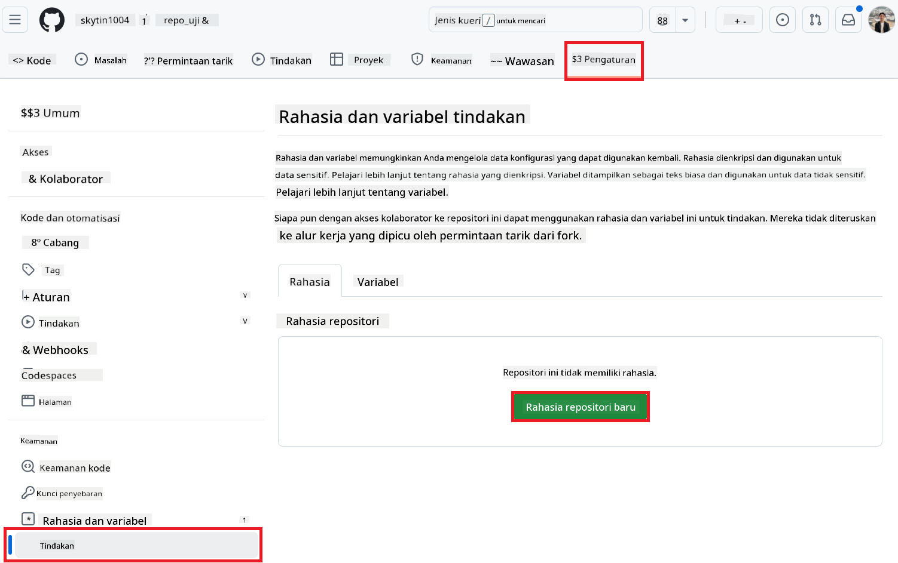
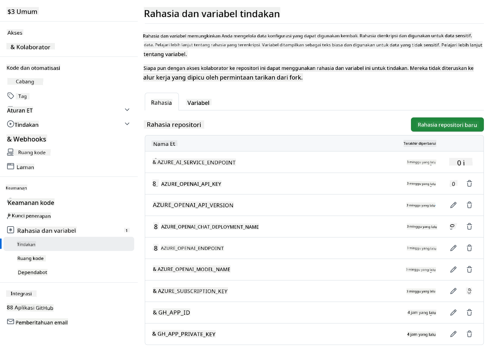

<!--
CO_OP_TRANSLATOR_METADATA:
{
  "original_hash": "c437820027c197f25fb2cbee95bae28c",
  "translation_date": "2025-06-12T19:14:12+00:00",
  "source_file": "getting_started/github-actions-guide/github-actions-guide-org.md",
  "language_code": "id"
}
-->
# Menggunakan Co-op Translator GitHub Action (Panduan Organisasi)

**Audiens Sasaran:** Panduan ini ditujukan untuk **pengguna internal Microsoft** atau **tim yang memiliki akses ke kredensial yang diperlukan untuk Co-op Translator GitHub App yang sudah dibuat sebelumnya** atau yang dapat membuat GitHub App kustom mereka sendiri.

Otomatiskan penerjemahan dokumentasi repositori Anda dengan mudah menggunakan Co-op Translator GitHub Action. Panduan ini memandu Anda dalam menyiapkan action untuk secara otomatis membuat pull request dengan terjemahan terbaru setiap kali file Markdown sumber atau gambar Anda berubah.

> [!IMPORTANT]
> 
> **Memilih Panduan yang Tepat:**
>
> Panduan ini menjelaskan pengaturan menggunakan **GitHub App ID dan Private Key**. Anda biasanya memerlukan metode "Panduan Organisasi" ini jika: **`GITHUB_TOKEN` Permissions are Restricted:** Pengaturan organisasi atau repositori Anda membatasi izin default yang diberikan kepada `GITHUB_TOKEN` standar. Secara khusus, jika `GITHUB_TOKEN` tidak diizinkan mendapatkan izin `write` yang diperlukan (seperti `contents: write` atau `pull-requests: write`), workflow dalam [Panduan Pengaturan Publik](./github-actions-guide-public.md) akan gagal karena izin yang tidak mencukupi. Menggunakan GitHub App khusus dengan izin yang diberikan secara eksplisit melewati batasan ini.
>
> **Jika hal di atas tidak berlaku untuk Anda:**
>
> Jika `GITHUB_TOKEN` standar memiliki izin yang cukup di repositori Anda (misalnya, Anda tidak dibatasi oleh pembatasan organisasi), silakan gunakan **[Panduan Pengaturan Publik menggunakan GITHUB_TOKEN](./github-actions-guide-public.md)**. Panduan publik tidak memerlukan pengambilan atau pengelolaan App ID atau Private Key dan hanya mengandalkan `GITHUB_TOKEN` standar dan izin repositori.

## Prasyarat

Sebelum mengonfigurasi GitHub Action, pastikan Anda sudah memiliki kredensial layanan AI yang diperlukan.

**1. Wajib: Kredensial Model Bahasa AI**  
Anda memerlukan kredensial untuk setidaknya satu Model Bahasa yang didukung:

- **Azure OpenAI**: Membutuhkan Endpoint, API Key, Nama Model/Deployment, Versi API.  
- **OpenAI**: Membutuhkan API Key, (Opsional: Org ID, Base URL, Model ID).  
- Lihat [Supported Models and Services](../../../../README.md) untuk detail.  
- Panduan Pengaturan: [Set up Azure OpenAI](../set-up-resources/set-up-azure-openai.md).

**2. Opsional: Kredensial Computer Vision (untuk Terjemahan Gambar)**

- Diperlukan hanya jika Anda perlu menerjemahkan teks dalam gambar.  
- **Azure Computer Vision**: Membutuhkan Endpoint dan Subscription Key.  
- Jika tidak disediakan, action akan menggunakan [mode Markdown saja](../markdown-only-mode.md).  
- Panduan Pengaturan: [Set up Azure Computer Vision](../set-up-resources/set-up-azure-computer-vision.md).

## Pengaturan dan Konfigurasi

Ikuti langkah-langkah berikut untuk mengonfigurasi Co-op Translator GitHub Action di repositori Anda:

### Langkah 1: Pasang dan Konfigurasi Otentikasi GitHub App

Workflow menggunakan otentikasi GitHub App untuk berinteraksi dengan aman dengan repositori Anda (misalnya, membuat pull request) atas nama Anda. Pilih salah satu opsi:

#### **Opsi A: Pasang Co-op Translator GitHub App yang Sudah Dibangun (untuk Penggunaan Internal Microsoft)**

1. Buka halaman [Co-op Translator GitHub App](https://github.com/apps/co-op-translator).

1. Pilih **Install** dan pilih akun atau organisasi tempat repositori target Anda berada.

    

1. Pilih **Only select repositories** dan pilih repositori target Anda (misalnya `PhiCookBook`). Klik **Install**. Anda mungkin diminta untuk melakukan otentikasi.

    

1. **Dapatkan Kredensial App (Proses Internal Diperlukan):** Untuk memungkinkan workflow mengautentikasi sebagai app, Anda memerlukan dua informasi yang diberikan oleh tim Co-op Translator:  
  - **App ID:** Identifier unik untuk Co-op Translator app. App ID adalah: `1164076`.  
  - **Private Key:** Anda harus mendapatkan **seluruh isi** file private key `.pem` dari kontak pemelihara. **Perlakukan kunci ini seperti kata sandi dan jaga kerahasiaannya.**

1. Lanjut ke Langkah 2.

#### **Opsi B: Gunakan GitHub App Kustom Anda Sendiri**

- Jika Anda mau, Anda dapat membuat dan mengonfigurasi GitHub App Anda sendiri. Pastikan memiliki akses Baca & Tulis ke Contents dan Pull requests. Anda akan memerlukan App ID dan Private Key yang dihasilkan.

### Langkah 2: Konfigurasikan Secrets Repositori

Anda perlu menambahkan kredensial GitHub App dan kredensial layanan AI Anda sebagai secrets terenkripsi di pengaturan repositori.

1. Buka repositori GitHub target Anda (misalnya `PhiCookBook`).

1. Pergi ke **Settings** > **Secrets and variables** > **Actions**.

1. Di bawah **Repository secrets**, klik **New repository secret** untuk setiap secret yang tercantum di bawah ini.

   

**Secrets Wajib (untuk Otentikasi GitHub App):**

| Nama Secret          | Deskripsi                                      | Sumber Nilai                                     |
| :------------------- | :----------------------------------------------- | :----------------------------------------------- |
| `GH_APP_ID`          | App ID dari GitHub App (dari Langkah 1).      | Pengaturan GitHub App                              |
| `GH_APP_PRIVATE_KEY` | **Seluruh isi** file `.pem` yang diunduh. | File `.pem` (dari Langkah 1)                      |

**Secrets Layanan AI (Tambahkan SEMUA yang relevan berdasarkan Prasyarat Anda):**

| Nama Secret                         | Deskripsi                               | Sumber Nilai                     |
| :---------------------------------- | :---------------------------------------- | :------------------------------- |
| `AZURE_SUBSCRIPTION_KEY`            | Kunci untuk Azure AI Service (Computer Vision)  | Azure AI Foundry                    |
| `AZURE_AI_SERVICE_ENDPOINT`         | Endpoint untuk Azure AI Service (Computer Vision) | Azure AI Foundry                     |
| `AZURE_OPENAI_API_KEY`              | Kunci untuk layanan Azure OpenAI              | Azure AI Foundry                     |
| `AZURE_OPENAI_ENDPOINT`             | Endpoint untuk layanan Azure OpenAI         | Azure AI Foundry                     |
| `AZURE_OPENAI_MODEL_NAME`           | Nama Model Azure OpenAI Anda              | Azure AI Foundry                     |
| `AZURE_OPENAI_CHAT_DEPLOYMENT_NAME` | Nama Deployment Azure OpenAI Anda         | Azure AI Foundry                     |
| `AZURE_OPENAI_API_VERSION`          | Versi API untuk Azure OpenAI              | Azure AI Foundry                     |
| `OPENAI_API_KEY`                    | API Key untuk OpenAI                        | OpenAI Platform                  |
| `OPENAI_ORG_ID`                     | ID Organisasi OpenAI                    | OpenAI Platform                  |
| `OPENAI_CHAT_MODEL_ID`              | ID model OpenAI tertentu                  | OpenAI Platform                    |
| `OPENAI_BASE_URL`                   | URL Basis API OpenAI kustom                | OpenAI Platform                    |



### Langkah 3: Buat File Workflow

Terakhir, buat file YAML yang mendefinisikan workflow otomatis.

1. Di direktori root repositori Anda, buat direktori `.github/workflows/` jika belum ada.

1. Di dalam `.github/workflows/`, buat file bernama `co-op-translator.yml`.

1. Tempelkan konten berikut ke dalam co-op-translator.yml.

```
name: Co-op Translator

on:
  push:
    branches:
      - main

jobs:
  co-op-translator:
    runs-on: ubuntu-latest

    permissions:
      contents: write
      pull-requests: write

    steps:
      - name: Checkout repository
        uses: actions/checkout@v4
        with:
          fetch-depth: 0

      - name: Set up Python
        uses: actions/setup-python@v4
        with:
          python-version: '3.10'

      - name: Install Co-op Translator
        run: |
          python -m pip install --upgrade pip
          pip install co-op-translator

      - name: Run Co-op Translator
        env:
          PYTHONIOENCODING: utf-8
          # Azure AI Service Credentials
          AZURE_SUBSCRIPTION_KEY: ${{ secrets.AZURE_SUBSCRIPTION_KEY }}
          AZURE_AI_SERVICE_ENDPOINT: ${{ secrets.AZURE_AI_SERVICE_ENDPOINT }}

          # Azure OpenAI Credentials
          AZURE_OPENAI_API_KEY: ${{ secrets.AZURE_OPENAI_API_KEY }}
          AZURE_OPENAI_ENDPOINT: ${{ secrets.AZURE_OPENAI_ENDPOINT }}
          AZURE_OPENAI_MODEL_NAME: ${{ secrets.AZURE_OPENAI_MODEL_NAME }}
          AZURE_OPENAI_CHAT_DEPLOYMENT_NAME: ${{ secrets.AZURE_OPENAI_CHAT_DEPLOYMENT_NAME }}
          AZURE_OPENAI_API_VERSION: ${{ secrets.AZURE_OPENAI_API_VERSION }}

          # OpenAI Credentials
          OPENAI_API_KEY: ${{ secrets.OPENAI_API_KEY }}
          OPENAI_ORG_ID: ${{ secrets.OPENAI_ORG_ID }}
          OPENAI_CHAT_MODEL_ID: ${{ secrets.OPENAI_CHAT_MODEL_ID }}
          OPENAI_BASE_URL: ${{ secrets.OPENAI_BASE_URL }}
        run: |
          # =====================================================================
          # IMPORTANT: Set your target languages here (REQUIRED CONFIGURATION)
          # =====================================================================
          # Example: Translate to Spanish, French, German. Add -y to auto-confirm.
          translate -l "es fr de" -y  # <--- MODIFY THIS LINE with your desired languages

      - name: Authenticate GitHub App
        id: generate_token
        uses: tibdex/github-app-token@v1
        with:
          app_id: ${{ secrets.GH_APP_ID }}
          private_key: ${{ secrets.GH_APP_PRIVATE_KEY }}

      - name: Create Pull Request with translations
        uses: peter-evans/create-pull-request@v5
        with:
          token: ${{ steps.generate_token.outputs.token }}
          commit-message: "🌐 Update translations via Co-op Translator"
          title: "🌐 Update translations via Co-op Translator"
          body: |
            This PR updates translations for recent changes to the main branch.

            ### 📋 Changes included
            - Translated contents are available in the `translations/` directory
            - Translated images are available in the `translated_images/` directory

            ---
            🌐 Automatically generated by the [Co-op Translator](https://github.com/Azure/co-op-translator) GitHub Action.
          branch: update-translations
          base: main
          labels: translation, automated-pr
          delete-branch: true
          add-paths: |
            translations/
            translated_images/

```

4.  **Sesuaikan Workflow:**  
  - **[!IMPORTANT] Bahasa Target:** Di bagian `Run Co-op Translator` step, you **MUST review and modify the list of language codes** within the `translate -l "..." -y` command to match your project's requirements. The example list (`ar de es...`) needs to be replaced or adjusted.
  - **Trigger (`on:`):** The current trigger runs on every push to `main`. For large repositories, consider adding a `paths:` filter (see commented example in the YAML) to run the workflow only when relevant files (e.g., source documentation) change, saving runner minutes.
  - **PR Details:** Customize the `commit-message`, `title`, `body`, `branch` name, and `labels` in the `Create Pull Request` step if needed.

## Credential Management and Renewal

- **Security:** Always store sensitive credentials (API keys, private keys) as GitHub Actions secrets. Never expose them in your workflow file or repository code.
- **[!IMPORTANT] Key Renewal (Internal Microsoft Users):** Be aware that Azure OpenAI key used within Microsoft might have a mandatory renewal policy (e.g., every 5 months). Ensure you update the corresponding GitHub secrets (`AZURE_OPENAI_...` pastikan bahasa target sudah sesuai.  
  - Perbarui secrets seperti `AZURE_OPENAI_...` sebelum kedaluwarsa untuk mencegah kegagalan workflow.

## Menjalankan Workflow

Setelah file `co-op-translator.yml` digabungkan ke cabang utama Anda (atau cabang yang ditentukan dalam filter `on:` trigger), the workflow will automatically run whenever changes are pushed to that branch (and match the `paths`, jika dikonfigurasi).

Jika terjemahan dibuat atau diperbarui, action akan otomatis membuat Pull Request yang berisi perubahan tersebut, siap untuk Anda tinjau dan gabungkan.

**Penafian**:  
Dokumen ini telah diterjemahkan menggunakan layanan terjemahan AI [Co-op Translator](https://github.com/Azure/co-op-translator). Meskipun kami berusaha untuk akurasi, harap diperhatikan bahwa terjemahan otomatis mungkin mengandung kesalahan atau ketidakakuratan. Dokumen asli dalam bahasa aslinya harus dianggap sebagai sumber yang sahih. Untuk informasi penting, disarankan menggunakan terjemahan profesional oleh manusia. Kami tidak bertanggung jawab atas kesalahpahaman atau penafsiran yang salah yang timbul dari penggunaan terjemahan ini.