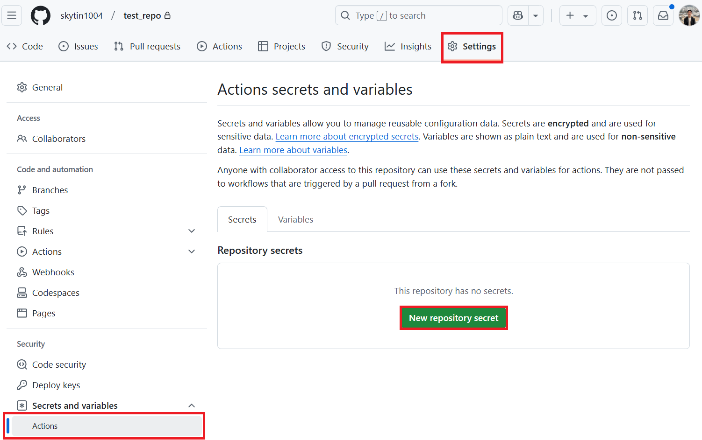
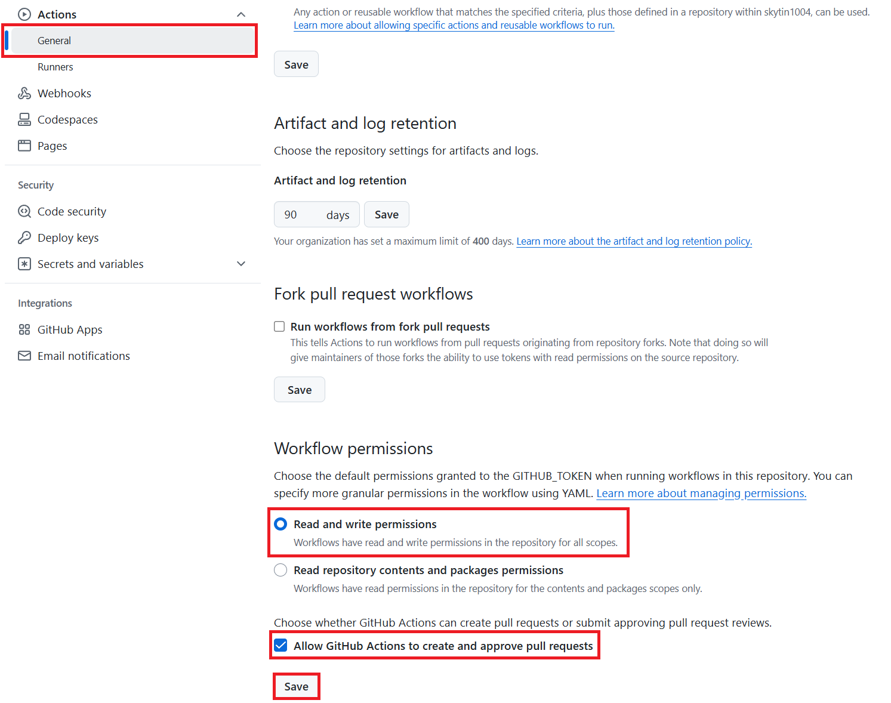

<!--
CO_OP_TRANSLATOR_METADATA:
{
  "original_hash": "a52587a512e667f70d92db853d3c61d5",
  "translation_date": "2025-05-07T14:15:36+00:00",
  "source_file": "getting_started/github-actions-guide/github-actions-guide-public.md",
  "language_code": "id"
}
-->
# Menggunakan Co-op Translator GitHub Action (Pengaturan Publik)

**Audiens Sasaran:** Panduan ini ditujukan untuk pengguna di sebagian besar repositori publik atau privat di mana izin GitHub Actions standar sudah cukup. Ini memanfaatkan `GITHUB_TOKEN` bawaan.

Otomatiskan penerjemahan dokumentasi repositori Anda dengan mudah menggunakan Co-op Translator GitHub Action. Panduan ini memandu Anda dalam mengatur action agar secara otomatis membuat pull request dengan terjemahan yang diperbarui setiap kali file Markdown sumber atau gambar Anda berubah.

> [!IMPORTANT]
>
> **Memilih Panduan yang Tepat:**
>
> Panduan ini menjelaskan **pengaturan yang lebih sederhana menggunakan `GITHUB_TOKEN` standar**. Ini adalah metode yang direkomendasikan untuk sebagian besar pengguna karena tidak memerlukan pengelolaan GitHub App Private Keys yang sensitif.
>

## Prasyarat

Sebelum mengonfigurasi GitHub Action, pastikan Anda sudah menyiapkan kredensial layanan AI yang diperlukan.

**1. Wajib: Kredensial Model Bahasa AI**  
Anda memerlukan kredensial untuk setidaknya satu Model Bahasa yang didukung:

- **Azure OpenAI**: Membutuhkan Endpoint, API Key, Nama Model/Deployment, Versi API.  
- **OpenAI**: Membutuhkan API Key, (Opsional: Org ID, Base URL, Model ID).  
- Lihat [Supported Models and Services](../../../../README.md) untuk detail lebih lanjut.

**2. Opsional: Kredensial AI Vision (untuk Terjemahan Gambar)**

- Diperlukan hanya jika Anda ingin menerjemahkan teks dalam gambar.  
- **Azure AI Vision**: Membutuhkan Endpoint dan Subscription Key.  
- Jika tidak disediakan, action akan default ke [Markdown-only mode](../markdown-only-mode.md).

## Pengaturan dan Konfigurasi

Ikuti langkah-langkah ini untuk mengonfigurasi Co-op Translator GitHub Action di repositori Anda menggunakan `GITHUB_TOKEN` standar.

### Langkah 1: Pahami Autentikasi (Menggunakan `GITHUB_TOKEN`)

Workflow ini menggunakan `GITHUB_TOKEN` bawaan yang disediakan oleh GitHub Actions. Token ini secara otomatis memberikan izin kepada workflow untuk berinteraksi dengan repositori Anda sesuai pengaturan yang dikonfigurasi di **Langkah 3**.

### Langkah 2: Konfigurasikan Secrets Repositori

Anda hanya perlu menambahkan **kredensial layanan AI** sebagai secrets terenkripsi di pengaturan repositori Anda.

1.  Buka repositori GitHub target Anda.  
2.  Pergi ke **Settings** > **Secrets and variables** > **Actions**.  
3.  Di bawah **Repository secrets**, klik **New repository secret** untuk setiap secret layanan AI yang diperlukan berikut ini.

     *(Referensi Gambar: Menunjukkan lokasi menambahkan secrets)*

**Secrets Layanan AI yang Diperlukan (Tambahkan SEMUA yang berlaku berdasarkan Prasyarat Anda):**

| Nama Secret                         | Deskripsi                                | Sumber Nilai                    |
| :---------------------------------- | :---------------------------------------- | :------------------------------- |
| `AZURE_SUBSCRIPTION_KEY`            | Kunci untuk Azure AI Service (Computer Vision)  | Azure AI Foundry Anda               |
| `AZURE_AI_SERVICE_ENDPOINT`         | Endpoint untuk Azure AI Service (Computer Vision) | Azure AI Foundry Anda               |
| `AZURE_OPENAI_API_KEY`              | Kunci untuk layanan Azure OpenAI              | Azure AI Foundry Anda               |
| `AZURE_OPENAI_ENDPOINT`             | Endpoint untuk layanan Azure OpenAI         | Azure AI Foundry Anda               |
| `AZURE_OPENAI_MODEL_NAME`           | Nama Model Azure OpenAI Anda              | Azure AI Foundry Anda               |
| `AZURE_OPENAI_CHAT_DEPLOYMENT_NAME` | Nama Deployment Azure OpenAI Anda         | Azure AI Foundry Anda               |
| `AZURE_OPENAI_API_VERSION`          | Versi API untuk Azure OpenAI              | Azure AI Foundry Anda               |
| `OPENAI_API_KEY`                    | API Key untuk OpenAI                        | Platform OpenAI Anda              |
| `OPENAI_ORG_ID`                     | ID Organisasi OpenAI (Opsional)         | Platform OpenAI Anda              |
| `OPENAI_CHAT_MODEL_ID`              | ID model OpenAI spesifik (Opsional)       | Platform OpenAI Anda              |
| `OPENAI_BASE_URL`                   | URL Base API OpenAI kustom (Opsional)     | Platform OpenAI Anda              |

### Langkah 3: Konfigurasikan Izin Workflow

GitHub Action membutuhkan izin yang diberikan melalui `GITHUB_TOKEN` untuk checkout kode dan membuat pull request.

1.  Di repositori Anda, buka **Settings** > **Actions** > **General**.  
2.  Gulir ke bagian **Workflow permissions**.  
3.  Pilih **Read and write permissions**. Ini memberikan izin `GITHUB_TOKEN` yang diperlukan untuk `contents: write` dan `pull-requests: write` pada workflow ini.  
4.  Pastikan kotak centang **Allow GitHub Actions to create and approve pull requests** dicentang.  
5.  Pilih **Save**.



### Langkah 4: Buat File Workflow

Terakhir, buat file YAML yang mendefinisikan workflow otomatis menggunakan `GITHUB_TOKEN`.

1.  Di direktori root repositori Anda, buat folder `.github/workflows/` jika belum ada.  
2.  Di dalam `.github/workflows/`, buat file bernama `co-op-translator.yml`.  
3.  Tempelkan konten berikut ke dalam `co-op-translator.yml`.

```yaml
name: Co-op Translator

on:
  push:
    branches:
      - main

jobs:
  co-op-translator:
    runs-on: ubuntu-latest

    permissions:
      contents: write
      pull-requests: write

    steps:
      - name: Checkout repository
        uses: actions/checkout@v4
        with:
          fetch-depth: 0

      - name: Set up Python
        uses: actions/setup-python@v4
        with:
          python-version: '3.10'

      - name: Install Co-op Translator
        run: |
          python -m pip install --upgrade pip
          pip install co-op-translator

      - name: Run Co-op Translator
        env:
          PYTHONIOENCODING: utf-8
          # === AI Service Credentials ===
          AZURE_SUBSCRIPTION_KEY: ${{ secrets.AZURE_SUBSCRIPTION_KEY }}
          AZURE_AI_SERVICE_ENDPOINT: ${{ secrets.AZURE_AI_SERVICE_ENDPOINT }}
          AZURE_OPENAI_API_KEY: ${{ secrets.AZURE_OPENAI_API_KEY }}
          AZURE_OPENAI_ENDPOINT: ${{ secrets.AZURE_OPENAI_ENDPOINT }}
          AZURE_OPENAI_MODEL_NAME: ${{ secrets.AZURE_OPENAI_MODEL_NAME }}
          AZURE_OPENAI_CHAT_DEPLOYMENT_NAME: ${{ secrets.AZURE_OPENAI_CHAT_DEPLOYMENT_NAME }}
          AZURE_OPENAI_API_VERSION: ${{ secrets.AZURE_OPENAI_API_VERSION }}
          OPENAI_API_KEY: ${{ secrets.OPENAI_API_KEY }}
          OPENAI_ORG_ID: ${{ secrets.OPENAI_ORG_ID }}
          OPENAI_CHAT_MODEL_ID: ${{ secrets.OPENAI_CHAT_MODEL_ID }}
          OPENAI_BASE_URL: ${{ secrets.OPENAI_BASE_URL }}
        run: |
          # =====================================================================
          # IMPORTANT: Set your target languages here (REQUIRED CONFIGURATION)
          # =====================================================================
          # Example: Translate to Spanish, French, German. Add -y to auto-confirm.
          translate -l "es fr de" -y  # <--- MODIFY THIS LINE with your desired languages

      - name: Create Pull Request with translations
        uses: peter-evans/create-pull-request@v5
        with:
          token: ${{ secrets.GITHUB_TOKEN }}
          commit-message: "🌐 Update translations via Co-op Translator"
          title: "🌐 Update translations via Co-op Translator"
          body: |
            This PR updates translations for recent changes to the main branch.

            ### 📋 Changes included
            - Translated contents are available in the `translations/` directory
            - Translated images are available in the `translated_images/` directory

            ---
            🌐 Automatically generated by the [Co-op Translator](https://github.com/Azure/co-op-translator) GitHub Action.
          branch: update-translations
          base: main
          labels: translation, automated-pr
          delete-branch: true
          add-paths: |
            translations/
            translated_images/
```  
4.  **Sesuaikan Workflow:**  
  - **[!IMPORTANT] Bahasa Target:** Pada langkah `Run Co-op Translator` step, you **MUST review and modify the list of language codes** within the `translate -l "..." -y` command to match your project's requirements. The example list (`ar de es...`) needs to be replaced or adjusted.
  - **Trigger (`on:`):** The current trigger runs on every push to `main`. For large repositories, consider adding a `paths:` filter (see commented example in the YAML) to run the workflow only when relevant files (e.g., source documentation) change, saving runner minutes.
  - **PR Details:** Customize the `commit-message`, `title`, `body`, `branch` name, and `labels` in the `Create Pull Request` jika perlu.

**Penafian**:  
Dokumen ini telah diterjemahkan menggunakan layanan terjemahan AI [Co-op Translator](https://github.com/Azure/co-op-translator). Meskipun kami berusaha untuk akurasi, harap diketahui bahwa terjemahan otomatis mungkin mengandung kesalahan atau ketidakakuratan. Dokumen asli dalam bahasa aslinya harus dianggap sebagai sumber yang sahih. Untuk informasi penting, disarankan menggunakan terjemahan manusia profesional. Kami tidak bertanggung jawab atas kesalahpahaman atau salah tafsir yang timbul dari penggunaan terjemahan ini.