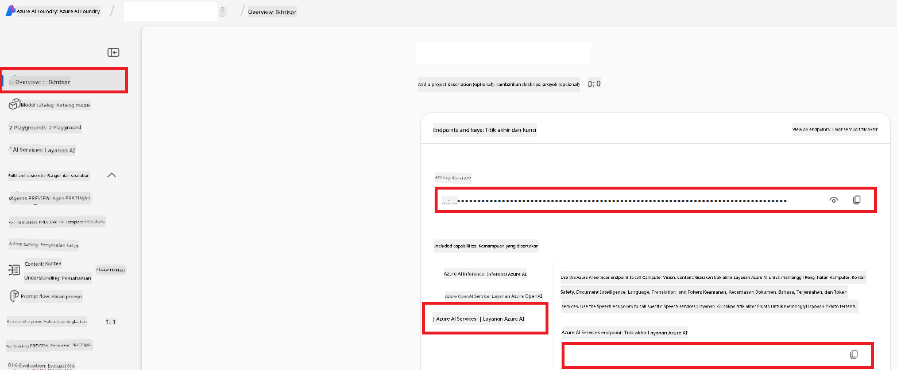

<!--
CO_OP_TRANSLATOR_METADATA:
{
  "original_hash": "b58d7c3cb4210697a073d20eb3064945",
  "translation_date": "2025-06-12T11:56:04+00:00",
  "source_file": "getting_started/set-up-azure-ai.md",
  "language_code": "id"
}
-->
# Menyiapkan Azure AI untuk Co-op Translator (Azure OpneAI & Azure AI Vision)

Panduan ini akan memandu Anda dalam menyiapkan Azure OpenAI untuk terjemahan bahasa dan Azure Computer Vision untuk analisis konten gambar (yang kemudian dapat digunakan untuk terjemahan berbasis gambar) dalam Azure AI Foundry.

**Persyaratan:**
- Akun Azure dengan langganan aktif.
- Izin yang cukup untuk membuat sumber daya dan penyebaran di langganan Azure Anda.

## Membuat Proyek Azure AI

Anda akan memulai dengan membuat Proyek Azure AI, yang berfungsi sebagai tempat pusat untuk mengelola sumber daya AI Anda.

1. Buka [https://ai.azure.com](https://ai.azure.com) dan masuk dengan akun Azure Anda.

1. Pilih **+Create** untuk membuat proyek baru.

1. Lakukan tugas berikut:
   - Masukkan **Project name** (misalnya `CoopTranslator-Project`).
   - Pilih **AI hub** (misalnya `CoopTranslator-Hub`) (Buat yang baru jika diperlukan).

1. Klik "**Review and Create**" untuk menyiapkan proyek Anda. Anda akan dibawa ke halaman ringkasan proyek Anda.

## Menyiapkan Azure OpenAI untuk Terjemahan Bahasa

Dalam proyek Anda, Anda akan menyebarkan model Azure OpenAI untuk berfungsi sebagai backend terjemahan teks.

### Buka Proyek Anda

Jika belum, buka proyek baru yang telah Anda buat (misalnya `CoopTranslator-Project`) di Azure AI Foundry.

### Menyebarkan Model OpenAI

1. Dari menu kiri proyek Anda, di bawah "My assets", pilih "**Models + endpoints**".

1. Pilih **+ Deploy model**.

1. Pilih **Deploy Base Model**.

1. Anda akan melihat daftar model yang tersedia. Saring atau cari model GPT yang sesuai. Kami merekomendasikan `gpt-4o`.

1. Pilih model yang diinginkan dan klik **Confirm**.

1. Pilih **Deploy**.

### Konfigurasi Azure OpenAI

Setelah disebarkan, Anda dapat memilih penyebaran dari halaman "**Models + endpoints**" untuk menemukan **REST endpoint URL**, **Key**, **Deployment name**, **Model name**, dan **API version**. Ini diperlukan untuk mengintegrasikan model terjemahan ke aplikasi Anda.

> [!NOTE]
> Anda dapat memilih versi API dari halaman [API version deprecation](https://learn.microsoft.com/azure/ai-services/openai/api-version-deprecation) sesuai kebutuhan Anda. Perlu diketahui bahwa **API version** berbeda dengan **Model version** yang ditampilkan di halaman **Models + endpoints** di Azure AI Foundry.

## Menyiapkan Azure Computer Vision untuk Terjemahan Gambar

Untuk mengaktifkan terjemahan teks dalam gambar, Anda perlu menemukan Azure AI Service API Key dan Endpoint.

1. Buka Proyek Azure AI Anda (misalnya `CoopTranslator-Project`). Pastikan Anda berada di halaman ringkasan proyek.

### Konfigurasi Azure AI Service

Temukan API Key dan Endpoint dari Azure AI Service.

1. Buka Proyek Azure AI Anda (misalnya `CoopTranslator-Project`). Pastikan Anda berada di halaman ringkasan proyek.

1. Temukan **API Key** dan **Endpoint** dari tab Azure AI Service.

    

Koneksi ini membuat kemampuan sumber daya Azure AI Services yang terhubung (termasuk analisis gambar) tersedia untuk proyek AI Foundry Anda. Anda kemudian dapat menggunakan koneksi ini di notebook atau aplikasi Anda untuk mengekstrak teks dari gambar, yang kemudian dapat dikirim ke model Azure OpenAI untuk diterjemahkan.

## Mengkonsolidasikan Kredensial Anda

Saat ini, Anda seharusnya sudah mengumpulkan hal-hal berikut:

**Untuk Azure OpenAI (Terjemahan Teks):**
- Azure OpenAI Endpoint
- Azure OpenAI API Key
- Azure OpenAI Model Name (misalnya `gpt-4o`)
- Azure OpenAI Deployment Name (misalnya `cooptranslator-gpt4o`)
- Azure OpenAI API Version

**Untuk Azure AI Services (Ekstraksi Teks Gambar melalui Vision):**
- Azure AI Service Endpoint
- Azure AI Service API Key

### Contoh: Konfigurasi Variabel Lingkungan (Pratinjau)

Nantinya, saat membangun aplikasi Anda, kemungkinan besar Anda akan mengonfigurasinya menggunakan kredensial yang sudah dikumpulkan ini. Misalnya, Anda dapat mengaturnya sebagai variabel lingkungan seperti berikut:

```bash
# Azure AI Service Credentials (Required for image translation)
AZURE_AI_SERVICE_API_KEY="your_azure_ai_service_api_key" # e.g., 21xasd...
AZURE_AI_SERVICE_ENDPOINT="https://your_azure_ai_service_endpoint.cognitiveservices.azure.com/"

# Azure OpenAI Credentials (Required for text translation)
AZURE_OPENAI_API_KEY="your_azure_openai_api_key" # e.g., 21xasd...
AZURE_OPENAI_ENDPOINT="https://your_azure_openai_endpoint.openai.azure.com/"
AZURE_OPENAI_MODEL_NAME="your_model_name" # e.g., gpt-4o
AZURE_OPENAI_CHAT_DEPLOYMENT_NAME="your_deployment_name" # e.g., cooptranslator-gpt4o
AZURE_OPENAI_API_VERSION="your_api_version" # e.g., 2024-12-01-preview
```

---

### Bacaan Lebih Lanjut

- [How to Create a project in Azure AI Foundry](https://learn.microsoft.com/azure/ai-foundry/how-to/create-projects?tabs=ai-studio)
- [How to Create Azure AI resources](https://learn.microsoft.com/azure/ai-foundry/how-to/create-azure-ai-resource?tabs=portal)
- [How to Deploy OpenAI models in Azure AI Foundry](https://learn.microsoft.com/en-us/azure/ai-foundry/how-to/deploy-models-openai)

**Penafian**:  
Dokumen ini telah diterjemahkan menggunakan layanan terjemahan AI [Co-op Translator](https://github.com/Azure/co-op-translator). Meskipun kami berupaya untuk akurasi, harap diperhatikan bahwa terjemahan otomatis mungkin mengandung kesalahan atau ketidakakuratan. Dokumen asli dalam bahasa aslinya harus dianggap sebagai sumber yang sahih. Untuk informasi penting, disarankan menggunakan terjemahan profesional oleh manusia. Kami tidak bertanggung jawab atas kesalahpahaman atau salah tafsir yang timbul dari penggunaan terjemahan ini.