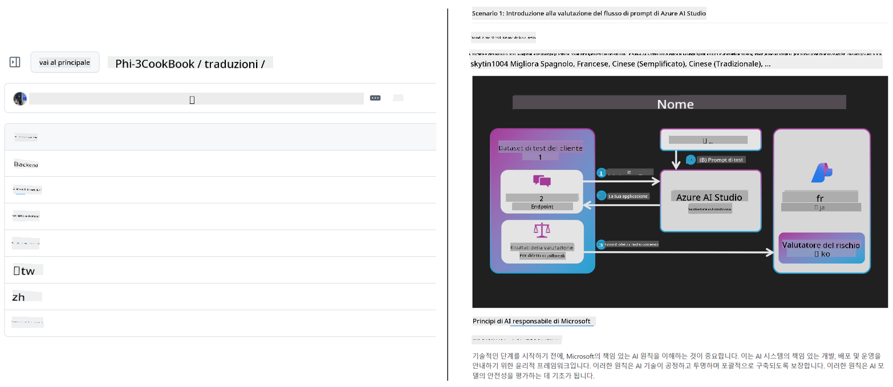
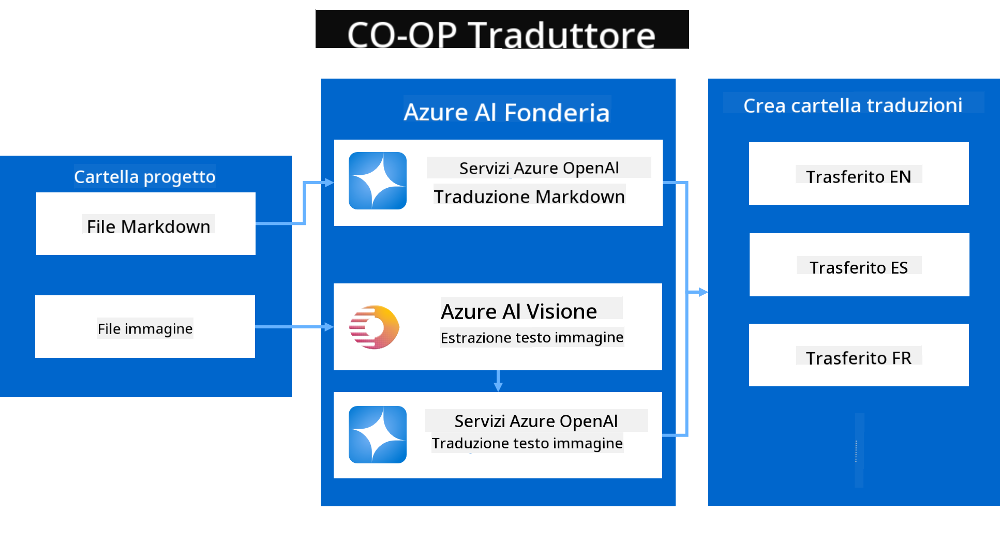
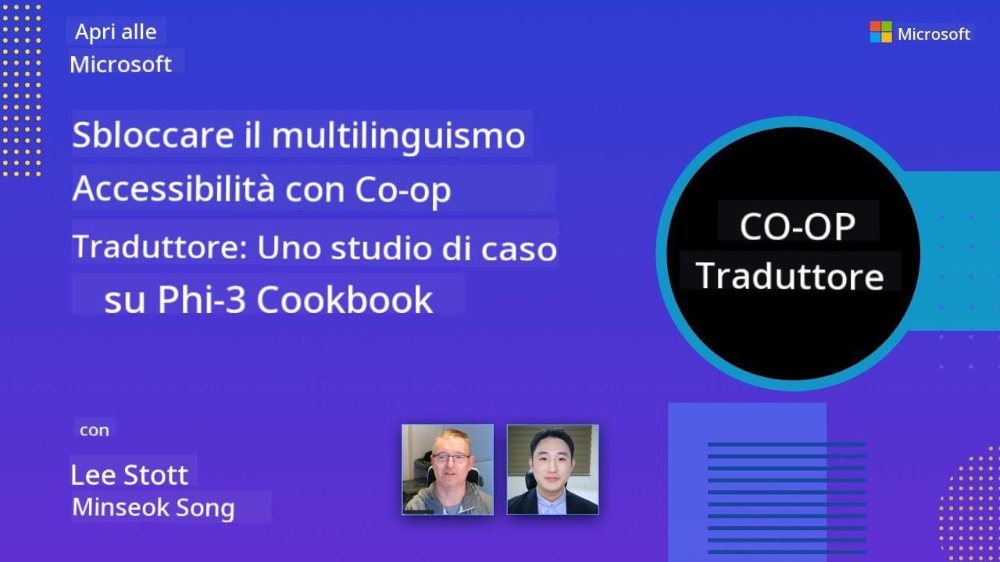

<!--
CO_OP_TRANSLATOR_METADATA:
{
  "original_hash": "044724537b57868117aadae8e7728c7c",
  "translation_date": "2025-06-12T10:20:40+00:00",
  "source_file": "README.md",
  "language_code": "it"
}
-->


# Co-op Translator: Automatizza la Traduzione della Documentazione Educativa Senza Sforzo

_Automatizza facilmente la traduzione della tua documentazione in più lingue per raggiungere un pubblico globale._

[](https://pypi.org/project/co-op-translator/)
[](https://github.com/azure/co-op-translator/blob/main/LICENSE)
[](https://pepy.tech/project/co-op-translator)
[](https://pepy.tech/project/co-op-translator)
[](https://github.com/psf/black)

[](https://GitHub.com/azure/co-op-translator/graphs/contributors/)
[](https://GitHub.com/azure/co-op-translator/issues/)
[](https://GitHub.com/azure/co-op-translator/pulls/)
[](http://makeapullrequest.com)

### Supporto Linguistico Alimentato da Co-op Translator

> [!NOTE]
> Queste sono le traduzioni attuali del contenuto di questo repository. Per un elenco completo delle lingue supportate da Co-op Translator, consulta la sezione [Language Support](../..).

[](https://GitHub.com/azure/co-op-translator/watchers/)
[](https://GitHub.com/azure/co-op-translator/network/)
[](https://GitHub.com/azure/co-op-translator/stargazers/)

[](https://discord.com/invite/ByRwuEEgH4)

[](https://codespaces.new/azure/co-op-translator)
[](https://vscode.dev/redirect?url=vscode://ms-vscode-remote.remote-containers/cloneInVolume?url=https://github.com/azure/co-op-translator)

## Panoramica: semplifica la traduzione dei tuoi contenuti educativi

Le barriere linguistiche ostacolano notevolmente l'accesso a risorse educative preziose e conoscenze tecniche per studenti e sviluppatori in tutto il mondo. Questo limita la partecipazione e rallenta il ritmo dell’innovazione e dell’apprendimento globale.

**Co-op Translator** è nato dall’esigenza di migliorare il processo di traduzione manuale inefficiente utilizzato per le grandi serie educative di Microsoft (come le guide "For Beginners"). È diventato uno strumento potente e facile da usare, progettato per abbattere queste barriere per tutti. Fornendo traduzioni automatiche di alta qualità tramite CLI e GitHub Actions, Co-op Translator permette a educatori, studenti, ricercatori e sviluppatori di tutto il mondo di condividere e accedere alle conoscenze senza limiti linguistici.

Scopri come Co-op Translator organizza i contenuti educativi tradotti:



I file Markdown e i testi delle immagini vengono tradotti automaticamente e ordinatamente organizzati in cartelle specifiche per lingua.

**Sblocca l’accesso globale ai tuoi contenuti educativi con Co-op Translator oggi stesso!**

## Supporto all’accesso globale per le risorse di apprendimento Microsoft

Co-op Translator aiuta a colmare il divario linguistico per importanti iniziative educative di Microsoft, automatizzando il processo di traduzione per repository che servono una comunità globale di sviluppatori. Ecco alcuni esempi che attualmente utilizzano Co-op Translator:

[](https://github.com/microsoft/Generative-AI-for-beginners)
[](https://github.com/microsoft/ML-For-Beginners)
[](https://github.com/microsoft/AI-For-Beginners)
[](https://github.com/microsoft/ai-agents-for-beginners)
[](https://github.com/microsoft/PhiCookBook)
[](https://github.com/microsoft/Generative-AI-for-beginners-dotnet)

## Caratteristiche principali

- **Traduzioni automatiche**: traduci testi in più lingue senza sforzo.
- **Integrazione con GitHub Actions**: automatizza le traduzioni come parte della tua pipeline CI/CD.
- **Preservazione del Markdown**: mantieni la sintassi Markdown corretta durante la traduzione.
- **Traduzione del testo nelle immagini**: estrai e traduci i testi contenuti nelle immagini.
- **Tecnologia LLM avanzata**: utilizza modelli linguistici all’avanguardia per traduzioni di alta qualità.
- **Integrazione semplice**: integra facilmente con la configurazione esistente del tuo progetto.
- **Semplifica la localizzazione**: snellisci il processo di localizzazione per i mercati internazionali.

## Come funziona



Co-op Translator prende i file Markdown e le immagini dalla cartella del progetto e li elabora come segue:

1. **Estrazione del testo**: estrae il testo dai file Markdown e, se configurato (ad esempio con Azure AI Vision), anche il testo incorporato nelle immagini.
1. **Traduzione AI**: invia il testo estratto al modello LLM configurato (Azure OpenAI, OpenAI, ecc.) per la traduzione.
1. **Salvataggio del risultato**: salva i file Markdown e le immagini tradotti (con testo tradotto) in cartelle specifiche per lingua, mantenendo la formattazione originale.

## Come iniziare

Inizia rapidamente con la CLI o configura l’automazione completa con GitHub Actions. Scegli l’approccio più adatto al tuo flusso di lavoro:

1. **Command Line (CLI)** - per traduzioni una tantum o controllo manuale
2. **GitHub Actions** - per traduzioni automatiche ad ogni push

> [!NOTE]
> Anche se questo tutorial si concentra sulle risorse Azure, puoi usare qualsiasi modello linguistico supportato.

### Supporto linguistico

Co-op Translator supporta un’ampia gamma di lingue per aiutarti a raggiungere un pubblico globale. Ecco cosa devi sapere:

#### Riferimento rapido

| Lingua | Codice | Lingua | Codice | Lingua | Codice |
|----------|------|----------|------|----------|------|
| Arabo | ar | Bengali | bn | Bulgaro | bg |
| Birmano (Myanmar) | my | Cinese (semplificato) | zh | Cinese (tradizionale, HK) | hk |
| Cinese (tradizionale, Macao) | mo | Cinese (tradizionale, TW) | tw | Croato | hr |
| Ceco | cs | Danese | da | Olandese | nl |
| Finlandese | fi | Francese | fr | Tedesco | de |
| Greco | el | Ebraico | he | Hindi | hi |
| Ungherese | hu | Indonesiano | id | Italiano | it |
| Giapponese | ja | Coreano | ko | Malese | ms |
| Marathi | mr | Nepalese | ne | Norvegese | no |
| Persiano (Farsi) | fa | Polacco | pl | Portoghese (Brasile) | br |
| Portoghese (Portogallo) | pt | Punjabi (Gurmukhi) | pa | Rumeno | ro |
| Russo | ru | Serbo (Cirillico) | sr | Slovacco | sk |
| Sloveno | sl | Spagnolo | es | Swahili | sw |
| Svedese | sv | Tagalog (Filippino) | tl | Thailandese | th |
| Turco | tr | Ucraino | uk | Urdu | ur |
| Vietnamita | vi | — | — | — | — |

#### Uso dei codici lingua

Quando usi Co-op Translator, devi specificare le lingue tramite i loro codici. Per esempio:

```bash
# Translate to French, Spanish, and German
translate -l "fr es de"

# Translate to Chinese (Simplified) and Japanese
translate -l "zh ja"
```

> [!NOTE]
> Per informazioni tecniche dettagliate sul supporto linguistico, inclusi:
>
> - Specifiche dei font per ogni lingua
> - Problemi noti
> - Come aggiungere nuove lingue
>
> consulta la nostra [documentazione sulle lingue supportate](./getting_started/supported-languages.md).

### Modelli e servizi supportati

| Tipo                  | Nome                           |
|-----------------------|--------------------------------|
| Modello linguistico        |   |
| AI Vision       |  |

> [!NOTE]
> Se un servizio AI vision non è disponibile, co-op translator passerà alla [modalità solo Markdown](./getting_started/markdown-only-mode.md).

### Configurazione iniziale

Prima di iniziare, devi configurare le seguenti risorse:

1. Risorsa Modello Linguistico (obbligatoria):
   - Azure OpenAI (consigliato) - offre traduzioni di alta qualità con affidabilità enterprise
   - OpenAI - opzione alternativa se non hai accesso ad Azure
   - Per dettagli sui modelli supportati, consulta [Supported Models and Services](../..)

1. Risorsa AI Vision (opzionale):
   - Azure AI Vision - consente la traduzione del testo contenuto nelle immagini
   - Se non configurata, il traduttore userà automaticamente la [modalità solo Markdown](./getting_started/markdown-only-mode.md)
   - Consigliata per progetti con immagini contenenti testo da tradurre

1. Passaggi di configurazione:
   - Segui la nostra [guida di configurazione Azure AI](./getting_started/set-up-azure-ai.md) per istruzioni dettagliate
   - Crea un file `.env` con le tue chiavi API e endpoint (vedi la sezione [Quick Start](../..))
   - Assicurati di avere i permessi e le quote necessarie per i servizi scelti

### Preparazione del progetto prima della traduzione

Prima di avviare il processo di traduzione, segui questi passaggi per preparare il tuo progetto:

1. Prepara il tuo README:
   - Aggiungi una tabella delle traduzioni al README.md per collegare le versioni tradotte
   - Esempio di formato:

     ```markdown

     ### 🌐 Multi-Language Support
     
     [French](../fr/README.md) | [Spanish](../es/README.md) | [German](../de/README.md) | [Russian](../ru/README.md) | [Arabic](../ar/README.md) | [Persian (Farsi)](../fa/README.md) | [Urdu](../ur/README.md) | [Chinese (Simplified)](../zh/README.md) | [Chinese (Traditional, Macau)](../mo/README.md) | [Chinese (Traditional, Hong Kong)](../hk/README.md) | [Chinese (Traditional, Taiwan)](../tw/README.md) | [Japanese](../ja/README.md) | [Korean](../ko/README.md) | [Hindi](../hi/README.md) | [Bengali](../bn/README.md) | [Marathi](../mr/README.md) | [Nepali](../ne/README.md) | [Punjabi (Gurmukhi)](../pa/README.md) | [Portuguese (Portugal)](../pt/README.md) | [Portuguese (Brazil)](../br/README.md) | [Italian](./README.md) | [Polish](../pl/README.md) | [Turkish](../tr/README.md) | [Greek](../el/README.md) | [Thai](../th/README.md) | [Swedish](../sv/README.md) | [Danish](../da/README.md) | [Norwegian](../no/README.md) | [Finnish](../fi/README.md) | [Dutch](../nl/README.md) | [Hebrew](../he/README.md) | [Vietnamese](../vi/README.md) | [Indonesian](../id/README.md) | [Malay](../ms/README.md) | [Tagalog (Filipino)](../tl/README.md) | [Swahili](../sw/README.md) | [Hungarian](../hu/README.md) | [Czech](../cs/README.md) | [Slovak](../sk/README.md) | [Romanian](../ro/README.md) | [Bulgarian](../bg/README.md) | [Serbian (Cyrillic)](../sr/README.md) | [Croatian](../hr/README.md) | [Slovenian](../sl/README.md) | [Ukrainian](../uk/README.md) | [Burmese (Myanmar)](../my/README.md) 
    
     ```

1. Pulisci eventuali traduzioni esistenti (se necessario):
   - Rimuovi eventuali cartelle di traduzioni esistenti (es. `translations/`)
   - Elimina vecchi file di traduzione per partire da zero
   - Questo evita conflitti con il nuovo processo di traduzione

### Avvio rapido: Command Line

Per iniziare velocemente con la riga di comando:

1. Crea un ambiente virtuale:

    ```bash
    python -m venv .venv
    ```

1. Attiva l’ambiente virtuale:

    - Su Windows:

    ```bash
    .venv\scripts\activate
    ```

    - Su Linux/macOS:

    ```bash
    source .venv/bin/activate
    ```

1. Installa il pacchetto:

    ```bash
    pip install co-op-translator
    ```

1. Configura le credenziali:

    - Crea un file `.env` file in your project's root directory.
    - Copy the contents from the [.env.template](../../.env.template) file into your new `.env` file.
    - Fill in the required API keys and endpoint information in your `.env` file.

1. Run Translation:
    - Navigate to your project's root directory in your terminal.
    - Execute the translate command, specifying target languages with the `-l` flag:

    ```bash
    translate -l "ko ja fr"
    ```

    _(Sostituisci `"ko ja fr"` with your desired space-separated language codes)_

### Detailed Usage Guides

Choose the approach that best fits your workflow:

#### 1. Using the Command Line (CLI)

- Best for: One-time translations, manual control, or integration into custom scripts.
- Requires: Local installation of Python and the `co-op-translator` package.
- Guide: [Command Line Guide](./getting_started/command-line-guide/command-line-guide.md)

#### 2. Using GitHub Actions (Automation)

- Best for: Automatically translating content whenever changes are pushed to your repository. Keeps translations consistently up-to-date.
- Requires: Setting up a workflow file (`.github/workflows`) nel tuo repository. Nessuna installazione locale necessaria.
- Guide:
  - [GitHub Actions Guide (Public Repositories & Standard Secrets)](./getting_started/github-actions-guide/github-actions-guide-public.md) - Usa questa guida per la maggior parte dei repository pubblici o personali che si affidano ai segreti standard del repository.
  - [GitHub Actions Guide (Microsoft Organization Repos & Org-Level Setups)](./getting_started/github-actions-guide/github-actions-guide-org.md) - Usa questa guida se lavori all’interno dell’organizzazione GitHub Microsoft o se devi utilizzare segreti o runner a livello di organizzazione.

### Risoluzione problemi e suggerimenti

- [Guida alla risoluzione problemi](./getting_started/troubleshooting.md)

### Risorse aggiuntive

- [Riferimento comandi](./getting_started/command-reference.md): guida dettagliata a tutti i comandi e opzioni disponibili.
- [Lingue supportate](./getting_started/supported-languages.md): verifica l’elenco delle lingue supportate e le istruzioni per aggiungerne di nuove.
- [Modalità solo Markdown](./getting_started/markdown-only-mode.md): come tradurre solo il testo, senza tradurre le immagini.

## Presentazioni video

Scopri di più su Co-op Translator attraverso le nostre presentazioni _(clicca sull’immagine qui sotto per guardare su YouTube)_:

- **Open at Microsoft**: una breve introduzione di 18 minuti e guida rapida su come usare Co-op Translator.
[](https://www.youtube.com/watch?v=jX_swfH_KNU)

## Supportaci e Favorisci l'Apprendimento Globale

Unisciti a noi nella rivoluzione del modo in cui i contenuti educativi vengono condivisi a livello globale! Dai una ⭐ a [Co-op Translator](https://github.com/azure/co-op-translator) su GitHub e supporta la nostra missione di abbattere le barriere linguistiche nell'apprendimento e nella tecnologia. Il tuo interesse e i tuoi contributi fanno una grande differenza! Contributi di codice e suggerimenti per nuove funzionalità sono sempre benvenuti.

## Contributi

Questo progetto accoglie contributi e suggerimenti. Sei interessato a contribuire ad Azure Co-op Translator? Consulta il nostro [CONTRIBUTING.md](./CONTRIBUTING.md) per le linee guida su come puoi aiutare a rendere Co-op Translator più accessibile.

## Collaboratori

[](https://github.com/Azure/co-op-translator/graphs/contributors)

## Codice di Condotta

Questo progetto ha adottato il [Microsoft Open Source Code of Conduct](https://opensource.microsoft.com/codeofconduct/).
Per maggiori informazioni consulta le [FAQ sul Codice di Condotta](https://opensource.microsoft.com/codeofconduct/faq/) o contatta [opencode@microsoft.com](mailto:opencode@microsoft.com) per domande o commenti aggiuntivi.

## AI Responsabile

Microsoft è impegnata ad aiutare i nostri clienti a utilizzare i nostri prodotti di AI in modo responsabile, condividendo le nostre esperienze e costruendo partnership basate sulla fiducia tramite strumenti come Transparency Notes e Impact Assessments. Molte di queste risorse sono disponibili su [https://aka.ms/RAI](https://aka.ms/RAI).
L'approccio di Microsoft all'AI responsabile si basa sui nostri principi di AI: equità, affidabilità e sicurezza, privacy e protezione, inclusività, trasparenza e responsabilità.

Modelli di linguaggio naturale, immagini e voce su larga scala - come quelli usati in questo esempio - possono potenzialmente comportarsi in modo ingiusto, inaffidabile o offensivo, causando danni. Consulta la [Transparency note del servizio Azure OpenAI](https://learn.microsoft.com/legal/cognitive-services/openai/transparency-note?tabs=text) per essere informato sui rischi e le limitazioni.

L'approccio consigliato per mitigare questi rischi è includere un sistema di sicurezza nella tua architettura che possa rilevare e prevenire comportamenti dannosi. [Azure AI Content Safety](https://learn.microsoft.com/azure/ai-services/content-safety/overview) offre un livello indipendente di protezione, in grado di identificare contenuti dannosi generati dagli utenti o dall'AI in applicazioni e servizi. Azure AI Content Safety include API per testo e immagini che permettono di individuare materiale dannoso. Disponiamo inoltre di un Content Safety Studio interattivo che consente di visualizzare, esplorare e provare esempi di codice per rilevare contenuti dannosi in diverse modalità. La seguente [documentazione quickstart](https://learn.microsoft.com/azure/ai-services/content-safety/quickstart-text?tabs=visual-studio%2Clinux&pivots=programming-language-rest) ti guida nell'invio di richieste al servizio.

Un altro aspetto da considerare è la performance complessiva dell'applicazione. Con applicazioni multi-modali e multi-modello, per performance intendiamo che il sistema funzioni come tu e i tuoi utenti vi aspettate, incluso il non generare output dannosi. È importante valutare le performance della tua applicazione complessiva usando [metriche di qualità di generazione e di rischio e sicurezza](https://learn.microsoft.com/azure/ai-studio/concepts/evaluation-metrics-built-in).

Puoi valutare la tua applicazione AI nel tuo ambiente di sviluppo usando il [prompt flow SDK](https://microsoft.github.io/promptflow/index.html). Fornendo un dataset di test o un obiettivo, le generazioni della tua AI generativa vengono misurate quantitativamente con valutatori integrati o personalizzati a tua scelta. Per iniziare con il prompt flow sdk e valutare il tuo sistema, puoi seguire la [guida quickstart](https://learn.microsoft.com/azure/ai-studio/how-to/develop/flow-evaluate-sdk). Una volta eseguita una valutazione, puoi [visualizzare i risultati in Azure AI Studio](https://learn.microsoft.com/azure/ai-studio/how-to/evaluate-flow-results).

## Marchi

Questo progetto può contenere marchi o loghi di progetti, prodotti o servizi. L'uso autorizzato dei marchi o loghi Microsoft è soggetto e deve seguire le [Microsoft's Trademark & Brand Guidelines](https://www.microsoft.com/en-us/legal/intellectualproperty/trademarks/usage/general).
L'uso di marchi o loghi Microsoft in versioni modificate di questo progetto non deve causare confusione né implicare sponsorizzazione da parte di Microsoft.
Qualsiasi uso di marchi o loghi di terze parti è soggetto alle politiche di tali terze parti.

**Disclaimer**:  
Questo documento è stato tradotto utilizzando il servizio di traduzione AI [Co-op Translator](https://github.com/Azure/co-op-translator). Pur impegnandoci per l'accuratezza, si prega di considerare che le traduzioni automatiche possono contenere errori o inesattezze. Il documento originale nella sua lingua nativa deve essere considerato la fonte autorevole. Per informazioni critiche, si raccomanda la traduzione professionale umana. Non siamo responsabili per eventuali malintesi o interpretazioni errate derivanti dall'uso di questa traduzione.