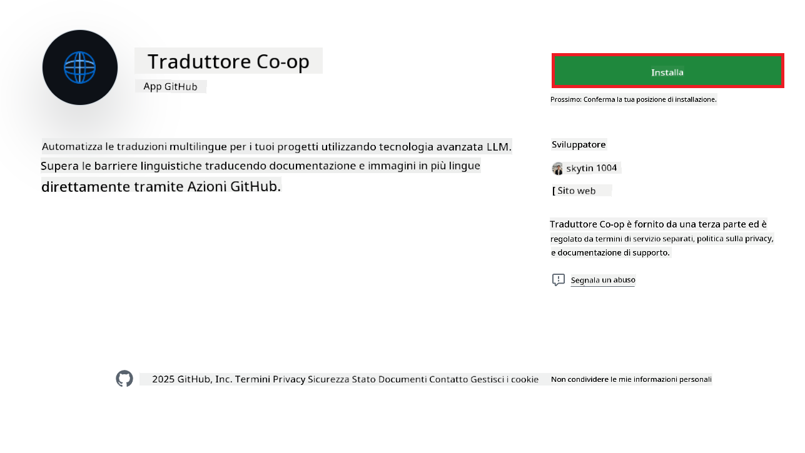
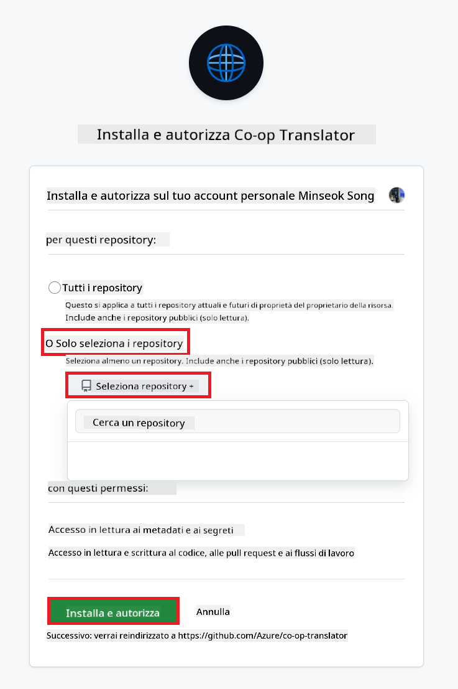
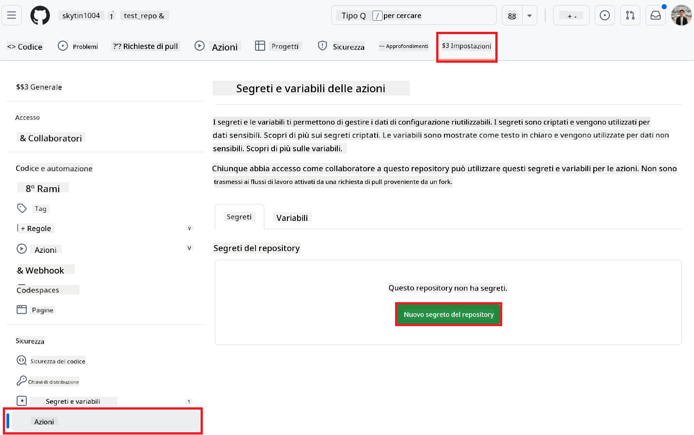
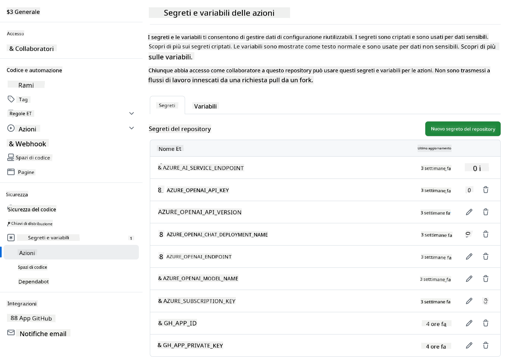

<!--
CO_OP_TRANSLATOR_METADATA:
{
  "original_hash": "c437820027c197f25fb2cbee95bae28c",
  "translation_date": "2025-06-12T19:08:41+00:00",
  "source_file": "getting_started/github-actions-guide/github-actions-guide-org.md",
  "language_code": "it"
}
-->
# Utilizzo della GitHub Action Co-op Translator (Guida per l’Organizzazione)

**Pubblico di riferimento:** Questa guida è pensata per **utenti interni Microsoft** o **team che hanno accesso alle credenziali necessarie per l’app GitHub Co-op Translator preconfigurata** o che possono creare una propria app GitHub personalizzata.

Automatizza la traduzione della documentazione del tuo repository in modo semplice usando la GitHub Action Co-op Translator. Questa guida ti accompagna nella configurazione dell’action per creare automaticamente pull request con traduzioni aggiornate ogni volta che cambiano i file Markdown sorgente o le immagini.

> [!IMPORTANT]
> 
> **Scelta della guida corretta:**
>
> Questa guida descrive la configurazione usando un **GitHub App ID e una chiave privata**. Solitamente serve questo metodo “Guida per l’Organizzazione” se: **`GITHUB_TOKEN` Permessi limitati:** Le impostazioni della tua organizzazione o repository limitano i permessi predefiniti concessi al normale `GITHUB_TOKEN`. In particolare, se al `GITHUB_TOKEN` non sono concessi i permessi necessari di `write` (come `contents: write` o `pull-requests: write`), il workflow nella [Guida di configurazione pubblica](./github-actions-guide-public.md) fallirà per mancanza di permessi. Usare un’app GitHub dedicata con permessi esplicitamente concessi supera questa limitazione.
>
> **Se non ti riguarda quanto sopra:**
>
> Se il `GITHUB_TOKEN` standard ha permessi sufficienti nel tuo repository (cioè non sei bloccato da restrizioni organizzative), usa la **[Guida di configurazione pubblica con GITHUB_TOKEN](./github-actions-guide-public.md)**. La guida pubblica non richiede di ottenere o gestire App ID o chiavi private e si basa solo sul `GITHUB_TOKEN` standard e i permessi del repository.

## Prerequisiti

Prima di configurare la GitHub Action, assicurati di avere pronte le credenziali necessarie per i servizi AI.

**1. Obbligatorio: Credenziali per il modello di linguaggio AI**  
Ti servono credenziali per almeno un modello di linguaggio supportato:

- **Azure OpenAI**: richiede Endpoint, API Key, nomi modello/deployment, versione API.  
- **OpenAI**: richiede API Key, (opzionale: Org ID, Base URL, Model ID).  
- Consulta [Modelli e servizi supportati](../../../../README.md) per i dettagli.  
- Guida di configurazione: [Configura Azure OpenAI](../set-up-resources/set-up-azure-openai.md).

**2. Facoltativo: Credenziali Computer Vision (per traduzione immagini)**

- Necessario solo se devi tradurre testo all’interno delle immagini.  
- **Azure Computer Vision**: richiede Endpoint e Subscription Key.  
- Se non fornite, l’action usa di default la [modalità solo Markdown](../markdown-only-mode.md).  
- Guida di configurazione: [Configura Azure Computer Vision](../set-up-resources/set-up-azure-computer-vision.md).

## Configurazione

Segui questi passaggi per configurare la GitHub Action Co-op Translator nel tuo repository:

### Passo 1: Installa e configura l’autenticazione tramite GitHub App

Il workflow usa l’autenticazione GitHub App per interagire in modo sicuro con il tuo repository (ad esempio per creare pull request) a tuo nome. Scegli una delle opzioni:

#### **Opzione A: Installa la GitHub App Co-op Translator preconfigurata (uso interno Microsoft)**

1. Vai alla pagina della [GitHub App Co-op Translator](https://github.com/apps/co-op-translator).

1. Seleziona **Installa** e scegli l’account o l’organizzazione dove risiede il repository target.

    

1. Scegli **Seleziona solo repository** e seleziona il repository target (es. `PhiCookBook`). Clicca su **Installa**. Potrebbe essere richiesta l’autenticazione.

    

1. **Ottieni le credenziali dell’app (processo interno richiesto):** Per permettere al workflow di autenticarsi come app, ti servono due informazioni fornite dal team Co-op Translator:  
  - **App ID:** Identificatore univoco dell’app Co-op Translator. L’App ID è: `1164076`.  
  - **Chiave privata:** Devi ottenere il **contenuto completo** del file di chiave privata `.pem` dal referente del manutentore. **Tratta questa chiave come una password e conservala in modo sicuro.**

1. Procedi al Passo 2.

#### **Opzione B: Usa una tua GitHub App personalizzata**

- Se preferisci, puoi creare e configurare una tua app GitHub. Assicurati che abbia accesso in lettura e scrittura a Contents e Pull requests. Ti serviranno App ID e chiave privata generata.

### Passo 2: Configura i segreti del repository

Devi aggiungere le credenziali GitHub App e quelle dei servizi AI come segreti criptati nelle impostazioni del repository.

1. Vai al repository target su GitHub (es. `PhiCookBook`).

1. Vai su **Settings** > **Secrets and variables** > **Actions**.

1. Sotto **Repository secrets**, clicca **New repository secret** per ogni segreto elencato qui sotto.

   

**Segreti obbligatori (per autenticazione GitHub App):**

| Nome Segreto          | Descrizione                                      | Fonte valore                                     |
| :------------------- | :----------------------------------------------- | :----------------------------------------------- |
| `GH_APP_ID`          | App ID della GitHub App (dal Passo 1).            | Impostazioni GitHub App                          |
| `GH_APP_PRIVATE_KEY` | **Intero contenuto** del file `.pem` scaricato. | File `.pem` (dal Passo 1)                      |

**Segreti per i servizi AI (aggiungi TUTTI quelli applicabili in base ai prerequisiti):**

| Nome Segreto                         | Descrizione                               | Fonte valore                     |
| :---------------------------------- | :---------------------------------------- | :------------------------------- |
| `AZURE_SUBSCRIPTION_KEY`            | Chiave per Azure AI Service (Computer Vision)  | Azure AI Foundry                    |
| `AZURE_AI_SERVICE_ENDPOINT`         | Endpoint per Azure AI Service (Computer Vision) | Azure AI Foundry                     |
| `AZURE_OPENAI_API_KEY`              | Chiave per servizio Azure OpenAI              | Azure AI Foundry                     |
| `AZURE_OPENAI_ENDPOINT`             | Endpoint per servizio Azure OpenAI         | Azure AI Foundry                     |
| `AZURE_OPENAI_MODEL_NAME`           | Nome del modello Azure OpenAI              | Azure AI Foundry                     |
| `AZURE_OPENAI_CHAT_DEPLOYMENT_NAME` | Nome del deployment Azure OpenAI         | Azure AI Foundry                     |
| `AZURE_OPENAI_API_VERSION`          | Versione API per Azure OpenAI              | Azure AI Foundry                     |
| `OPENAI_API_KEY`                    | API Key per OpenAI                        | OpenAI Platform                  |
| `OPENAI_ORG_ID`                     | ID organizzazione OpenAI                    | OpenAI Platform                  |
| `OPENAI_CHAT_MODEL_ID`              | ID modello specifico OpenAI                  | OpenAI Platform                    |
| `OPENAI_BASE_URL`                   | URL base API personalizzato OpenAI                | OpenAI Platform                    |



### Passo 3: Crea il file del workflow

Infine, crea il file YAML che definisce il workflow automatico.

1. Nella cartella principale del tuo repository, crea la directory `.github/workflows/` se non esiste.

1. All’interno di `.github/workflows/`, crea un file chiamato `co-op-translator.yml`.

1. Incolla il seguente contenuto in co-op-translator.yml.

```
name: Co-op Translator

on:
  push:
    branches:
      - main

jobs:
  co-op-translator:
    runs-on: ubuntu-latest

    permissions:
      contents: write
      pull-requests: write

    steps:
      - name: Checkout repository
        uses: actions/checkout@v4
        with:
          fetch-depth: 0

      - name: Set up Python
        uses: actions/setup-python@v4
        with:
          python-version: '3.10'

      - name: Install Co-op Translator
        run: |
          python -m pip install --upgrade pip
          pip install co-op-translator

      - name: Run Co-op Translator
        env:
          PYTHONIOENCODING: utf-8
          # Azure AI Service Credentials
          AZURE_SUBSCRIPTION_KEY: ${{ secrets.AZURE_SUBSCRIPTION_KEY }}
          AZURE_AI_SERVICE_ENDPOINT: ${{ secrets.AZURE_AI_SERVICE_ENDPOINT }}

          # Azure OpenAI Credentials
          AZURE_OPENAI_API_KEY: ${{ secrets.AZURE_OPENAI_API_KEY }}
          AZURE_OPENAI_ENDPOINT: ${{ secrets.AZURE_OPENAI_ENDPOINT }}
          AZURE_OPENAI_MODEL_NAME: ${{ secrets.AZURE_OPENAI_MODEL_NAME }}
          AZURE_OPENAI_CHAT_DEPLOYMENT_NAME: ${{ secrets.AZURE_OPENAI_CHAT_DEPLOYMENT_NAME }}
          AZURE_OPENAI_API_VERSION: ${{ secrets.AZURE_OPENAI_API_VERSION }}

          # OpenAI Credentials
          OPENAI_API_KEY: ${{ secrets.OPENAI_API_KEY }}
          OPENAI_ORG_ID: ${{ secrets.OPENAI_ORG_ID }}
          OPENAI_CHAT_MODEL_ID: ${{ secrets.OPENAI_CHAT_MODEL_ID }}
          OPENAI_BASE_URL: ${{ secrets.OPENAI_BASE_URL }}
        run: |
          # =====================================================================
          # IMPORTANT: Set your target languages here (REQUIRED CONFIGURATION)
          # =====================================================================
          # Example: Translate to Spanish, French, German. Add -y to auto-confirm.
          translate -l "es fr de" -y  # <--- MODIFY THIS LINE with your desired languages

      - name: Authenticate GitHub App
        id: generate_token
        uses: tibdex/github-app-token@v1
        with:
          app_id: ${{ secrets.GH_APP_ID }}
          private_key: ${{ secrets.GH_APP_PRIVATE_KEY }}

      - name: Create Pull Request with translations
        uses: peter-evans/create-pull-request@v5
        with:
          token: ${{ steps.generate_token.outputs.token }}
          commit-message: "🌐 Update translations via Co-op Translator"
          title: "🌐 Update translations via Co-op Translator"
          body: |
            This PR updates translations for recent changes to the main branch.

            ### 📋 Changes included
            - Translated contents are available in the `translations/` directory
            - Translated images are available in the `translated_images/` directory

            ---
            🌐 Automatically generated by the [Co-op Translator](https://github.com/Azure/co-op-translator) GitHub Action.
          branch: update-translations
          base: main
          labels: translation, automated-pr
          delete-branch: true
          add-paths: |
            translations/
            translated_images/

```

4.  **Personalizza il workflow:**  
  - **[!IMPORTANT] Lingue target:** Nel comando `Run Co-op Translator` step, you **MUST review and modify the list of language codes** within the `translate -l "..." -y` command to match your project's requirements. The example list (`ar de es...`) needs to be replaced or adjusted.
  - **Trigger (`on:`):** The current trigger runs on every push to `main`. For large repositories, consider adding a `paths:` filter (see commented example in the YAML) to run the workflow only when relevant files (e.g., source documentation) change, saving runner minutes.
  - **PR Details:** Customize the `commit-message`, `title`, `body`, `branch` name, and `labels` in the `Create Pull Request` step if needed.

## Credential Management and Renewal

- **Security:** Always store sensitive credentials (API keys, private keys) as GitHub Actions secrets. Never expose them in your workflow file or repository code.
- **[!IMPORTANT] Key Renewal (Internal Microsoft Users):** Be aware that Azure OpenAI key used within Microsoft might have a mandatory renewal policy (e.g., every 5 months). Ensure you update the corresponding GitHub secrets (`AZURE_OPENAI_...` assicurati di impostare correttamente le lingue target **prima che scadano** per evitare errori nel workflow.

## Esecuzione del Workflow

Una volta che il file `co-op-translator.yml` è stato unito nel branch principale (o nel branch specificato nel filtro `on:` trigger), the workflow will automatically run whenever changes are pushed to that branch (and match the `paths`, se configurato),

se vengono generate o aggiornate traduzioni, l’action creerà automaticamente una Pull Request contenente le modifiche, pronta per la tua revisione e il merge.

**Disclaimer**:  
Questo documento è stato tradotto utilizzando il servizio di traduzione automatica [Co-op Translator](https://github.com/Azure/co-op-translator). Pur impegnandoci per garantire accuratezza, si prega di notare che le traduzioni automatiche possono contenere errori o imprecisioni. Il documento originale nella sua lingua madre deve essere considerato la fonte autorevole. Per informazioni critiche si raccomanda la traduzione professionale effettuata da un umano. Non siamo responsabili per eventuali malintesi o interpretazioni errate derivanti dall’uso di questa traduzione.